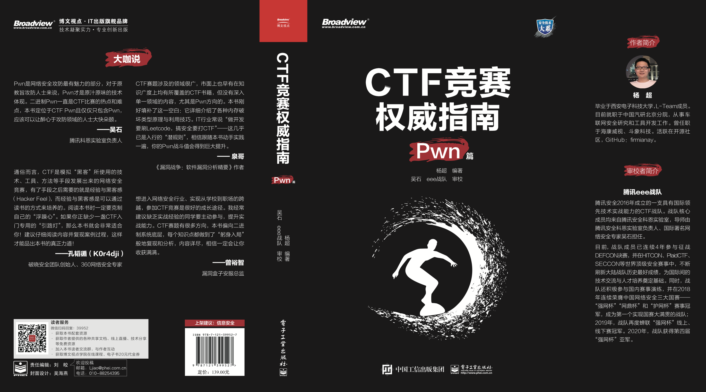
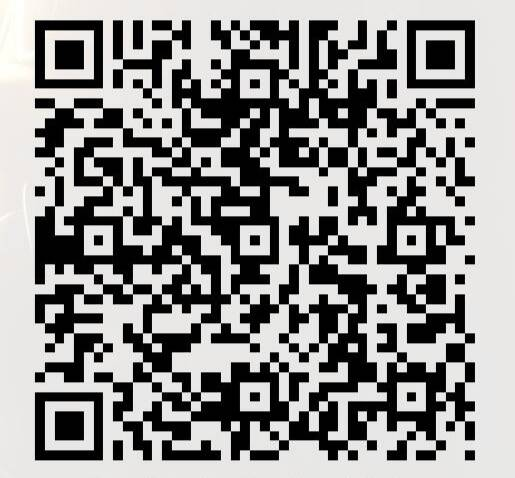

# CTF-All-In-One 《CTF竞赛权威指南(Pwn篇)》

## 号外号外！

本书 **《CTF竞赛权威指南(Pwn篇)》（杨超 编著，吴石 eee战队 审校）** 已上架！！！[京东购买链接](https://item.jd.com/13041828.html)

*谨以此书献给为人类安全奋战在抗疫一线的医护人员们，以勉励自己为网络安全事业作出贡献。*

本书主要面向CTF Pwn初学者，专注于Linux二进制安全。全书包含12章，从二进制底层讲起，结合源码详细分析了常见二进制安全漏洞、缓解机制以及漏洞利用方法，并辅以分析工具和环境搭建的讲解，循序渐进，让读者可以进行系统性的学习。本书在内容和素材的选择上较为连续完整，每个知识点都配以经典例题，并花费了大量篇幅进行讲解，旨在最大程度地还原分析思路和解题过程，达到举一反三的效果。

> pwn是网络安全攻防最有魅力的部分，对于原教旨攻防人士来说，pwn才是原汁原味的技术体现。二进制pwn一直是CTF比赛的热点和难点，本书定位于ctf pwn内容而且仅仅只包含pwn，应该可以让醉心于攻防领域人士大快朵颐。——吴石，腾讯科恩实验室负责人

> CTF赛题涉及的领域很广，市面上也早有在知识广度上均有所覆盖的CTF书籍，但没有深入单一领域的内容，尤其是Pwn方向的。本书刚好填补了这一空白：它详细介绍了各种内存破坏类型原理与利用技巧。IT行业常说“做开发要刷Leetcode，搞安全要打CTF”——这几乎已是入行的“潜规则”，相信跟随本书动手实践一遍，你的Pwn战斗值会得到巨大提升。——泉哥，《漏洞战争：软件漏洞分析精要》作者

> 想进入网络安全行业，实现从学校到职场跨越，CTF是很好的成长途径。我经常建议缺乏实战经验的在校同学要主动参与CTF竞赛，提升实战能力。本书偏向二进制系统底层，每个知识点能做到“躬身入局”去复现和分析过程，本书内容详尽，相信一定会让你收获满满。——曾裕智，漏洞盒子安服总监

> CTF通俗易懂的角度是模拟"黑客"所使用的技术、工具、方法等手段发展出来的网络安全竞赛，有了手段之后需要的就是经验与Hacker Feel，经验与Hacker Feel是可以通过读书的方式来培养，本书阅读时一定要克制自己的"浮躁心"，如果你正缺乏一个CTF入门专用的"引路灯"，本书就会非常的适合你，推荐仔细阅读内容并复现里面的过程才能品出这本书真正味道。——孔韬循（K0r4dji），破晓安全团队创始人，360网络安全专家

关于本书：[关于本书](./book/about.md)

目录：[目录](./book/catalog.pdf)

样章：[样章1](./book/demo1-pwn.pdf) [样章2](./book/demo2-angr.pdf)

相关资源（源码、勘误等）：[相关资源](https://github.com/firmianay/ctf-book)

读者交流QQ群：808542982

**图书编写耗时费力，倾注了作者大量的心力，打击盗版，维护正版！**

---

*——“与其相信谣言，不如一直学习。”*

GitHub 地址：<https://github.com/firmianay/CTF-All-In-One>

GitBook 地址：<https://firmianay.gitbook.io/ctf-all-in-one/>

由于 GitBook 把 pdf 导出设置为会员服务了，所以这应该是虽不推荐但唯一的版本了，还是直接在 GitHub 看吧：

- （不推荐 2018-07-15）<https://github.com/firmianay/CTF-All-In-One/releases>

## 目录

请查看 [SUMMARY.md](https://github.com/firmianay/CTF-All-In-One/blob/master/SUMMARY.md)

## 合作和贡献

请查看 [CONTRIBUTION.md](https://github.com/firmianay/CTF-All-In-One/blob/master/CONTRIBUTION.md)

## 常见问题

请查看 [FAQ.md](https://github.com/firmianay/CTF-All-In-One/blob/master/FAQ.md)

## 修改记录

请查看 [CHANGELOG](https://github.com/firmianay/CTF-All-In-One/blob/master/CHANGELOG)

## 致谢

请查看 [THANKS](./THANKS.md)

## LICENSE

CC BY-SA 4.0

## 捐赠

本项目接受捐赠，形式不限，如：送书，寄明信片，打赏，~~介绍女朋友~~……

打赏二维码如下，金额随意，所得捐款将用于给 Contributors 购买书籍和西瓜，~~可直播~~。

支付宝：
微信(加好友请标注“github”)：

- 2018-12-04 长点心吧 ¥10
- 2018-12-17 tjw ¥10
- 2019-01-27 Yimin Zhang ¥99
- 2019-02-25 *孟达 ¥100
- 2019-03-05 *哲超 ¥233
- 2019-03-23 毁三观大人 ¥888
- 2019-07-20 *柏琴 ¥20
- 2019-07-24 小龙 ¥100
- 2019-08-05 *鹏飞 ¥20
- 2019-10-02 Gk ¥66.6
- 2019-10-12 简单 ¥40.96
- 2020-04-05 jingle ¥200
- 2020-05-19 新写的旧歌 ¥5.2
- 2020-08-26 *绍林 ¥50
- 2020-09-11 d0ub1e2 ¥66
- 2020-10-21 **涵 ¥6.6
- 2020-11-22 wxixw ¥5.2
- 2020-12-08 **祖 ¥6.6
- 2020-12-10 **航 ¥66.66
- 2020-12-25 **铉 ¥5
