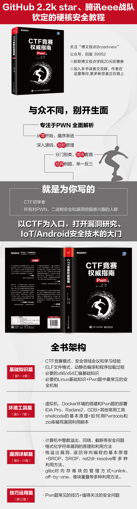

# 关于本书

- [作者简介](#作者简介)
- [作者序](#作者序)
- [推荐序](#推荐序)
- [内容简介](#内容简介)
- [本书结构](#本书结构)

## 作者简介

杨超，毕业于西安电子科技大学，L-Team成员。目前就职于中国汽研北京分院，从事车联网安全研究和工具开发。曾在海康威视、斗象科技工作过。活跃在开源社区，关注我的GitHub（firmianay）。

## 作者序

时间回到2017年7月，随着信息安全的发展，CTF竞赛也开始引人关注，这种有趣的竞赛模式对技术切磋和快速学习十分有效。在西电信安协会（XDSEC）学长的带领下，我已经接触了较长的一段时间。由于网上还没有比较完善和系统的资料，本着开源之精神，以分享他人提高自己为目的，我在GitHub上创建了一个叫做“CTF-All-In-One”的项目，并给了自己第1个star。在随后的时间里，这个项目日渐完善，吸引和帮助了不少初学者，到今天已经收获了超过2100个star，在此我将它们献给所有为技术分享与进步作出贡献的CTF出题人和项目贡献者们。

收到刘皎老师的约稿邀请是在2018年10月，那时我刚上大四，我说可以试试看，就惊喜又惶恐地接受了这项挑战。然后就是定目录，交样章，在2019年1月签订了约稿合同。没想到写作的道路竟如此艰难，每一章、每一节、每一个例子甚至每一个词都要斟酌，就生怕误人子弟。学业和工作的事情很多，最初参与的两个朋友相继离开，我本人也多次想要放弃，直到2020年7月才完成初稿。经过几轮艰苦的校稿，终于在2020年10月签订了出版合同。两年时间仿佛一晃就这样过去了。

写作的过程基本就是一个现学现卖的过程，我一边学习新知识，一边在框架体系里进行整理。这条路上有太多的分叉和无数的坑，我尽量把自己的经验写进书里，让读者可以快速获得其中的关键技术，避免重复劳动。所以与其称之为一本书，倒不如说是一个经过校对、完善，最终得到出版的知识库。在这个过程中，我也发现了写作对我来说是一种有效的训练方式，是一种附加的价值，通过对自己的知识和想法进行梳理，从而大大有益于我的工作。

我知道自己的限度，这本书是我写的第一本也很可能是最后一本。安全很有趣，我很高兴当初选择了它，很荣幸有机会分享出来，希望读者读到这本书时，也会为自己的选择而感到高兴。我们将此书命名为《CTF竞赛权威指南(Pwn篇)》，是给未来留出了空间，期待有更多人参与进来，拿出Web篇、Reverse篇、Crypto篇等更好的作品，让这个系列更配得上“权威”二字。

作为一本面向初学者的书，读者中一定不乏中学生群体，全国中学生网络安全竞赛每年都在我的母校西安电子科技大学进行，今年已是第三届，颇具规模。欢迎各位报考网络与信息安全学院，这里真的是一个很棒的地方。

最后，感谢我的大学室友刘晋，他早期的帮助让这个项目得以成型。感谢腾讯的吴石老师，他的推荐让这个成型的项目得以转换成书。感谢电子工业出版社的刘皎老师，她认真细致的工作使本书得以高质量地呈现给读者。感谢eee战队谢天忆、朱梦凡、马会心和刘耕铭的审核。感谢我的学弟槐和koocola，贡献了本书第11章的初稿。感谢湖北警官学院的谈楚瑜和MXYLR，以及其他来自GitHub的朋友的鼓励和支持。感谢我的父母给了我选择和发展的自由，让我在人生道路上没有后顾之忧。以及感谢那位不愿透露姓名的朋友，遇见你曾是青春最美好的事。感谢你们！

杨超
2020年11月于北京

## 推荐序

近年来，在党和国家的高度重视下，网络安全行业发展迅猛，吸引了大批年轻学子和有志青年投身其中。2015年，“网络空间安全”正式成为“工学”门类下的一级学科，与此同时，不论是高校、还是企事业单位中，CTF等类型的信息安全竞赛也开始蓬勃发展。通过竞赛涌现出了一大批高手、能手。但是竞赛中各个模块间的发展程度却也参差不齐。相对而言，Web、Misc等模块发展较快，参与的选手也较多；二进制安全相关模块，如逆向（RE）、移动安全（Mobile）等选手相对就少些，而其中的Pwn模块，则参赛选手最少。究其原因，主要是因为相对其他模块，二进制安全相关模块的学习曲线更陡峭，要求选手对系统的理解更为深入。

市面上安全相关的书籍、教程汗牛充栋，与漏洞主题相关的却屈指可数。在这些书籍中，由于作者本身都是从事漏洞发掘工作的，所以相关案例多以Windows平台下各种软件漏洞的为主，其他平台为辅。但Windows平台本身内部实现机制就比较复杂，相关文档不多，且有的软件自身还会有自己私有的内存管理方法（比如微软的office软件），在开始学习相关技能之前，所需要掌握的相关前置背景知识就够人喝一壶了。

本书另辟蹊径，利用历年历届的CTF真题，以x86/x64平台下，Linux系统中的Pwn样题为例，讲述漏洞利用的基本方法和技巧。由于Linux系统本身就是一个开源系统，相关文档也比较齐全，因此，在这个平台上容易把问题讲透。把基本功练扎实了，再去学习其他平台上的漏洞利用技术，必将起到事半而功倍的效果。此外，当前被广泛使用的Android等操作系统本身就是Linux系统的变种，相关技术也很容易移植到这些系统的漏洞发掘利用中去。

本书的作者是业内后起之秀。书中所用的例子贴近CTF实战，讲解详尽，思路清晰，非常有助于读者理解和学习。

本书的审校者——吴石老师率领的腾讯eee战队——曾多次斩获国内外高等级竞赛的大奖，相关经验非常丰富。

本书为广大学子和从业人员学习漏洞利用技术知识提供了有益的指导。相信有志学者，经过认真钻研，必能早日登堂入室，为我国网络安全事业的发展添砖加瓦。

——崔孝晨
《Python绝技：运用python成为顶级黑客》、《最强Android书：架构大剖析》译者

## 内容简介

本书专注于Linux二进制安全。全书包含12章，从二进制底层开始，结合源码详细分析了常见的二进制安全漏洞、缓解机制以及漏洞利用方法，并辅以分析工具和环境搭建的讲解。
本书在素材的选择上较为连续、完整，每个知识点均配以经典例题，并花费了大量篇幅深入讲解，以最大程度地还原分析思路和解题过程。读者完全可以依据本书自主、系统性地学习，达到举一反三的效果。
本书主要面向CTF初学者，也适合对CTF感兴趣的人群学习。

## 本书结构

**第1章 CTF简介**：介绍CTF竞赛模式、安全领域会议和学习经验。

**第2章 二进制文件**：介绍ELF文件格式、动静态编译和程序加载过程。

**第3章 汇编基础**：介绍必要的x86/x64汇编基础知识。

**第4章 Linux安全机制**：介绍必要的Linux基础知识，以及Pwn题中最常见的安全机制（Stack Canaries、No-eXecute、ASLR、PIE、FORTIFY_SOURCE、RELRO）。

**第5章 分析环境搭建**：介绍虚拟机、Docker环境的搭建和Pwn题的部署。

**第6章 分析工具**：介绍IDA Pro、Radare2、GDB以及其他常用工具的使用方法。

**第7章 漏洞利用开发**：介绍shellcode的基本原理，以及如何用Pwntools和zio库编写漏洞利用脚本。

**第8章 整数安全**：介绍计算机中整数的存储方式，以及溢出、回绕、截断等安全问题。

**第9章 格式化字符串**：介绍格式化字符串漏洞的原理和利用方法。

**第10章 栈溢出与ROP**：介绍栈溢出漏洞、返回导向编程的基本原理，以及BROP、SROP、ret2dl-resolve等多种利用方法。

**第11章 堆利用**：介绍glibc对内存堆块的管理方式，以及unlink、off-by-one、堆块重叠等多种利用方法。

**第12章 pwn技巧**：介绍Pwn题中常见的利用技巧和值得关注的安全问题。
