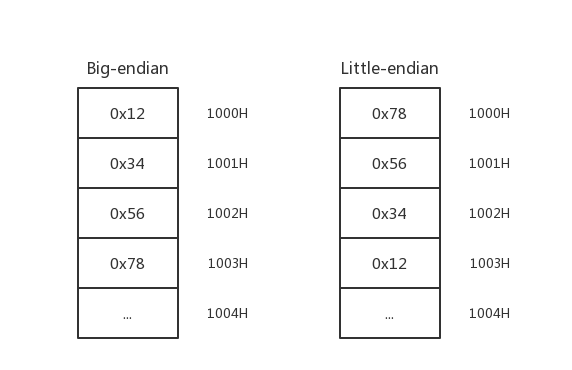

# 1.3 Linux 基础

- [常用基础命令](#常用基础命令)
- [Bash 快捷键](#bash-快捷键)
- [根目录结构](#根目录结构)
- [进程管理](#进程管理)
- [UID 和 GID](#uid-和-gid)
- [权限设置](#权限设置)
- [字节序](#字节序)
- [输入输出](#输入输出)
- [文件描述符](#文件描述符)
- [核心转储](#核心转储)
- [调用约定](#调用约定)
- [环境变量](#环境变量)
- [procfs](#procfs)
- [参考资料](#参考资料)

## 常用基础命令

```text
ls                  用来显示目标列表

cd [path]           用来切换工作目录

pwd                 以绝对路径的方式显示用户当前工作目录

man [command]       查看Linux中的指令帮助、配置文件帮助和编程帮助等信息

apropos [whatever]  在一些特定的包含系统命令的简短描述的数据库文件里查找关键字

echo [string]       打印一行文本，参数“-e”可激活转义字符

cat [file]          连接文件并打印到标准输出设备上

less [file]         允许用户向前或向后浏览文字档案的内容

mv [file1] [file2]  用来对文件或目录重新命名，或者将文件从一个目录移到另一个目录中

cp [file1] [file2]  用来将一个或多个源文件或者目录复制到指定的目的文件或目录

rm [file]           可以删除一个目录中的一个或多个文件或目录，也可以将某个目录及其下属的所有文件及其子目录均删除掉

ps                  用于报告当前系统的进程状态

top                 实时查看系统的整体运行情况

kill                杀死一个进程

ifconfig            查看或设置网络设备

ping                查看网络上的主机是否工作

netstat             显示网络连接、路由表和网络接口信息

nc(netcat)          建立 TCP 和 UDP 连接并监听

su                  切换当前用户身份到其他用户身份

touch [file]        创建新的空文件

mkdir [dir]         创建目录

chmod               变更文件或目录的权限

chown               变更某个文件或目录的所有者和所属组

nano / vim / emacs  字符终端的文本编辑器

exit                退出 shell
```

```text
管道命令符 "|"       将一个命令的标准输出作为另一个命令的标准输入
```

使用变量：

```text
var=value         给变量var赋值value

$var, ${var}      取变量的值

`cmd`, $(cmd)     代换标准输出

'string'          非替换字符串

"string"          可替换字符串
```

```text
$ var="test";
$ echo $var
test
$ echo 'This is a $var';
This is a $var
$ echo "This is a $var";
This is a test

$ echo `date`;
2017年 11月 06日 星期一 14:40:07 CST
$ $(bash)

$ echo $0
/bin/bash
$ $($0)
```

## Bash 快捷键

```text
Up(Down)          上（下）一条指令

Ctrl + c          终止当前进程

Ctrl + z          挂起当前进程，使用“fg”可唤醒

Ctrl + d          删除光标处的字符

Ctrl + l          清屏

Ctrl + a          移动到命令行首

Ctrl + e          移动到命令行尾

Ctrl + b          按单词后移（向左）

Ctrl + f          按单词前移（向右）

Ctrl + Shift + c  复制

Ctrl + Shift + v  粘贴
```

更多细节请查看：[Bash Keyboard Shortcuts](https://ss64.com/bash/syntax-keyboard.html)

## 根目录结构

```text
$ uname -a
Linux manjaro 4.11.5-1-ARCH #1 SMP PREEMPT Wed Jun 14 16:19:27 CEST 2017 x86_64 GNU/Linux
$ ls -al /
drwxr-xr-x  17 root root  4096 Jun 28 20:17 .
drwxr-xr-x  17 root root  4096 Jun 28 20:17 ..
lrwxrwxrwx   1 root root     7 Jun 21 22:44 bin -> usr/bin
drwxr-xr-x   4 root root  4096 Aug 10 22:50 boot
drwxr-xr-x  20 root root  3140 Aug 11 11:43 dev
drwxr-xr-x 101 root root  4096 Aug 14 13:54 etc
drwxr-xr-x   3 root root  4096 Apr  8 19:59 home
lrwxrwxrwx   1 root root     7 Jun 21 22:44 lib -> usr/lib
lrwxrwxrwx   1 root root     7 Jun 21 22:44 lib64 -> usr/lib
drwx------   2 root root 16384 Apr  8 19:55 lost+found
drwxr-xr-x   2 root root  4096 Oct  1  2015 mnt
drwxr-xr-x  15 root root  4096 Jul 15 20:10 opt
dr-xr-xr-x 267 root root     0 Aug  3 09:41 proc
drwxr-x---   9 root root  4096 Jul 22 22:59 root
drwxr-xr-x  26 root root   660 Aug 14 21:08 run
lrwxrwxrwx   1 root root     7 Jun 21 22:44 sbin -> usr/bin
drwxr-xr-x   4 root root  4096 May 28 22:07 srv
dr-xr-xr-x  13 root root     0 Aug  3 09:41 sys
drwxrwxrwt  36 root root  1060 Aug 14 21:27 tmp
drwxr-xr-x  11 root root  4096 Aug 14 13:54 usr
drwxr-xr-x  12 root root  4096 Jun 28 20:17 var
```

由于不同的发行版会有略微的不同，我们这里使用的是基于 Arch 的发行版 Manjaro，以上就是根目录下的内容，我们介绍几个重要的目录：

- `/bin`、`/sbin`：链接到 `/usr/bin`，存放 Linux 一些核心的二进制文件，其包含的命令可在 shell 上运行。
- `/boot`：操作系统启动时要用到的程序。
- `/dev`：包含了所有 Linux 系统中使用的外部设备。需要注意的是这里并不是存放外部设备的驱动程序，而是一个访问这些设备的端口。
- `/etc`：存放系统管理时要用到的各种配置文件和子目录。
- `/etc/rc.d`：存放 Linux 启动和关闭时要用到的脚本。
- `/home`：普通用户的主目录。
- `/lib`、`/lib64`：链接到 `/usr/lib`，存放系统及软件需要的动态链接共享库。
- `/mnt`：这个目录让用户可以临时挂载其他的文件系统。
- `/proc`：虚拟的目录，是系统内存的映射。可直接访问这个目录来获取系统信息。
- `/root`：系统管理员的主目录。
- `/srv`：存放一些服务启动之后需要提取的数据。
- `/sys`：该目录下安装了一个文件系统 sysfs。该文件系统是内核设备树的一个直观反映。当一个内核对象被创建时，对应的文件和目录也在内核对象子系统中被创建。
- `/tmp`：公用的临时文件存放目录。
- `/usr`：应用程序和文件几乎都在这个目录下。
- `/usr/src`：内核源代码的存放目录。
- `/var`：存放了很多服务的日志信息。

## 进程管理

- top
  - 可以实时动态地查看系统的整体运行情况。
- ps
  - 用于报告当前系统的进程状态。可以搭配 kill 指令随时中断、删除不必要的程序。
  - 查看某进程的状态：`$ ps -aux | grep [file]`，其中返回内容最左边的数字为进程号（PID）。
- kill
  - 用来删除执行中的程序或工作。
  - 删除进程某 PID 指定的进程：`$ kill [PID]`

## UID 和 GID

Linux 是一个支持多用户的操作系统，每个用户都有 User ID(UID) 和 Group ID(GID)，UID 是对一个用户的单一身份标识，而 GID 则对应多个 UID。知道某个用户的 UID 和 GID 是非常有用的，一些程序可能就需要 UID/GID 来运行。可以使用 `id` 命令来查看：

```text
$ id root
uid=0(root) gid=0(root) groups=0(root),1(bin),2(daemon),3(sys),4(adm),6(disk),10(wheel),19(log)
$ id firmy
uid=1000(firmy) gid=1000(firmy) groups=1000(firmy),3(sys),7(lp),10(wheel),90(network),91(video),93(optical),95(storage),96(scanner),98(power),56(bumblebee)
```

UID 为 0 的 root 用户类似于系统管理员，它具有系统的完全访问权。我自己新建的用户 firmy，其 UID 为 1000，是一个普通用户。GID 的关系存储在 `/etc/group` 文件中：

```text
$ cat /etc/group
root:x:0:root
bin:x:1:root,bin,daemon
daemon:x:2:root,bin,daemon
sys:x:3:root,bin,firmy
......
```

所有用户的信息（除了密码）都保存在 `/etc/passwd` 文件中，而为了安全起见，加密过的用户密码保存在 `/etc/shadow` 文件中，此文件只有 root 权限可以访问。

```text
$ sudo cat /etc/shadow
root:$6$root$wvK.pRXFEH80GYkpiu1tEWYMOueo4tZtq7mYnldiyJBZDMe.mKwt.WIJnehb4bhZchL/93Oe1ok9UwxYf79yR1:17264::::::
firmy:$6$firmy$dhGT.WP91lnpG5/10GfGdj5L1fFVSoYlxwYHQn.llc5eKOvr7J8nqqGdVFKykMUSDNxix5Vh8zbXIapt0oPd8.:17264:0:99999:7:::
```

由于普通用户的权限比较低，这里使用 `sudo` 命令可以让普通用户以 root 用户的身份运行某一命令。使用 `su` 命令则可以切换到一个不同的用户：

```text
$ whoami
firmy
$ su root
# whoami
root
```

`whoami` 用于打印当前有效的用户名称，shell 中普通用户以 `$` 开头，root 用户以 `#` 开头。在输入密码后，我们已经从 firmy 用户转换到 root 用户了。

## 权限设置

在　Linux 中，文件或目录权限的控制分别以读取、写入、执行 3 种一般权限来区分，另有 3 种特殊权限可供运用。

使用 `ls -l [file]` 来查看某文件或目录的信息：

```text
$ ls -l /
lrwxrwxrwx   1 root root     7 Jun 21 22:44 bin -> usr/bin
drwxr-xr-x   4 root root  4096 Jul 28 08:48 boot
-rw-r--r--   1 root root 18561 Apr  2 22:48 desktopfs-pkgs.txt
```

第一栏从第二个字母开始就是权限字符串，权限表示三个为一组，依次是所有者权限、组权限、其他人权限。每组的顺序均为 `rwx`，如果有相应权限，则表示成相应字母，如果不具有相应权限，则用 `-` 表示。

- `r`：读取权限，数字代号为 “4”
- `w`：写入权限，数字代号为 “2”
- `x`：执行或切换权限，数字代号为 “1”

通过第一栏的第一个字母可知，第一行是一个链接文件 （`l`），第二行是个目录（`d`），第三行是个普通文件（`-`）。

用户可以使用 `chmod` 指令去变更文件与目录的权限。权限范围被指定为所有者（`u`）、所属组（`g`）、其他人（`o`）和所有人（`a`）。

- -R：递归处理，将指令目录下的所有文件及子目录一并处理；
- <权限范围>+<权限设置>：开启权限范围的文件或目录的该选项权限设置
  - `$ chmod a+r [file]`：赋予所有用户读取权限
- <权限范围>-<权限设置>：关闭权限范围的文件或目录的该选项权限设置
  - `$ chmod u-w [file]`：取消所有者写入权限
- <权限范围>=<权限设置>：指定权限范围的文件或目录的该选项权限设置；
  - `$ chmod g=x [file]`：指定组权限为可执行
  - `$ chmod o=rwx [file]`：制定其他人权限为可读、可写和可执行


## 字节序

目前计算机中采用两种字节存储机制：大端（Big-endian）和小端（Little-endian）。

>MSB (Most Significan Bit/Byte)：最重要的位或最重要的字节。
>
>LSB (Least Significan Bit/Byte)：最不重要的位或最不重要的字节。

Big-endian 规定 MSB 在存储时放在低地址，在传输时放在流的开始；LSB 存储时放在高地址，在传输时放在流的末尾。Little-endian 则相反。常见的 Intel 处理器使用 Little-endian，而 PowerPC 系列处理器则使用 Big-endian，另外 TCP/IP 协议和 Java 虚拟机的字节序也是 Big-endian。

例如十六进制整数 0x12345678 存入以 1000H 开始的内存中：



我们在内存中实际地看一下，在地址 `0xffffd584` 处有字符 `1234`，在地址 `0xffffd588` 处有字符 `5678`。

```text
gdb-peda$ x/w 0xffffd584
0xffffd584:     0x34333231
gdb-peda$ x/4wb 0xffffd584
0xffffd584:     0x31    0x32    0x33    0x34
gdb-peda$ python print('\x31\x32\x33\x34')
1234

gdb-peda$ x/w 0xffffd588
0xffffd588:     0x38373635
gdb-peda$ x/4wb 0xffffd588
0xffffd588:     0x35    0x36    0x37    0x38
gdb-peda$ python print('\x35\x36\x37\x38')
5678

gdb-peda$ x/2w 0xffffd584
0xffffd584:     0x34333231      0x38373635
gdb-peda$ x/8wb 0xffffd584
0xffffd584:     0x31    0x32    0x33    0x34    0x35    0x36    0x37    0x38
gdb-peda$ python print('\x31\x32\x33\x34\x35\x35\x36\x37\x38')
123455678
db-peda$ x/s 0xffffd584
0xffffd584:     "12345678"
```

## 输入输出

- 使用命令的输出作为可执行文件的输入参数
  - <code>$ ./vulnerable &#96;your_command_here&#96;</code>
  - `$ ./vulnerable $(your_command_here)`
- 使用命令作为输入
  - `$ your_command_here | ./vulnerable`
- 将命令行输出写入文件
  - `$ your_command_here > filename`
- 使用文件作为输入
  - `$ ./vulnerable < filename`

## 文件描述符

在 Linux 系统中一切皆可以看成是文件，文件又分为：普通文件、目录文件、链接文件和设备文件。文件描述符（file descriptor）是内核管理已被打开的文件所创建的索引，使用一个非负整数来指代被打开的文件。

标准文件描述符如下：

文件描述符 | 用途 | stdio 流
--- | --- | ---
0 | 标准输入 | stdin
1 | 标准输出 | stdout
2 | 标准错误 | stderr

当一个程序使用 `fork()` 生成一个子进程后，子进程会继承父进程所打开的文件表，此时，父子进程使用同一个文件表，这可能导致一些安全问题。如果使用 `vfork()`，子进程虽然运行于父进程的空间，但拥有自己的进程表项。

## 核心转储

当程序运行的过程中异常终止或崩溃，操作系统会将程序当时的内存、寄存器状态、堆栈指针、内存管理信息等记录下来，保存在一个文件中，这种行为就叫做核心转储（Core Dump）。

### 会产生核心转储的信号

Signal | Action | Comment
--- | --- | ---
SIGQUIT | Core | Quit from keyboard
SIGILL | Core | Illegal Instruction
SIGABRT | Core | Abort signal from abort
SIGSEGV | Core | Invalid memory reference
SIGTRAP | Core | Trace/breakpoint trap

### 开启核心转储

- 输入命令 `ulimit -c`，输出结果为 `0`，说明默认是关闭的。
- 输入命令 `ulimit -c unlimited` 即可在当前终端开启核心转储功能。
- 如果想让核心转储功能永久开启，可以修改文件 `/etc/security/limits.conf`，增加一行：

  ```text
  #<domain>      <type>  <item>         <value>
  *               soft    core            unlimited
  ```

### 修改转储文件保存路径

- 通过修改 `/proc/sys/kernel/core_uses_pid`，可以使生成的核心转储文件名变为 `core.[pid]` 的模式。

  ```text
  # echo 1 > /proc/sys/kernel/core_uses_pid
  ```

- 还可以修改 `/proc/sys/kernel/core_pattern` 来控制生成核心转储文件的保存位置和文件名格式。

  ```text
  # echo /tmp/core-%e-%p-%t > /proc/sys/kernel/core_pattern
  ```

  此时生成的文件保存在 `/tmp/` 目录下，文件名格式为 `core-[filename]-[pid]-[time]`。

### 使用 gdb 调试核心转储文件

```text
gdb [filename] [core file]
```

### 例子

```text
$ cat core.c
#include <stdio.h>
void main(int argc, char **argv) {
    char buf[5];
    scanf("%s", buf);
}
$ gcc -m32 -fno-stack-protector core.c
$ ./a.out
AAAAAAAAAAAAAAAAAAAA
Segmentation fault (core dumped)
$ file /tmp/core-a.out-12444-1503198911
/tmp/core-a.out-12444-1503198911: ELF 32-bit LSB core file Intel 80386, version 1 (SYSV), SVR4-style, from './a.out', real uid: 1000, effective uid: 1000, real gid: 1000, effective gid: 1000, execfn: './a.out', platform: 'i686'
$ gdb a.out /tmp/core-a.out-12444-1503198911 -q
Reading symbols from a.out...(no debugging symbols found)...done.
[New LWP 12444]
Core was generated by `./a.out'.
Program terminated with signal SIGSEGV, Segmentation fault.
#0  0x5655559b in main ()
gdb-peda$ info frame
Stack level 0, frame at 0x41414141:
 eip = 0x5655559b in main; saved eip = <not saved>
 Outermost frame: Cannot access memory at address 0x4141413d
 Arglist at 0x41414141, args:
 Locals at 0x41414141, Previous frame's sp is 0x41414141
Cannot access memory at address 0x4141413d
```

## 调用约定

函数调用约定是对函数调用时如何传递参数的一种约定。关于它的约定有许多种，下面我们分别从内核接口和用户接口介绍 32 位和 64 位 Linux 的调用约定。

### 内核接口

**x86-32 系统调用约定**：Linux 系统调用使用寄存器传递参数。`eax` 为 syscall_number，`ebx`、`ecx`、`edx`、`esi`、`ebp` 用于将 6 个参数传递给系统调用。返回值保存在 `eax` 中。所有其他寄存器（包括 EFLAGS）都保留在 `int 0x80` 中。

**x86-64 系统调用约定**：内核接口使用的寄存器有：`rdi`、`rsi`、`rdx`、`r10`、`r8`、`r9`。系统调用通过 `syscall` 指令完成。除了 `rcx`、`r11` 和 `rax`，其他的寄存器都被保留。系统调用的编号必须在寄存器 `rax` 中传递。系统调用的参数限制为 6 个，不直接从堆栈上传递任何参数。返回时，`rax` 中包含了系统调用的结果。而且只有 INTEGER 或者 MEMORY 类型的值才会被传递给内核。

### 用户接口

**x86-32 函数调用约定**：参数通过栈进行传递。最后一个参数第一个被放入栈中，直到所有的参数都放置完毕，然后执行 call 指令。这也是 Linux 上 C 语言函数的方式。

**x86-64 函数调用约定**：x86-64 下通过寄存器传递参数，这样做比通过栈有更高的效率。它避免了内存中参数的存取和额外的指令。根据参数类型的不同，会使用寄存器或传参方式。如果参数的类型是 MEMORY，则在栈上传递参数。如果类型是 INTEGER，则顺序使用 `rdi`、`rsi`、`rdx`、`rcx`、`r8` 和 `r9`。所以如果有多于 6 个的 INTEGER 参数，则后面的参数在栈上传递。

## 环境变量

环境变量字符串都是 `name=value` 这样的形式。大多数 name 由大写字母加下画线组成，一般把 name 部分叫做环境变量名，value 部分则是环境变量的值，而且 value 需要以 "/0" 结尾，环境变量定义了该进程的运行环境。

### 分类

- 按照生命周期划分
  - 永久环境变量：修改相关配置文件，永久生效。
  - 临时环境变量：使用 `export` 命令，在当前终端下生效，关闭终端后失效。
- 按照作用域划分
  - 系统环境变量：对该系统中所有用户生效。
  - 用户环境变量：对特定用户生效。

### 设置方法

- 在文件 `/etc/profile` 中添加变量，这种方法对所有用户永久生效。如：

  ```text
  # Set our default path
  PATH="/usr/local/sbin:/usr/local/bin:/usr/bin"
  export PATH
  ```

  添加后执行命令 `source /etc/profile` 使其生效。
- 在文件 `~/.bash_profile` 中添加变量，这种方法对当前用户永久生效。其余同上。
- 直接运行命令 `export` 定义变量，这种方法只对当前终端临时生效。

### 常用变量

使用命令 `echo` 打印变量：

```text
$ echo $PATH
/usr/local/sbin:/usr/local/bin:/usr/bin:/usr/lib/jvm/default/bin:/usr/bin/site_perl:/usr/bin/vendor_perl:/usr/bin/core_perl
$ echo $HOME
/home/firmy
$ echo $LOGNAME
firmy
$ echo $HOSTNAME
firmy-pc
$ echo $SHELL
/bin/bash
$ echo $LANG
en_US.UTF-8
```

使用命令 `env` 可以打印出所有环境变量：

```text
$ env
COLORFGBG=15;0
COLORTERM=truecolor
...
```

使用命令 `set` 可以打印出所有本地定义的 shell 变量：

```text
$ set
'!'=0
'#'=0
...
```

使用命令 `unset` 可以清除变量：

```text
unset $变量名
```

### LD_PRELOAD

该环境变量可以定义在程序运行前优先加载的动态链接库。在 pwn 题目中，我们可能需要一个特定的 libc，这时就可以定义该变量：

```text
LD_PRELOAD=/path/to/libc.so ./binary
```

一个例子：

```text
$ ldd /bin/true
  linux-vdso.so.1 =>  (0x00007fff9a9fe000)
  libc.so.6 => /lib/x86_64-linux-gnu/libc.so.6 (0x00007f1c083d9000)
  /lib64/ld-linux-x86-64.so.2 (0x0000557bcce6c000)
$ LD_PRELOAD=~/libc.so.6 ldd /bin/true
  linux-vdso.so.1 =>  (0x00007ffee55e9000)
  /home/firmy/libc.so.6 (0x00007f4a28cfc000)
  /lib64/ld-linux-x86-64.so.2 (0x000055f33bc50000)
```

注意，在加载动态链接库时需要使用 `ld.so` 进行重定位，通常被符号链接到 `/lib64/ld-linux-x86-64.so` 中。动态链接库在编译时隐式指定 `ld.so` 的搜索路径，并写入 ELF Header 的 INTERP 字段中。从其他发行版直接拷贝已编译的 `.so` 文件可能会引发 `ld.so` 搜索路径不正确的问题。相似的，在版本依赖高度耦合的发行版中(如 ArchLinux)，版本相差过大也会引发 `ld.so` 的运行失败。

本地同版本编译后通常不会出现问题。如果有直接拷贝已编译版本的需要，可以对比 `interpreter` 确定是否符合要求，但是不保证不会失败。

上面的例子中两个 libc 是这样的：

```text
$ file /lib/x86_64-linux-gnu/libc-2.23.so
/lib/x86_64-linux-gnu/libc-2.23.so: ELF 64-bit LSB shared object, x86-64, version 1 (GNU/Linux), dynamically linked, interpreter /lib64/ld-linux-x86-64.so.2, BuildID[sha1]=088a6e00a1814622219f346b41e775b8dd46c518, for GNU/Linux 2.6.32, stripped
$ file ~/libc.so.6
/home/firmy/libc.so.6: ELF 64-bit LSB shared object, x86-64, version 1 (GNU/Linux), dynamically linked, interpreter /lib64/ld-linux-x86-64.so.2, BuildID[sha1]=088a6e00a1814622219f346b41e775b8dd46c518, for GNU/Linux 2.6.32, stripped
```

都是 `interpreter /lib64/ld-linux-x86-64.so.2`，所以可以替换。

而下面的例子是在 Arch Linux 上使用一个 Ubuntu 的 libc，就会出错：

```text
$ ldd /bin/true
        linux-vdso.so.1 (0x00007ffc969df000)
        libc.so.6 => /usr/lib/libc.so.6 (0x00007f7ddde17000)
        /lib64/ld-linux-x86-64.so.2 => /usr/lib64/ld-linux-x86-64.so.2 (0x00007f7dde3d7000)
$ LD_PRELOAD=~/libc.so.6 ldd /bin/true
Illegal instruction (core dumped)
```

```text
$ file /usr/lib/libc-2.26.so
/usr/lib/libc-2.26.so: ELF 64-bit LSB shared object, x86-64, version 1 (GNU/Linux), dynamically linked, interpreter /usr/lib/ld-linux-x86-64.so.2, BuildID[sha1]=458fd9997a454786f071cfe2beb234542c1e871f, for GNU/Linux 3.2.0, not stripped
$ file ~/libc.so.6
/home/firmy/libc.so.6: ELF 64-bit LSB shared object, x86-64, version 1 (GNU/Linux), dynamically linked, interpreter /lib64/ld-linux-x86-64.so.2, BuildID[sha1]=088a6e00a1814622219f346b41e775b8dd46c518, for GNU/Linux 2.6.32, stripped
```

一个在 `interpreter /usr/lib/ld-linux-x86-64.so.2`，而另一个在 `interpreter /lib64/ld-linux-x86-64.so.2`。

### environ

libc 中定义的全局变量 `environ` 指向环境变量表。而环境变量表存在于栈上，所以通过 `environ` 指针的值就可以泄露出栈地址。

```text
gdb-peda$ vmmap libc
Start              End                Perm      Name
0x00007ffff7a1c000 0x00007ffff7bcf000 r-xp      /usr/lib/libc-2.27.so
0x00007ffff7bcf000 0x00007ffff7dce000 ---p      /usr/lib/libc-2.27.so
0x00007ffff7dce000 0x00007ffff7dd2000 r--p      /usr/lib/libc-2.27.so
0x00007ffff7dd2000 0x00007ffff7dd4000 rw-p      /usr/lib/libc-2.27.so
gdb-peda$ vmmap stack
Start              End                Perm      Name
0x00007ffffffde000 0x00007ffffffff000 rw-p      [stack]
gdb-peda$ shell nm -D /usr/lib/libc-2.27.so | grep environ
00000000003b8ee0 V environ
00000000003b8ee0 V _environ
00000000003b8ee0 B __environ
gdb-peda$ x/gx 0x00007ffff7a1c000 + 0x00000000003b8ee0
0x7ffff7dd4ee0 <environ>:       0x00007fffffffde48
gdb-peda$ x/5gx 0x00007fffffffde48
0x7fffffffde48: 0x00007fffffffe1da      0x00007fffffffe1e9
0x7fffffffde58: 0x00007fffffffe1fd      0x00007fffffffe233
0x7fffffffde68: 0x00007fffffffe25f
gdb-peda$ x/5s 0x00007fffffffe1da
0x7fffffffe1da: "COLORFGBG=15;0"
0x7fffffffe1e9: "COLORTERM=truecolor"
0x7fffffffe1fd: "DBUS_SESSION_BUS_ADDRESS=unix:path=/run/user/1000/bus"
0x7fffffffe233: "DESKTOP_SESSION=/usr/share/xsessions/plasma"
0x7fffffffe25f: "DISPLAY=:0"
```

## procfs

procfs 文件系统是 Linux 内核提供的虚拟文件系统，为访问系统内核数据的操作提供接口。之所以说是虚拟文件系统，是因为它不占用存储空间，而只是占用了内存。用户可以通过 procfs 查看有关系统硬件及当前正在运行进程的信息，甚至可以通过修改其中的某些内容来改变内核的运行状态。

### /proc/cmdline

在启动时传递给内核的相关参数信息，通常由 lilo 或 grub 等启动管理工具提供：

```text
$ cat /proc/cmdline
BOOT_IMAGE=/boot/vmlinuz-4.14-x86_64 root=UUID=8e79a67d-af1b-4203-8c1c-3b670f0ec052 rw quiet resume=UUID=a220ecb1-7fde-4032-87bf-413057e9c06f
```

### /proc/cpuinfo

记录 CPU 相关的信息：

```text
$ cat /proc/cpuinfo
processor       : 0
vendor_id       : GenuineIntel
cpu family      : 6
model           : 60
model name      : Intel(R) Core(TM) i5-4210H CPU @ 2.90GHz
stepping        : 3
microcode       : 0x24
cpu MHz         : 1511.087
cache size      : 3072 KB
physical id     : 0
siblings        : 4
core id         : 0
cpu cores       : 2
apicid          : 0
initial apicid  : 0
fpu             : yes
fpu_exception   : yes
cpuid level     : 13
wp              : yes
flags           : fpu vme de pse tsc msr pae mce cx8 apic sep mtrr pge mca cmov pat pse36 clflush dts acpi mmx fxsr sse sse2 ss ht tm pbe syscall nx pdpe1gb rdtscp lm constant_tsc arch_perfmon pebs bts rep_good nopl xtopology nonstop_tsc cpuid aperfmperf pni pclmulqdq dtes64 monitor ds_cpl vmx est tm2 ssse3 sdbg fma cx16 xtpr pdcm pcid sse4_1 sse4_2 x2apic movbe popcnt tsc_deadline_timer aes xsave avx f16c rdrand lahf_lm abm cpuid_fault epb invpcid_single pti ibrs ibpb stibp tpr_shadow vnmi flexpriority ept vpid fsgsbase tsc_adjust bmi1 avx2 smep bmi2 erms invpcid xsaveopt dtherm ida arat pln pts
bugs            : cpu_meltdown spectre_v1 spectre_v2 spec_store_bypass
bogomips        : 5788.66
clflush size    : 64
cache_alignment : 64
address sizes   : 39 bits physical, 48 bits virtual
power management:
...
```

### /proc/crypto

已安装的内核所使用的密码算法及算法的详细信息：

```text
$ cat /proc/crypto
name         : ccm(aes)
driver       : ccm_base(ctr(aes-aesni),cbcmac(aes-aesni))
module       : ccm
priority     : 300
refcnt       : 2
selftest     : passed
internal     : no
type         : aead
async        : no
blocksize    : 1
ivsize       : 16
maxauthsize  : 16
geniv        : <none>
...
```

### /proc/devices

已加载的所有块设备和字符设备的信息，包含主设备号和设备组（与主设备号对应的设备类型）名：

```text
$ cat /proc/devices
Character devices:
  1 mem
  4 /dev/vc/0
  4 tty
  4 ttyS
  5 /dev/tty
  5 /dev/console
...
```

### /proc/interrupts

X86/X86_64 系统上每个 IRQ 相关的中断号列表，多路处理器平台上每个 CPU 对于每个 I/O 设备均有自己的中断号：

```text
$ cat /proc/interrupts
           CPU0       CPU1       CPU2       CPU3
  0:         15          0          0          0  IR-IO-APIC   2-edge      timer
  1:      46235       1277        325        156  IR-IO-APIC   1-edge      i8042
  8:          0          1          0          0  IR-IO-APIC   8-edge      rtc0
...
NMI:          0          0          0          0   Non-maskable interrupts
LOC:    7363806    5569019    6138317    5442200   Local timer interrupts
SPU:          0          0          0          0   Spurious interrupts
...
```

### /proc/kcore

系统使用的物理内存，以 ELF 核心文件（core file）格式存储：

```text
$ sudo file /proc/kcore
/proc/kcore: ELF 64-bit LSB core file x86-64, version 1 (SYSV), SVR4-style, from 'BOOT_IMAGE=/boot/vmlinuz-4.14-x86_64 root=UUID=8e79a67d-af1b-4203-8c1c-3b670f0e'
```

### /proc/meminfo

系统中关于当前内存的利用状况等的信息：

```text
$ cat /proc/meminfo
MemTotal:       12226252 kB
MemFree:         4909444 kB
MemAvailable:    8776048 kB
Buffers:          288236 kB
Cached:          3953616 kB
...
```

### /proc/mounts

每个进程自身挂载名称空间中的所有挂载点列表文件的符号链接：

```text
$ cat /proc/mounts
proc /proc proc rw,nosuid,nodev,noexec,relatime 0 0
sys /sys sysfs rw,nosuid,nodev,noexec,relatime 0 0
dev /dev devtmpfs rw,nosuid,relatime,size=6106264k,nr_inodes=1526566,mode=755 0 0
...
```

### /proc/modules

当前装入内核的所有模块名称列表，可以由 lsmod 命令使用。其中第一列表示模块名，第二列表示此模块占用内存空间大小，第三列表示此模块有多少实例被装入，第四列表示此模块依赖于其它哪些模块，第五列表示此模块的装载状态：Live（已经装入）、Loading（正在装入）和 Unloading（正在卸载），第六列表示此模块在内核内存（kernel memory）中的偏移量：

```text
$ cat /proc/modules
fuse 118784 3 - Live 0xffffffffc0d9b000
ccm 20480 3 - Live 0xffffffffc0d95000
rfcomm 86016 4 - Live 0xffffffffc0d7f000
bnep 24576 2 - Live 0xffffffffc0d78000
...
```

### /proc/slabinfo

保存着监视系统中所有活动的 slab 缓存的信息：

```text
$ sudo cat /proc/slabinfo
slabinfo - version: 2.1
# name            <active_objs> <num_objs> <objsize> <objperslab> <pagesperslab> : tunables <limit> <batchcount> <sharedfactor> : slabdata <active_slabs> <num_slabs> <sharedavail>
fuse_request           0     20    400   20    2 : tunables    0    0    0 : slabdata      1      1      0
fuse_inode             1     39    832   39    8 : tunables    0    0    0 : slabdata      1      1      0
drm_i915_gem_request    765   1036    576   28    4 : tunables    0    0    0 : slabdata     37     37      0
...
```

### /proc/[pid]

在 /proc 文件系统下，还有一些以数字命名的目录，这些数字是进程的 PID 号，而这些目录是进程目录。目录下的所有文件如下，然后会介绍几个比较重要的：

```text
$ cat - &
[1] 1060
$ ls /proc/1060/
attr        comm             fd         maps        ns             personality  smaps         syscall
autogroup   coredump_filter  fdinfo     mem         numa_maps      projid_map   smaps_rollup  task
auxv        cpuset           gid_map    mountinfo   oom_adj        root         stack         timers
cgroup      cwd              io         mounts      oom_score      sched        stat          timerslack_ns
clear_refs  environ          limits     mountstats  oom_score_adj  schedstat    statm         uid_map
cmdline     exe              map_files  net         pagemap        setgroups    status        wchan
```

### /proc/[pid]/cmdline

启动当前进程的完整命令：

```text
$ cat /proc/1060/cmdline
cat-
```

### /proc/[pid]/exe

指向启动当前进程的可执行文件的符号链接：

```text
$ file /proc/1060/exe
/proc/1060/exe: symbolic link to /usr/bin/cat
```

### /proc/[pid]/root

当前进程运行根目录的符号链接：

```text
$ file /proc/1060/root
/proc/1060/root: symbolic link to /
```

### /proc/[pid]/mem

当前进程所占用的内存空间，由open、read和lseek等系统调用使用，不能被用户读取。但可通过下面的 /proc/[pid]/maps 查看。

### /proc/[pid]/maps

这个文件大概是最常用的，用于显示进程的内存区域映射信息：

```text
$ cat /proc/1060/maps
56271b3a5000-56271b3ad000 r-xp 00000000 08:01 24904069                   /usr/bin/cat
56271b5ac000-56271b5ad000 r--p 00007000 08:01 24904069                   /usr/bin/cat
56271b5ad000-56271b5ae000 rw-p 00008000 08:01 24904069                   /usr/bin/cat
56271b864000-56271b885000 rw-p 00000000 00:00 0                          [heap]
7fefb66cd000-7fefb6a1e000 r--p 00000000 08:01 24912207                   /usr/lib/locale/locale-archive
7fefb6a1e000-7fefb6bd1000 r-xp 00000000 08:01 24905238                   /usr/lib/libc-2.27.so
7fefb6bd1000-7fefb6dd0000 ---p 001b3000 08:01 24905238                   /usr/lib/libc-2.27.so
7fefb6dd0000-7fefb6dd4000 r--p 001b2000 08:01 24905238                   /usr/lib/libc-2.27.so
7fefb6dd4000-7fefb6dd6000 rw-p 001b6000 08:01 24905238                   /usr/lib/libc-2.27.so
7fefb6dd6000-7fefb6dda000 rw-p 00000000 00:00 0
7fefb6dda000-7fefb6dff000 r-xp 00000000 08:01 24905239                   /usr/lib/ld-2.27.so
7fefb6fbd000-7fefb6fbf000 rw-p 00000000 00:00 0
7fefb6fdc000-7fefb6ffe000 rw-p 00000000 00:00 0
7fefb6ffe000-7fefb6fff000 r--p 00024000 08:01 24905239                   /usr/lib/ld-2.27.so
7fefb6fff000-7fefb7000000 rw-p 00025000 08:01 24905239                   /usr/lib/ld-2.27.so
7fefb7000000-7fefb7001000 rw-p 00000000 00:00 0
7ffde5659000-7ffde567a000 rw-p 00000000 00:00 0                          [stack]
7ffde5748000-7ffde574b000 r--p 00000000 00:00 0                          [vvar]
7ffde574b000-7ffde574d000 r-xp 00000000 00:00 0                          [vdso]
ffffffffff600000-ffffffffff601000 r-xp 00000000 00:00 0                  [vsyscall]
```

### /proc/[pid]/stack

这个文件表示当前进程的内核调用栈信息，只有在内核编译启用 `CONFIG_STACKTRACE` 选项，才会生成该文件：

```text
$ sudo cat /proc/1060/stack
[<ffffffff8e08fa2e>] do_signal_stop+0xae/0x1f0
[<ffffffff8e090ec1>] get_signal+0x191/0x580
[<ffffffff8e02ae56>] do_signal+0x36/0x610
[<ffffffff8e003669>] exit_to_usermode_loop+0x69/0xa0
[<ffffffff8e0039d1>] do_syscall_64+0xf1/0x100
[<ffffffff8e800081>] entry_SYSCALL_64_after_hwframe+0x3d/0xa2
[<ffffffffffffffff>] 0xffffffffffffffff
```

### /proc/[pid]/auxv

该文件包含了传递给进程的解释器信息，即 auxv(AUXiliary Vector)，每一项都是由一个 unsigned long 长度的 ID 加上一个 unsigned long 长度的值构成：

```text
$ xxd -e -g8 /proc/1060/auxv
00000000: 0000000000000021 00007ffde574b000  !.........t.....
00000010: 0000000000000010 00000000bfebfbff  ................
00000020: 0000000000000006 0000000000001000  ................
00000030: 0000000000000011 0000000000000064  ........d.......
00000040: 0000000000000003 000056271b3a5040  ........@P:.'V..
00000050: 0000000000000004 0000000000000038  ........8.......
00000060: 0000000000000005 0000000000000009  ................
00000070: 0000000000000007 00007fefb6dda000  ................
00000080: 0000000000000008 0000000000000000  ................
00000090: 0000000000000009 000056271b3a7260  ........`r:.'V..
000000a0: 000000000000000b 00000000000003e8  ................
000000b0: 000000000000000c 00000000000003e8  ................
000000c0: 000000000000000d 00000000000003e8  ................
000000d0: 000000000000000e 00000000000003e8  ................
000000e0: 0000000000000017 0000000000000000  ................
000000f0: 0000000000000019 00007ffde5678349  ........I.g.....
00000100: 000000000000001a 0000000000000000  ................
00000110: 000000000000001f 00007ffde5679fef  ..........g.....
00000120: 000000000000000f 00007ffde5678359  ........Y.g.....
00000130: 0000000000000000 0000000000000000  ................
```

每个值具体是做什么的，可以用下面的办法显示出来，对比看一看，更详细的可以查看 `/usr/include/elf.h` 和 `man ld.so`：

```text
$ LD_SHOW_AUXV=1 cat -
AT_SYSINFO_EHDR: 0x7ffd16be5000
AT_HWCAP:        bfebfbff
AT_PAGESZ:       4096
AT_CLKTCK:       100
AT_PHDR:         0x55eb4c59a040
AT_PHENT:        56
AT_PHNUM:        9
AT_BASE:         0x7f61506e8000
AT_FLAGS:        0x0
AT_ENTRY:        0x55eb4c59c260
AT_UID:          1000
AT_EUID:         1000
AT_GID:          1000
AT_EGID:         1000
AT_SECURE:       0
AT_RANDOM:       0x7ffd16bd0ce9
AT_HWCAP2:       0x0
AT_EXECFN:       /bin/cat
AT_PLATFORM:     x86_64
```

值得一提的是，`AT_SYSINFO_EHDR` 所对应的值是一个叫做的 VDSO(Virtual Dynamic Shared Object) 的地址。在 ret2vdso 漏洞利用方法中会用到（参考章节6.1.6）。

### /proc/[pid]/environ

该文件包含了进程的环境变量：

```text
$ strings /proc/1060/environ
GS_LIB=/home/firmy/.fonts
KDE_FULL_SESSION=true
VIRTUALENVWRAPPER_WORKON_CD=1
VIRTUALENVWRAPPER_HOOK_DIR=/home/firmy/.virtualenvs
LANG=zh_CN.UTF-8
...
```

### /proc/[pid]/fd

该文件包含了进程打开文件的情况：

```text
$ ls -al /proc/1060/fd
total 0
dr-x------ 2 firmy firmy  0 6月   7 23:37 .
dr-xr-xr-x 9 firmy firmy  0 6月   7 23:37 ..
lrwx------ 1 firmy firmy 64 6月   7 23:44 0 -> /dev/pts/3
lrwx------ 1 firmy firmy 64 6月   7 23:44 1 -> /dev/pts/3
lrwx------ 1 firmy firmy 64 6月   7 23:44 2 -> /dev/pts/3
```

### /proc/[pid]/status

该文件包含了进程的状态信息：

```text
$ cat /proc/1060/status
Name:   cat
Umask:  0022
State:  T (stopped)
Tgid:   1060
Ngid:   0
Pid:    1060
PPid:   1035
TracerPid:      0
Uid:    1000    1000    1000    1000
Gid:    1000    1000    1000    1000
FDSize: 256
Groups: 3 7 10 56 90 91 93 95 96 98 1000
...
```

### /proc/[pid]/task

一个目录，包含当前进程的每一个线程的相关信息，每个线程的信息分别放在一个由线程号（tid）命名的目录中：

```text
$ ls /proc/1060/task/
1060
$ ls /proc/1060/task/1060/
attr      clear_refs  cwd      fdinfo   maps       net        oom_score      projid_map  setgroups     stat     uid_map
auxv      cmdline     environ  gid_map  mem        ns         oom_score_adj  root        smaps         statm    wchan
cgroup    comm        exe      io       mountinfo  numa_maps  pagemap        sched       smaps_rollup  status
children  cpuset      fd       limits   mounts     oom_adj    personality    schedstat   stack         syscall
```

### /proc/[pid]/syscall

该文件包含了进程正在执行的系统调用：

```text
$ sudo cat /proc/1060/syscall
0 0x0 0x7fefb6fdd000 0x20000 0x22 0xffffffff 0x0 0x7ffde5677d48 0x7fefb6b07901
```

第一个值是系统调用号，后面跟着是六个参数，最后两个值分别是堆栈指针和指令计数器的值。

## 参考资料

- [Linux Filesystem Hierarchy](http://tldp.org/LDP/Linux-Filesystem-Hierarchy/html/proc.html)
