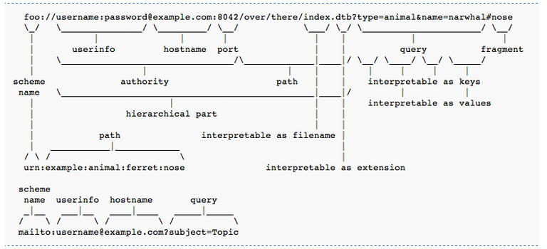

# 1.4.2 HTTP协议基础

- [什么是HTTP](#什么是http)
- [HTTP请求与响应](#http请求与响应)
- [HTTP方法](#http方法)
- [URL](#url)
- [HTTP消息头](#http消息头)
- [Cookie](#cookie)
- [状态码](#状态码)
- [HTTPS](#https)

## 什么是HTTP
HTTP是Web领域的核心通信协议。最初的HTTP支持基于文本的静态资源获取，随着协议版本的不断迭代，它已经支持如今常见的复杂分布式应用程序。

HTTP使用一种基于消息的模型，建立于TCP层之上。由客户端发送一条请求消息，而后由服务器返回一条响应消息。

## HTTP请求与响应

一次完整的请求或响应由消息头、一个空白行和消息主体构成。以下是一个典型的HTTP请求：

```
GET / HTTP/1.1
Host: www.github.com
User-Agent: Mozilla/5.0 (Windows NT 10.0; Win64; x64; rv:52.0) Gecko/20100101 Firefox/52.0
Accept: text/html,application/xhtml+xml,application/xml;q=0.9,*/*;q=0.8
Accept-Language: zh-CN,zh;q=0.8,en-US;q=0.5,en;q=0.3
Accept-Encoding: gzip, deflate
Upgrade-Insecure-Requests: 1
Cookie: logged_in=yes;
Connection: close
```

第一行分别是请求方法，请求的资源路径和使用的HTTP协议版本
第二至九行为消息头键值对


以下是对上面请求的回应（并不一定和真实访问相同，这里只是做为示例）

```

HTTP/1.1 200 OK
Date: Tue, 26 Dec 2017 02:28:53 GMT
Content-Type: text/html; charset=utf-8
Connection: close
Server: GitHub.com
Status: 200 OK
Cache-Control: no-cache
Vary: X-PJAX
X-UA-Compatible: IE=Edge,chrome=1
Set-Cookie: user_session=37Q; path=/;
X-Request-Id: e341
X-Runtime: 0.538664
Content-Security-Policy: default-src 'none'; 
Strict-Transport-Security: max-age=31536000; includeSubdomains; preload
Public-Key-Pins: max-age=0;
X-Content-Type-Options: nosniff
X-Frame-Options: deny
X-XSS-Protection: 1; mode=block
X-Runtime-rack: 0.547600
Vary: Accept-Encoding
X-GitHub-Request-Id: 7400
Content-Length: 128504

<!DOCTYPE html>
......

```

第一行为协议版本、状态号和对应状态的信息
第二至二十二为返回头键值对
紧接着为一个空行和返回的内容实体。

## HTTP方法

在提到HTTP方法之前，我们需要先讨论一下HTTP版本问题。HTTP协议现在共有三个大版本，版本差异会导致一些潜在的漏洞利用方式。

|版本    |简述   |
|-------|-------|
|HTTP 0.9|该版本只允许GET方法，具有典型的无状态性，无协议头和状态码，支持纯文本|
|HTTP 1.0|增加了HEAD和POST方法，支持长连接、缓存和身份认证|
|HTTP 1.1|增加了keep-alive机制和PipeLining流水线，新增了OPTIONS、PUT、DELETE、TRACE、CONNECT方法|
|HTTP 2.0|增加了多路复用、头部压缩、随时复位等功能|

|请求方法    |描述     				|
|-------    |-------                |
|GET        |请求获取URL资源         |
|POST       |执行操作，请求URL资源后附加新的数据|
|HEAD		|只获取资源响应消息报头|
|PUT		|请求服务器存储一个资源|
|DELETE		|请求服务器删除资源|
|TRACE		|请求服务器回送收到的信息|
|OPTIONS	|查询服务器的支持选项|


## URL

URL是统一资源定位符，它代表了Web资源的唯一标识，如同电脑上的盘符路径。最常见的URL格式如下所示：

```
protocol://[user[:password]@]hostname[:post]/[path]/file[?param=value]
协议   分隔符   用户信息        域名      端口   路径   资源文件   参数键   参数值      
```

下面是一张具体案例分析



## HTTP消息头

HTTP支持许多不同的消息头，一些有着特殊作用，而另一些则特定出现在请求或者响应中。

|消息头		|描述														|备注		|
|-------    |-------                									|-----------|	
|Connection	|告知通信另一端，在完成HTTP传输后是关闭TCP连接，还是保持连接开放	|			|
|Content-Encoding|规定消息主体内容的编码形式								|			|
|Content-Length|规定消息主体的字节长度										|			|
|Content-Type|规定消息主体的内容类型										|			|
|Accept|告知服务器客户端愿意接受的内容类型									|请求		|
|Accept-Encoding|告知服务器客户端愿意接受的内容编码							|请求		|
|Authorization|进行内置HTTP身份验证										|请求		|
|Cookie		|用于向服务器提交cookie										|请求		|
|Host		|指定所请求的完整URL中的主机名称								|请求		|
|Oringin	|跨域请求中的请求域											|请求		|
|Referer	|指定提出当前请求的原始URL										|请求		|
|User-Agent	|提供浏览器或者客户端软件的有关信息								|请求		|
|Cache-Control|向浏览器发送缓存指令										|响应		|
|Location	|重定向响应													|响应		|
|Server		|提供所使用的服务器软件信息										|响应		|
|Set-Cookie	|向浏览器发布cookie											|响应		|
|WWW-Authenticate|提供服务器支持的验证信息									|响应		|

## Cookie

Cookie是大多数Web应用程序所依赖的关键组成部分，它用来弥补HTTP的无状态记录的缺陷。服务器使用Set-Cookie发布cookie，浏览器获取cookie后每次请求会在Cookie字段中包含cookie值。

Cookie是一组键值对，另外还包括以下信息：

- expires，用于设定cookie的有效时间。
- domain，用于指定cookie的有效域。
- path，用于指定cookie的有效URL路径。
- secure，指定仅在HTTPS中提交cookie。
- HttpOnly，指定无法通过客户端JS直接访问cookie。

## 状态码

状态码表明资源的请求结果状态，由三位十进制数组成，第一位代表基本的类别：


- 1xx，提供信息
- 2xx，请求成功提交
- 3xx，客户端重定向其他资源
- 4xx，请求包含错误
- 5xx，服务端执行遇到错误

常见的状态码及短语如下所示：

|状态码|短语|描述|
|-----|----|----|
|100|Continue	|服务端已收到请求并要求客户端继续发送主体|
|200|Ok			|已成功提交，且响应主体中包含请求结果	|
|201|Created	|PUT请求方法的返回状态，请求成功提交	|
|301|Moved Permanently|请求永久重定向					|
|302|Found		|暂时重定向							|
|304|Not Modified|指示浏览器使用缓存中的资源副本		|
|400|Bad Request|客户端提交请求无效					|
|401|Unauthorized|服务端要求身份验证					|
|403|Forbidden	|禁止访问被请求资源					|
|404|Not Found	|所请求的资源不存在					|
|405|Method Not Allowed|请求方法不支持				|
|413|Request Entity Too Large|请求主体过长			|
|414|Request URI Too Long|请求URL过长				|
|500|Internal Server Error|服务器执行请求时遇到错误	|
|503|Service Unavailable|Web服务器正常，但请求无法被响应|

401状态支持的HTTP身份认证

- Basic，以Base64编码的方式发送证书
- NTLM，一种质询-响应机制
- Digest，一种质询-响应机制，随同证书一起使用一个随机的MD5校验和

## HTTPS

HTTPS用来弥补HTTP明文传输的缺陷。通过使用安全套接字SSL，在端与端之间传输加密后的消息，保护传输数据的隐密性和完整性，并且原始的HTTP协议依然按照之前同样的方式运作，不需要改变。

## 参考资料
[URL](https://en.wikipedia.org/wiki/URL)

[HTTP协议版本对比](https://www.cnblogs.com/andashu/p/6441271.html)

《黑客攻防技术宝典——Web实战篇》


