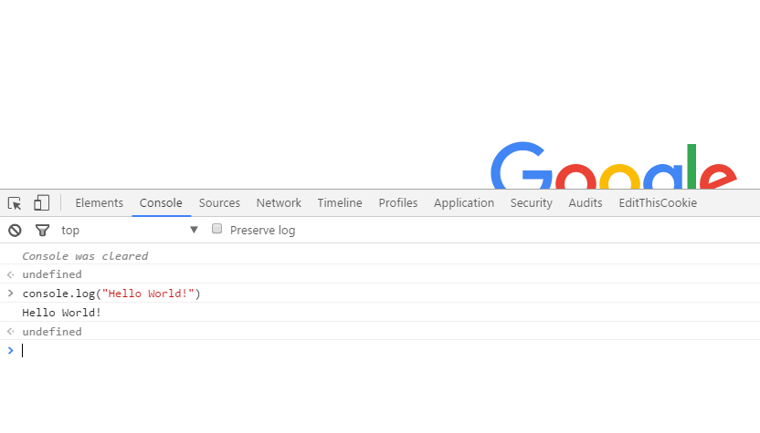
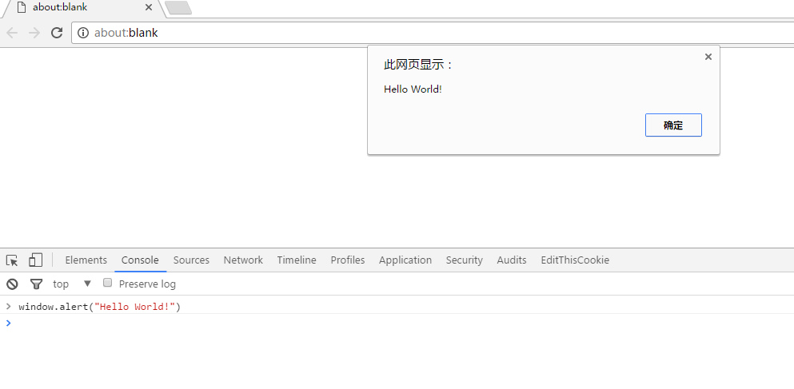

# 1.4.3 JavaScript基础

- [使用浏览器执行前端 JavaScript](#通过浏览器执行前端-javascript)
- [JavaScript 数据类型](#javascript-数据类型)
- [JavaScript 编程逻辑](#javascript-编程逻辑)
- [JavaScript 打印数据](#javascript-打印数据)
- [JavaScript 框架](#javascript-框架)
- [JavaScript DOM 和 BOM](#javascript-dom-和-bom)
- [JavaScript 混淆](#javascript-混淆)
- [使用 Node.js 执行后端 JavaScript](#使用-nodejs-执行后端-javascript)
- [Node.js 模块](#nodejs-模块)
- [参考资料](#参考资料)

## 使用浏览器执行前端 JavaScript

大多数浏览器通过 F12 可以调出调试窗口，如图所示。在调试窗口中可以执行相关代码。JS 是一种解释性语言，由解释器对代码进行解析。

```js
console.log("Hello World!")
```



在浏览器中，会集成 JS 的解析引擎，不同的浏览器拥有不同的解析引擎，这就使得 JS 的执行在不同浏览器上有不同的解释效果。

| 浏览器 | 引擎 |
| --- | --- |
| IE/Edge | Chakra |
| Firefox | SpiderMonkey |
| Safari | SFX |
| Chrome | V8 |
| Opera | Carakan |

嵌入在 HTML 中的 JS 代码通常有以下几种形式：

```text
直接插入代码块
<script>console.log('Hello World!');</script>

加载外部 JS 文件
<script src="Hello.js"></script>

使用 HTML 标签中的事件属性
<a href="javascript:alert('Hello')"></a>
```

## JavaScript 数据类型

作为弱类型的语言，JS 的变量声明不需要指定数据类型：

```js
var pi=3.14;
var pi='ratio of the circumference of a circle to its diameter';
```

当然，可以通过“ new ”来声明变量类型：

```js
var pi=new String;
var pi=new Number;
var pi=new Boolean;
var pi=new Array;
var pi=new Object;
```

上一个示例也展示了 JS 的数据类型，分别是字符串、数字、布尔值、数组和对象。

有两个特殊的类型是 Undefined 和 Null，形象一点区分，前者表示有坑在但坑中没有值，后者表示没有坑。另外，所有 JS 变量都是对象，**但是需要注意的是，对象声明的字符串和直接赋值的字符串并不严格相等**。

## JavaScript 编程逻辑

### 基础

JS 语句使用分号分隔。

### 逻辑语句

if 条件语句：

```js
if (condition)
{
  代码块
}
else
{
  代码块
}
```

switch 条件语句：

```js
switch(n)
{
  case 1:
    代码块
    break;
  case 2:
    代码块
    break;
  default:
    代码块
}
```

for/for in 循环语句：

```js
for (代码1；代码2；代码3)
{
  代码块
}
```

```js
for (x in xs)
{
  代码块
}
```

while/do while 循环语句：

```js
while (条件)
{
  代码块
}
```

```js
do
{
  代码块
}
while (条件);
```

## JavaScript 打印数据

在浏览器中调试代码时，经常用到的手段是打印变量。

| 函数 | 作用 |
| --- | --- |
| window.alert() | 弹出警告框 |
| document.write() | 写入HTML文档 |
| console.log() | 写入浏览器控制台 |




## JavaScript 框架

JS 同样有许多功能强大的框架。大多数的前端 JS 框架使用外部引用的方式将 JS 文件引入到正在编写的文档中。

### jQuery

jQuery 封装了常用的 JS 功能，通过选择器的机制来操纵 DOM 节点，完成复杂的前端效果展示。

### Angular

实现了前端的 MVC 架构，通过动态数据绑定来简化数据转递流程。

### React

利用组件来构建前端UI的框架

### Vue

MVVM 构架的前端库，理论上讲，将它定义为数据驱动、组件化的框架，但这些概念也可能适用于其他框架，所以可能只有去真正使用到所有框架才能领悟到它们之间的区别。

### 其他

还有许许多多针对不同功能的框架，比如针对图表可视化、网络信息传递或者移动端优化等等。

### 双向数据绑定

传统基于 MVC 的架构的思想是数据单向的传送到 View 视图中进行显示，但是有时我们还需要将视图层的数据传输回模型层，这部分的功能就由前端 JS 来接手，因此许多近几年出现的新框架都使用数据双向绑定来完成MVVM的新构架，这就带给了用户更多的权限接触到程序的编程逻辑，进而产生一些安全问题，比较典型的就是许多框架曾经存在的模板注入问题。

## JavaScript DOM 和 BOM

| | |
| --- | --- |
| DOM | 文档对象模型，JS 通过操纵 DOM 可以动态获取、修改 HTML 中的元素、属性、CSS 样式，这种修改有时会带来 XSS 攻击风险 |
| BOM | 浏览器对象模型，类比于 DOM，赋予 JS 对浏览器本身进行有限的操纵，获取 Cookie、地理位置、系统硬件或浏览器插件信息等 |

## JavaScript 混淆

由于前端代码的可见性，出于知识产权或者其他目的，JS 代码通过混淆的方法使得自己既能被浏览器执行，又难以被人为解读。常见的混淆方法有重命名变量名和函数名、挤压代码、拼接字符、使用动态执行函数在函数与字符串之间进行替换等。下面对比代码混淆前后的差异。

混淆前：

```js
console.log('Hello World!');
```

混淆后：

```js
console["\x6c\x6f\x67"]('\x48\x65\x6c\x6c\x6f \x57\x6f\x72\x6c\x64\x21');
```

更加复杂的混淆后：

```js
eval(function(p,a,c,k,e,d){e=function(c){return(c<a?"":e(parseInt(c/a)))+((c=c%a)>35?String.fromCharCode(c+29):c.toString(36))};if(!''.replace(/^/,String)){while(c--)d[e(c)]=k[c]||e(c);k=[function(e){return d[e]}];e=function(){return'\\w+'};c=1;};while(c--)if(k[c])p=p.replace(new RegExp('\\b'+e(c)+'\\b','g'),k[c]);return p;}('1.0(\'3 2!\');',4,4,'log|console|World|Hello'.split('|'),0,{}))
```

由于之前提到的特性，无论混淆有多么复杂，最终它都能够在浏览器中被解释执行。

## 使用 Node.js 执行后端 JavaScript

在 [安装完成](https://nodejs.org/en/download/) Node.js 后，我们可以尝试编写第一个后端 JS 程序。

1.打开文本编辑器，写入

```js
console.log("Hello World");
```

并保存为 `hello.js`

2.使用

```js
node hello.js
```

来执行文件。


## Node.js 模块

Node.js 同样通过丰富的模块提供强大的功能，模块使用 npm 进行管理。

- `events`：事件模块，提供事件触发和事件监听功能
- `util`：核心功能模块，用于弥补核心 JS 功能的不足
- `fs`：文件操作模块，提供文件操作 API
- `http`：Web 协议模块，提供 Web 协议交互功能
- `express`：Web 框架，用于快速构建 Web 应用服务
- `vm`：沙箱模块，提供干净的上下文环境

后端 JS 就会存在其他语言后端所同样存在安全问题，包括基础的 Web 攻击、服务端模板注入、沙箱逃逸、内存溢出等问题。

## 参考资料

- [JavaScript 教程](http://www.runoob.com/js/js-tutorial.html)
- [Node.js 教程](http://www.runoob.com/nodejs/nodejs-tutorial.html)
- [浅谈 Node.js 安全](https://zhuanlan.zhihu.com/p/28105239)
