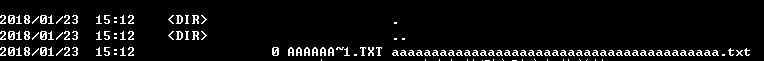

# 常见 Web 服务器基础

- [Apache HTTP Server](#apache-http-server)
- [Nginx](#nginx)
- [IIS](#iis)
- [如何获取 Web 服务指纹](#如何获取-web-服务指纹)

由于涉及到 Web 服务器和应用服务器的差别问题，这里着重介绍三款使用广泛的 Web 服务器。

当客户端按照 HTTP 协议发送了请求，服务端也写好了处理请求的逻辑代码，这时就需要一个中间人来接收请求，解析请求，并将请求放入后端代码中执行，最终将执行结果返回的页面传递给客户端。另外，我们还要保证整个服务能同时被大规模的人群使用，Web 服务器就充当了这样的角色。

## Apache HTTP Server

Apache HTTP Server 以稳定、安全以及对 PHP 的高效支持而被广泛用于 PHP 语言中，WAMP 或者 LAMP 就是它们组合的简称，即 Windows 或者 Linux 下的 Apache2+Mysql+PHP。

### 安装 Apache

Windows 下推荐直接[安装](http://www.wampserver.com/en/) WAMP 环境。

Ubuntu 下可以依次使用命令安装，需要注意的是不同的系统版本对 PHP 的支持情况不同，这里以 ubuntu 16.04 为例。

```text
sudo apt-get install apache2
sudo apt-get install mysql-server mysql-client
sudo apt-get install php7.0
sudo apt-get install libapache2-mod-php7.0
sudo apt-get install php7.0-mysql
service apache2 restart
service mysql restart
```

### 组件

Apache 服务器拥有强大的组件系统，这些组件补充了包括认证、日志记录、命令交互、语言支持等复杂功能，同样在 Apache 的发展过程中，许多组件都出现过漏洞，包括资源溢出、拒绝服务、远程命令执行等。

关于 Apache 的组件历史漏洞可以在 [https://www.exploit-db.com](https://www.exploit-db.com) 中进行查看

### 文件后缀解析特性

Apache 支持多后缀解析，对文件的后缀解析采用从右向左的顺序，如果遇到无法识别的后缀名就会依次遍历剩下的后缀名。

同时，还可以在配置文件如下选项中增加其他后缀名：

```text
<IfModule mime_module>
```

更多的后缀名支持可以查看 `mime.type` 文件。

## Nginx

Nginx 的特点在于它的负载均衡和反向代理功能，在访问规模庞大的站点上通常使用 Nginx 作为服务器。同样，Nginx 也和 Mysql、PHP 一同构成了 WNMP 和 LNMP 环境。和 Apache 默认将 PHP 作为模块加载不同的是，Nginx 通过 CGI 来调用 PHP。

### 安装 Nginx

Windows 由于没有官方网站的 WNMP，大家可以选择 Github 上的 WNMP 项目或者其他用户打包好的安装环境进行安装。

Ubuntu 这里以 FPM 配置为例：

```text
$ sudo apt-get install nginx
$ sudo apt-get install php7.0
$ sudo apt-get install php7.0-fpm
打开 vim /etc/nginx/sites-available/default
修改配置
server {
......
......
   location ~ \.php$ {
       include snippets/fastcgi-php.conf;
       fastcgi_pass unix:/run/php/php7.0-fpm.sock;
   }

......
......
}
$ service nginx restart
$ sudo apt-get install mysql-server php7.0-mysql
$ sudo apt-get install mysql-client
```

### 文件后缀解析

由于 Nginx 对 CGI 的使用更加广泛，所以 PHP 在 CGI 的一些解析特性放到 Nginx 这里来讲解，PHP 具有对文件路径进行修正的特性，使用如下配置参数：

```text
cgi.fix_pathinfo = 1
```

当使用如下的 URL 来访问一个存在的 1.jpg 资源时，Nginx 认为这是一个 PHP 资源，于是会将该资源交给 PHP 来处理，而 PHP 此时会发现 1.php 不存在，通过修正路径，PHP 会将存在的 1.jpg 作为 PHP 来执行。

```text
http://xxx/xxx/1.jpg/1.php
```

相似的绕过方式还有以下几种方式：

```text
http://xxx/xxx/1.jpg%00.php
http://xxx/xxx/1.jpg \0.php
```

但是，新版本的 PHP 引入了新的配置项 “security.limit_extensions” 来限制可执行的文件后缀，以此来弥补 CGI 文件后缀解析的不足。

## IIS

IIS 被广泛内置于 Windows 的多个操作系统中，只需要在控制面板中的 Windows 服务下打开 IIS 服务，即可进行配置操作。作为微软的 Web 服务器，它对 .net 的程序应用支持最好，同时也支持以 CGI 的方式加载其他语言。

### 安装 IIS

IIS 通常只能运行在 Windows 系统上，以 Windows 10 为例，打开控制面板，依次选择程序-启用或关闭 Windows 功能，勾选打开 Internet Information Services 服务。

启动成功后，在 “此电脑” 选项上点击右键，打开 “管理” 选项，选择 “服务和应用程序” 即可看到 IIS 的相关配置。

### IIS 解析特性

- IIS 短文件名

为了兼容 16 位 MS-DOS 程序， Windows 会为文件名较长的文件生成对应的短文件名，如下所示：



利用这种文件机制，我们可以在 IIS 和 .net 环境下进行短文件名爆破。

- IIS 6.0 解析特性

IIS 6.0 解析文件时会忽略分号后的字符串，因此 `1.asp;2.jpg` 将会被解析为 `1.asp`。

- IIS 也存在类似于 Nginx 的 CGI 解析特性

## 如何获取 Web 服务指纹

比赛中的信息获取往往十分重要，确定 Web 服务器指纹对于下一步的对策很重要。

### HTTP 头识别

许多 Web 服务器都会在返回给用户的 HTTP 头中告知自己的服务器名称和版本。举例列出一些真实存在的包含服务器信息的 HTTP 头：

```text
Server: nginx
Server: Tengine
Server: openresty/1.11.2.4
Server: Microsoft-IIS/8.0
Server: Apache/2.4.26 (Unix) OpenSSL/1.0.2l PHP/5.6.31 mod_perl/2.0.8-dev Perl/v5.16.3
X-Powered-By: PHP/5.5.25
X-Powered-By: ASP.NET
```

### 文件扩展名

URL 中使用的文件扩展名也能够揭示相关的服务平台和编程语言，如：

- `asp`：Microsoft Active Server Pages
- `aspx`：Microsoft ASP.NET
- `jsp`：Java Server Pages
- `php`：PHP

### 目录名称

一些子目录名称也常常表示应用程序所使用的相关技术。

### 会话令牌

许多服务会默认生成会话令牌，通过读取 cookie 中的会话令牌可以判断所使用的技术。如：

- `JSESSIONID`：JAVA
- `ASPSESSIONID`：IIS
- `ASP.NET_SessionId`：ASP.NET
- `PHPSESSID`：PHP
