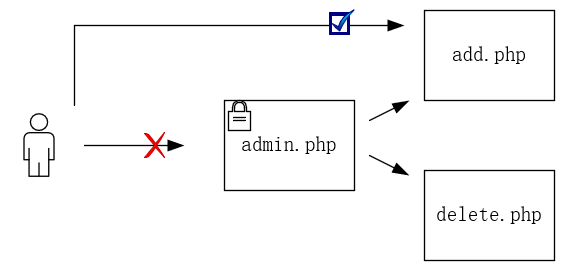

# 1.4.5 OWASP Top Ten Project 漏洞基础

- [OWASP Project](#owasp-project)
- [注入](#注入)
- [失效的身份认证](#失效的身份认证)
- [敏感信息泄露](#敏感信息泄露)
- [XML 外部实体](#xml-外部实体)
- [失效的访问控制](#失效的访问控制)
- [安全配置错误](#安全配置的错误)
- [跨站脚本](#跨站脚本)
- [不安全的反序列化](#不安全的反序列化)
- [使用含有已知漏洞的组件](#使用含有已知漏洞的组件)
- [不足的日志记录和监控](#不足的日志记录和监控)

## OWASP Project

OWASP 是一个开放的 Web 安全社区，影响着 Web 安全的方方面面，OWASP 每隔一段时间就会整理更新一次 “Top 10” 的 Web 漏洞排名，对当前实际环境常见的漏洞进行罗列，虽然漏洞排名经常引起业界的争议，但是在开源环境下，该计划公布的漏洞也能够客观反映实际场景中的某些问题，因此，我们选择 OWASP Top Ten 来作为 Web 方向的漏洞入门介绍材料。

## 注入

用一个不严谨的说法来形容注入攻击，就是，本应该处理用户输入字符的代码，将用户输入当作了代码来执行，常见于解释型语言。主要有以下几种形式：

| 类别 | 说明 |
| --- | --- |
| SQL 注入 | 最常见的注入形式，通过恶意拼接数据库语句，来实现非预期的功能 |
| 系统命令注入 | 通过拼接来执行非预期的操作系统指令 |
| 表达式语言注入 | Java 中常见的命令注入执行方式 |
| 服务端模板注入 | 使用模板引擎的语言常见的注入形式 |

一个简单的例子如下所示，这是一段身份认证常见的代码：

```sql
SELECT * FROM users WHERE username = 'admin' and password = '123456'
```

这个查询接收用户输入的账号和密码，放入数据库中进行查询，如果查询有结果则允许用户登录。在这种情况下，攻击者可以注入用户名或密码字段，来修改整个 SQL 语句的逻辑，用户可以提交这样的用户名：

```sql
admin' -- -
```

这时，应用程序将执行以下查询：

```sql
SELECT * FROM users WHERE username = 'admin' -- -' and password = '123456'
```

这里使用了 SQL 语句中的注释符（--），将密码部分查询注释掉，因此上面语句等同于：

```sql
SELECT * FROM users WHERE username = 'admin'
```

此时，仅仅通过用户名而不需要密码，我们便可成功登陆一个账号。

## 失效的身份认证

身份认证对于 Web 应用程序尤为重要，它是鉴别用户权限并授权的重要依据。但是，由于设计缺陷，许多登陆窗口缺乏验证码机制，导致攻击者可以低成本的对用户口令进行爆破攻击。另一方面，大量存在的弱口令或默认口令使得攻击者可以轻易的猜测出用户的常用口令，窃取用户权限。

当用户身份得到确定后，通常会使用会话来保持一定时间的权限，避免用户短时间内需要多次重复认证。但是，如果会话 ID 处理不当，有可能导致攻击者获取会话 ID 进行登录。

## 敏感数据泄露

一种场景是由于没有进行科学的加密方法，导致敏感数据以明文形式泄露。另一种场景是由于人为的管理不当，导致个人信息、登录凭证泄漏到公网中，常见的敏感数据泄露包括网站备份文件泄露、代码仓库泄露、硬编码凭证于代码中导致的泄露。

比如，在 Github 中搜索口令或者 API 关键字，可以发现大量私人的凭证直接写在代码中被上传到 Github 仓库中。

## XML 外部实体

从某种意义上说，XXE 也是一种注入攻击。通过利用 XML 处理器对外部实体的处理机制，将用户的外部实体输入代替已定义的实体引用，执行恶意代码。

一个典型的 XXE 攻击如下所示：

```http
POST /AjaxSearch.ashx HTTP/1.1
Host: test.com
Content-Type: text/xml;

<!DOCTYPE foo [ <!ENTITY xxe SYSTEM "file:///etc/passwd"> ]>
<c>&xxe</c>
```

我们创建了一个外部引用文档类型定义去访问一个敏感的系统文件，而这个外部引用会在应用程序中替代已经命名的实体去执行，最终获取到敏感文件，如果这个时候的执行结果会返回给用户，那么用户就可以看到敏感文件中的内容。

## 失效的访问控制

如果采用安全的代码框架编写模式，很有可能会造成访问控制失效问题，比如某一个需要用户登录才能访问的主页面，其中的某些功能实现的页面并没有添加权限认证过程，导致虽然攻击者无法访问主页面，但却能够访问到功能页面执行功能函数。

另一种常见的漏洞就是用户权限跨越，典型的方式是通过明文的 ID 数字来赋予用户权限，攻击者可以修改 ID 号来获取任意用户权限。



## 安全配置错误

由于配置疏忽，导致一些额外的信息、账户、文件可以被攻击者获取所导致的漏洞。常见的就是由于配置不当导致的目录遍历。

使用如下语句在 Google 中可以搜索到可目录遍历的网站，当然，许多网站也使用这种目录遍历的方式提供用户下载服务。

```text
intitle:index of
```

## 跨站脚本

跨站脚本攻击（XSS）通过插入恶意脚本代码来窃取用户信息，获取用户权限以及配合其他漏洞发动更加复杂的攻击，一个最基本的 XSS 攻击如下所示,恶意脚本在 script 标签内，这一段脚本将会弹出你在当前页面上的 cookie 信息。

```html
<script>alert(document.cookie)</script>
```

XSS 漏洞根据表现形式的不同，主要有以下三种类型。

### 反射型 XSS

有时，开发者会将一些用户可控的输入返回到网页中，如果返回的位置能够插入脚本语言或者触发事件，就存在反射型 XSS，通常攻击者发动这类攻击时需要受害者进行交互，因此这种攻击存在一定的局限性。

### 存储型 XSS

存储型 XSS 是指当页面从持久化存储中读取内容并显示时，如果攻击者能够将 XSS 攻击代码写入持久化存储中，那么当任意用户访问漏洞页面时，都将触发恶意代码，因此，这种攻击具有更加严重的风险。

### DOM 型 XSS

DOM 型 XSS 是由于攻击者可控的内容被加入到了正常的 JS 的框架或者 API 中导致的漏洞。

## 不安全的反序列化

序列化是一种数据对象传递手段，在传递数据值的同时保留了数据的结构属性。但是，如果在数据传递过程中处理不当，导致用户可控序列数据，在数据反序列化过程中就有可能造成命令执行或者越权行为。由于包括 Java、Python、PHP 等在内的语言都包含序列化和反序列化功能，根据不同的语言特性，利用方法有细微差距。

## 使用含有已知漏洞的组件

供应链安全是比较热门的话题，由于许多开源库被广泛用于各大社区、商业软件中，同时有部分的开源库并未得到有效维护，由此带来的供应链安全导致许多用户范围很广的软件存在着隐患。

当 0 day 漏洞公布后，一些场景无法及时的打补丁，也会使自身容易被攻击者利用。

## 不足的日志记录和监控

对系统、服务日志的有效监控会增加攻击者的入侵成本，因此，及时有效的日志记录、日志审计也应该是安全建设的重要环节。

需要强调的是，有时不足的日志记录方式还会产生严重的漏洞利用点，有可能被攻击者用来传递 Webshell。

## 参考资料

- [2017-owasp-top-10](http://www.owasp.org.cn/owasp-project/2017-owasp-top-10)
- 《黑客攻防技术宝典 - Web 实战篇》
