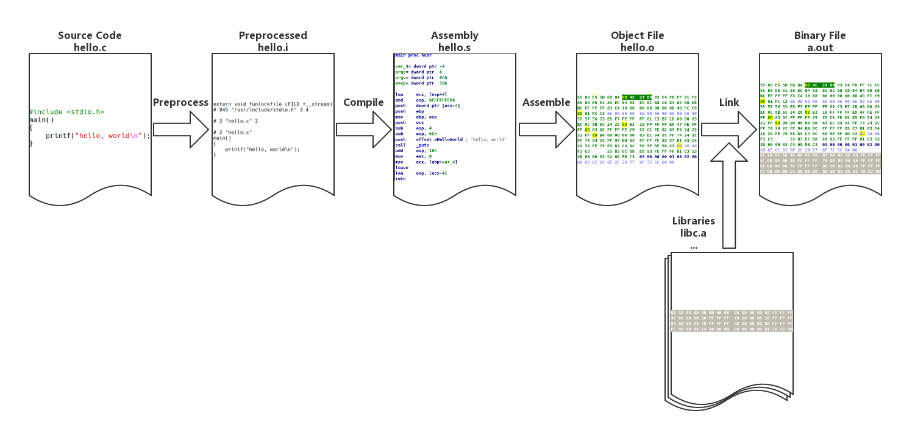
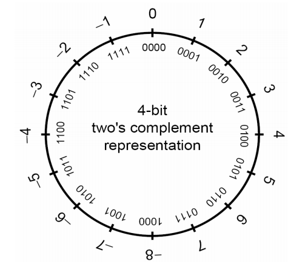
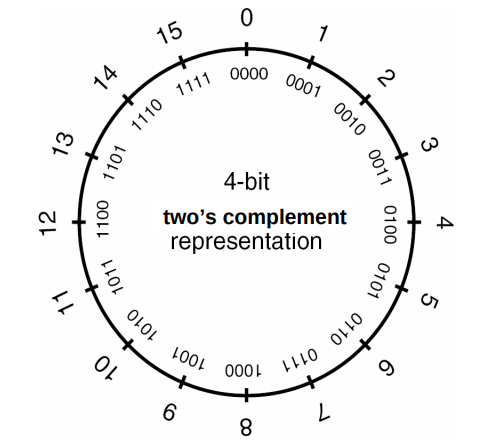

# 1.5.1 C 语言基础

- [从源代码到可执行文件](#从源代码到可执行文件)
- [C 语言标准库](#c-语言标准库)
- [整数表示](#整数表示)
- [格式化输出函数](#格式化输出函数)
- [关于 C++](#关于-c++)

## 从源代码到可执行文件

我们以经典著作《The C Programming Language》中的第一个程序 “Hello World” 为例，讲解 Linux 下 GCC 的编译过程。

```c
#include <stdio.h>
main()
{
    printf("hello, world\n");
}
```

```text
$gcc hello.c
$./a.out
hello world
```

以上过程可分为4个步骤：预处理（Preprocessing）、编译（Compilation）、汇编（Assembly）和链接（Linking）。



### 预编译

```text
gcc -E hello.c -o hello.i
```

```c
# 1 "hello.c"
# 1 "<built-in>"
# 1 "<command-line>"
......
extern int printf (const char *__restrict __format, ...);
......
main() {
 printf("hello, world\n");
}
```

预编译过程主要处理源代码中以 “#” 开始的预编译指令：

- 将所有的 “#define” 删除，并且展开所有的宏定义。
- 处理所有条件预编译指令，如 “#if”、“#ifdef”、“#elif”、“#else”、“#endif”。
- 处理 “#include” 预编译指令，将被包含的文件插入到该预编译指令的位置。注意，该过程递归执行。
- 删除所有注释。
- 添加行号和文件名标号。
- 保留所有的 #pragma 编译器指令。

### 编译

```text
gcc -S hello.c -o hello.s
```

```text
        .file   "hello.c"
        .section        .rodata
.LC0:
        .string "hello, world"
        .text
        .globl  main
        .type   main, @function
main:
.LFB0:
        .cfi_startproc
        pushq   %rbp
        .cfi_def_cfa_offset 16
        .cfi_offset 6, -16
        movq    %rsp, %rbp
        .cfi_def_cfa_register 6
        leaq    .LC0(%rip), %rdi
        call    puts@PLT
        movl    $0, %eax
        popq    %rbp
        .cfi_def_cfa 7, 8
        ret
        .cfi_endproc
.LFE0:
        .size   main, .-main
        .ident  "GCC: (GNU) 7.2.0"
        .section        .note.GNU-stack,"",@progbits
```

编译过程就是把预处理完的文件进行一系列词法分析、语法分析、语义分析及优化后生成相应的汇编代码文件。

### 汇编

```text
$ gcc -c hello.s -o hello.o
或者
$gcc -c hello.c -o hello.o
```

```text
$ objdump -sd hello.o

hello.o:     file format elf64-x86-64

Contents of section .text:
 0000 554889e5 488d3d00 000000e8 00000000  UH..H.=.........
 0010 b8000000 005dc3                      .....].
Contents of section .rodata:
 0000 68656c6c 6f2c2077 6f726c64 00        hello, world.
Contents of section .comment:
 0000 00474343 3a202847 4e552920 372e322e  .GCC: (GNU) 7.2.
 0010 3000                                 0.
Contents of section .eh_frame:
 0000 14000000 00000000 017a5200 01781001  .........zR..x..
 0010 1b0c0708 90010000 1c000000 1c000000  ................
 0020 00000000 17000000 00410e10 8602430d  .........A....C.
 0030 06520c07 08000000                    .R......

Disassembly of section .text:

0000000000000000 <main>:
   0:   55                      push   %rbp
   1:   48 89 e5                mov    %rsp,%rbp
   4:   48 8d 3d 00 00 00 00    lea    0x0(%rip),%rdi        # b <main+0xb>
   b:   e8 00 00 00 00          callq  10 <main+0x10>
  10:   b8 00 00 00 00          mov    $0x0,%eax
  15:   5d                      pop    %rbp
  16:   c3                      retq
```

汇编器将汇编代码转变成机器可以执行的指令。

### 链接

```text
gcc hello.o -o hello
```

```text
$ objdump -d -j .text hello
......
000000000000064a <main>:
 64a:   55                      push   %rbp
 64b:   48 89 e5                mov    %rsp,%rbp
 64e:   48 8d 3d 9f 00 00 00    lea    0x9f(%rip),%rdi        # 6f4 <_IO_stdin_used+0x4>
 655:   e8 d6 fe ff ff          callq  530 <puts@plt>
 65a:   b8 00 00 00 00          mov    $0x0,%eax
 65f:   5d                      pop    %rbp
 660:   c3                      retq
 661:   66 2e 0f 1f 84 00 00    nopw   %cs:0x0(%rax,%rax,1)
 668:   00 00 00
 66b:   0f 1f 44 00 00          nopl   0x0(%rax,%rax,1)
......
```

目标文件需要链接一大堆文件才能得到最终的可执行文件（上面只展示了链接后的 main 函数，可以和 hello.o 中的 main 函数作对比）。链接过程主要包括地址和空间分配（Address and Storage Allocation）、符号决议（Symbol Resolution）和重定向（Relocation）等。

### gcc 技巧

通常在编译后只会生成一个可执行文件，而中间过程生成的 `.i`、`.s`、`.o` 文件都不会被保存。我们可以使用参数 `-save-temps` 永久保存这些临时的中间文件。

```text
$ gcc -save-temps hello.c
$ ls
a.out hello.c  hello.i  hello.o  hello.s
```

这里要注意的是，gcc 默认使用动态链接，所以这里生成的 a.out 实际上是共享目标文件。

```text
$ file a.out
a.out: ELF 64-bit LSB shared object, x86-64, version 1 (SYSV), dynamically linked, interpreter /lib64/ld-linux-x86-64.so.2, for GNU/Linux 3.2.0, BuildID[sha1]=533aa4ca46d513b1276d14657ec41298cafd98b1, not stripped
```

使用参数 `--verbose` 可以输出 gcc 详细的工作流程。

```text
gcc hello.c -static --verbose
```

东西很多，我们主要关注下面几条信息：

```text
$ /usr/lib/gcc/x86_64-pc-linux-gnu/7.2.0/cc1 -quiet -v hello.c -quiet -dumpbase hello.c -mtune=generic -march=x86-64 -auxbase hello -version -o /tmp/ccj1jUMo.s

as -v --64 -o /tmp/ccAmXrfa.o /tmp/ccj1jUMo.s

/usr/lib/gcc/x86_64-pc-linux-gnu/7.2.0/collect2 -plugin /usr/lib/gcc/x86_64-pc-linux-gnu/7.2.0/liblto_plugin.so -plugin-opt=/usr/lib/gcc/x86_64-pc-linux-gnu/7.2.0/lto-wrapper -plugin-opt=-fresolution=/tmp/cc1l5oJV.res -plugin-opt=-pass-through=-lgcc -plugin-opt=-pass-through=-lgcc_eh -plugin-opt=-pass-through=-lc --build-id --hash-style=gnu -m elf_x86_64 -static /usr/lib/gcc/x86_64-pc-linux-gnu/7.2.0/../../../../lib/crt1.o /usr/lib/gcc/x86_64-pc-linux-gnu/7.2.0/../../../../lib/crti.o /usr/lib/gcc/x86_64-pc-linux-gnu/7.2.0/crtbeginT.o -L/usr/lib/gcc/x86_64-pc-linux-gnu/7.2.0 -L/usr/lib/gcc/x86_64-pc-linux-gnu/7.2.0/../../../../lib -L/lib/../lib -L/usr/lib/../lib -L/usr/lib/gcc/x86_64-pc-linux-gnu/7.2.0/../../.. /tmp/ccAmXrfa.o --start-group -lgcc -lgcc_eh -lc --end-group /usr/lib/gcc/x86_64-pc-linux-gnu/7.2.0/crtend.o /usr/lib/gcc/x86_64-pc-linux-gnu/7.2.0/../../../../lib/crtn.o
```

三条指令分别是 `cc1`、`as` 和 `collect2`，cc1 是 gcc 的编译器，将 `.c` 文件编译为 `.s` 文件，as 是汇编器命令，将 `.s` 文件汇编成 `.o` 文件，collect2 是链接器命令，它是对命令 ld 的封装。静态链接时，gcc 将 C 语言运行时库的 5 个重要目标文件 `crt1.o`、`crti.o`、`crtbeginT.o`、`crtend.o`、`crtn.o` 和 `-lgcc`、`-lgcc_eh`、`-lc` 表示的 3 个静态库链接到可执行文件中。

更多的内容我们会在 1.5.3 中专门对 ELF 文件进行讲解。

## C 语言标准库

C 运行库（CRT）是一套庞大的代码库，以支撑程序能够正常地运行。其中 C 语言标准库占据了最主要地位。

常用的标准库文件头：

- 标准输入输出（stdio.h）
- 字符操作（ctype.h）
- 字符串操作（string.h）
- 数学函数（math.h）
- 实用程序库（stdlib.h）
- 时间／日期（time.h）
- 断言（assert.h）
- 各种类型上的常数（limits.h & float.h）
- 变长参数（stdarg.h）
- 非局部跳转（setjmp.h）

glibc 即 GNU C Library，是为 GNU 操作系统开发的一个 C 标准库。glibc 主要由两部分组成，一部分是头文件，位于 `/usr/include`；另一部分是库的二进制文件。二进制文件部分主要是 C 语言标准库，有动态和静态两个版本，动态版本位于 `/lib/libc.so.6`，静态版本位于 `/usr/lib/libc.a`。

在漏洞利用的过程中，通常我们通过计算目标函数地址相对于已知函数地址在同一个 libc 中的偏移，来获得目标函数的虚拟地址，这时我们需要让本地的 libc 版本和远程的 libc 版本相同，可以先泄露几个函数的地址，然后在 [libcdb.com](http://libcdb.com/) 中进行搜索来得到。

## 整数表示

默认情况下，C 语言中的数字是有符号数，下面我们声明一个有符号整数和无符号整数：

```c
int var1 = 0;
unsigned int var2 = 0;
```

- 有符号整数
  - 可以表示为正数或负数
  - `int` 的范围：`-2,147,483,648 ~ 2,147,483,647`
- 无符号整数
  - 只能表示为零或正数
  - `unsigned int` 的范围：`0 ~ 4,294,967,295`

`signed` 或者 `unsigned` 取决于整数类型是否可以携带标志 `+/-`：

- Signed
  - int
  - signed int
  - long
- Unsigned
  - unit
  - unsigned int
  - unsigned long

在 `signed int` 中，二进制最高位被称作符号位，符号位被设置为 `1` 时，表示值为负，当设置为 `0` 时，值为非负：

- 0x7FFFFFFF = 2147493647
  - 01111111111111111111111111111111
- 0x80000000 = -2147483647
  - 10000000000000000000000000000000
- 0xFFFFFFFF = -1
  - 11111111111111111111111111111111

二进制补码以一种适合于二进制加法器的方式来表示负数，当一个二进制补码形式表示的负数和与它的绝对值相等的正数相加时，结果为 0。首先以二进制方式写出正数，然后对所有位取反，最后加 1 就可以得到该数的二进制补码：

```text
eg: 0x00123456
  = 1193046
  = 00000000000100100011010001010110
 ~= 11111111111011011100101110101001
 += 11111111111011011100101110101010
  = -1193046 (0xFFEDCBAA)
```

编译器需要根据变量类型信息编译成相应的指令：

- 有符号指令
  - IDIV：带符号除法指令
  - IMUL：带符号乘法指令
  - SAL：算术左移指令（保留符号）
  - SAR：右移右移指令（保留符号）
  - MOVSX：带符号扩展传送指令
  - JL：当小于时跳转指令
  - JLE：当小于或等于时跳转指令
  - JG：当大于时跳转指令
  - JGE：当大于或等于时跳转指令
- 无符号指令
  - DIV：除法指令
  - MUL：乘法指令
  - SHL：逻辑左移指令
  - SHR：逻辑右移指令
  - MOVZX：无符号扩展传送指令
  - JB：当小于时跳转指令
  - JBE：当小于或等于时跳转指令
  - JA：当大于时跳转指令
  - JAE：当大于或等于时跳转指令

32 位机器上的整型数据类型，不同的系统可能会有不同：

C 数据类型 | 最小值 | 最大值 | 最小大小
--- | --- | --- | ---
char | -128 | 127 | 8 bits
short | -32 768 | 32 767 | 16 bits
int | -2 147 483 648 | 2 147 483 647 | 16 bits
long | -2 147 483 648 | 2 147 483 647 | 32 bits
long long | -9 223 372 036 854 775 808 | 9 223 372 036 854 775 807 | 64 bits

固定大小的数据类型：

- `int [# of bits]_t`
  - int8\_t, int16\_t, int32_t
- `uint[# of bits]_t`
  - uint8\_t, uint16\_t, uint32_t

- 有符号整数
  - 
- 无符号整数
  - 

更多信息在 `stdint.h` 和 `limits.h` 中：

```text
man stdint.h
cat /usr/include/stdint.h
man limits.h
cat /usr/include/limits.h
```

了解整数的符号和大小是很有用的，在后面的相关章节中我们会介绍整数溢出的内容。

## 格式化输出函数

C 标准中定义了下面的格式化输出函数（参考 `man ３ printf`）：

```c
#include <stdio.h>

int printf(const char *format, ...);
int fprintf(FILE *stream, const char *format, ...);
int dprintf(int fd, const char *format, ...);
int sprintf(char *str, const char *format, ...);
int snprintf(char *str, size_t size, const char *format, ...);

#include <stdarg.h>

int vprintf(const char *format, va_list ap);
int vfprintf(FILE *stream, const char *format, va_list ap);
int vdprintf(int fd, const char *format, va_list ap);
int vsprintf(char *str, const char *format, va_list ap);
int vsnprintf(char *str, size_t size, const char *format, va_list ap);
```

- `fprintf()` 按照格式字符串的内容将输出写入流中。三个参数为流、格式字符串和变参列表。
- `printf()` 等同于 `fprintf()`，但是它假定输出流为 `stdout`。
- `sprintf()` 等同于 `fprintf()`，但是输出不是写入流而是写入数组。在写入的字符串末尾必须添加一个空字符。
- `snprintf()` 等同于 `sprintf()`，但是它指定了可写入字符的最大值 `size`。当 `size` 大于零时，输出字符超过第 `size-1` 的部分会被舍弃而不会写入数组中，在写入数组的字符串末尾会添加一个空字符。
- `dprintf()` 等同于 `fprintf()`，但是它输出不是流而是一个文件描述符 `fd`。
- `vfprintf()`、`vprintf()`、`vsprintf()`、`vsnprintf()`、`vdprintf()` 分别与上面的函数对应，只是它们将变参列表换成了 `va_list` 类型的参数。

### 格式字符串

格式字符串是由普通字符（ordinary character）（包括 `%`）和转换规则（conversion specification）构成的字符序列。普通字符被原封不动地复制到输出流中。转换规则根据与实参对应的转换指示符对其进行转换，然后将结果写入输出流中。

一个转换规则有可选部分和必需部分组成：

```text
%[ 参数 ][ 标志 ][ 宽度 ][ .精度 ][ 长度 ] 转换指示符
```

- （必需）转换指示符

| 字符 | 描述 |
| --- | --- |
| `d`, `i` | 有符号十进制数值 `int`。'`%d`' 与 '`%i`' 对于输出是同义；但对于 `scanf()` 输入二者不同，其中 `%i` 在输入值有前缀 `0x` 或 `0` 时，分别表示 16 进制或 8 进制的值。如果指定了精度，则输出的数字不足时在左侧补 0。默认精度为 1。精度为 0 且值为 0，则输出为空 |
| `u` | 十进制 `unsigned int`。如果指定了精度，则输出的数字不足时在左侧补 0。默认精度为 1。精度为 0 且值为 0，则输出为空 |
| `f`, `F` | `double` 型输出 10 进制定点表示。'`f`' 与 '`F`' 差异是表示无穷与 NaN 时，'`f`' 输出 '`inf`', '`infinity`' 与 '`nan`'；'`F`' 输出 '`INF`', '`INFINITY`' 与 '`NAN`'。小数点后的数字位数等于精度，最后一位数字四舍五入。精度默认为 6。如果精度为 0 且没有 # 标记，则不出现小数点。小数点左侧至少一位数字 |
| `e`, `E` | `double` 值，输出形式为 10 进制的([`-`]d.ddd `e`[`+`/`-`]ddd). `E` 版本使用的指数符号为 `E`（而不是`e`）。指数部分至少包含 2 位数字，如果值为 0，则指数部分为 00。Windows 系统，指数部分至少为 3 位数字，例如 1.5e002，也可用 Microsoft 版的运行时函数 `_set_output_format` 修改。小数点前存在 1 位数字。小数点后的数字位数等于精度。精度默认为 6。如果精度为 0 且没有 # 标记，则不出现小数点 |
| `g`, `G` | `double` 型数值，精度定义为全部有效数字位数。当指数部分在闭区间 [-4,精度] 内，输出为定点形式；否则输出为指数浮点形式。'`g`' 使用小写字母，'`G`' 使用大写字母。小数点右侧的尾数 0 不被显示；显示小数点仅当输出的小数部分不为 0 |
| `x`, `X` | 16 进制 `unsigned int`。'`x`' 使用小写字母；'`X`' 使用大写字母。如果指定了精度，则输出的数字不足时在左侧补 0。默认精度为 1。精度为 0 且值为 0，则输出为空 |
| `o` | 8 进制 `unsigned int`。如果指定了精度，则输出的数字不足时在左侧补 0。默认精度为 1。精度为 0 且值为 0，则输出为空 |
| `s` | 如果没有用 `l` 标志，输出 `null` 结尾字符串直到精度规定的上限；如果没有指定精度，则输出所有字节。如果用了 `l` 标志，则对应函数参数指向 `wchar_t` 型的数组，输出时把每个宽字符转化为多字节字符，相当于调用 `wcrtomb` 函数 |
| `c` | 如果没有用 `l` 标志，把 `int` 参数转为 `unsigned char` 型输出；如果用了 `l` 标志，把 `wint_t` 参数转为包含两个元素的 `wchart_t` 数组，其中第一个元素包含要输出的字符，第二个元素为 `null` 宽字符 |
| `p` | `void *` 型，输出对应变量的值。`printf("%p", a)` 用地址的格式打印变量 `a` 的值，`printf("%p", &a)` 打印变量 `a` 所在的地址 |
| `a`, `A` | `double` 型的 16 进制表示，"[−]0xh.hhhh p±d"。其中指数部分为 10 进制表示的形式。例如：1025.010 输出为 0x1.004000p+10。'`a`' 使用小写字母，'`A`' 使用大写字母 |
| `n` | 不输出字符，但是把已经成功输出的字符个数写入对应的整型指针参数所指的变量 |
| `%` | '`%`' 字面值，不接受任何除了 `参数` 以外的部分 |

- （可选）参数

| 字符 | 描述 |
| --- | --- |
| `n$` | `n` 是用这个格式说明符显示第几个参数；这使得参数可以输出多次，使用多个格式说明符，以不同的顺序输出。如果任意一个占位符使用了 `参数`，则其他所有占位符必须也使用 `参数`。例：`printf("%2$d %2$#x; %1$d %1$#x",16,17)` 产生 "`17 0x11; 16 0x10`" |

- （可选）标志

| 字符 | 描述 |
| --- | --- |
| `+` | 总是表示有符号数值的 '`+`' 或 '`-`' 号，缺省情况是忽略正数的符号。仅适用于数值类型 |
| *空格* | 使得有符号数的输出如果没有正负号或者输出 0 个字符，则前缀 1 个空格。如果空格与 '`+`' 同时出现，则空格说明符被忽略 |
| `-` | 左对齐。缺省情况是右对齐 |
| `#` | 对于 '`g`' 与 '`G`'，不删除尾部 0 以表示精度。对于 '`f`', '`F`', '`e`', '`E`', '`g`', '`G`', 总是输出小数点。对于 '`o`', '`x`', '`X`', 在非 0 数值前分别输出前缀 `0`, `0x` 和 `0X`表示数制 |
| `0` | 如果 `宽度` 选项前缀为 `0`，则在左侧用 `0` 填充直至达到宽度要求。例如 `printf("%2d", 3)` 输出 "`3`"，而 `printf("%02d", 3)` 输出 "`03`"。如果 `0` 与 `-` 均出现，则 `0` 被忽略，即左对齐依然用空格填充 |

- （可选）宽度

是一个用来指定输出字符的最小个数的十进制非负整数。如果实际位数多于定义的宽度,则按实际位数输出；如果实际位数少于定义的宽度则补以空格或 0。

- （可选）精度

精度是用来指示打印字符个数、小数位数或者有效数字个数的非负十进制整数。对于 `d`、`i`、`u`、`x`、`o` 的整型数值，是指最小数字位数，不足的位要在左侧补 0，如果超过也不截断，缺省值为 1。对于 `a`, `A`, `e`, `E`, `f`, `F` 的浮点数值，是指小数点右边显示的数字位数，必要时四舍五入；缺省值为 6。对于 `g`, `G` 的浮点数值，是指有效数字的最大位数。对于 `s` 的字符串类型，是指输出的字节的上限，超出限制的其它字符将被截断。如果域宽为 `*`，则由对应的函数参数的值为当前域宽。如果仅给出了小数点，则域宽为 0。

- （可选）长度

| 字符 | 描述 |
| --- | --- |
| `hh` | 对于整数类型，`printf` 期待一个从 `char` 提升的 `int` 整型参数 |
| `h` | 对于整数类型，`printf` 期待一个从 `short` 提升的 `int` 整型参数 |
| `l` | 对于整数类型，`printf` 期待一个 `long` 整型参数。对于浮点类型，`printf` 期待一个 `double` 整型参数。对于字符串 `s` 类型，`printf` 期待一个 `wchar_t` 指针参数。对于字符 `c` 类型，`printf` 期待一个 `wint_t` 型的参数 |
| `ll` | 对于整数类型，`printf` 期待一个 `long long` 整型参数。Microsoft 也可以使用 `I64` |
| `L` | 对于浮点类型，`printf` 期待一个 `long double` 整型参数 |
| `z` | 对于整数类型，`printf` 期待一个 `size_t` 整型参数 |
| `j` | 对于整数类型，`printf` 期待一个 `intmax_t` 整型参数 |
| `t` | 对于整数类型，`printf` 期待一个 `ptrdiff_t` 整型参数 |

### 例子

```c
printf("Hello %%");           // "Hello %"
printf("Hello World!");       // "Hello World!"
printf("Number: %d", 123);    // "Number: 123"
printf("%s %s", "Format", "Strings");   // "Format Strings"

printf("%12c", 'A');          // "           A"
printf("%16s", "Hello");      // "          Hello!"

int n;
printf("%12c%n", 'A', &n);    // n = 12
printf("%16s%n", "Hello!", &n); // n = 16

printf("%2$s %1$s", "Format", "Strings"); // "Strings Format"
printf("%42c%1$n", &n);       // 首先输出41个空格，然后输出 n 的低八位地址作为一个字符
```

这里我们对格式化输出函数和格式字符串有了一个详细的认识，后面的章节中我们会介绍格式化字符串漏洞的内容。

## 关于 C++
