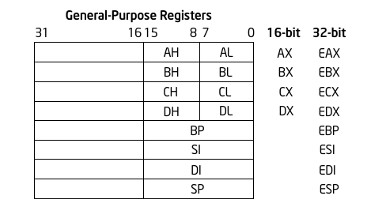
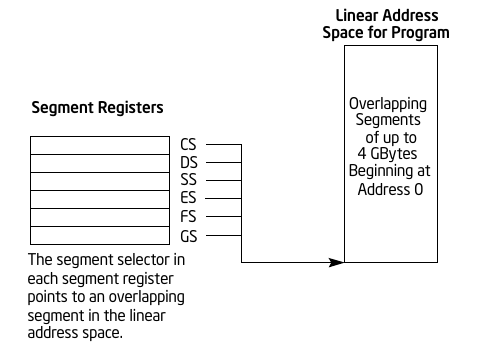
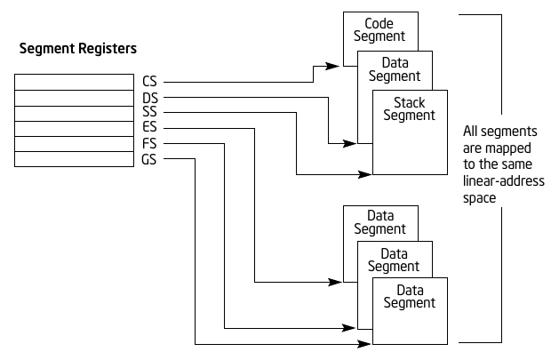
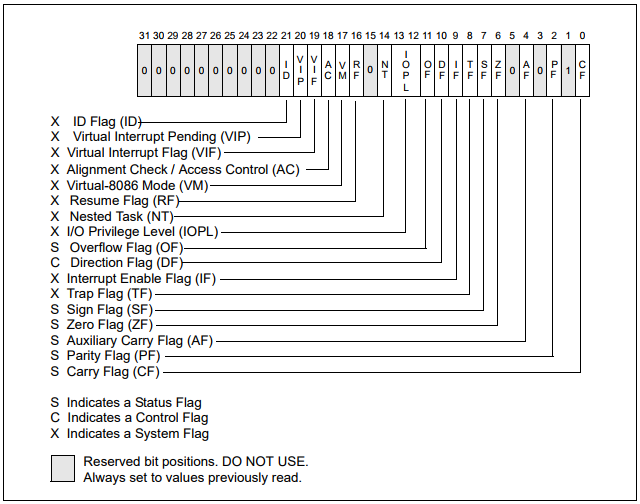

# 1.5.2 x86/x64 汇编基础

- [x86](#x86)
- [x64](#x64)
- [参考资料](#参考资料)

## x86

IA-32 体系结构提供了 16 个基础寄存器，可分为下面几组：

- 通用寄存器：8 个通用寄存器用于存储操作数、运算结果和指针。
- 段寄存器：包括 6 个段选择器。
- EFLAGS 寄存器：用于显示程序执行的状态和允许对处理器进行有限的（应用层）控制。
- EIP 寄存器：包含一个 32 位的指针，指向下一条被执行的指令

### 通用寄存器

- EAX：操作数和结果数据的累加器。
- EBX：指向 DS 段中数据的指针。
- ECX：用于字符串和循环操作的计数器。
- EDX：I/O 指针。
- ESI：指向由 DS 寄存器指向的段中的数据的指针；字符串操作的源指针。
- EDI：指向由 ES 寄存器指向的段中的数据（或目标地址）的指针；字符串操作的目标指针。
- ESP：栈指针（位于 SS 段）。
- EBP：指向栈上数据的指针（位于 SS 段）。

### 段寄存器

段寄存器用于保存 16 位的段选择器。段选择器是一种特殊的指针，用于确定内存中某个段的位置。

段寄存器的使用取决于操作系统的内存管理模型。

平坦内存模型：

分段内存模型：

### EFLAGS

标志位寄存器统称为 EFLAGS：

- 状态标志
  - CF（bit 0）：进位标志，用于表示无符号数运算是否产生进位或者借位，如果产生了进位或借位则值为 1，否则值为 0。
  - PF（bit 2）：奇偶标志，用于表示运算结果中 1 的个数的奇偶性，偶数个 1 时值为 1，奇数个 1 时值为 0。
  - AF（bit 4）：辅助进位标志，在字操作时标记低位字节（低 4 位）是否向高位字节（高 4 位）进位或借位。
  - ZF（bit 6）：零标志，用于表示运算结果是否为 0，结果为 0 时其值置 1，否则置 0。
  - SF（bit 7）：符号标志，用来标记有符号数运算结果是否小于 0，小于 0 时置 1，否则置 0。
  - OF（bit 11）：溢出标志，用于表示有符号运算结果是否溢出，发生溢出时置 1，否则置 0。
- DF（bit 10）：方向标志，决定串操作指令执行时指针寄存器的调整方向。
- 系统标志和 IOPL 域
  - TF（bit 8）：跟踪标志，用于程序调试，置 1 时 CPU 处于单步执行状态，置 0 时处于连续工作状态。
  - IF（bit 9）：中断允许标志，决定 CPU 是否响应 CPU 外部的可屏蔽中断发出的中断请求，置 1 时可以响应中断，置 0 时不响应中断。
  - IOPL（bits 12,13）：I/O 特权标志，用于表示当前进程的 I/O 特权级别，只有当前进程的 CPL 小于或等于 IOPL 时才能访问 I/O 地址空间，只有 CPL 为 0 时才能修改 IOPL 域。
  - NT（bit 14）：嵌套任务标志，置 1 时表示当前任务是在另一个任务中嵌套执行，置 0 时表示非嵌套。
  - RT（bit 16）：恢复标志，用于表示是否响应指令断点，置 1 禁用指令断点，置 0 允许指令断点。
  - VM（bit 17）：虚拟 8086 模式标志，用于表示进程是运行在虚拟 8086 模式还是保护模式，置 1 运行在虚拟 8086 模式，置 0 运行在保护模式。
  - AC（bit 18）：对齐检测标志，与 CR0 寄存器的 AM 标志联合使用，这两个标志位同时置 1 启用对内存引用的对齐检查，同时置 0 表示禁用对齐检查。对齐检查仅在用户态下进行，0 特权级下不做检查。
  - VIF（bit 19）：虚拟中断标志，是 IF 标志的一个虚拟映像，与 VIP 标志一起使用，当控制寄存器 CR4 中的 VME 或者 PVI 标志位置 1 且 IOPL 小于 3 时，处理器只识别 VIF 标志。
  - VIP（bit 20）：虚拟中断等待标志，置 1 表示有一个等待处理的中断，置 0 表示没有等待处理的中断。
  - ID（bit 21）：识别标志，置 1 表示支持 CPUID 指令，置 0 表示不支持。

### EIP 寄存器

指令指针寄存器存储了当前代码段的偏移，指向了下一条要执行的指令，系统根据该寄存器从内存中取出指令，然后再译码执行。

## x64

## 参考资料

- [Intel® 64 and IA-32 Architectures Software Developer Manuals](https://software.intel.com/en-us/articles/intel-sdm)
