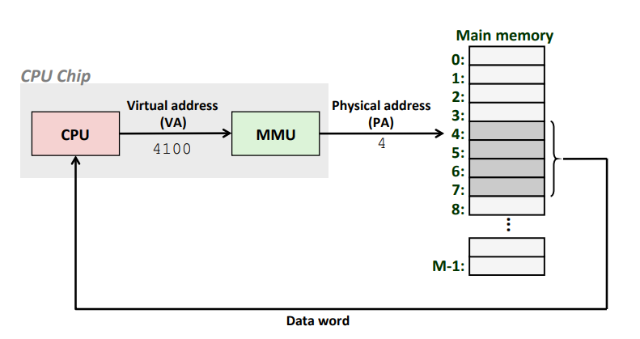
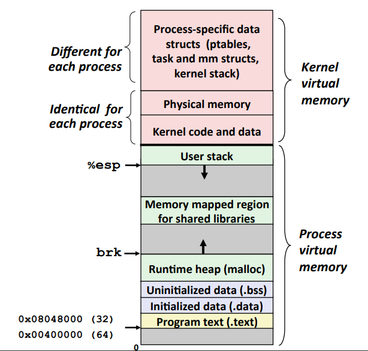
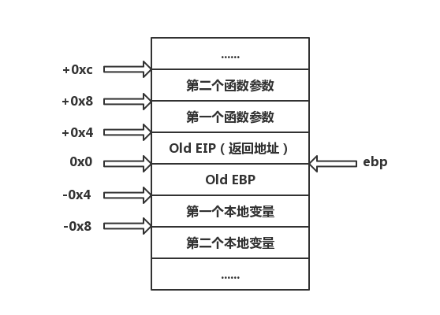

# 内存管理

- [什么是内存](#什么是内存)
- [栈与调用约定](#栈与调用约定)
- [堆与内存管理](#堆与内存管理)


## 什么是内存
为了使用户程序在运行时具有一个私有的地址空间、有自己的 CPU，就像独占了整个计算机一样，现代操作系统提出了虚拟内存的概念。

虚拟内存的主要作用主要为三个：
- 它将内存看做一个存储在磁盘上的地址空间的高速缓存，在内存中只保存活动区域，并根据需要在磁盘和内存之间来回传送数据。
- 它为每个进程提供了一致的地址空间。
- 它保护了每个进程的地址空间不被其他进程破坏。

现代操作系统采用虚拟寻址的方式，CPU 通过生成一个虚拟地址（Virtual Address(VA)）来访问内存，然后这个虚拟地址通过内存管理单元（Memory Management Unit(MMU)）转换成物理地址之后被送到存储器。



前面我们已经看到可执行文件被映射到了内存中，Linux 为每个进程维持了一个单独的虚拟地址空间，包括了 .text、.data、.bss、栈（stack）、堆（heap），共享库等内容。

32 位系统有 4GB 的地址空间，其中 0x08048000~0xbfffffff 是用户空间（3GB），0xc0000000~0xffffffff 是内核空间（１GB）。




## 栈与调用约定
#### 栈
栈是一个先入后出（First In Last Out(FIFO)）的容器。用于存放函数返回地址及参数、临时变量和有关上下文的内容。程序在调用函数时，操作系统会自动通过压栈和弹栈完成保存函数现场等操作，不需要程序员手动干预。

栈由高地址向低地址增长，栈保存了一个函数调用所需要的维护信息，称为堆栈帧（Stack Frame）在 x86 体系中，寄存器 `ebp` 指向堆栈帧的底部，`esp` 指向堆栈帧的顶部。压栈时栈顶地址减小，弹栈时栈顶地址增大。
- `PUSH`：用于压栈。将 `esp` 减 4，然后将其唯一操作数的内容写入到 `esp` 指向的内存地址
- `POP` ：用于弹栈。从 `esp` 指向的内存地址获得数据，将其加载到指令操作数（通常是一个寄存器）中，然后将 `esp` 加 4。

x86 体系下函数的调用总是这样的：
- 把所有或一部分参数压入栈中，如果有其他参数没有入栈，那么使用某些特定的寄存器传递。
- 把当前指令的下一条指令的地址压入栈中。
- 跳转到函数体执行。

其中第 2 步和第 3 步由指令 `call` 一起执行。跳转到函数体之后即开始执行函数，而 x86 函数体的开头是这样的：
- `push ebp`：把ebp压入栈中（old ebp）。
- `mov ebp, esp`：ebp=esp（这时ebp指向栈顶，而此时栈顶就是old ebp）
- [可选] `sub esp, XXX`：在栈上分配 XXX 字节的临时空间。
- [可选] `push XXX`：保存名为 XXX 的寄存器。

把ebp压入栈中，是为了在函数返回时恢复以前的ebp值，而压入寄存器的值，是为了保持某些寄存器在函数调用前后保存不变。函数返回时的操作与开头正好相反：
- [可选] `pop XXX`：恢复保存的寄存器。
- `mov esp, ebp`：恢复esp同时回收局部变量空间。
- `pop ebp`：恢复保存的ebp的值。
- `ret`：从栈中取得返回地址，并跳转到该位置。

栈帧对应的汇编代码：
```text
PUSH ebp          ; 函数开始（使用ebp前先把已有值保存到栈中）
MOV ebp, esp      ; 保存当前esp到ebp中

...       　      ; 函数体
                　; 无论esp值如何变化，ebp都保持不变，可以安全访问函数的局部变量、参数
MOV esp, ebp    　; 将函数的其实地址返回到esp中
POP ebp       　  ; 函数返回前弹出保存在栈中的ebp值
RET              ; 函数返回并跳转
```

函数调用后栈的标准布局如下图：



我们来看一个例子：[源码](../src/Others/1.5.7_stack.c)
```c
#include<stdio.h>
int add(int a, int b) {
    int x = a, y = b;
    return (x + y);
}

int main() {
    int a = 1, b = 2;
    printf("%d\n", add(a, b));
    return 0;
}
```

使用 gdb 查看对应的汇编代码：
```text
gdb-peda$ disassemble main
Dump of assembler code for function main:
   0x00000563 <+0>:	lea    ecx,[esp+0x4]
   0x00000567 <+4>:	and    esp,0xfffffff0
   0x0000056a <+7>:	push   DWORD PTR [ecx-0x4]
   0x0000056d <+10>:	push   ebp
   0x0000056e <+11>:	mov    ebp,esp
   0x00000570 <+13>:	push   ebx
   0x00000571 <+14>:	push   ecx
   0x00000572 <+15>:	sub    esp,0x10
   0x00000575 <+18>:	call   0x440 <__x86.get_pc_thunk.bx>
   0x0000057a <+23>:	add    ebx,0x1a86
   0x00000580 <+29>:	mov    DWORD PTR [ebp-0x10],0x1
   0x00000587 <+36>:	mov    DWORD PTR [ebp-0xc],0x2
   0x0000058e <+43>:	push   DWORD PTR [ebp-0xc]
   0x00000591 <+46>:	push   DWORD PTR [ebp-0x10]
   0x00000594 <+49>:	call   0x53d <add>
   0x00000599 <+54>:	add    esp,0x8
   0x0000059c <+57>:	sub    esp,0x8
   0x0000059f <+60>:	push   eax
   0x000005a0 <+61>:	lea    eax,[ebx-0x19b0]
   0x000005a6 <+67>:	push   eax
   0x000005a7 <+68>:	call   0x3d0 <printf@plt>
   0x000005ac <+73>:	add    esp,0x10
   0x000005af <+76>:	mov    eax,0x0
   0x000005b4 <+81>:	lea    esp,[ebp-0x8]
   0x000005b7 <+84>:	pop    ecx
   0x000005b8 <+85>:	pop    ebx
   0x000005b9 <+86>:	pop    ebp
   0x000005ba <+87>:	lea    esp,[ecx-0x4]
   0x000005bd <+90>:	ret    
End of assembler dump.
gdb-peda$ disassemble add
Dump of assembler code for function add:
   0x0000053d <+0>:	push   ebp
   0x0000053e <+1>:	mov    ebp,esp
   0x00000540 <+3>:	sub    esp,0x10
   0x00000543 <+6>:	call   0x5be <__x86.get_pc_thunk.ax>
   0x00000548 <+11>:	add    eax,0x1ab8
   0x0000054d <+16>:	mov    eax,DWORD PTR [ebp+0x8]
   0x00000550 <+19>:	mov    DWORD PTR [ebp-0x8],eax
   0x00000553 <+22>:	mov    eax,DWORD PTR [ebp+0xc]
   0x00000556 <+25>:	mov    DWORD PTR [ebp-0x4],eax
   0x00000559 <+28>:	mov    edx,DWORD PTR [ebp-0x8]
   0x0000055c <+31>:	mov    eax,DWORD PTR [ebp-0x4]
   0x0000055f <+34>:	add    eax,edx
   0x00000561 <+36>:	leave  
   0x00000562 <+37>:	ret    
End of assembler dump.
```
这里我们在 Linux 环境下，由于 ELF 文件的入口其实是 `_start` 而不是 `main()`，所以我们还应该关注下面的函数：
```text
gdb-peda$ disassemble _start
Dump of assembler code for function _start:
   0x00000400 <+0>:	xor    ebp,ebp
   0x00000402 <+2>:	pop    esi
   0x00000403 <+3>:	mov    ecx,esp
   0x00000405 <+5>:	and    esp,0xfffffff0
   0x00000408 <+8>:	push   eax
   0x00000409 <+9>:	push   esp
   0x0000040a <+10>:	push   edx
   0x0000040b <+11>:	call   0x432 <_start+50>
   0x00000410 <+16>:	add    ebx,0x1bf0
   0x00000416 <+22>:	lea    eax,[ebx-0x19d0]
   0x0000041c <+28>:	push   eax
   0x0000041d <+29>:	lea    eax,[ebx-0x1a30]
   0x00000423 <+35>:	push   eax
   0x00000424 <+36>:	push   ecx
   0x00000425 <+37>:	push   esi
   0x00000426 <+38>:	push   DWORD PTR [ebx-0x8]
   0x0000042c <+44>:	call   0x3e0 <__libc_start_main@plt>
   0x00000431 <+49>:	hlt    
   0x00000432 <+50>:	mov    ebx,DWORD PTR [esp]
   0x00000435 <+53>:	ret    
   0x00000436 <+54>:	xchg   ax,ax
   0x00000438 <+56>:	xchg   ax,ax
   0x0000043a <+58>:	xchg   ax,ax
   0x0000043c <+60>:	xchg   ax,ax
   0x0000043e <+62>:	xchg   ax,ax
End of assembler dump.
```

#### 调用约定


## 堆与内存管理
#### 堆
堆是用于存放除了栈里的东西之外所有其他东西的内存区域，当使用 `malloc()` 和 `free()` 时就是在操作堆中的内存。对于堆来说，释放工作由程序员控制，容易产生 memory leak。

堆是向高地址扩展的数据结构，是不连续的内存区域。这是由于系统是用链表来存储的空闲内存地址的，而链表的遍历方向是由低地址向高地址。堆的大小受限于计算机系统中有效的虚拟内存。由此可见，堆获得的空间比较灵活，也比较大。

#### 进程堆管理
