# 1.6.1 密码学导论

**author:Odyssey@cyberpeace**

- [密码学基本思想](#密码学基本思想)
- [密码学分类](#密码学分类)
- [古典密码学](#古典密码学)
- [单表置换密码](#单表置换密码)
- [多表置换密码](#多表置换密码)

### 知识点

- 密码体制
- 古典密码
- 密码安全性

### 学习目标

- 掌握密码技术的基本思想
- 掌握密码体制的组成结构
- 熟悉置换、代替和代数等古典密码的编码方法
- 掌握密码体制的分类
- 掌握密码安全性的概念
- 了解密码在信息安全领域的实际应用

### 密码学基本思想

**为什么会有密码学**
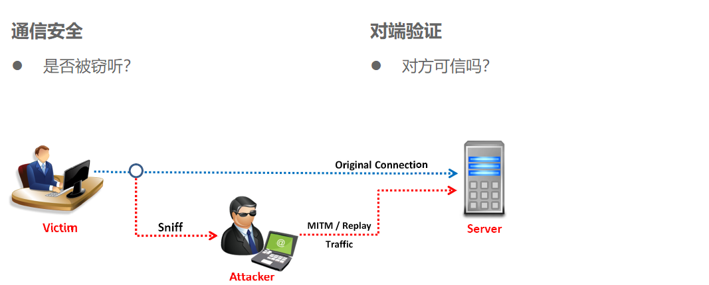

**密码学的定义**
密码学是构建和分析不同加密解密方法的科学，该科学实际上包含两个部分：
- 密码使用学是构建功能更强大、更有效的新密码的加密解密方法的科学。
- 密码分析学则是发现已有加密法的弱点，以便不用密钥就能还原成明文的科学。

密码分析是确保密码体制安全的唯一方法，是密码学不可缺少的部分。密码学与通信有着密不可分的关系，往往还能决定着战争的胜负。

**密码与信息安全**

- 密码总会被破解
- 密码的算法总会被公开
- 弱密码比不加密更危险
- 密码只是信息安全的一部分

**安全性原则**

- 计算安全性
- 可证明安全性
- 无条件安全性

### 密码学分类

- 密码使用学
- 密码分析学

#### 1.2.1 密码使用学分类

- 无秘钥算法
- 对称秘钥算法
- 公开秘钥算法

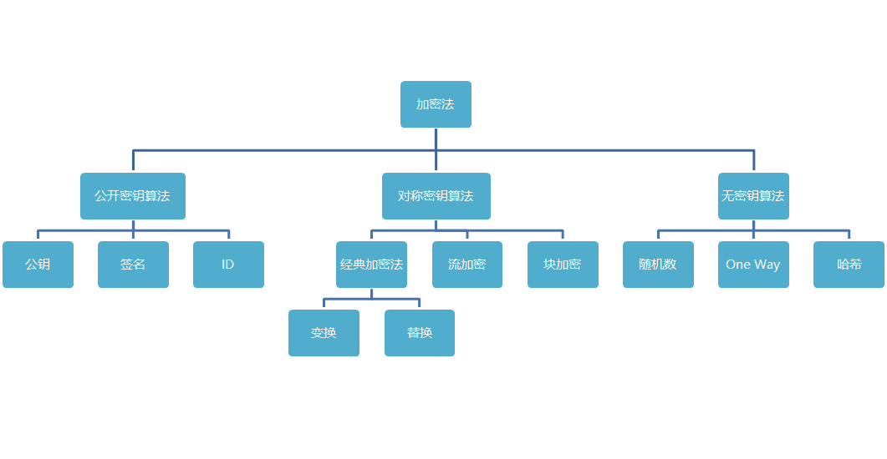

**对称密钥算法**
双方共享一个密钥，并使用相同的加密和解密方法。
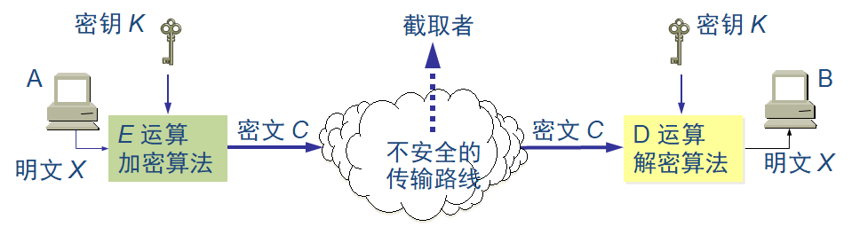

**对称密钥算法**

对称密钥算法重要术语：

明文：被传递的消息。用M表示，它可能是位序列、文本文件、位图、数字化的语音序列或数字化的视频图像等。对于计算机，M指的是二进制数据。

密文：加密后的消息。用C表示，对于计算机，C指的是二进制数据。

加密函数：作用于明文M得到密文C，用E表示。
>数学公式：𝐶=𝐸(𝑀)

解密函数：作用于密文C还原明文M，用D表示。
>数学公式：𝑀=𝐷(𝐶)

先加密后解密，原始明文将恢复：𝐷(𝐸(𝑀))=𝑀

**公开密钥算法**

公钥密码体制使用不同的加密密钥与解密密钥，是一种“由已知加密密钥推导出解密密钥在计算上是不可行的”密码体制。解密密钥是接收者专用的秘钥，对其他人都保密。

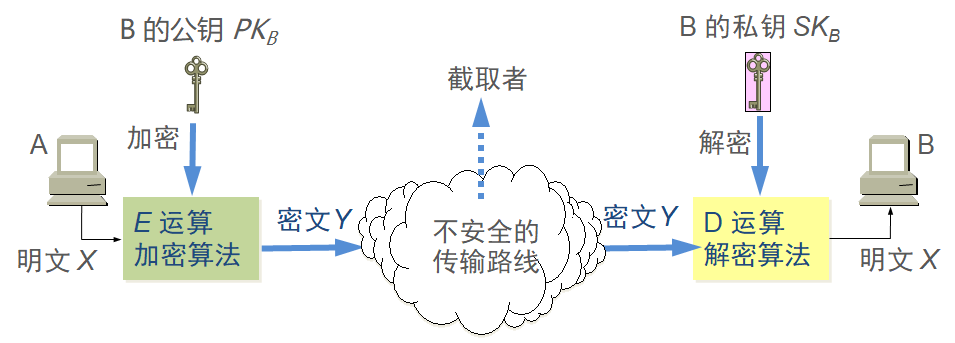

公开密钥算法重要术语：

发送者 A 用 B 的公钥 PKB 对明文 X 加密（E 运算）后，在接收者 B 用自己的私钥 SKB 解密（D 运算），即可恢复出明文：
$$D_{SK_{B}}(Y)=D_{SK_{B}}(E_{PK_B}(X))=X$$
加密密钥是公开的，但不能用它来解密，即：
$$D_{PK_B}(E_{PK_B}(X))\neq X$$

#### 1.2.2 密码分析学分类

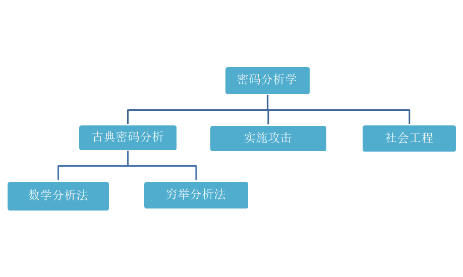

### 古典密码学

#### 1.3.1 古今密码学

密码学已经存在了几千年，密码学一词源于希腊语kryptós“隐藏的”，和gráphein“书写”。古典密码学的编码和破译通常依赖于设计者和敌手的创造力与技巧，作为一种实用性艺术存在，并没有对于密码学原理的清晰定义。而现代密码学则起源于20世纪末出现的大量相关理论，这些理论使得现代密码学成为了一种可以系统而严格地学习的科学。

#### 1.3.2 常见替换密码

单表替换加密法：明文中的同一字母在加密时被同一固定的字母代换。
- 凯撒密码
- 简单替换密码
- 仿射密码
- Polybius密码

多表替换加密法：明文中的同一字母在加密时不是完全被同一固定的字母代换，可能是多个。
- 维吉尼亚密码
- ADFGVX密码
- Enigma密码机

### 单表置换密码

#### 1.4.1 凯撒密码

恺撒密码（英语：Caesar cipher），或称恺撒加密、恺撒变换、变换加密，是一种最简单且最广为人知的加密技术。当年恺撒曾用此方法与其将军们进行联系。

现在已经无法弄清恺撒密码在当时有多大的效果，但是有理由相信它是安全的。因为恺撒大部分敌人都是目不识丁的，而其余的则可能将这些消息当作是某个未知的外语。即使有某个敌人获取了恺撒的加密信息，根据现有的记载，当时也没有任何技术能够解决这一最基本、最简单的替换密码。

**算法：**

明文中的所有字母都在字母表上向后（或向前）按照一个固定数目进行偏移后被替换成密文。𝐶=(𝑀+𝑘)𝑚𝑜𝑑26
例如，当偏移量是3的时候，所有的字母A将被替换成D，B变成E，以此类推。

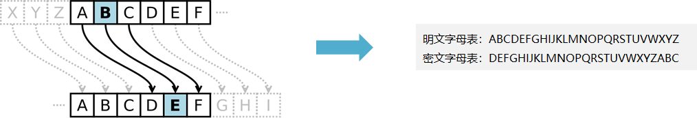

**破解凯撒密码**

由于使用恺撒密码进行加密的语言一般都是字母文字系统，因此密码中可使用的偏移量也是有限的，因此可以通过穷举法，很轻易地进行破解。

>密文：Q TQSM BW LZQVS UQTS
>明文：I LIKE TO DRINK MILK

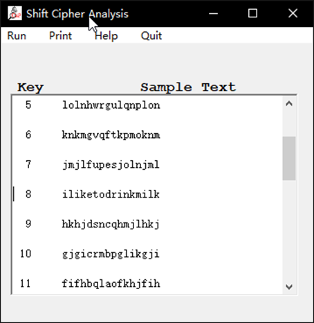

### 小实验

破解一个凯撒密码
密文：GR BRXO LNHF UBSWRJUDSKB

凯撒秘密在线分析网站
```
https://planetcalc.com/1434/
```

### 1.4.2 简单替换密码

将明文中所使用的字母替换为另一套字母表，形成新的对应关系。这种替换可以是任意的一对一关系。

例如：现有一个简单替换密码表

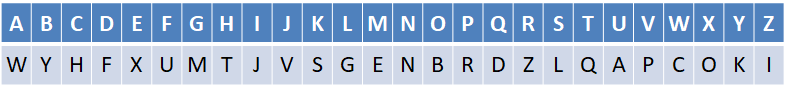

```
明文： crypto
密文： hzkrqb
```

简单替换密码很难通过穷举法来破译。
密钥空间：26！=26×25×24×⋯×3×2×1

**破译简单替换密码**

已知一段密文：
```
UZQSOVUOHXMOPVGPOZPEVSGZWSZOPFPESXUDBMETSXAIZVUEPHZHMDZSHZOWSFPAPPDTSVPQUZWYMXUZUHSXEPYEPOPDZSZUFPOMBZWPFUPZHMDJUDTMOHMQ
```

>有用信息：
>明文使用标准英文书写
>使用简单替换密码
>每个明文字母被唯一的密文字母替代

语言的每个字母都有其自身的特性，这是就像语言的指纹一样
最容易观察出的特性就是字母出现的频率
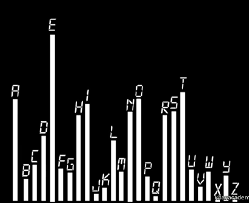

- 高频字母可以成为线索
- 低频字母可以成为线索
- 常见的字母组合可以成为线索（the , it , here , per 等）
- 密文越长越容易被破解
- 需要加入适当的猜测和推理

我们再次分析密文：
```
UZQSOVUOHXMOPVGPOZPEVSGZWSZOPFPESXUDBMETSXAIZVUEPHZHMDZSHZOWSFPAPPDTSVPQUZWYMXUZUHSXEPYEPOPDZSZUFPOMBZWPFUPZHMDJUDTMOHMQ
```

频率分析：
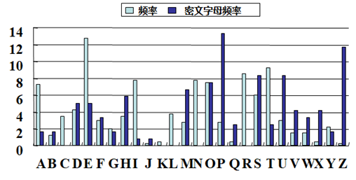

1. 猜测P Z可能是e和t；
2. 统计字母的相对频率-双字母
3. 猜测ZW可能是th，因此ZWP可能是the
4. 经过反复猜测、分析和处理，得到明文

>it was disclosed yesterday that several informal but direct contacts have been made with political representatives of the viet cong in moscow

在线进行词频分析网站
```
https://quipqiup.com/
```

### 1.4.3 仿射密码

它的加密函数是$C=(aM+b) mod\space 26$，其中
- 数字对（a，b）为密钥
- a和26互素，既：$gcd⁡(a,26)=1$
- b为小于26的正整数
- 在英文中有26个字母，因此是 $mod\space 26$

它的解密函数是$M=a^{−1} (C−b)mod\space 26$

解密函数，推导过程如下：

$$\begin{gathered}
C\equiv (aM+b)\space mod\space 26 \\
aM+b\equiv C\space mod\space 26 \\
M\equiv a^{−1}(C−b)\space mod\space 26
\end{gathered}$$

$gcd⁡(a,26)=1$ 的原因：解密时需要求密钥参数a的逆元。如果a的逆元存在，则元素a与模数必须互素。

**实例**

字母A-Z对应的数字

加密
若密钥对为（5，8），即函数中a为5，b为8，我们使用的是英文字母，即m为26
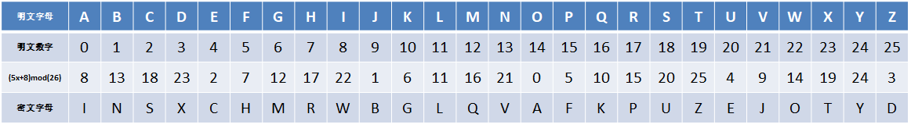

**破解仿射密码**

仿射密码和简单替换密码类似，最后都会形成一个明文字母和密文字母一对一的关系，然而区别在于，仿射密码的对应关系是由加密函数生成的，我们可以通过给定一个已知的明文攻击，求解出仿射方程式。
- 通过对密文进行频率分析，确定两个替换关系，例如e被替换成了c，t被替换成了f
- 将字母转换成数字，模拟加密过程，求方程组：
$2=(a×4+b)mod\space 26$【 e（对应数字4）被替换成c（对应数字2）的过程 】
$5=(a×19+b)mod\space 26$【t（对应数字19）被替换成f（对应数字5）的过程】

- 得到密钥对（21,22）

### 小实验

用仿射密码传送一个消息：
offensive time tomorrow morning at ten o'clock
密钥对为（7,10）

### 1.4.4 Polybius密码

这是一种简单的单码加密法，它将字母表的字母填充在一个正方形中，加上行列编号。

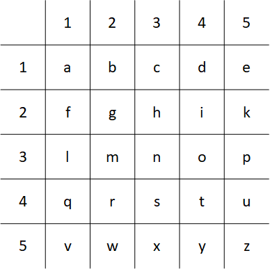

由于只有25个位置，所以去除字母j，因为 j 出现的频率低，用 i 来替代，不影响文字的可读性。
明文中的a被替换成11，b被替换成12，依次类推。

### 1.4.5 摩尔斯电码

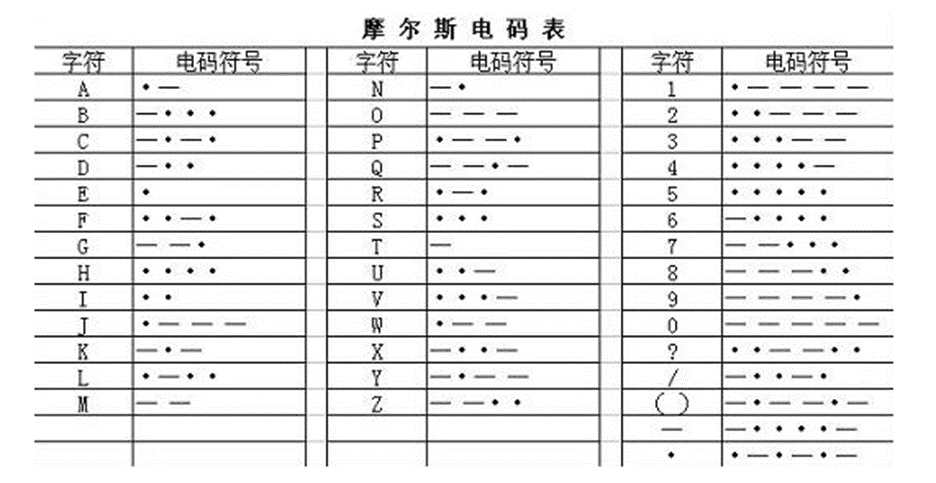

### 1.4.6 PIGPEN密码（猪圈密码）

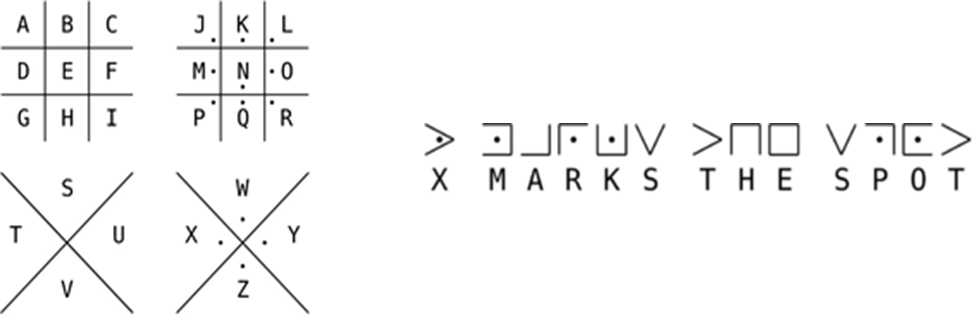

### 1.4.7 跳舞小人

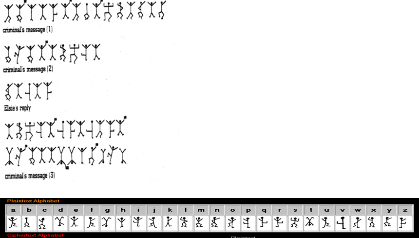

### 1.4.8 培根密码

由法兰西斯·培根发明的一种隐写术。

第一步：加密时，明文中的每个字母都会转换成一组五个英文字母。其转换依靠下表：

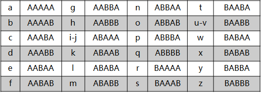

第二步：加密者需使用两种不同字体。准备好一篇包含相同AB字数的假信息后，即两种字体分别代表A型和B型。然后假信息中的每个字母按字体来决定其代表“A”还是“B”。

例如：
>密文：LOVE
>密钥：对应的转换表
>密码算法：普通字体为A，斜体为B
>密文载体：messages is in the words

>第一步：ABABA ABBAB BAABB AABAA
>第二步：messages is in the words

### 1.4.9 Hill密码

希尔密码(Hill Cipher)是基于线性代数多重代换密码，由Lester S. Hill在1929年发明。
每个字母转换成26进制数字：A=0, B=1, C=2...Z=25一串字母当成n维向量，跟一个n×n的矩阵相乘，再将得出的结果MOD26。


Hill密码的解密

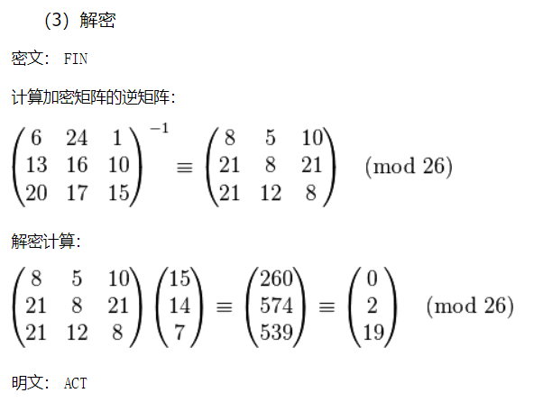

Hill密码证明和求逆主要参考线性代数知识。

对于单表加密法，破译人员可以通过密文频率分析对密文进行破译，有些需要花费很大的耐心，有些则通过工具可以直接破解。总的来说，这种加密方法还是太过于脆弱，下一节 ，我们将使用更复杂的方法让频率分析法失效。

### 多表置换密码

#### 1.5.1 维吉尼亚密码

维吉尼亚密码（又译维热纳尔密码）是使用一系列凯撒密码组成密码字母表的加密算法，属于多表密码的一种简单形式。

维吉尼亚密码以其简单易用而著称，同时初学者通常难以破解，因而又被称为“不可破译的密码”。这也让很多人使用维吉尼亚密码来加密的目的就是为了将其破解。

维吉尼亚密码以布莱斯·德·维吉尼亚的名字来命名，然而其真正的发明者是莱昂·巴蒂斯塔·阿尔伯蒂。而维吉尼亚则发明过一种更强大的自动密钥密码。

为了生成密码，需要使用表格法。这一表格包括了26行字母表，每一行都由前一行向左偏移一位得到。具体使用哪一行字母表进行编译，是基于密钥进行的，在过程中会不断地变换。

>明文：ATTACKATDAWN
>密钥：LEMONLEMONLE
>密文：LXFOPVEFRNHR

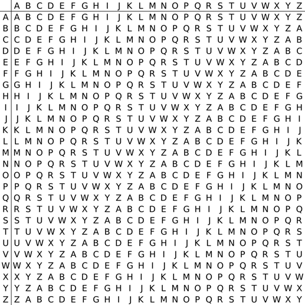

**破译维吉尼亚密码**

对于维吉尼亚密码，直接的频率分析却并不适用。
由于在维吉尼亚密码中，同一个字母可以被加密成不同的密文，因而简单的频率分析在这里并没有用。
如右图所示，任意截取了一段英文文章，加密后频率分布趋向平滑。

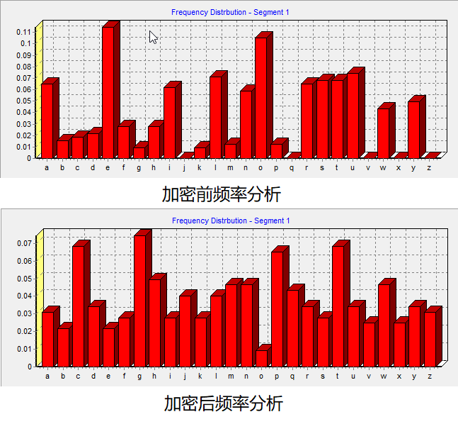

破译维吉尼亚密码的关键在于它的密钥是循环重复的。如果我们知道了密钥的长度，那密文就可以被看作是交织在一起的凯撒密码，而其中每一个都可以单独破解。

此时，我们可以使用IC测试（也可以称为一致性索引），IC是基于凹凸度量理念。

如果字母完全平滑分布，说明密文中每个字母出现的概率相同，都为1/26。然而标准英文中字母频率分布不是平滑的，因此，凹凸度量是密文中字母实际频率与完全平滑频率（1/26）之差。

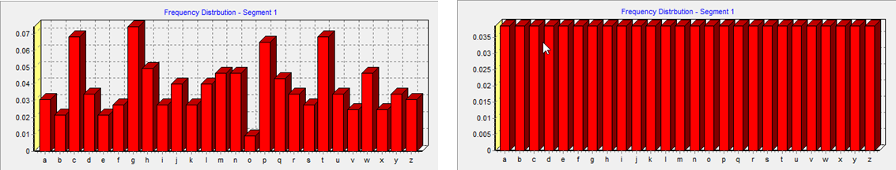

若选取的字母为：𝛼，出现频率为p_𝛼，密文总字数为n，𝑓𝛼是密文中字母𝛼的个数
MR为完全偏差，a~z所有字母的偏差的平方和为：

$$MR=\sum_{\alpha =a}^z(p_\alpha -\frac{1}{26})^2$$

进行一定的取舍计算后得到：

$$MP=\sum_{\alpha =a}^zp_\alpha ^2 -0.038$$

IC的定义：

$$IC=\frac{\sum_{\alpha =a}^z f_\alpha (f_\alpha -1)}{n(n-1)}$$

单码加密法的IC值大概为0.066，对于完全平滑文字，其值为0.038，如果IC值位于0.038与0.066之间，说明加密的密钥长度不同。不同长度的密钥对应不同的IC值。

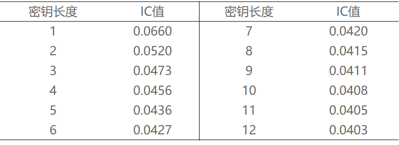

如果明文中的字母组合重复出现，被关键字加密后，密文也可能包含重复的字母组合，并且间距是密钥长度倍数。
有一段密文如下：

>DYDUXRMHTVDVNQDQNWDYDUXRMHARTJGWNQD

- 两个DYDUXRMH的出现相隔了18个字母，则密钥的长度是18的约数
- 两个NQD相距20个字母，则密钥长度是20的约数
- 最大公约数是2，则基本可以判断密钥长度为2

维吉尼亚在线解密网站 
```
https://planetcalc.com/2468/
```

#### 1.5.2 ADFGVX 密码

ADFGVX密码是德军在第一次世界大战中使用的栏块密码。事实上，它是早先一种密码 ADFGX 的增补版。1918年3月Fritz Nebel上校发明了这种密码，并提倡使用。它结合了改良过的Polybius方格替代密码与单行换位密码。这个密码以使用于密文当中六个字母 A, D, F, G, V, X命名。ADFGVX 是被法国陆军中尉 Georges Painvin 所破解的。以古典密码学的标准来说，此密码破解的工作是属于格外困难的，在这期间，Painvin 更因此健康蒙受了严重损伤。他破解的方法是依靠于找到多份开头相同的讯息，这表示说它们是被相同的分解钥匙和移位钥匙加密的。

**加密方式：**

第一步：替换

将25个字母（ i / j 视为同一字母）任意填充至方格的灰色区域，不能重复或缺少，用字母所在的行列字母替代原有字母。如b为AA，g为GA


第二步：排列
假设我们需要发送明文讯息 “Attack at once”
替换后的密文为：AFADADAFGFDXAFADDFFXGFXF
将得到的密文按密钥的长度进行排列：

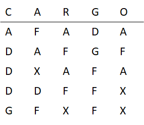

第三步：移动

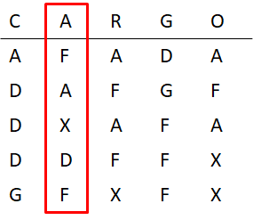

>A:FAXDF
>C:ADDDG
>G:DGFFF
>O:AFAXX
>R:AFAFX

最终得到：FAXDF ADDDG DGFFF AFAXX AFAFX

#### 1.5.3 ENIGMA密码机

恩尼格玛密码机在1920年代早期开始被用于商业，一些国家的军队与政府也曾使用过它，其中的主要使用者是第二次世界大战时的纳粹德国。

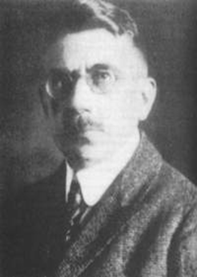

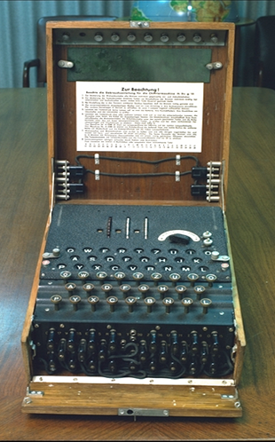

**ENIGMA密码机工作原理**

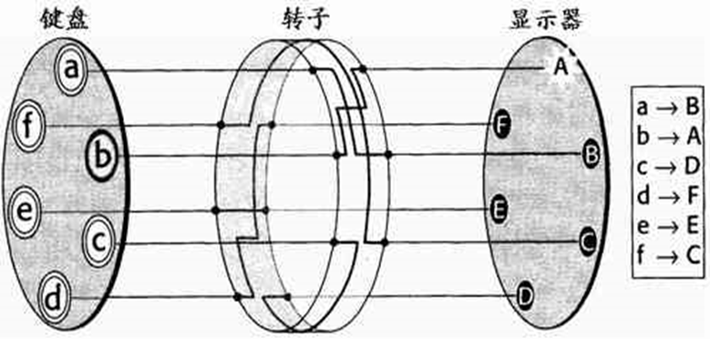

- 当键盘上的一个键被按下时，相应的密文在显示器上显示，然后转子的方向就自动地转动一个字母的位置（在示意图中就是转动1/6圈，而在实际中 转动1/26圈）。
- 相当于有26 个替换表的Vigenere加密

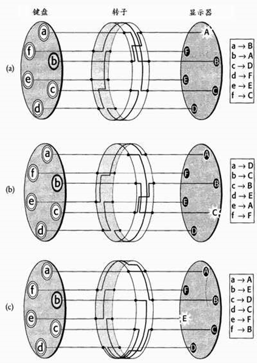

为了解决转子转动一圈重复的问题，密码机多增加了几个转子

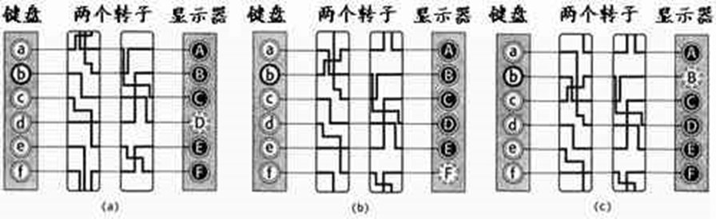

- ENIGMA里有三个转子不重复的方向个数达到26*26*26 =17576个
- 相当于有17576个替换表的Vigenere密码

**ENIGMA密码机反射器**

ENIGMA密码机反射器的加密与解密过程相同

- 反射器和 转子一样，把某一个字母连在另一个字母上，但是它并不转动。
- 反射器可以使译码的过程和编码的过程完全一 样。
- 反射器从不把输入映射成自身

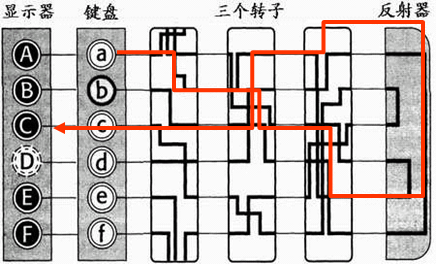

**ENIGMA密码机连接板**

从26个字母中取出6对进行交换，比如：A/J, S/O, T/D, B/W,  K/F, U/Y
- 选择12个字母的可能性：$26!(12!\times 14!)$
- 12个字母组合交换的可能性：$(\frac{12!}{6!\times 6!})\times 6!\div 2$
两者相乘，共计：$3.21\times 10^{17}$
另外，三个转子本身还有 17576 种可能性，所以，表的个数约有$3.38\times 10^{17}$

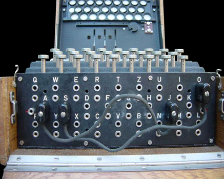
**Enigma曾在13年时间里（1926-1939）被认为坚不可摧**

**Enigma的密钥管理**

- 算法公开
  - 连接板交换6对字符，如：A/L  , P/R, T/D, B/W, K/F, O/Y
  - 转子的顺序，比如： 2,3,1
  - 转子的初始方向，如：Q-C-W
- 密钥保密
  - 每月发送当月每天的密钥
  - 每条密文使用不同的密钥
  - 每条电文的开头是加密的临时密钥，由三个字母重复两次加密而成, 称为indicator

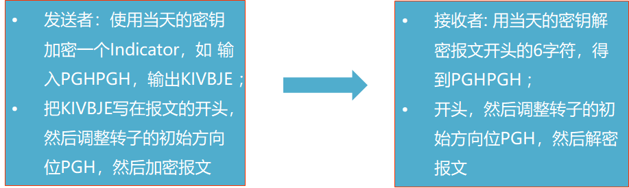

**Enigma的破译：波兰人**

- 可证明对于任何的连线变化都不影响循环圈的个数和每个循环圈上字母的个数；
- 尝试所有3 个rotors的初始位置，可以得到所有密钥的”fingerprint”，即循环圈的个数、每个循环圈上字母的个数:
- 需要操作的次数：26 * 26 * 26 ＝17576
- 考虑3个转子交换顺序3!，用6台Enigma协作运算
- 建立这样一个档案（book of fingerprints）用了一年时间
- 1938年, 德国人提升了密码强度
- Enigma密码机另外增加了2个转子: 5*4*3 = 60
- 连接板交换6对字符提升至10对字符
- 波兰人没有足够经费造出足够多的Enigma密码机
- 德国人汉斯-提罗·施密特停止提供情报和密码本
- 1939年4月, 德国撕毁与波兰签订的和平协定，波兰处于战争乌云阴影之中。
- 1939年7月,  波兰人将破译成果展示给英法同行
- 1939年9月, 希特勒下令闪电战入侵波兰，波兰亡国

**Enigma的破译：布莱切利公园**

破译小组于1939年在布莱切利公园组建，其中的成员包括：

- 填字游戏爱好者
- 国际象棋专家
- 语言学家
- 数学家
- 电脑科学家

**Enigma的弱点**

* 过于简单的密钥：比如DFG
* 重复使用的密钥：比如，CIL (cillie),   -> silly
* 已知明文攻击(Know plaintext)，候选单词（crib）
  - weather report
  - Heil Hitler
  - Nothing to report
  - Seeding, to get cribs
* 明文中的同一个字母在密码中几乎可以变成任意的其它字母，但就是无法成为它本身。
* 过分严格的规定
  - 转子的位置不得重复： 如对3个rotor位置, 不是6 ，而是 2
  - 连接板上的相邻的字符不得链接
* 其他手段：盟军可以通过间谍偷取密码本

**Enigma的破译：图灵的方法**

* Alan Turing(1912-1954)
  - 1931年进入剑桥大学，提出图灵机模型
  - 1933年受聘于GCCS，1939进入布莱切利公园
* 图灵认为：波兰的方法依赖密钥的重复，如果德军改变密钥规则怎么办？
* 图灵的方法在候选单词的明文和密文之间找到字母循环圈的特征指纹


- 根据Enigma的弱点，明文中的同一个字母在密码中几乎可以变成任意的其它字母，但就是无法成为它本身。因此在破译时，我们可以确定：A 绝对不会是 A，B 绝对不会是 B ...
- 利用这个漏洞，破译者可以先尝试猜测一个可能会出现在密码中的词语或短语，比如德语 “Heil Hitler”（希特勒万岁），然后把这个词语放在密文中任意的位置上，与整段密码进行比对，如果发现有重合的字母，那就说明该词语与当前的位置不匹配，一旦找到了一个没有重复字母的位置，那么很有可能那段密码所对应的明文正是 “Heil Hitler”。

- 在确定了至少一组正确的对应字母的前提下，破译者便可以通过假设和推理的方法猜测出一些可能的接线板上的字母配对。由于接线板上的一条接线会将两个字母绑定在一起，因此，如果我们猜测 A 接 B ，而由此却推导出了 C 接 A 的话，那么 A 接 B 的方案就是错的，而且由 A 接 B 所推导出来的一切可能的方案也全部都是错的；当接线板上，一个字母与所有其它字母的配对都被否决后，就说明问题出在转子上。这时，破译者要么更换转子，要么变动转子的位置，要么设定新的转子起始位置，再继续排查下去 ... 这就是破译 “恩尼格玛” 的通用方法。
- 由于人力操作需要耗费大量的时间，英国数学家艾伦·图灵专门设计制造了一台 “炸弹机”（Bombe），通过电子技术，运用上述的排除法来破译 “恩尼格玛”，最快的一次仅用了大约20分钟。

### 小结

多表替换加密都具有这样的特征：一个明文字母可映射到多个密文字母，这种加密可以干扰字母频率分析法，通常来说，多表替换密码肯定比单表密码更加安全。尽管加密的方法看上去十分复杂，这并不意味着它就是安全的，解密者会通过多种方式来寻找加密方法的线索，社会工程学就是他们必要技能，他们会想尽一切办法去破译密码。
