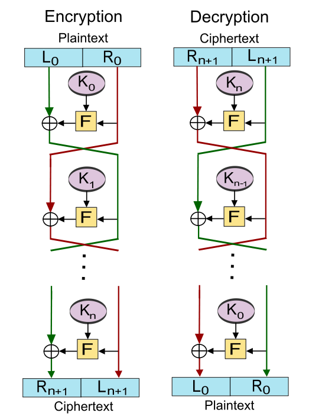

# 1.6.4 分组密码

- [分组密码概述](#分组密码概述)
  - [Feistel 密码结构](#feistel-密码结构)
- [数据加密标准](#数据加密标准)
  - [DES](#des)
  - [3DES](#3des)
- [高级加密标准](#高级加密标准)
- [分组密码工作模式](#分组密码工作模式)
  - [电子密码本模式](#电子密码本模式)
  - [密码分组链接模式](#密码分组链接模式)
  - [密码反馈模式](#密码反馈模式)
  - [输出反馈模式](#输出反馈模式)
  - [计数器模式](#计数器模式)
- [参考资料](#参考资料)

## 分组密码概述

#### Feistel 密码结构
Feistel 结构是分组密码的一个通用结构。其加密算法的输入是长度为 2*w* 比特的明文分组及密钥 *K*。明文分组被分为两半：![L0][1] 和 ![R0][2]

## 数据加密标准

#### DES

#### 3DES

## 高级加密标准

## 分组密码工作模式

#### 电子密码本模式

#### 密码分组链接模式

#### 密码反馈模式

#### 输出反馈模式

#### 计数器模式

## 参考资料
- [Block cipher](https://en.wikipedia.org/wiki/Block_cipher)
- [Data Encryption Standard](https://en.wikipedia.org/wiki/Data_Encryption_Standard)
- [Advanced Encryption Standard](https://en.wikipedia.org/wiki/Advanced_Encryption_Standard)
- [Block cipher mode of operation](https://en.wikipedia.org/wiki/Block_cipher_mode_of_operation)

  [1]: http://chart.apis.google.com/chart?cht=tx&chl=L_0
  [2]: http://chart.apis.google.com/chart?cht=tx&chl=R_0
