# CRYPT-5 消息认证和哈希函数

**author : Odyssey@cyberpeace**

- [消息认证](#消息认证)
- [消息认证码（MAC）](#消息认证码mac)
- [Hash函数](#hash函数)
- [MD5哈希函数](#md5哈希函数)
- [安全哈希算法SHA-1](#安全哈希算法sha-1)
- [基于分组密码与离散对数的哈希函数](#基于分组密码与离散对数的哈希函数)

### 消息认证

消息认证的目标是：收到一条消息，希望确保消息在传递的过程中没有被改变
- 根据消息和秘密密钥生成一个短序列位
- 为了验证消息，通信双方将计算相同的位模式，假设他共享相同的密钥

这不一定包括对消息进行加密或签名

- 消息可以以纯文本形式发送，并附加验证码
- 这不是数字签名：接收者可以生成相同的MAC
- 可以使用他的私钥对验证者进行加密以产生 数字签名
- 可以加密消息和认证者

第1章曾介绍过信息安全所面临的基本攻击类型，包括被动攻击（获取消息的内容、业务流分析）和主动攻击（假冒、重放、消息的篡改、业务拒绝）。抗击被动攻击的方法是前面已介绍过的加密，本章介绍的消息认证则是用来抗击主动攻击的。消息认证是一个过程，用以验证接收消息的真实性（的确是由它所声称的实体发来的）和完整性（未被篡改、插入、删除），同时还用于验证消息的顺序性和时间性（未重排、重放、延迟）。除此之外，在考虑信息安全时还需考虑业务的不可否认性，即防止通信双方中的某一方对所传输消息的否认。实现消息的不可否认性可通过数字签字，数字签字也是一种认证技术，它也可用于抗击主动攻击。" 

可能的消息认证攻击：
- 内容修改
- 序列修改：修改一系列消息，包括插入，删除，重新排序
- 定时修改：延迟或重播消息

消息认证机制和数字签字机制都需有产生认证符的基本功能，这一基本功能又作为认证协议的一个组成部分。认证符是用于认证消息的数值，它的产生方法又分为消息认证码MAC（message authentication code）和哈希函数（hash function）两大类

### 消息认证码（MAC）

消息认证码是指消息被一密钥控制的公开函数作用后产生的、用作认证符的、固定长度的数值，也称为密码校验和。此时需要通信双方A和B共享一密钥K。设A欲发送给B的消息是M，A首先计算$MAC=C_K(M)$，其中C_K(·)是密钥控制的公开函数，然后向B发送M‖MAC，B收到后做与A相同的计算，求得一新MAC，并与收到的MAC做比较，如图5.1(a)所示。
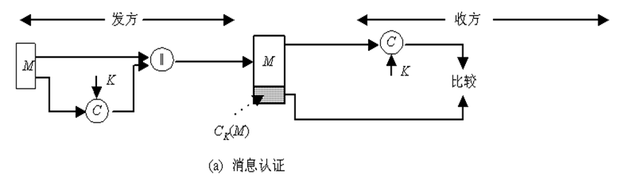

### 5.2.1  消息认证码的定义及使用方式

如果仅收发双方知道K，且B计算得到的MAC与接收到的MAC一致，则这一系统就实现了以下功能：
- 接收方相信发送方发来的消息未被篡改，这是因为攻击者不知道密钥，所以不能够在篡改消息后相应地篡改MAC，而如果仅篡改消息，则接收方计算的新MAC将与收到的MAC不同。
- 接收方相信发送方不是冒充的，这是因为除收发双方外再无其他人知道密钥，因此其他人不可能对自己发送的消息计算出正确的MAC。

#### 5.2.1  消息认证码的定义及使用方式

AC函数与加密算法类似，不同之处为MAC函数不必是可逆的，因此与加密算法相比更不易被攻破。
上述过程中，由于消息本身在发送过程中是明文形式，所以这一过程只提供认证性而未提供保密性。为提供保密性可在MAC函数以后(如图5.1(b))或以前(如图5.1(c))进行一次加密，而且加密密钥也需被收发双方共享。在图5.1(b)中，M与MAC链接后再被整体加密，在图5.1(c)中，M先被加密再与MAC链接后发送。通常希望直接对明文进行认证，因此图5.1(b)所示的使用方式更为常用。

#### 5.2.1  消息认证码的定义及使用方式

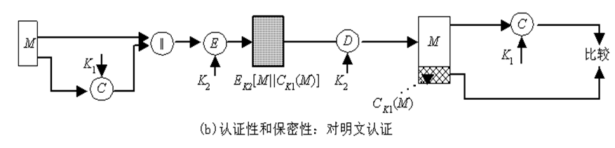

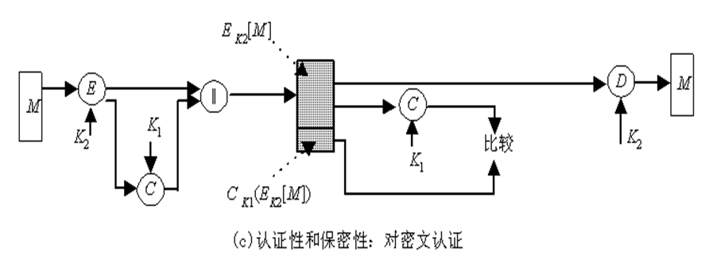

#### 5.2.2  产生MAC的函数应满足的要求

使用加密算法（单钥算法或公钥算法）加密消息时，其安全性一般取决于密钥的长度。如果加密算法没有弱点，则敌手只能使用穷搜索攻击以测试所有可能的密钥。如果密钥长为k比特，则穷搜索攻击平均将进行$2^{k-1}$个测试。特别地，对惟密文攻击来说，敌手如果知道密文C，则将对所有可能的密钥值$K_i$执行解密运算$P_i=D_{Ki}(C)$，直到得到有意义的明文。

对MAC来说，由于产生MAC的函数一般都为多到一映射，如果产生n比特长的MAC，则函数的取值范围即为$2^n$个可能的MAC，函数输入的可能的消息个数N>>2n，而且如果函数所用的密钥为k比特，则可能的密钥个数为$2^k$。如果系统不考虑保密性，即敌手能获取明文消息和相应的MAC，那么在这种情况下要考虑敌手使用穷搜索攻击来获取产生MAC的函数所使用的密钥。

假定k>n，且敌手已得到$M_1$和$MAC_1$，其中$AC_1=C_{K1}(M_1)$，敌手对所有可能的密钥值$K_i$求$MAC_i=C_{Ki}(M_1)$，直到找到某个$K_i$使得$MAC_i=MAC_1$。由于不同的密钥个数为$2^k$，因此将产生$2^k$个MAC，但其中仅有$2^n$个不同，由于$2^k>2^n$，所以有很多密钥（平均有$2^k/2^n=2^{k-n}$个）都可产生出正确的$MAC_1$，而敌手无法知道进行通信的两个用户用的是哪一个密钥，还必须按以下方式重复上述攻击：

第1轮	已知$M_1$、$MAC_1$，其中$MAC_1=C_K(M_1)$。对所有$2^k$个可能的密钥计算$MAC_i=C_{Ki}(M_1)$，得$2^{k-n}$个可能的密钥。
第2轮	已知$M_2$、$MAC_2$，其中$MAC_2=C_K(M_2)$。对上一轮得到的$2^{k-n}$个可能的密钥计算$MAC_i=C_{Ki}(M_2)$，得$2^{k-2×n}$个可能的密钥。
如此下去，如果$k=αn$，则上述攻击方式平均需要$α$轮。例如，密钥长为80比特，MAC长为32比特，则第1轮将产生大约248个可能密钥，第2轮将产生216个可能的密钥，第3轮即可找出正确的密钥。

如果密钥长度小于MAC的长度，则第1轮就有可能找出正确的密钥，也有可能找出多个可能的密钥，如果是后者，则仍需执行第2轮搜索。
所以对消息认证码的穷搜索攻击比对使用相同长度密钥的加密算法的穷搜索攻击的代价还要大。然而有些攻击法却不需要寻找产生MAC所使用的密钥。

例如，设M=(X1‖X2‖…‖Xm)是由64比特长的分组$X_i(i=1,…,m)$链接得到的，其消息认证码由以下方式得到：
$\varDelta (M)=X_1\oplus X_2\oplus ...\oplus X_m$
$C_K(M)=E_K[\varDelta(M)]$
其中$\oplus$表示异或运算，加密算法是电码本模式的DES。因此，密钥长为56比特，MAC长为64比特，如果敌手得到M‖CK(M)，那么敌手使用穷搜索攻击寻找K将需做256次加密。然而敌手还可用以下方式攻击系统： 将$X_1$到$X_{m-1}$分别用自己选取的$Y_1$到$Y_{m-1}$替换，求出$Ym=Y_1\oplus Y_2\oplus ...\oplus Y_{m-1}\oplus Δ(M)$，并用$Y_m$替换$X_m$。因此敌手可成功伪造一新消息$M'=Y_1...Y_m$，且M'的MAC与原消息M的MAC相同。

考虑到MAC所存在的以上攻击类型，可知它应满足以下要求，其中假定敌手知道函数C，但不知道密钥K：
① 如果敌手得到M和CK(M)，则构造一满足CK(M′)=CK(M)的新消息M′在计算上是不可行的。
② CK(M)在以下意义下是均匀分布的： 随机选取两个消息M、M′，Pr[CK(M)=CK(M′)]=2-n，其中n为MAC的长。
③ 若M′是M的某个变换，即M′=f(M)，例如f为插入一个或多个比特，那么Pr[CK(M)=CK(M′)]= 2-n。

第1个要求是针对上例中的攻击类型的，此要求是说敌手不需要找出密钥K而伪造一个与截获的MAC相匹配的新消息在计算上是不可行的。第2个要求是说敌手如果截获一个MAC，则伪造一个相匹配的消息的概率为最小。最后一个要求是说函数C不应在消息的某个部分或某些比特弱于其他部分或其他比特，否则敌手获得M和MAC后就有可能修改M中弱的部分，从而伪造出一个与原MAC相匹配的新消息。

#### 5.2.3 数据认证算法

数据认证算法是最为广泛使用的消息认证码中的一个，已作为FIPS Publication（FIPS PUB 113）并被ANSI作为X9.17标准。
算法基于CBC模式的DES算法，其初始向量取为零向量。需被认证的数据（消息、记录、文件或程序）被分为64比特长的分组D1，D2，…，DN，其中最后一个分组不够64比特的话，可在其右边填充一些0，然后按以下过程计算数据认证码（见图6.2）：

数据认证算法

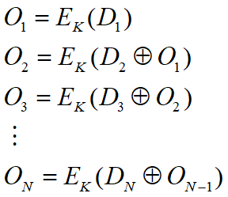
其中E为DES加密算法，K为密钥。
数据认证码或者取为$O_N$或者取为$O_N$的最左M个比特，其中16≤M≤64。

### Hash函数

Hash函数是一个将任意长度的消息（message）映射成固定长度消息的函数。

将h称为一个Hash函数（hash function），或称为哈希函数、散列函数。对于任何消息x ，将h(x)称为x的Hash值、散列值、消息摘要（message digest）。

#### 5.3.1 Hash函数的碰撞（collision）

设x、x’是两个不同的消息，如果

h(x)=h(x’)

则称x和x’是Hash函数h的一个（对）碰撞.

#### 5.3.2 Hash函数的分类

* 单向Hash函数（one-way）
    给定一个Hash值y，如果寻找一个消息x，使得y=h (x)是计算上不可行的，则称h是单向Hash函数.
* 弱抗碰撞Hash函数（weakly collision-free）
   任给一个消息x，如果寻找另一个不同的消息x’，使得h(x) =h(x’)是计算上不可行的，则称h是弱抗碰撞Hash函数.
* 强抗碰撞Hash函数 （strongly collision-free）
    如果寻找两个不同的消息x和x’，使得h(x)=h(x’)是计算上不可行的，则称h是强抗碰撞Hash函数.

#### 5.3.3 安全Hash函数

* 安全Hash函数h应具有以下性质：
  - 对任意的消息x，计算h(x)是容易的；
  - h是单向的；
  - h是弱抗碰撞的，或是强抗碰撞的。

#### 5.3.4 Hash函数的安全性

* 对Hash函数的攻击是指寻找一对碰撞消息的过程
* 生日悖论（birthday paradox）
生日问题：假设每个人的生日是等概率的，每年有365天，在k个人中至少有两个人的生日相同的概率大于1/2，问k最小应是多少？
k人生日都不同的概率是：

$(1-\frac{1}{365})(1-\frac{2}{365}...(1-\frac{k-1}{365})$

k人中至少有2人生日相同的概率为：

$p(365,k)=1-(1-\frac{1}{365})(1-\frac{2}{365}...(1-\frac{k-1}{365})$

有P(365,23)=0.5073。即在23个人中，至少有两个人生日相同的概率大于0.5，这个数字比人们直观猜测的结果小得多，因而称为生日悖论。

#### 5.3.4 Hash函数的安全性

**生日攻击法**

生日悖论原理可以用于构造对Hash函数的攻击

>设Hash函数值有n个比特，m是真消息，M是伪造的假消息，分别把消息m和M表示成r和R个变形的消息。消息与其变形消息具有不同的形式，但有相同的含义。将消息表示成变形消息的方法很多，例如增加空格、使用缩写、使用意义相同的单词、去掉不必要的单词等。

#### 5.3.4 Hash函数的安全性

**生日攻击法**

分别把消息m和M表示成r和R个变形的消息

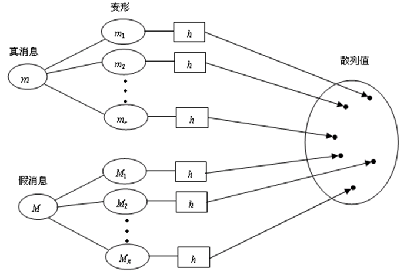

计算真消息m的变形与假消息M的变形发生碰撞的概率
由于n比特长的散列值共有2n个，所以对于给定m的变形mi和M的变形Mj，mi与Mj不碰撞的概率是1-1/2n。由于M共有R个变形，所以M的全部变形都不与mi碰撞的概率是：

$(1-\frac{1}{2^n})^R$

因为消息m共有r个变形，因此m的变形与M的变形都不碰撞的概
率是：

$(1-\frac{1}{2^n})^{rR}$

m的变形与M的变形发生碰撞的概率是：

$P(n)=1-(1-\frac{1}{2^n})^{rR}\approx1-e^{-\frac{rR}{2^n}}$

当r=R=2n/2时，P(n)=1e10.63。对于Hash值长度为64比特的Hash函数，生日攻击的时间复杂度约为232，所以是不安全的。
>为了抵抗生日攻击，建议Hash值长度至少为128 比特

**中间相遇攻击（in-the-middle attack）**

- 用于攻击一类具有特殊结构的Hash函数
- 分析Hash函数运算的中间值相等的概率
- 讨论一类利用加密变换构造的Hash函数

设加密体制为：
$H=M=\sum^n,E_k:H\times M$ →$\sum^n$

对于消息m=(m1, m2)，其散列值的计算分以下两步：
（1） h1= EK(m1, IV)；
（2） d=h(m)=EK (m2, h1)，
其中IV是加密变换的初始值。
这类Hash函数将遭受中间相遇攻击。

* 用于攻击一类具有特殊结构的Hash函数
* 分析Hash函数运算的中间值相等的概率
* 讨论一类利用加密变换构造的Hash函数
* 攻击方式:  假设攻击者要找出一个假消息M=(M1, M2)，使得M与m是一个碰撞。设m的散列值都为d。攻击者首先产生消息M1的r个变形，消息M2的R个变形.

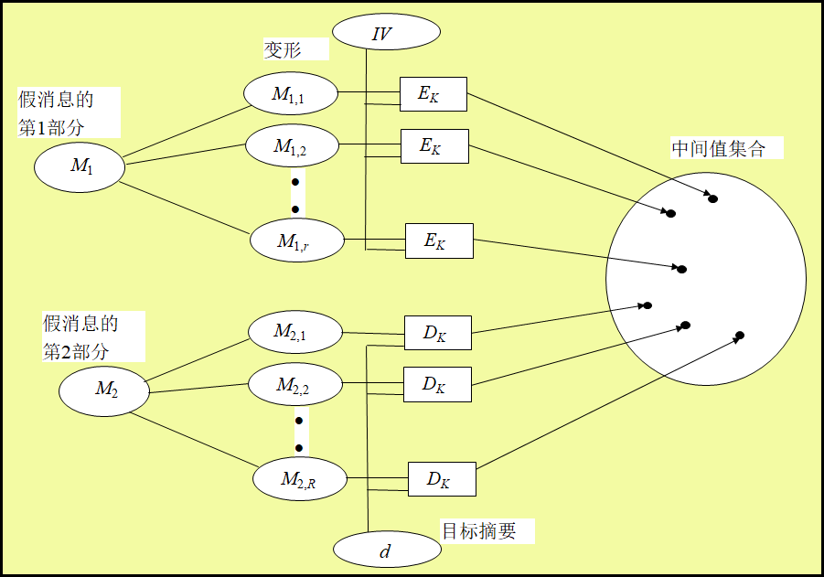

令：$\{M_{1,i}|i=1,2,...,r\},\{M_{2,j}=1,2,...,R\}$
计算：$H_1=\{h_{1,i}=E_K(M_{1,i},IV)|i=1,2,...,r\}$
$H_2=\{h_{2,j}=D_K(M_{2,j}),d|j=1,2,...,R\}$

这里DK是解密变换。假设加密变换EK是随机的，那么可以使用生日攻击法来分析集合H1和H2中出现相同元素的概率。
如果集合H1与H2有相同元素，例如h1, i= h2, j=DK(M2, j, d)，则有d=EK (M2, j, h1,i )，即M与m有相同的散列值d。

$h_1=E_k(m_1,IV)$

$d=h(m)=E_k(m_2,h_1)$

#### 5.3.5 Hash函数的迭代构造法

**压缩函数（compression function）**

$f:\{0,1\}^{m+t}$ →$\{0,1\}^m\space (t\geq 1)$

**迭代技术**
设x是一个长度为L的比特串。重复应用压缩函数f，对消息x进行多次压缩，最后得到x的散列值

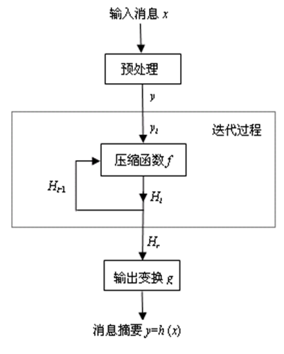

计算消息x的散列值h(x)的步骤
- 预处理: 用一个公开算法在消息x右方添加若干比特，得到比特串y，使  得y的长度为t的倍数。即有

$y=x||pad(x)=y_1||y_2||...||y_r$

其中| yi|=t (i =1, 2,…, r)，pad(x)称为填充函数。典型的填充函数是先添加x长度| x|的值，再添加若干比特（例如0）。
- 迭代过程: 设$H_0=IV$是一个长度为m的初始比特串，重复使用压缩函数f，依次计算

$Hi= f (H_{i-1}|| y_i) (i=1, 2,…,r)$

- 输出变换: 设g: {0,1}m{0,1}t是一个公开函数，令

$h(x)=g(H_r)$

- 用上述方法构造的Hash函数称为迭代Hash函数。大多数实用Hash函数都是迭代Hash函数
- 在预处理阶段，必须保证变换xy是单射。因为如果预处理变换xy不是单射，则存在xx’使得y=y’，从而h(x)=h(x’)，即能够找到h的碰撞。
- 对于任意无碰撞的压缩函数，都可以使用迭代技术构造一个无碰撞的Hash函数。

### MD5哈希函数

MD5(MD:message digest,消息摘要)
1990年10月, 著名密码学家R. L. Rivest在MIT(Massachusetts Institute of Technology)提出了一种Hash函数,作为RFC 1320 (RFC:互联网研究和开发机构工作记录)公开发表,称为MD4. MD5是MD4的改进版本, 于1992年4月作为RFC 1321公开发表.

* MD5特性
- 直接构造法: 不依赖任何密码系统和假设条件
- 算法简洁
- 计算速度快
- 特别适合32位计算机软件实现
- 倾向于使用低端结构

#### 5.4.1 MD5算法

MD5算法的输入可以是任意长度的消息x，对输入消息按512位的分组为单位进行处理，输出128位的散列值MD(x)。整个算法分为五个步骤。

**步骤1: 增加填充位**
- 在消息x右边增加若干比特，使其长度与448模512同余。也就是说，填充后的消息长度比512的某个倍数少64位。
- 即使消息本身已经满足上述长度要求，仍然需要进行填充。
- 例如，若消息长为448，则仍需要填充512位使其长度为960位。填充位数在1到512之间。填充比特的第一位是1，其它均为0。

**步骤2: 附加消息长度值**
用64位表示原始消息x的长度，并将其附加在步骤1所得结果之。若填充前消息长度大于264，则只使用其低64位。填充方法是把64比特的长度分成两个32比特的字，低32比特字先填充，高32比特字后填充。

步骤1与步骤2一起称为消息的预处理
- 经预处理后，原消息长度变为512的倍数
- 设原消息x经预处理后变为消息
$Y=Y_0Y_1...Y_{L-1}$
其中$Y_i(i =0,1,...,L-1)$是512比特
在后面的步骤中，将对512比特的分组$Y_i$进行处理

假设消息为:
x=“abcde”=01100001 01100010 01100011 01100100  01100101=$(61 62 63 64 65)_{16}$,|x|=40=$(28)_16$

在x的右边填充1个“1”和407个“0”，将x变成448比特的$x_1$:

$x_1$= $x$ || 1 || 0 (407个)
= $x$ || 800000 00000000 00000000 00000000 00000000
      00000000 00000000 00000000 00000000 00000000
      00000000  00000000 00000000
=61626364 65800000 00000000 00000000 00000000 00000000
00000000 00000000  00000000 00000000 00000000 00000000
00000000 00000000

$x$=“abcde”=01100001 01100010 01100011 01100100  01100101=(61 62 63 64 65)16,  |x|=40=(28)16

处理后的比特串为（16进制表示）：
$x_2=x_1||28$(64位)
=61626364 65800000 00000000 00000000 00000000 00000000 00000000 00000000 00000000  00000000 00000000 00000000 00000000 00000000 28000000 00000000

**步骤3：初始化MD缓冲区**

- MD5算法的中间结果和最终结果都保存在128位的缓冲区里，缓冲区用4个32位的寄存器表示。
- 4个缓冲区记为A、B、C、D，其初始值为下列32位整数（16进制表示）：

>A=67 45 23 01
>B=EF CD AB 89
>C=98 BA DC FE
>D=10 32 54 76

- 上述初始值以小端格式存储(字的最低有效字节存储在低地址位置 )为：

>字A=01 23 45 67
>字B=89 AB CD EF
>字C=FE DC BA 98
>字D=76 54 32 10

**步骤4：压缩函数**

以512位的分组(16个字)为单位处理消息
- MD5是迭代Hash函数, 其压缩函数为:

$H_{MD5}:\{0,1\}^{128+512}$ → $\{0,1\}^{128}$

步骤4是MD5算法的主循环，它以512比特作为分组，重复应用压缩函数$H_MD5$，从消息Y的第一个分组$Y_1$开始，依次对每个分组$Y_i$进行压缩，直至最后分组$Y_{L-1}$，然后输出消息x的Hash值。可见，MD5的循环次数等于消息Y中512比特分组的数目L。

**MD5压缩函数$H_{MD5}$**

$H_{MD5}:\{0,1\}^{128+512}$ → $\{0,1\}^{128}$

- $H_{MD5}$由四轮处理组成
- 加法是指缓冲区中的4个字与$CV_i$中对应的4个字分别模232相加

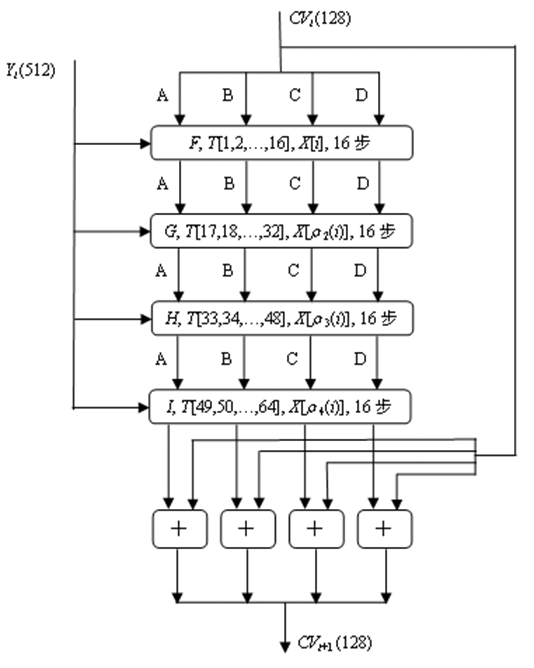

$H_{MD5}$的四轮处理过程的算法结构相同，每一轮要对缓冲区ABCD进行16次迭代，每次迭代的运算形式为:

$a←b+L^s(a+g(b,c,d)+X[k]+T[i])$

其中a、b、c、d分别为缓冲区A、B、C、D中的字，运算结束后再将（a、b、c、d）循环右移一个字。

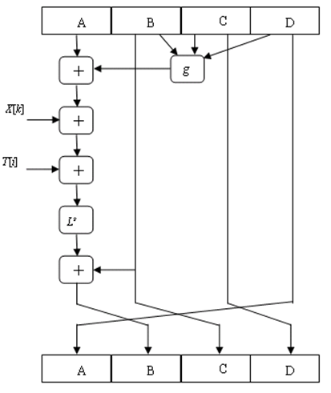

* $H_{MD5}$的基本逻辑函数g
- 每一轮使用一个基本逻辑函数g，每个基本逻辑函数的输入是三个32位的字，输出是一个32位的字，它执行位逻辑运算，即输出的第n位是其三个输入的第n位的函数
- 基本逻辑函数g的定义：符号$\wedge$、$\vee$和$-$分别表示逻辑操作AND、OR、NOT和XOR

|轮数|基本逻辑函数g|g(b,c,d)|
|-|-|-|
|1|F(b,c,d)|$(b\wedge c)\vee (\overline b \wedge d)$|
|2|G(b,c,d)|$(b\wedge d)\vee (c \wedge \overline d)$|
|3|H(b,c,d)|$b\oplus c\oplus d$|
|4|I(b,c,d)|$c\oplus (b\wedge \overline d)$|

$H_MD5$的基本逻辑函数g
基本逻辑函数g的真值表

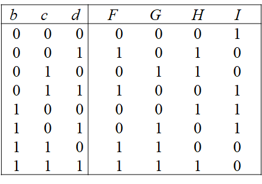

- 字组X
把当前处理的512比特的分组Yi依次分成16个32比特的字, 分别记为X[0,1,…,15].
- 在每一轮的16步迭代中, 每一步迭代使用一个字,迭代步数不同使用的字也不相同. 因此, 16步迭代恰好用完16个字。

* 对于不同轮处理过程, 使用16个字的顺序不一样.
- 第一轮中，使用顺序为X[0,1,…,15]。
- 第二轮中使用顺序由下列置换确定:
  $\rho_2(i)= (1+5i)\space mod\space 16$
- 第三轮中使用顺序由下列置换确定:
  $\rho_3(i)= (5+3i)\space mod\space 16$
- 第四轮中使用顺序由下列置换确定:
  $rho_4(i)= 7i\space mod\space 16$
* 例如：第三轮处理过程的第i步迭代使用字
  $X[\rho_3(i)]=X[(5+3_i)\space mod\space 16]$
  第8步迭代使用字
  $X[\rho_3(8)]=X[(5+3\times 8)]=X[29]=X[23]$

* 常数表T：64个32位常数
  - $T[i] =2^{32}\times abs(sin(i))$的整数部分(i=1,2,…,64)

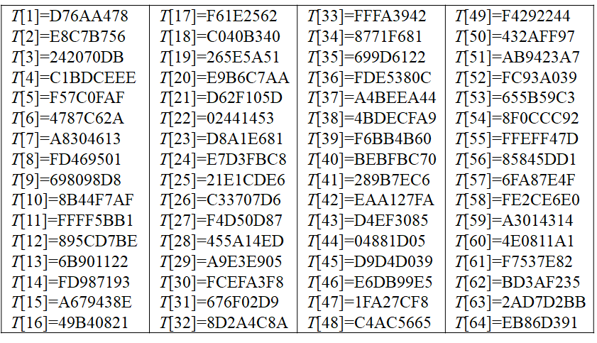

* 常数表T的作用是“随机化”32位的输入数据，即消除输入数据的规律性。
* HMD5的第k轮处理过程使用常数表T的元素
  $T[16(k-1)+1, 16(k-1)+2,…,16k] (k=1,2,3,4)$
  第k轮的第i次迭代使用元素
  $T[16(k-1)+ i](i=1,2,…,16)$

循环左移位数s
$L^s(v)$表示对32位的变量v循环左移s位。s的值与轮数和迭代步数有关。

|步数 \\ 轮数|1|2|3|4|5|6|7|8|9|10|11|12|13|14|15|16|
|-|-|-|-|-|-|-|-|-|-|-|-|-|-|-|-|-|
|1|7|12|17|22|7|12|17|22|7|12|17|22|7|12|17|22|
|2|5|9|14|20|5|9|14|20|5|9|14|20|5|9|14|20|
|3|4|11|16|23|4|11|16|23|4|11|16|23|4|11|16|23|
|4|6|10|15|21|6|10|15|21|6|10|15|21|6|10|15|21|

**步骤5: 输出**
依次对消息的L个512比特的分组进行处理，第L个分组处理后的输出值即是消息x的散列值MD(x)。
可将MD5的处理过程归纳如下：
- $CV_0=IV$
- $CV_{i+1}=SUM_{32}[CV_i, RF_I(Y_i,RF_H(Y_i,RF_G(Y_i,RF_F(Y_i,CV_i))) )]   (i=0,1,…,L-1)$
- $MD=CV_{L-1}$
- $IV$=第三步定义的缓冲区ABCD的初值
- L =消息经第一步和第二步处理后分组的个数
- $Y_i$ =消息的第i个512位分组
- $RF_u$ =使用基本逻辑函数u的轮函数
- $SUM_{32}$=对输入字的模232相加
- MD =散列值

### 5.4.2  MD5的安全性

* Rivest猜测，MD5可能是128位Hash函数中强度最大的。
* 目前，对MD5的攻击已取得以下结果：
  - T. Berson（1992）已经证明，对单轮的MD5算法，利用差分密码分析，可以在合理的时间内找出散列值相同的两条消息。这一结果对MD5四轮运算的每一轮都成立。但是，目前尚不能将这种攻击推广到具有四轮运算的MD5上.
  - B. Boer和A. Bosselaers（1993）说明了如何找到消息分组和MD5两个不同的初始值,使它们产生相同的输出. 也就是说, 对一个512位的分组, MD5压缩函数对缓冲区ABCD的不同值产生相同的输出,这种情况称为伪碰撞（pseudo-collision）.目前尚不能用该方法成功攻击MD5算法.

* 目前，对MD5的攻击已取得以下结果(续)：
  - H. Dobbertin（1996）找到了MD5无初始值的碰撞(pseudo-collision).给定一个512位的分组,可以找到另一个512位的分组,对于选择的初始值IV0,它们的MD5运算结果相同. 到目前为止, 尚不能用这种方法对使用MD5初始值IV的整个消息进行攻击.
  - 我国山东大学王小云教授（2004）提出的攻击对MD5最具威胁。对于MD5的初始值IV，王小云找到了许多512位的分组对，它们的MD5值相同.
  - 国际密码学家Lenstra利用王小云等提供的MD5碰撞，伪造了符合X.509标准的数字证书.
* MD5算法抗密码分析能力较弱,对MD5的生日攻击所需代价为264数量级. 所以, 必须设计新的Hash算法, 使其与MD5相比具有更长的散列值和更高的安全性.

### 安全哈希算法SHA-1
安全Hash算法SHA（secure hash algorithm）由美国标准与技术研究所（NIST）设计并于1993年作为联邦信息处理标准（FIPS 180）发布
修改版于1995年发布（FIPS 180-1），通常称之为SHA-1。该标准称为安全Hash函数。
RFC 3174也给出了SHA-1，它基本上是复制FIPS 180-1的内容，但增加了C代码实现。
SHA-1算法的输入是长度小于264的任意消息x，输出160位的散列值。

#### 5.5.1 SHA-1算法步骤
SHA-1处理消息的过程与MD5类似，对输入消息按512位的分组为单位进行处理，整个算法分为五个步骤

**步骤1: 增加填充位**

在消息右边增加若干比特，使其长度与448模512同余。即使消息本身已经满足上述长度要求，仍然需要进行填充。填充位数在1到512之间。填充比特的第一位是“1”，其它均为“0”。

**步骤2: 附加消息长度值**

用64位表示原始消息x的长度，并将其附加在步骤1所得结果之后。
- 步骤1与步骤2一起称为消息的预处理

经预处理后，原消息长度变为512的倍数。设原消息x经预处理后变为消息$Y=Y_0 Y1… Y_{L-1}$，其中$Y_i(i =0,1,…,L-1)$是512比特。在后面的步骤中，将对512比特的分组$Y_i$进行处理。

**步骤3: 初始化缓冲区**

SHA-1算法的中间结果和最终结果保存在160位的缓冲区里，缓冲区用5个32位的寄存器表示。5个缓冲区记为A、B、C、D、E，其初始值为下列32位整数（16进制表示）：

>A=67 45 23 01
>B=EF CD AB 89
>C=98 BA DC FE
>D=10 32 54 76
>E=C3 D2 E1 F0

其中，前4个初始值与MD5的初始值相同。SHA1以大端格式存储缓冲区的值，即字的最高有效字节存于低地址字节位置。因此，上述初始值存储为（十六进制）：

>字A=67 45 23 01
>字B=EF CD AB 89
>字C=98 BA DC FE
>字D=10 32 54 76
>字E=C3 D2 E1 F0

- 步骤4: 以512位的分组（16个字）为单位处理消息
SHA-1是迭代Hash函数，其压缩函数为：

$H_{SHA}:\{0,1\}^{160+512}→\{0,1\}^{160}$

- 步骤4是SHA-1算法的主循环，它以512比特作为分组，重复应用压缩函数HSHA，从消息Y的第一个分组$Y_1$开始，依次对每个分组$Y_i$进行压缩，直至最后分组Y_{L-1}，然后输出消息x的Hash值。
SHA-1循环次数等于消息Y中512比特分组的数目L。

**SHA-1的压缩函数$H_{SHA}$**

* 由四轮处理组成
* 加法是模232相加

<aside class="left">
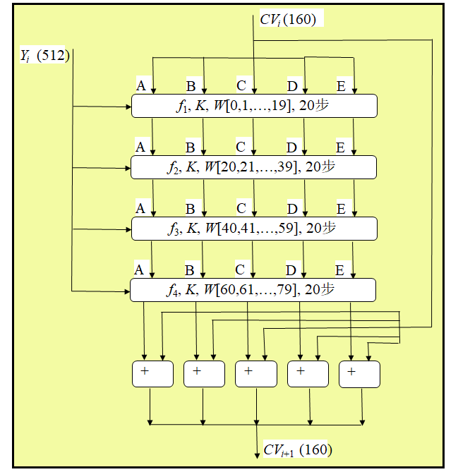
</aside>

- 压缩函数HSHA的四轮处理过程的算法结构相同，每一轮要对缓冲区ABCDE进行20次迭代，每次迭代的运算形式为

$A,B,C,D,E\space ←\space (E+f(B,C,D)+L^5(A)+W_t+K_t),A,L^{30}(B),C,D$

其中A、B、C、D、E分别为五个缓冲区中的字，运算结束后再将（A、B、C、D、E）循环右移一个字。

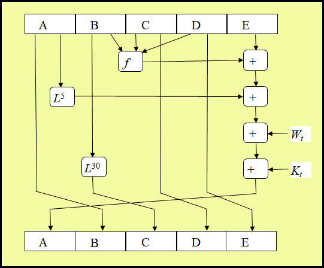

* 基本逻辑函数f
  - 每一轮使用一个基本逻辑函数f，每个基本逻辑函数的输入是三个32位的字，输出是一个32位的字，它执行位逻辑运算，即输出的第n位是其三个输入第n位的函数。

|轮数|基本逻辑函数f|f(B,C,D)|
|-|-|-|
|1|$f_1(B,C,D)$|$(B\wedge C)\vee (\overline B \wedge D)$|
|2|$f_2(B,C,D)$|$B\oplus C \oplus D$|
|3|$f_3(B,C,D)$|$(B\wedge C)\vee (B \wedge D)\vee (C\wedge D)$|
|4|$f_4(B,C,D)$|$B\oplus C \oplus D$|

* 基本逻辑函数f
  - 基本逻辑函数f的真值表

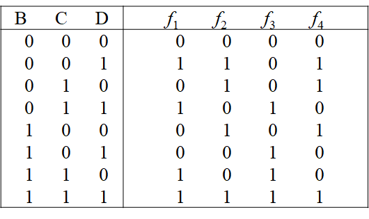

* 字组$W_t$
  - t（0≤t≤79）代表迭代步数，依次表示第一、二、三、四轮处理过程进行的迭代次序
  - $W_t(0≤t≤79)$是32比特的字，它的前面16个字$W_0,W_1,…,W_{15}$依次取自当前输入分组$Y_i$，其余字为

  $W_t=L^1(W_{t-16}\oplus W_{t-14}\oplus W_{t-3})\space (t=16,17,...79)$

加法常数表$K_t$

|迭代步数|十六进制|十进制|
|-|-|-|
|$0\leq t \leq  19$|5A827999|[$2^{30}\times \sqrt{2}$]|
|$20\leq t \leq 39$|6ED9EBA1|[$2^{30}\times \sqrt{3}$]|
|$40\leq t \leq 59$|8F1BBCDC|[$2^{30}\times \sqrt{5}$]|
|$60\leq t \leq 79$|CA62C1D6|[$2^{30}\times \sqrt{10}$]|

**步骤5: 输出**

- 第L个分组处理后的输出值即是消息x的散列值MD(x)
- SHA-1的处理过程归纳如下：
  + $CV_0=IV$
  + $CV_{i+1}=SUM_{32}(CV_i, ABCDE_i ) (i=0,1,…, L-1)$
  + $MD= CV_{L-1}$
- 其中：
  + IV =第三步定义的缓冲区ABCDE的初值
  + $ABCDE_i$ =处理第i个消息分组时最后一轮的输出
  + L =消息经第一步和第二步处理后分组的个数
  + SUM_{32}=对输入字的模$2^{32}$相加
  + MD =散列值

#### 5.5.2  SHA-1和MD5的比较

* SHA-1与MD5的算法类似，所以它们的性质极为相似
* 抗穷举攻击的能力
  - SHA1抗穷举攻击的能力比MD5强
  - 用穷举攻击方法产生具有给定散列值的消息
    + MD5需要的代价为2128数量级
    + SHA1需要的代价为2160数量级
  - 用穷举攻击方法产生两个具有相同散列值的消息
    + MD5需要的代价为264数量级
    + SHA1需要的代价为280数量级
* 抗密码分析的能力
  - MD5算法抗密码分析的能力较弱
  - SHA1算法抗密码分析的能力似乎并不弱

* 速度
  SHA-1执行的速度比MD5的速度慢得多
* 简洁性
  SHA-1和MD5两种算法都易于描述和实现，不需要使用大的程序和置换表
* 数据的存储方式
  MD5使用little-endian方式，SHA-1使用big-endian方式。这两种方式没有本质的差异

### 基于分组密码与离散对数的哈希函数

**Hash函数的间接构造法**
- 利用已有的密码算法构造Hash函数
- 如果密码算法是安全的，那么利用它所构造的Hash函数也是安全的

#### 5.6.1 利用分组密码算法构造Hash函数

**已知条件**

设$E_k$是一个分组长度为n的分组密码的加密算法，密钥为k，对于任意的消息x，首先对x进行分组，每组的长度为n。设消息x为:
$x=x_1 x_2…x_L$,
其中$x_i\in GF(2)^n\space (1\leq i\leq L)$

**基于分组密码CBC工作模式构造Hash函数**
首先选取一个初始值: $y_0=IV\in GF(2)^n$，
然后依次计算:
$y_i=E_k(x_i\oplus y_{i-1})(1\leq i\leq L)$
最后定义Hash值为: $h_{CBC}(x)=y_L$

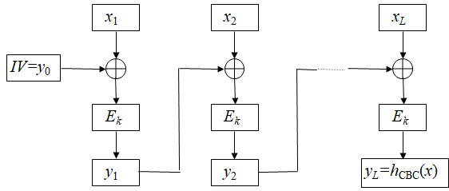

**基于分组密码CFB工作模式构造Hash函数**
- 首先选取一个初始值: y0 =IVGF(2)n，
- 然后依次计算:
$y_i=x_i\oplus E_k(y_{i-1})(1\leq i\leq L)$
最后定义Hash值为: $h_{CFB}(x)=y_L$

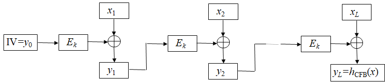

在密钥公开的情况下，基于分组密码CBC工作模式和CFB工作模式构造的Hash函数是不安全的，它们甚至不是弱无碰撞的.

#### 5.6.2 基于离散对数问题的Hash函数

* 基于一些困难数学问题，诸如离散对数问题、因子分解问题、背包问题等可以构造出一些Hash函数，这些Hash函数的安全性依赖于对应数学问题的困难性
* Chaum、Heijst和Pfitzmann（1992年）提出的基于离散对数问题构造的Hash函数
  - 运行速度不是很快
  - 可以证明是安全的.
* Chaum-Heijst-Pfitzmann Hash函数的构造
  设p是一个大素数，$q=(p-1)/2$是一个素数，$\alpha$和$\beta$是$Z_p$的两个本原元。假设离散对数$log_{\alpha}\beta$是计算上不可行的。定义Hash函数$h$为：
$h:Z_p\times Z_p → Z_p^{*}$
$h(x_1,x_2)=\alpha^{x_1}\times \beta^{x_2}\space mod \space p$

Chaum-Heijst-Pfitzmann Hash函数是强抗碰撞的，用反证法，如果Hash函数h有一对碰撞，那么可以证明离散对数$log^{\alpha}\beta$能被有效计算.

设$(x_1, x_2)$，$(x_3, x_4)$是h的一对碰撞消息，即$(x_1, x_2)\neq (x_3, x_4)$，$h(x_1, x_2)=h(x_3, x_4)$，那么
$\alpha^{x_1}\beta^{x_2}=\alpha^{x_3}\beta^{x_4}\space mod\space p \space \Rightarrow\space \alpha^{x_1-x_3}=\beta^{x_4-x_2}\space mod\space p$

记$d=gcd(x_4-x_2, p-1)$。因为p-1=2q，且q是一个素数，所以$d\in {1,2, q, p-1}$。下面对d的四个取值分别进行讨论。

* 情况1：d =1
此时$x_4-x_2$关于模p-1有逆，设$y=(x_4-x_2)^{-1}\space mod\space(p-1)$，则存在整数k，使得$(x_4-x_2)y=1+(p-1)k$，则有
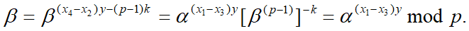
因此，可计算离散对数
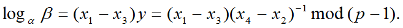

* 情况2：d =2
因为$p-1=2q$,且q是奇数,所以$gcd(x_4-x_2, q)=1$。设$y=(x_4-x_2)^{-1}\space mod\space q$，则存在整数k，使得 $(x_4-x_2) y=1+qk$, 有

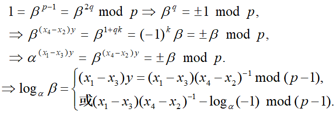

由于$\alpha^q=-1\space mod\space p$，所以
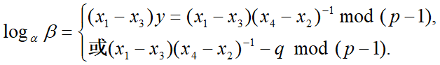

容易检验二式中哪一个成立. 即离散对数$log_{\alpha}^{\beta}$能被有效计算。

* 情况3：d = q
因为 0≤x2≤q-1, 0≤x4≤q-1
$\rightarrow -(q-1)≤x4-x2≤q-1 \rightarrow gcd(x4-x2, q-1)= q$不成立。
情况3不存在.

* 情况4：d =p-1
这种情况只有在$x_2=x_4$时才可能发生。这样就有
$\alpha^{x-1}=\alpha^{x_3}\space mod\space p$
所以$x_1=x_3,(x_1, x_2)= (x_3, x_4)$，与已知矛盾! 即情况4也不存在。
