# CRYPT-7 密码协议

**author : Odyssey@cyberpeace**

## 目录
7.1 认证的定义
7.2 密码协议
7.3 身份证明
7.4 零知识证明

### 7.1 认证的定义

CRYPT-5 介绍过消息认证的基本概念，事实上安全可靠的通信除需进行消息的认证外，还需建立一些规范的协议对数据来源的可靠性、通信实体的真实性加以认证，以防止欺骗、伪装等攻击。本节以网络通信的一个基本问题的解决引出认证协议的基本意义，这一基本问题陈述如下： A和B是网络的两个用户，他们想通过网络先建立安全的共享密钥再进行保密通信。那么A(B)如何确信自己正在和B(A)通信而不是和C通信呢？这种通信方式为双向通信，因此，此时的认证称为相互认证。类似地，对于单向通信来说，认证称为单向认证。

### 7.1 认证的定义
认证可以是单向的也可以是双向的。
- 单向认证是指通信双方中只有一方向另一方进行认证
- 双向认证是指通信双方相互进行认证。

### 7.2 密码协议
- 相互认证
  - 采用对称密码算法的机制
  - 采用公开密钥算法的机制
- 单向认证
  - 采用对称密码算法的机制
  - 采用公开密钥算法的机制

#### 7.2.1 相互认证
A、B两个用户在建立共享密钥时需要考虑的核心问题是保密性和实时性。为了防止会话密钥的伪造或泄露，会话密钥在通信双方之间交换时应为密文形式，所以通信双方事先就应有密钥或公开钥。第2个问题实时性则对防止消息的重放攻击极为重要，实现实时性的一种方法是对交换的每一条消息都加上一个序列号，一个新消息仅当它有正确的序列号时才被接收。但这种方法的困难性是要求每个用户分别记录与其他每一用户交换的消息的序列号，从而增加了用户的负担，所以序列号方法一般不用于认证和密钥交换。

#### 7.2.1 相互认证
保证消息的实时性常用以下三种方法： 
- 时戳
如果A收到的消息包括一时戳，且在A看来这一时戳充分接近自己的当前时刻， A才认为收到的消息是新的并接受之。这种方案要求所有各方的时钟是同步的。
- 询问-应答
用户A向B发出一个一次性随机数作为询问，如果收到B发来的消息（应答）也包含一正确的一次性随机数，A就认为B发来的消息是新的并接受之。
- 序列号
对交换的每一条消息加上序列号，序列号正确才被接收

其中时戳法不能用于面向连接的应用过程，这是由于时戳法在实现时固有的困难性。首先是需要在不同的处理器时钟之间保持同步，那么所用的协议必须是容错的以处理网络错误，并且是安全的以对付恶意攻击。第二，如果协议中任一方的时钟出现错误而暂时地失去了同步，则将使敌手攻击成功的可能性增加。最后还由于网络本身存在着延迟，因此不能期望协议的各方能保持精确的同步。所以任何基于时戳的处理过程、协议等都必须允许同步有一个误差范围。考虑到网络本身的延迟，误差范围应足够大；考虑到可能存在的攻击，误差范围又应足够小。

而询问-应答方式则不适合于无连接的应用过程，这是因为在无连接传输以前需经询问\应答这一额外的握手过程，这与无连接应用过程的本质特性不符。对无连接的应用程序来说，利用某种安全的时间服务器保持各方时钟同步是防止重放攻击最好的方法。
通信双方建立共享密钥时可采用单钥加密体制和公钥加密体制。

序列号方法要求每个用户分别记录与其他每一用户交互的序列号，增加用户负担，因而很少使用

**采用对称密码算法的机制**

采用单钥加密体制为通信双方建立共享的密钥时，需要有一个可信的密钥分配中心KDC，网络中每一用户都与KDC有一共享的密钥，称为主密钥。KDC为通信双方建立一个短期内使用的密钥，称为会话密钥，并用主密钥加密会话密钥后分配给两个用户。这种分配密钥的方式在实际应用中较为普遍采用，如接下来介绍的Kerberos系统采用的就是这种方式。

#### 7.2.1 相互认证

**Needham-Schroeder协议**

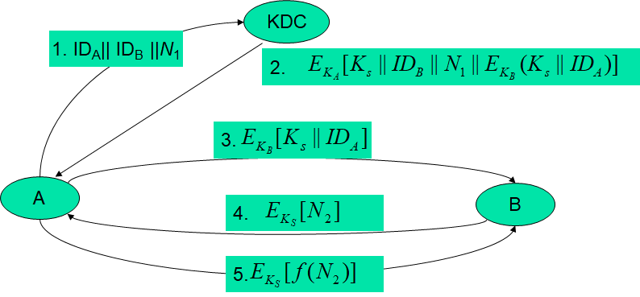

- $A→KDC:ID_A ||ID_B||N_1$
- $KDC→A:E_{KA}[K_S||ID_B||N_1||E_{KB}[K_S||ID_A]]$
- $A→B:E_{KB}[KS||IDA]$   ----------弱点
- $B→A:E_{KS}[N_2]$
- $→B:E_{KS}[f(N_2)]$

式中$K_A$、$K_B$分别是A、B与KDC共享的主密钥。协议的目的是由KDC为A、B安全地分配会话密钥$K_S$，A在第②步安全地获得了KS，而第③步的消息仅能被B解读，因此B在第③步安全地获得了$K_S$ ，第④步中B向A示意自己已掌握$K_S$，N2用于向A询问自己在第③步收到的$K_S$是否为一新会话密钥，第⑤步A对B的询问作出应答，一方面表示自己已掌握$
K_S$，另一方面由$f(N_2)$回答了$K_S$的新鲜性。可见第④、⑤两步用于防止一种类型的重放攻击，比如敌手在前一次执行协议时截获第③步的消息，然后在这次执行协议时重放，如果双方没有第④、⑤两步的握手过程的话，B就无法检查出自己得到的$K_S$是重放的旧密钥。

然而以上协议却易遭受另一种重放攻击，假定敌手能获取旧会话密钥，则冒充A向B重放第③步的消息后，就可欺骗B使用旧会话密钥。敌手进一步截获第④步B发出的询问后，可假冒A作出第⑤步的应答。进而，敌手就可冒充A使用经认证过的会话密钥向B发送假消息。

**协议改进方案一**
为克服以上弱点，可在第②步和第③步加上一时戳，改进后的协议如下： 
- $A→KDC:ID_A||ID_B$
- $KDC→A:E_{KA}[K_S||ID_B||T||E_{KB}[K_S||ID_A||T]]$
- $A→B:E_{KB}[K_S||ID_A||T]$
- $B→A:E_{KS}[N_1]$
- $A→B:E_{KS}[f(N_1)]$

- 其中T是时戳，用以向A、B双方保证KS的新鲜性。A和B可通过下式检查T的实时性：
$|Clock-T|<Δt_1+Δt_2$
- 其中Clock为用户（A或B）本地的时钟，$Δt_1$是用户本地时钟和KDC时钟误差的估计值，$Δt_2$是网络的延迟时间。
- 以上协议中由于T是经主密钥加密的，所以敌手即使知道旧会话密钥，并在协议的过去执行期间截获第③步的结果，也无法成功地重放给B，因B对收到的消息可通过时戳检查其是否为新的。

以上改进还存在以下问题： 方案主要依赖网络中各方时钟的同步，这种同步可能会由于系统故障或计时误差而被破坏。如果发送方的时钟超前于接收方的时钟，敌手就可截获发送方发出的消息，等待消息中时戳接近于接收方的时钟时，再重发这个消息。这种攻击称为等待重放攻击。

抗击等待重放攻击的一种方法是要求网络中各方以KDC的时钟为基准定期检查并调整自己的时钟，另一种方法是使用一次性随机数的握手协议，因为接收方向发送方发出询问的随机数是他人无法事先预测的，所以敌手即使实施等待重放攻击，也可被下面的握手协议检查出来。

**协议改进方案二**
下面的协议可解决Needham-Schroeder协议以及改进方案一可能遭受的攻击：
① $A→B:ID_A||N_A$
② $B→KDC:ID_B||N_B||E_{KB}[ID_A||N_A||T_B]$
③ $KDC→A:E_{KA}[ID_B||N_A||K_S||T_B]||E_{KB}[ID_A||K_S||T_B]||N_B$
④ $A→B:E_{KB}[ID_A||K_S||T_B]||E_{KS}[N_B]$

协议的具体含义如下： 
① A将新产生的一次性随机数$N_A$与自己的身份$I_{DA}$一起以明文形式发往B，$N_A$以后将与会话密钥$K_S$一起以加密形式返回给A，以保证A收到的会话密钥的新鲜性。

② B向KDC发出与A建立会话密钥的请求，表示请求的消息包括B的身份、一次性随机数$N_B$以及由B与KDC共享的主密钥加密的数据项。其中$N_B$以后将与会话密钥一起以加密形式返回给B以向B保证会话密钥的新鲜性，请求中由主密钥加密的数据项用于指示KDC向A发出一个证书，其中的数据项有证书接收者A的身份、B建议的证书截止时间TB、B从A收到的一次性随机数。

③ KDC将B产生的$N_B$连同由KDC与B共享的密钥KB加密的$ID_A||K_S||T_B$一起发给A，其中$K_S$是KDC分配的会话密钥，$E_{KB}[ID_A||K_S||T_B]$由A当作票据用于以后的认证。KDC向A发出的消息还包括由KDC与A共享的主密钥加密的$ID_B||N_A||K_S||T_B$，A用这一消息可验证B已收到第①步发出的消息（通过$ID_B$），A还能验证这一步收到的消息是新的（通过$N_A$），这一消息中还包括KDC分配的会话密钥$K_S$以及会话密钥的截止时间$T_B$。

④ A将票据$E_{KB}[ID_A||K_S||T_B]$连同由会话密钥加密的一次性随机数$N_B$发往B，B由票据得到会话密钥$K_S$，并由$K_S$得$N_B$。$N_B$由会话密钥加密的目的是B认证了自己收到的消息不是一个重放,而的确是来自于A。

以上协议为A、B双方建立共享的会话密钥提供了一个安全有效的手段。再者，如果A保留由协议得到的票据，就可在有效时间范围内不再求助于认证服务器而由以下方式实现双方的新认证： 
① $A→B:E_{KB}[ID_A||K_S||T_B],N'A$
② $B→A:N'_B,E_{KS}[N'_A]$
③ $A→B:E_{KS}[N'_B]$

B在第①步收到票据后，可通过$T_B$检验票据是否过时，而新产生的一次性随机数$N'_A$、$N'_B$则向双方保证了没有重放攻击。
以上协议中时间期限$T_B$是B根据自己的时钟定的，因此不要求各方之间的同步。

**采用公开密钥算法的机制**

前面的课程曾介绍过使用公钥加密体制分配会话密钥的方法，下面的协议也用于这个目的。
① $A→AS:ID_A||ID_B$
② $AS→A:E_{SK^{AS}}[ID_A||PK_A||T]||E_{SK^{AS}}[ID_B||PK_B||T]$
③ $A→B:E_{SK^{AS}}[ID_A||PK_A||T]||E_{SK^{AS}}[ID_B||PK_B||T||E_{PK^B}[E_{SK^A}[K_S||T]]$

其中$SK_{AS}$、$SK_A$分别是AS和A的秘密钥，$PK_A$、$PK_B$分别是A和B的公开钥，E为公钥加密算法，AS是认证服务器（authentication server）。第①步，A将自己的身份及欲通信的对方的身份发送给AS。第②步，AS发给A的两个链接的数据项都是由自己的秘密钥加密（即由AS签字），分别作为发放给通信双方的公钥证书。第③步，A选取会话密钥并经自己的秘密钥和B的公开钥加密后连同两个公钥证书一起发往B。因会话密钥是由A选取，并以密文形式发送给B，因此包括AS在内的任何第3者都无法得到会话密钥。时戳T用以防止重放攻击，所以需要各方的时钟是同步的。

下一协议使用一次性随机数，因此不需要时钟的同步： 
① $A→KDC:ID_A||ID_B$
② $KDC→A:E_{SK_{AU}}[ID_B||PK_B]$
③ $A→B:E_{PK^B}[N_A||ID_A]$
④ $B→KDC:ID_B||ID_A||E_{PK^{AU}}[N_A]$
⑤ $KDC→B:E_{SK^{AU}}[ID_A||PK_A]||E_{PK^B}[E_{SK^{AU}}[N_A||K_S||ID_B]]$
⑥ $B→A:E_{PK^A}[E_{SK^{AU}}[N_A||K_S||ID_B]||N_B]$
⑦ $A→B:E_{K^S}[N_B]$

其中$SK_{AU}$和$PK_{AU}$分别是KDC的秘密钥和公开钥。第①步，A通知KDC他想和B建立安全连接。第②步，KDC将B的公钥证书发给A，公钥证书包括经KDC签字的B的身份和公钥。第③步，A告诉B想与他通信，并将自己选择的一次性随机数$N_A$发给B。第④步，B向KDC发出得到A的公钥证书和会话密钥的请求，请求中由KDC的公开钥加密的$N_A$用于让KDC将建立的会话密钥与$N_A$联系起来，以保证会话密钥的新鲜性。

第⑤步，KDC向B发出A的公钥证书以及由自己的秘密钥和B的公开钥加密的三元组$\{N_A,K_S,ID_B\}$。三元组由KDC的秘密钥加密可使B验证三元组的确是由KDC发来的，由B的公开钥加密是防止他人得到三元组后假冒B建立与A的连接。第⑥步，B新产生一个一次性随机数$N_B$,连同上一步收到的由KDC的秘密钥加密的三元组一起经A的公开钥加密后发往A。第⑦步，A取出会话密钥，再由会话密钥加密$N_B$后发往B，以使B知道A已掌握会话密钥。

以上协议可进一步做如下改进： 在第⑤、⑥两步出现$N_A$的地方加上$ID_A$，以说明$N_A$的确是由A产生的而不是其他人产生的，这时$\{ID_A,N_A\}$就可惟一地识别A发出的连接请求。

#### 7.2.2 单向认证
电子邮件等网络应用有一个最大的优点就是不要求收发双方同时在线，发送方将邮件发往接收方的信箱，邮件在信箱中存着，直到接收方阅读时才打开。邮件消息的报头必须是明文形式以使SMTP（simple mail transfer protocol-简单邮件传输协议）或X.400等存储-转发协议能够处理。然而通常都不希望邮件处理协议要求邮件的消息本身是明文形式，否则就要求用户对邮件处理机制的信任。

所以用户在进行保密通信时，需对邮件消息进行加密以使包括邮件处理系统在内的任何第3者都不能读取邮件的内容。再者邮件接收者还希望对邮件的来源即发方的身份进行认证，以防他人的假冒。与双向认证一样，在此仍分为单钥加密和公钥加密两种情况来考虑。

**采用对称密码算法的机制**

对诸如电子邮件等单向通信来说，图5.2所示的无中心的密钥分配情况不适用。因为该方案要求发送方给接收方发送一请求，并等到接收方发回一个包含会话密钥的应答后，才向接收方发送消息，所以本方案与接收方和发送方不必同时在线的要求不符。在图5.1所示的情况中去掉第④步和第⑤步就可满足单向通信的两个要求。协议如下： 
① $A→KDC:ID_A||ID_B||N_1$
② $KDC→A:E_{K^A}[K_S||ID_B||N_1||E_{K^B}[K_S||ID_A]]$
③ $A→B:E_{K^B}[K_S||ID_A]||E_{K^S}[M]$

本协议不要求B同时在线，但保证了只有B能解读消息，同时还提供了对消息的发方A的认证。然而本协议不能防止重放攻击，为此需在消息中加上时戳，但由于电子邮件处理中的延迟，时戳的作用极为有限。

**采用公开密钥算法的机制**
公钥加密算法可对发送的消息提供保密性、认证性或既提供保密性又提供认证性，为此要求发送方知道接收方的公开钥（保密性），或要求接收方知道发送方的公开钥（认证性），或要求每一方都知道另一方的公开钥。

如果主要关心保密性，则可使用以下方式： 
$A→B:E_{PK^B}[K_S]||E_{K^S}[M]$
其中A用B的公开钥加密一次性会话密钥，用一次性会话密钥加密消息。只有B能够使用相应的秘密钥得到一次性会话密钥，再用一次性会话密钥得到消息。这种方案比简单地用B的公开钥加密整个消息要有效得多。

如果主要关心认证性，则可使用以下方式： 
$A→B:M||E_{SK^A}[H(M)]$
这种方式可实现对A的认证，但不提供对M的保密性。如果既要提供保密性又要提供认证性，可使用以下方式： 
$A→B:E_{PK^B}[M||E_{SK^A}[H(M)]]$

后两种情况要求B知道A的公开钥并确信公开钥的真实性。为此A还需同时向B发送自己的公钥证书，表示为
$A→B:M||E_{SK^A}[H(M)]||E_{SK^{AS}}[T||ID_A||PK_A]$
或
$A→B:E_{PK^B}[M||E_{SK^A}[H(M)]||E_{SK^{AS}}[T||ID_A||PK_A]]$
其中$E_{SK^{AS}}[T||ID_A||PK_A]$是认证服务器AS为A签署的公钥证书。

#### 7.3 身份证明
身份证明：又称为身份识别、身份认证。它是证实客户的真实身份与其所声称的身份是否相符的过程。 
用户的身份识别是许多应用系统的第一道防线，身份证明对确保系统和数据的安全保密是极其重要的。 

- 身份证明的手段：三种途径之一或他们的组合
1）所知（Knowledge）:密码、口令
2）所有（Possesses):身份证、护照、信用卡、钥匙
3）个人特征：指纹、笔迹、声纹、手型、血型、视网
  膜、虹膜、DNA以及个人动作方面的一些特征
4）你做的事情（如手写签名）

- 设计依据：
安全水平、系统通过率、用户可接受性、成本等

#### 7.3.1  身份证明机制分类
- 口令机制
- 交互式证明
- 零知识证明协议

#### 7.3.2 口令认证
- Passwords（weak authentication）：系统检查口令是否与系统拥有的相应用户数据相匹配，批准声明的身份访问资源 
  - 用户ID是声称的身份 

  - 口令是支持声称的证据：固定口令、PIN和通行密钥 

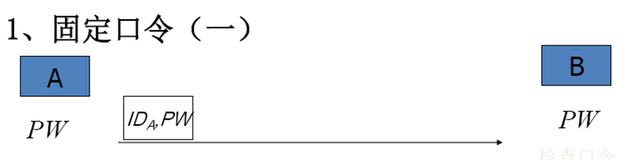

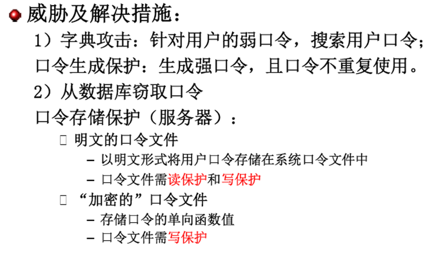

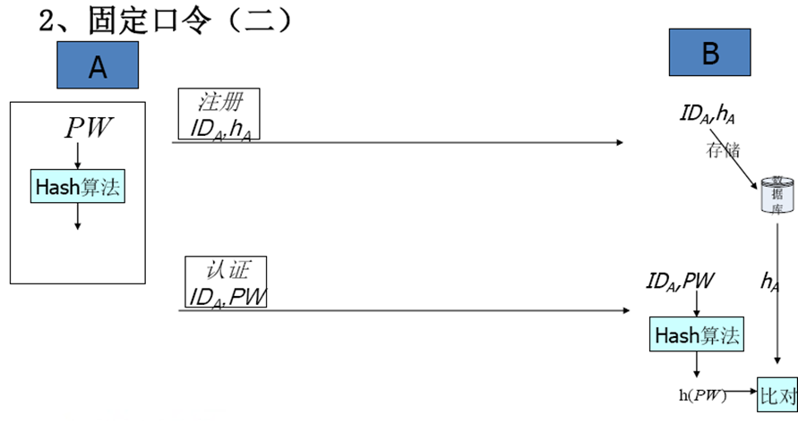

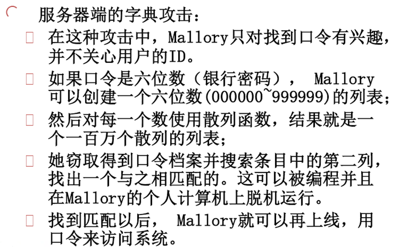

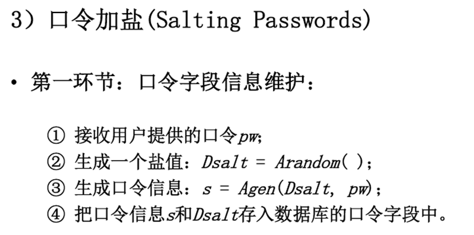

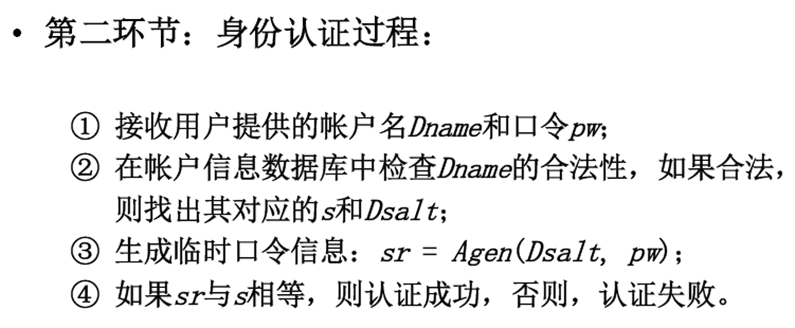

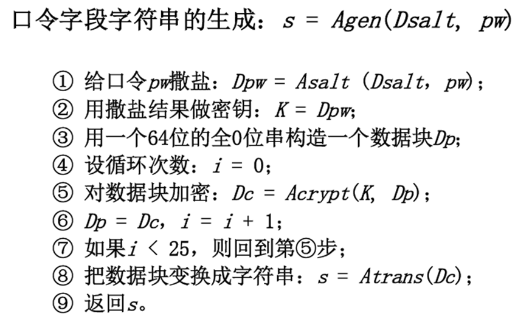

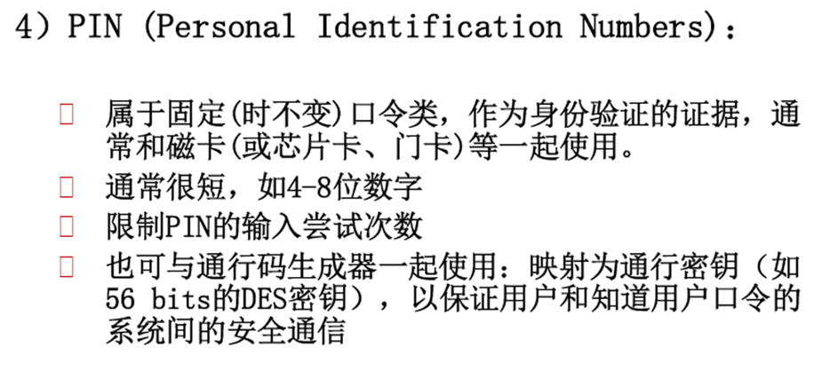

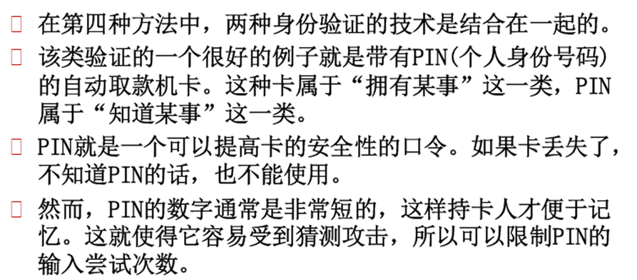

- 加强固定口令安全性的措施 
  - 避免“弱”口令 
  - 口令加盐 
  - 口令扩展为通行短语 
  - 放慢口令映射（多次迭代函数，上面的撒盐机制） 
  - 定义口令生存期 
  - 限制口令的尝试次数 
  - 登录需输入指定图片中的随机数和字母的组合 

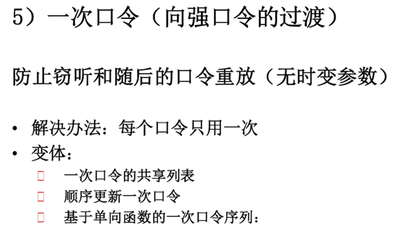

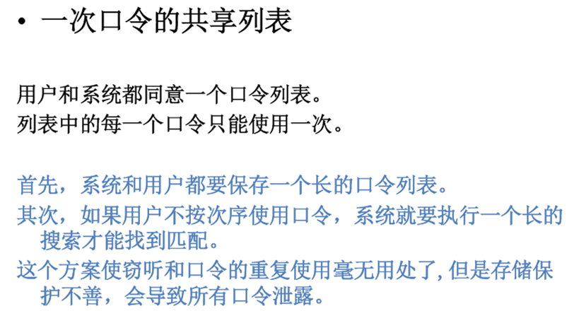

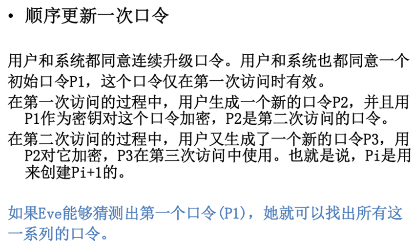

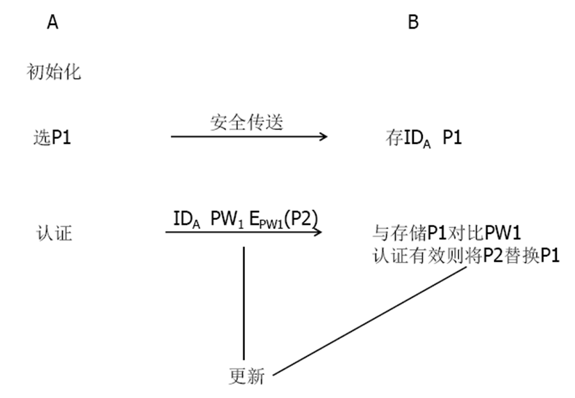

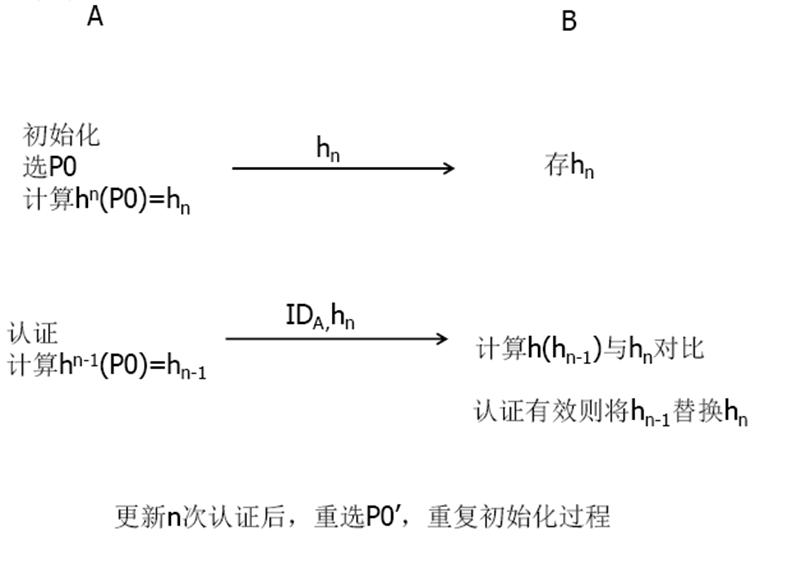

#### 7.3.3 交互式证明
- 示证者P(Prover)，知道某一秘密，使V相信自己掌握这一秘密；
- 验证者V(Verifier)，验证P掌握秘密；每轮V向P发出一询问，P向V做应答。V检查P是否每一轮都能正确应答。

P知道某一秘密（如公钥密码体制的秘密钥或一平方剩余x的平方根），P希望使V相信自己的确掌握这一秘密。交互证明由若干轮组成，在每一轮，P和V可能需根据从对方收到的消息和自己计算的某个结果向对方发送消息。比较典型的方式是在每轮V都向P发出一询问，P向V做出一应答。所有轮执行完后，V根据P是否在每一轮对自己发出的询问都能正确应答，以决定是否接受P的证明。

交互证明和数学证明的区别是： 数学证明的证明者可自己独立地完成证明，而交互证明是由P产生证明、V验证证明的有效性来实现，因此双方之间通过某种信道的通信是必需的。
		交互证明系统须满足以下要求： 
① 完备性: 如果P知道某一秘密，V将接受P的证明。
② 正确性: 如果P能以一定的概率使V相信P的证明，则P知道相应的秘密。

#### 7.3.4 简化的Fiat-Shamir身份识别方案
**协议及原理**
设n=pq，其中p和q是两个不同的大素数，x是模n的平方剩余，y是x的平方根。又设n和x是公开的，而p、q和y是保密的。证明者P以y作为自己的秘密。4.1.8节已证明，求解方程$y^2≡x\space mod\space n$与分解n是等价的。因此他人不知n的两个素因子p、q而计算y是困难的。P和验证者V通过交互证明协议，P向V证明自己掌握秘密y，从而证明了自己的身份。

**协议如下：**
①   P随机选$r(0<r<n)$，计算$a≡r^2\space mod\space n$，将a发送给V。
②   V随机选$e∈{0,1}$，将e发送给P。
③   P计算$b≡ry^e\space mod\space n$，即e=0时，b=r；e=1时，$b=ry\space mod\space n$。将b发送给V。
④   若$b^2≡ax^e\space mod\space n$，V接受P的证明。

在协议的前3步，P和V之间共交换了3个消息，这3个消息的作用分别是： 第1个消息是P用来声称自己知道a的平方根；第2个消息e是V的询问，如果e=0，P必须展示a的平方根，即r，如果e=1，P必须展示被加密的秘密，即ry mod n；第3个消息b是P对V询问的应答。

**协议的完备性、正确性和安全性**

- 完备性

如果P和V遵守协议，且P知道y，则应答$b≡ry^e\space mod\space n$应是模n下axe的平方根，在协议的第④步V接受P的证明，所以协议是完备的。

- 正确性

假冒的证明者E可按以下方式以1/2的概率骗得V接受自己的证明： 
  ① E随机选$r(0<r<n)$和$\widetilde{e}\in \{0,1\}$，计算$a\equiv r^2x^{-\widetilde{e}}\space mod\space n$
将a发送给V。
  ② V随机选$e∈{0,1}$，将e发送给E。
  ③ E将r发送给V。

根据协议的第④步，V的验证方程是$r^2\equiv ax^e\space mod\space n\equiv r^2x^{-\widetilde{e}}x^e\space mod\space n$，当$\widetilde{e}=e$时，验证方程成立，V接受E的证明，即E欺骗成功。因的概率是1/2，所以E欺骗成功的概率是1/2。另一方面，1/2是E能成功欺骗的最好概率，否则假设E以大于1/2的概率使V相信自己的证明，那么E知道一个a，对这个a他可正确地应答V的两个询问e=0和e=1，意味着E能计算$b^2_1≡a\space mod\space n$和$b_2^2≡ax\space mod\space n$，即$\frac{b_2^2}{b_1^2}\equiv x\space mod\space n$，因此E由$\frac{b_2}{b_1}mod\space n$即可求得$x$的平方根$y$，矛盾。

- 安全性

协议的安全性可分别从证明者P和验证者V的角度来考虑。根据上面的讨论，假冒的证明者E欺骗V成功的概率是1/2，对V来说，这个概率太大了。为减小这个概率，可将协议重复执行多次，设执行t次，则欺骗者欺骗成功的概率将减小到2-t。

下面考虑P的安全性。因为V的询问是在很小的集合{0,1}中选取的，V没有机会产生其他信息，而P发送给V的信息仅为P知道x的平方根这一事实，因此V无法得知x的平方根。

### 7.4 零知识证明
零知识证明起源于最小泄露证明。在交互证明系统中，设P知道某一秘密，并向V证明自己掌握这一秘密，但又不向V泄露这一秘密，这就是最小泄露证明。进一步，如果V除了知道P能证明某一事实外，不能得到其他任何信息，则称P实现了零知识证明，相应的协议称为零知识证明协议。

#### 7.4.1 简单迷宫

右图表示一个简单的迷宫，C与D之间有一道门，需要知道秘密口令才能将其打开。P向V证明自己能打开这道门，但又不愿向V泄露秘密口令。

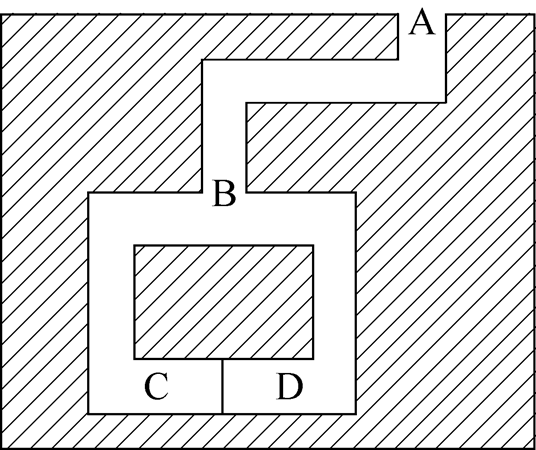

#### 7.4.1 简单迷宫
可采用如下协议： 
- V在协议开始时停留在位置A。
- P一直走到迷宫深处，随机选择位置C或位置D。
- P消失后，V走到位置B，然后命令P从某个出口返回位置B。
- P服从V的命令，必要时利用秘密口令打开C与D之间的门。
- P和V重复以上过程n次。

协议中，如果P不知道秘密口令，就只能从来路返回B，而不能走另外一条路。此外，P每次猜对V要求走哪一条路的概率是1/2，因此每一轮中P能够欺骗V的概率是1/2。假定n取16，则执行16轮后，P成功欺骗V的概率是$\frac{1}{216}=\frac{1}{65536}$。于是，如果P16次都能按V的要求返回，V即能证明P确实知道秘密口令。还可以看出，V无法从上述证明过程中获取丝毫关于P的秘密口令的信息，所以这是一个零知识证明协议。

#### 7.4.2 哈密尔顿（Hamilton）回路

1959 年 William Rowan Hamilton 发明了一个小玩具，这个玩具是一个木刻的正十二面体，每面系正五角形，三面交于一角，共 20 个角，没每个角上标有世界上一个重要城市。他提出一个问题：要求沿着正十二面体的边寻找一条路，通过 20 个城市，而每个城市只通过一次，最后返回原地。Hamilton 将此问题称为周游世界问题，并且坐了肯定的回答。

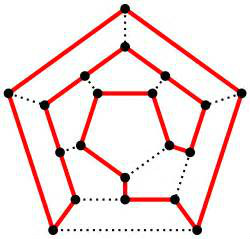

图中的回路是指始点和终点相重合的路径，若回路通过图的每个顶点一次且仅一次，则称为哈密尔顿回路，构造图的哈密尔顿回路是NPC问题。现在假定P知道图G的哈密尔顿回路，并希望向V证明这一事实，可采用如下协议： 

- P随机地构造一个与图G同构的图$\widetilde{G}$，并将交给V。
- V随机地要求P做下述两件工作之一： 
  - 证明图G和图$\widetilde{G}$同构；
  - 指出图的一条哈密尔顿回路。
- P根据要求做下述两件工作之一： 
  - 证明图G和图$\widetilde{G}$同构，但不指出图G或图$\widetilde{G}$的哈密尔顿回路；
  - 指出图$\widetilde{G}$的哈密尔顿回路，但不证明图G和图$\widetilde{G}$同构。
- P和V重复以上过程n次。

协议执行完后，V无法获得任何信息使自己可以构造图G的哈密尔顿回路，因此该协议是零知识证明协议。事实上，如果P向V证明图G和图$\widetilde{G}$同构，这个结论对V并没有意义，因为构造图$\widetilde{G}$的哈密尔顿回路和构造图G的哈密尔顿回路同样困难。如果P向V指出图$\widetilde{G}$的一条哈密尔顿回路，这一事实也无法向V提供任何帮助，因为求两个图之间的同构并不比求一个图的哈密尔顿回路容易。在协议的每一轮中，P都随机地构造一个与图G同构的新图，因此不论协议执行多少轮，V都得不到任何有关构造图G的哈密尔顿回路的信息。

### 7.4.2 哈密尔顿（Hamilton）回路
注：两个图$G_1$和$G_2$是同构的是指从$G_1$的顶点集合到$G_2$的顶点集合之间存在一个一一映射π，当且仅当若$x$、$y$是$G_1$上的相邻点，$π(x)$和$π(y)$是$G_2$上的相邻点。

### 7.4.3 Fiat-Shamir身份识别方案

**1. 协议及原理**

在简化的Fiat-Shamir身份识别方案中，验证者V接受假冒的证明者证明的概率是1/2，为减小这个概率，将证明者的秘密改为由随机选择的t个平方根构成的一个向量$y=(y_1,y_2,…,y_t)$，模数n和向量$x=(y^2_1,y^2_2,…,y^2_t)$是公开的，其中n仍是两个不相同的大素数的乘积。

协议如下： 
① P随机选$r(0<r<n)$，计算$a≡r^2\space mod\space n$，将a发送给V。
② V随机选$e=(e_1,e_2,…,e_t)$，其中$e_i\in \{0,1\}(i=1,2,…,t)$，将e发送给P。
③ P计算$b\equiv r\prod^{t}_{i=1}y_i^{e_i}\space mod\space n$，将b发送给V。
④ 若$b^2\not\equiv a\prod^{t}_{i=1}x_i^{e_i}\space$ V拒绝P的证明，协议停止。
⑤ P和V重复以上过程k次。

**2. 协议的完备性、正确性和安全性**

- 完备性

若P和V遵守协议，则V接受P的证明。
- 正确性

如果假冒者E欺骗V成功的概率大于$2^{-kt}$，意味着E知道一个向量$A=(a^1,a^2,…,a^k)$，其中$a^j$是第j次执行协议时产生的，对这个A，E能正确地回答V的两个不同的询问$E=(e_1,e_2,…,e_k)$、$F=(f_1,f_2,…,f_k)$（每一元素是一向量），$E≠F$。

由$E≠F$可设$e^j≠f^j$，$e^j$和$f^j$是第j次执行协议时V的两个不同的询问（为向量），简记为$e=e^j$和$f=f^j$，这一轮对应的$a^j$简记为a。所以E能计算两个不同的值，

$$b_1^2\equiv a\prod^{t}_{i=1}x_i^{f_i-e_i}\space mod\space n，b_2^2\equiv a\prod^{t}_{i=1}x_i^{f_i}\space mod\space n$$

即$\frac{b_2^2}{b_1^2}\equiv \prod^{t}_{i=1}x_i^{f_i-e_i}\space mod\space n$，

所以E可由$\frac{b_2}{b_1}\space mod\space n$求得$x\equiv \prod^{t}_{i=1}x_i^{f_i-e_i}\space mod\space n$的平方根，矛盾。

- 安全性

Fiat-Shamir身份识别方案是对简化的Fiat-Shamir身份识别方案的推广，首先将V的询问由一个比特推广到由t个比特构成的向量，再者基本协议被执行k次。假冒的证明者只有能正确猜测V的每次询问，才可使V相信自己的证明，成功的概率是$2^{-kt}$。
