# 2.2.6 Ghidra

Ghidra是RSA Conference 2019上NSA发布的一个开源的逆向分析工具。由于该分析工具使用Java开发，因此可以在Windows、macOS和Linux系统上都可以运行，且有不错的使用体验。此外，由于Ghidra内置了Jython解释器，我们还可以使用Java或Python开发自己的Ghidra插件或者脚本。至此，对于无法忍受IDA Pro高昂售价的二进制安全研究者和CTFer来说，不仅有了免费的开源工具，甚至Ghidra在一些反编译的特性上比IDA Pro还要优秀，对于其他的开源反编译工具如Binary Ninja和r2，也将借鉴Ghidra中的反汇编实现，为这些工具的质量更上一层楼。

## 1.Ghidra安装和初始化

Ghidra的官方地址[https://ghidra-sre.org/](https://ghidra-sre.org/)，我们可以在官网上找到工具的下载链接和帮助文档。
想要安装使用Ghidra，仅支持以下系统：64位的Windows 7或Windows10、64位的Linux发行版（最好是CentOS 7），或是macOS 10.8.3以上的版本；硬件的要求是4GB的内存和1GB的硬盘空间，此外官网还提到建议使用双屏的显示器来操作Ghidra。Ghidra是使用Java开发的，因此软件要求是需要系统中有安装Java 11 Runtime and Development Kit (JDK 11)。

Ghidra没有提供安装程序，只有一个压缩包下载，官网的描述是这样可以不修改系统的配置，也便于删除该工具。我们以Windows系统为例来安装和使用Ghidra如果想解压Ghidra到系统盘符，则需要管理员权限。

在运行Ghidra之前，我们需要先配置Java的环境变量。对于Windows系统来说，前往Oracle官网https://www.oracle.com/technetwork/java/javase/downloads/jdk11-downloads-5066655.html，下载Windows系统的安装程序后，选择目录安装JDK之后就是设置环境变量了。此时，我们需要：

-   新建一个名为JAVA\_HOME的环境变量，值为JDK的安装目录，如C:\\Program
    Files\\Java\\jdk-11.0.2

-   新建一个classpath的环境变量，值为
    %JAVA\_HOME%\\lib;%JAVA\_HOME%\\lib\\tools.jar

-   最后在Path环境变量中添加 %JAVA\_HOME%\\bin的值就完成了

此时Java环境变量就设置完成了，开启一个cmd窗口并输入java
-version，出现如下字样就代表Java环境变量设置成功，此时就可以打开Ghidra了：


点击解压安装包后的Ghidra目录中的ghidraRun.bat就可以开启Ghidra了：


那么，接下来让我们学习Ghidra的使用。

## 2.Ghidra简单使用

Ghidra支持的处理器架构可以在Help菜单的Install
Processers选项查看，目前来看还是可以分析主流的架构的：

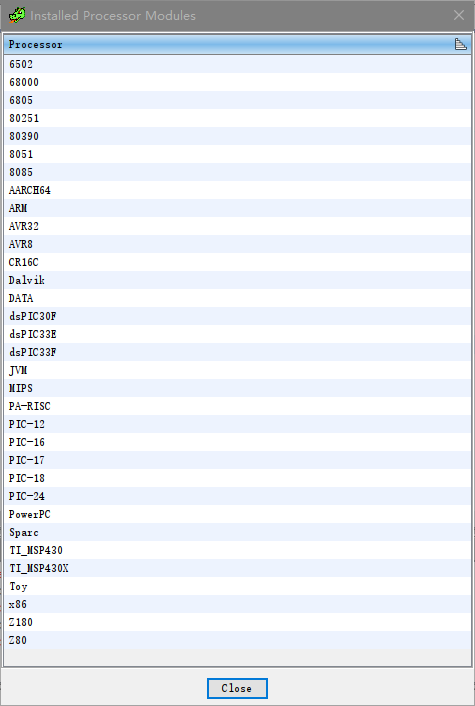

Ghidra有GUI模式、CLI模式、Ghidra Server模式和独立Jar包运行模式，上节我们是通过GUI模式打开运行的。Ghidra支持多人协作完成一个逆向项目，多人可以使用多个设备对二进制可执行文件进行分析，并将其修改提交到公共的server端存储库中，相关配置和文档在Ghidra 安装目录下的server目录中有详尽的说明。Ghidra的Jar包模式指的是可以将Ghidra打包成一个Jar包来运行，在Windows系统中，只需要运行support目录下的buildGhidraJar.bat脚本即可打包成Jar包。

Ghidra的目录如下所示：

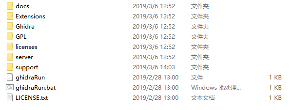

其中，docs目录是相关的离线文档，Extensions是Ghidra的插件目录，Ghidra目录是其主要程序目录，GPL目录是独立的GPL支持程序，server目录是Ghidra server的文档和执行程序，support目录包含了一些在高级模式下调试和运行Ghidra的脚本。

对于Ghidra的插件安装，可以在GUI模式中通过相应的菜单安装，也可以直接将扩展解压到Extensions目录。如果我们想编写自己的Ghidra插件，Ghidra也提供了一个名为GhidraDev的Eclipse插件在Eclipse中开发。

由于Ghidra支持多人协作，因此我们在使用Ghidra分析可执行文件时首先需要创建工程。在File菜单的New
Project选项，选择是否共享该工程，并设置工程的名称和目录即可。此时，我们在File菜单点击Import
File就可以导入想要分析的文件了：

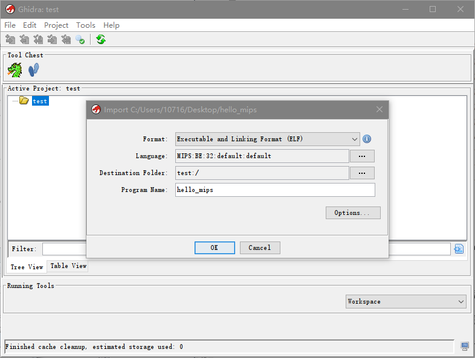

载入文件后会列出该可执行文件的详细信息：

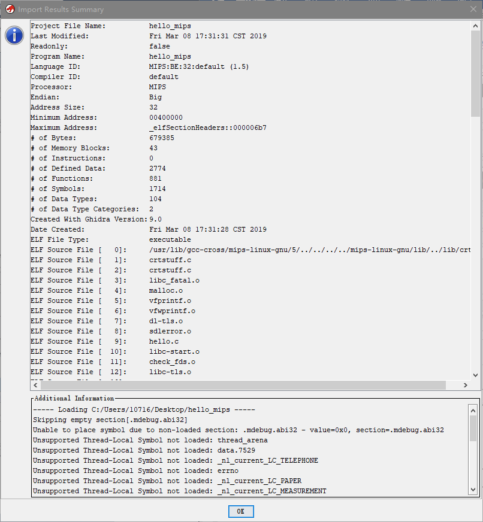

导入分析完成之后，我们可以在项目目录中找到该二进制可执行文件，双击即可进入：

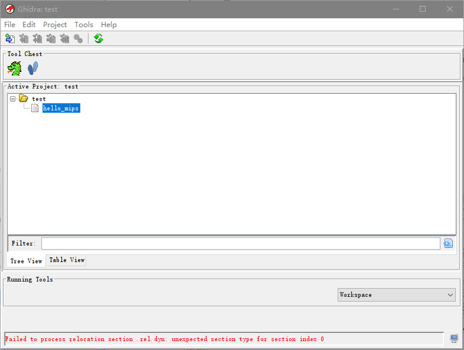

双击后会提示该文件还未被分析，我们选择OK，在下一步的菜单中选择合适的分析选项即可进行分析：

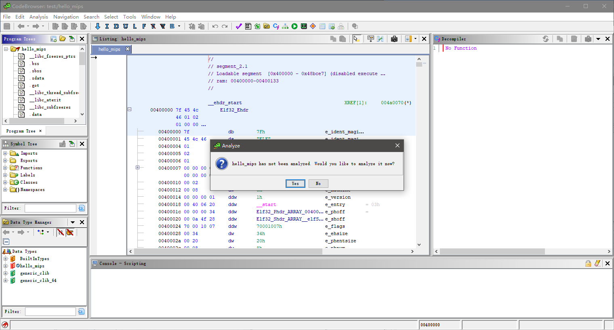

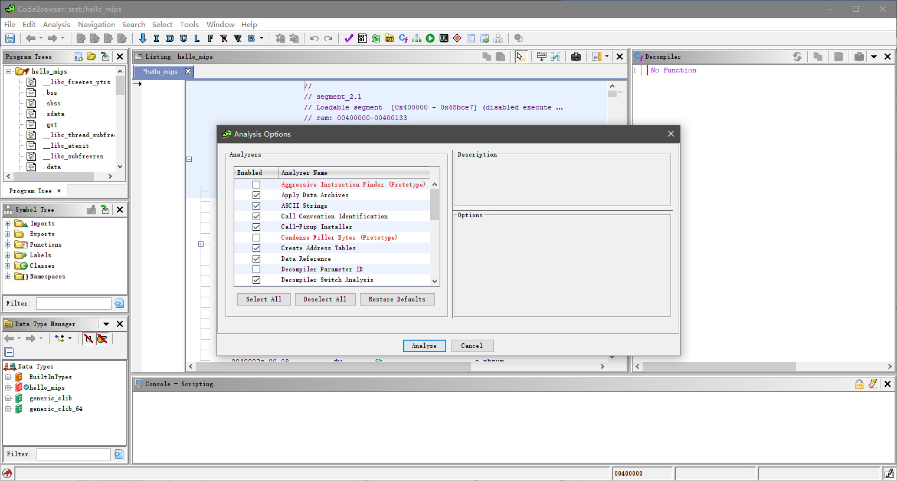

分析完成之后，就可以看到Ghidra的窗口了，中间是反汇编代码，右侧是类似IDA Pro F5功能的伪代码，由于我们分析的可执行文件编译时添加了-g参数，保留有调试信息，因此反编译结果和源码相差无几：

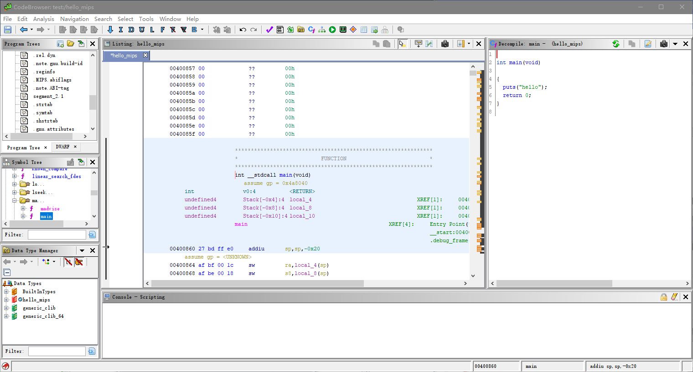

Ghidra的菜单栏和IDA Pro类似，File菜单可以导入PDB文件，或是打开新项目；Edit菜单可以进行一些简单的设置；Analysis菜单主要是分析选项的调整，Navigation菜单有快捷的前往下一函数等功能，Search菜单可以进行字符串的搜索等，Tools菜单可以查看当前可执行文件的处理器帮助手册，也有一个Diff功能。Window菜单可以快捷打开其他窗口，如字符串等，Help菜单可以查阅帮助文档和API文档等。

此外，点击快捷工具栏的脚本管理按钮可以看到有很多辅助分析的Java、py脚本：

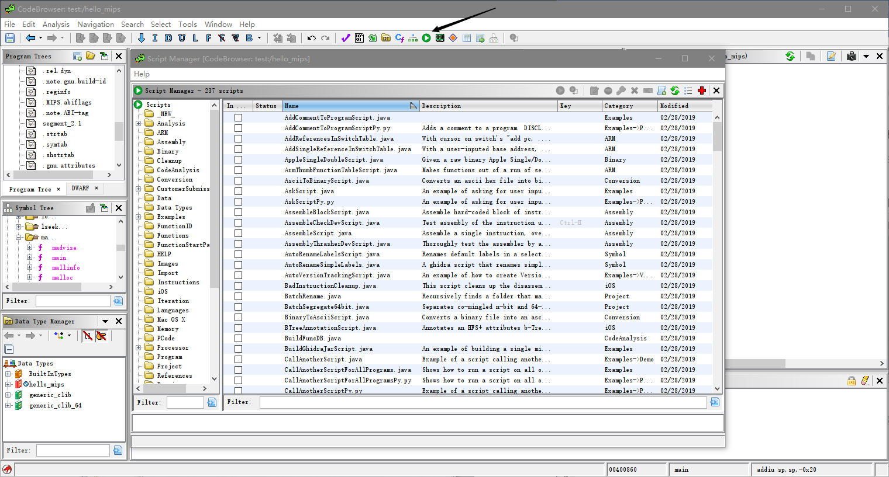

选择脚本就可以直接运行，如字符串的搜索功能：

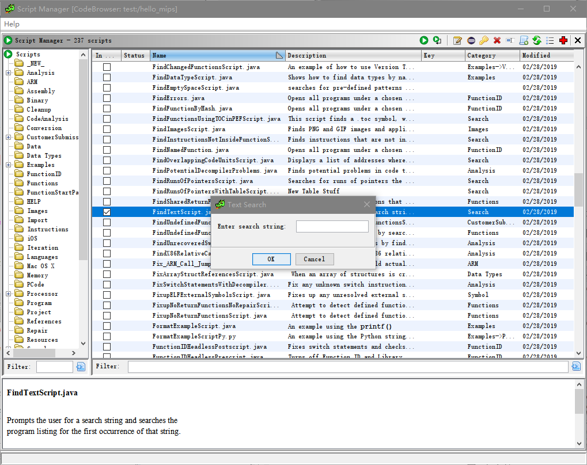

Ghidra常用的快捷键可以在docs目录下的CHeatSheet.html文件中查看。和IDA Pro一样，多多使用才能将快捷操作熟练掌握。

## 3.Ghidra多人协作

Ghidra允许我们在机器上安装Ghidra服务，以便多人协作分析某个文件或某些项目，这恰是IDA Pro没有的功能。本节将对Ghidra的多人协作功能进行简单介绍。

Ghidra多人协作服务的相关帮助文件和脚本在Ghidra的安装目录的 server目录下，在使用多人协作功能之前，我们需要安装Ghidra Server的服务，我们以在Windows系统下运行Ghidra的服务为例。由于在安装过程中需要获取管理员权限，因此我们需要新打开一个管理员权限的cmd窗口并运行如下脚本：

```shell
D:\\ghidra\_9.0\\server\> .\\svrInstall.bat

YAJSW: yajsw-stable-12.12

OS : Windows 10/10.0/amd64

JVM : Oracle Corporation/11.0.2/C:\\Program Files\\Java\\jdk-11.0.2/64

WARNING: An illegal reflective access operation has occurred

WARNING: Illegal reflective access by
org.codehaus.groovy.reflection.CachedClass

......

\*\*\*\*\*\*\*\*\*\*\*\*\* STARTING ghidraSvr
\*\*\*\*\*\*\*\*\*\*\*\*\*\*\*\*\*\*\*\*\*\*\*

Service ghidraSvr started

安装服务完成之后，可以运行如下脚本检查服务状态：

D:\\ghidra\_9.0\\server\> .\\svrInstall.bat status

...

Name : ghidraSvr

Installed : true

Running : true

Interactive : false

Automatic : true

Manual : false

Disabled : false

Paused : false

Unknown : false
```

在输出窗口观察到服务正在运行就可以在Ghidra的新建项目填入相应的服务的IP与端口号即可。我们可以看到这里需要密码认证，这时我们可以在新弹出的窗口看到本机的User ID，在Server端的cmd窗口运行`SvrAdmin.bat -add
User\_id`即可，就可以在Server端默认的连接密码是`changeme`，初次使用该密码会要求更改这个默认密码，否则将会在24小时后过期。如果用户遗忘密码，可以在Server端的cmd窗口运行`SvrAdmin.bat -reset User\_id`就可以重置密码为changeme：

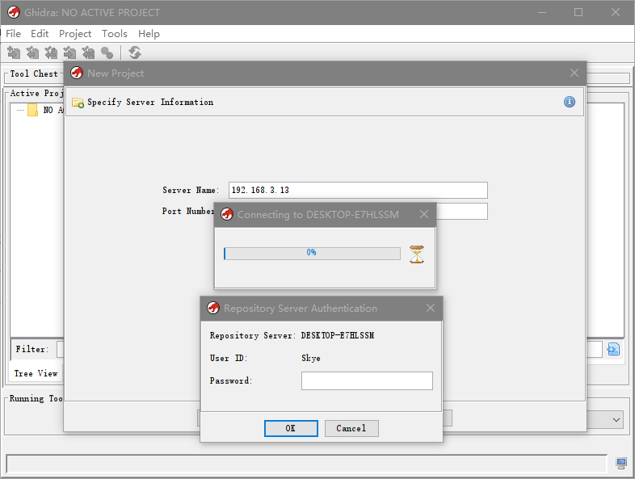

输入密码成功登录后和本机的操作类似，就可以进行新建一个项目了，还可以针对连接到该Ghidra 服务器的用户对该项目的权限进行管理：

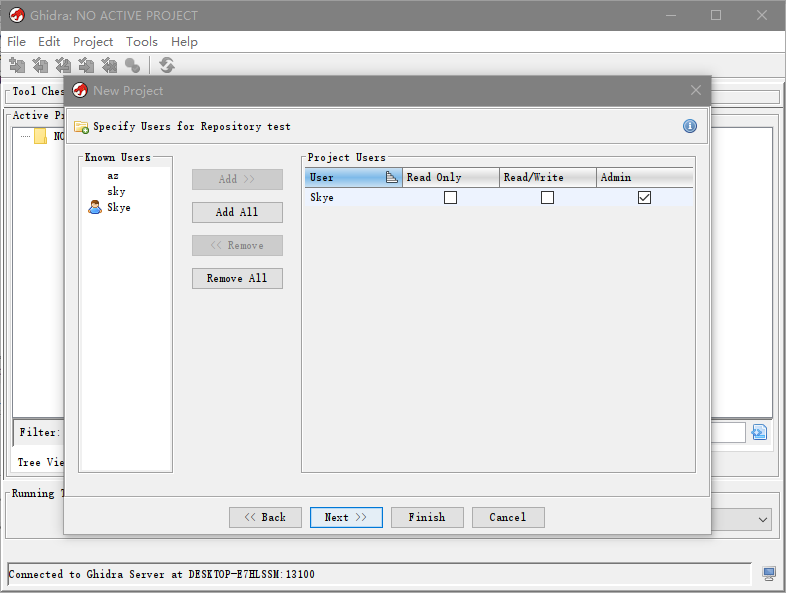

此外，Ghidra的多人协作功能还有着版本追踪功能，在本地导入文件后并提交更改，有该项目权限的用户就可以看到该文件了，在对文件修改后并提交，有权限的用户也可以同步该更改：

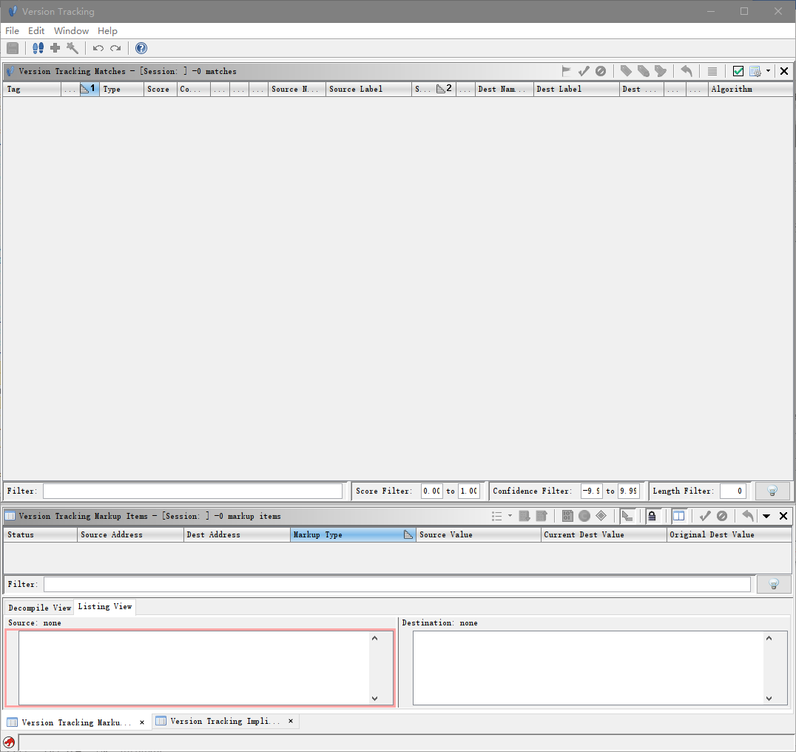

Ghidra内建支持的协作功能比IDA Pro的插件支持更加人性化，只是操作步骤还需要更合理的优化。官方文档对Ghidra的帮助文件写得十分清楚明了，如果在使用中遇到疑问可以查阅相关文档或是寻求Ghidra社区的帮助。

经过一番尝试，Ghidra的反编译功能的确很好用，查看和定位汇编代码也十分方便，但由于其是以Java编写的，因此分析速度仍然不如IDA Pro快速，且UI界面仍需美化才能更好的使用，但是由于其开源的优势，相信随着越来越多的二进制安全研究人员的参与，Ghidra也会变得越来越易用。
