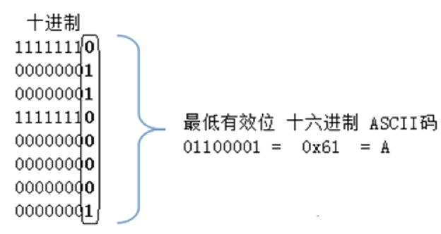

# Lsb 隐写

Lsb≠Lsb隐写

## Lsb
最低有效位代表二进制数中的最小的单位，可以用来指示数字很小的变化。

那么给出一个二进制1001，其最低有效位就是拥有最小单位数值的那一位。也就是最右边一位。拥有的数值最小。

## LSB隐写
图片由像素组成。像素由RGB三个通道混合而成。每个通道有256级亮度即0-255。那么一共就会有256x256x256=16777216种颜色

而人类大约可以分辨1000万种颜色，也就是说还剩6777216种颜色我们分辨不出来

还记得我们刚刚说过的么，图片由像素组成，像素由RGB通道混合而成。而LSB隐写就是修改每个像素的RGB通道的二进制数据的最低位来达到人眼分辨不出，但是仍然每个像素可以携带3Byte的数据。

接下来让我们看看如何吧A这个ASCII字符放进一个图片里

因为LSB是要数据放进图片像素里的，自然不能是JPG文件，JPG文件是一种有损压缩。我们修改的数据可能会在压缩过程中被破坏。

PNG图片也会被压缩，但运用的是DEFLATE算法，DEFLATE算法是同时使用了LZ77算法[1]与哈夫曼编码（Huffman Coding）[2]的一个无损数据压缩算法。[3]

不仅如此，我们也可以使用位图(BMP)文件，这种类型的文件不压缩。但是文件体积通常也很感人。

## 实战

## 参考资料
[1] [LZ77算法](https://zh.wikipedia.org/wiki/LZ77%E4%B8%8ELZ78)

[2] [哈夫曼编码](https://zh.wikipedia.org/wiki/%E5%93%88%E5%A4%AB%E6%9B%BC%E7%BC%96%E7%A0%81)

[3] [DEFLATE算法](https://zh.wikipedia.org/wiki/DEFLATE)
