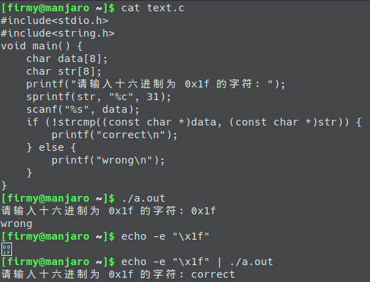

# Linux 命令行技巧

- [重定向输入字符](#重定向输入字符)
- [从可执行文件中提取 shellcode](#从可执行文件中提取-shellcode)
- [查看进程虚拟地址空间](#查看进程虚拟地址空间)
- [ASCII 表](#ascii-表)


## 重定向输入字符
有时候我们需要在 shell 里输入键盘上没有对应的字符，如 `0x1F`，就需要使用重定向输入。下面是一个例子：[源码](../src/Others/4.2_0x1f.c)




## 从可执行文件中提取 shellcode
```text
for i in `objdump -d print_flag | tr '\t' ' ' | tr ' ' '\n' | egrep '^[0-9a-f]{2}$' ` ; do echo -n "\x$i" ; done
```
注意：在 objdump 中空字节可能会被删除。


## 查看进程虚拟地址空间
有时我们需要知道一个进程的虚拟地址空间是如何使用的，以确定栈是否是可执行的。
```text
$ cat /proc/<PID>/maps
```
下面我们分别来看看可执行栈和不可执行栈的不同：
```text
$ cat hello.c
#include <stdio.h>
void main()
{
    char buf[128];
    scanf("hello, world: %s\n", buf);
}

$ gcc hello.c -o a.out1

$ ./a.out1 &
[1] 7403

$ cat /proc/7403/maps
555555554000-555555555000 r-xp 00000000 08:01 26389924                   /home/firmy/a.out1
555555754000-555555755000 r--p 00000000 08:01 26389924                   /home/firmy/a.out1
555555755000-555555756000 rw-p 00001000 08:01 26389924                   /home/firmy/a.out1
555555756000-555555777000 rw-p 00000000 00:00 0                          [heap]
7ffff7a33000-7ffff7bd0000 r-xp 00000000 08:01 21372436                   /usr/lib/libc-2.25.so
7ffff7bd0000-7ffff7dcf000 ---p 0019d000 08:01 21372436                   /usr/lib/libc-2.25.so
7ffff7dcf000-7ffff7dd3000 r--p 0019c000 08:01 21372436                   /usr/lib/libc-2.25.so
7ffff7dd3000-7ffff7dd5000 rw-p 001a0000 08:01 21372436                   /usr/lib/libc-2.25.so
7ffff7dd5000-7ffff7dd9000 rw-p 00000000 00:00 0
7ffff7dd9000-7ffff7dfc000 r-xp 00000000 08:01 21372338                   /usr/lib/ld-2.25.so
7ffff7fbc000-7ffff7fbe000 rw-p 00000000 00:00 0
7ffff7ff8000-7ffff7ffa000 r--p 00000000 00:00 0                          [vvar]
7ffff7ffa000-7ffff7ffc000 r-xp 00000000 00:00 0                          [vdso]
7ffff7ffc000-7ffff7ffd000 r--p 00023000 08:01 21372338                   /usr/lib/ld-2.25.so
7ffff7ffd000-7ffff7ffe000 rw-p 00024000 08:01 21372338                   /usr/lib/ld-2.25.so
7ffff7ffe000-7ffff7fff000 rw-p 00000000 00:00 0
7ffffffde000-7ffffffff000 rw-p 00000000 00:00 0                          [stack]
ffffffffff600000-ffffffffff601000 r-xp 00000000 00:00 0                  [vsyscall]

[1]+  Stopped                 ./a.out1

$ gcc -z execstack hello.c -o a.out2

$ ./a.out2 &
[2] 7467
[firmy@manjaro ~]$ cat /proc/7467/maps
555555554000-555555555000 r-xp 00000000 08:01 26366643                   /home/firmy/a.out2
555555754000-555555755000 r-xp 00000000 08:01 26366643                   /home/firmy/a.out2
555555755000-555555756000 rwxp 00001000 08:01 26366643                   /home/firmy/a.out2
555555756000-555555777000 rwxp 00000000 00:00 0                          [heap]
7ffff7a33000-7ffff7bd0000 r-xp 00000000 08:01 21372436                   /usr/lib/libc-2.25.so
7ffff7bd0000-7ffff7dcf000 ---p 0019d000 08:01 21372436                   /usr/lib/libc-2.25.so
7ffff7dcf000-7ffff7dd3000 r-xp 0019c000 08:01 21372436                   /usr/lib/libc-2.25.so
7ffff7dd3000-7ffff7dd5000 rwxp 001a0000 08:01 21372436                   /usr/lib/libc-2.25.so
7ffff7dd5000-7ffff7dd9000 rwxp 00000000 00:00 0
7ffff7dd9000-7ffff7dfc000 r-xp 00000000 08:01 21372338                   /usr/lib/ld-2.25.so
7ffff7fbc000-7ffff7fbe000 rwxp 00000000 00:00 0
7ffff7ff8000-7ffff7ffa000 r--p 00000000 00:00 0                          [vvar]
7ffff7ffa000-7ffff7ffc000 r-xp 00000000 00:00 0                          [vdso]
7ffff7ffc000-7ffff7ffd000 r-xp 00023000 08:01 21372338                   /usr/lib/ld-2.25.so
7ffff7ffd000-7ffff7ffe000 rwxp 00024000 08:01 21372338                   /usr/lib/ld-2.25.so
7ffff7ffe000-7ffff7fff000 rwxp 00000000 00:00 0
7ffffffde000-7ffffffff000 rwxp 00000000 00:00 0                          [stack]
ffffffffff600000-ffffffffff601000 r-xp 00000000 00:00 0                  [vsyscall]

[2]+  Stopped                 ./a.out2
```
当使用 `-z execstack` 参数进行编译时，会关闭 `Stack Protector`。我们可以看到在 `a.out1` 中的 `stack` 是 `rw` 的，而 `a.out2` 中则是 `rwx` 的。

`maps` 文件有 6 列，分别为：
- **地址**：库在进程里地址范围
- **权限**：虚拟内存的权限，r=读，w=写,x=执行,s=共享,p=私有
- **偏移量**：库在进程里地址偏移量
- **设备**：映像文件的主设备号和次设备号，可以通过通过 `cat /proc/devices` 查看设备号对应的设备名
- **节点**：映像文件的节点号
- **路径**: 映像文件的路径，经常同一个地址有两个地址范围，那是因为一段是 `r-xp` 为只读的代码段，一段是 `rwxp` 为可读写的数据段


## ASCII 表
ASCII 表将键盘上的所有字符映射到固定的数字。有时候我们可能需要查看这张表：
```text
$ man ascii

Oct   Dec   Hex   Char                        Oct   Dec   Hex   Char
────────────────────────────────────────────────────────────────────────
000   0     00    NUL '\0' (null character)   100   64    40    @
001   1     01    SOH (start of heading)      101   65    41    A
002   2     02    STX (start of text)         102   66    42    B
003   3     03    ETX (end of text)           103   67    43    C
004   4     04    EOT (end of transmission)   104   68    44    D
005   5     05    ENQ (enquiry)               105   69    45    E
006   6     06    ACK (acknowledge)           106   70    46    F
007   7     07    BEL '\a' (bell)             107   71    47    G
010   8     08    BS  '\b' (backspace)        110   72    48    H
011   9     09    HT  '\t' (horizontal tab)   111   73    49    I
012   10    0A    LF  '\n' (new line)         112   74    4A    J
013   11    0B    VT  '\v' (vertical tab)     113   75    4B    K
014   12    0C    FF  '\f' (form feed)        114   76    4C    L
015   13    0D    CR  '\r' (carriage ret)     115   77    4D    M
016   14    0E    SO  (shift out)             116   78    4E    N
017   15    0F    SI  (shift in)              117   79    4F    O
020   16    10    DLE (data link escape)      120   80    50    P
021   17    11    DC1 (device control 1)      121   81    51    Q
022   18    12    DC2 (device control 2)      122   82    52    R
023   19    13    DC3 (device control 3)      123   83    53    S
024   20    14    DC4 (device control 4)      124   84    54    T
025   21    15    NAK (negative ack.)         125   85    55    U
026   22    16    SYN (synchronous idle)      126   86    56    V
027   23    17    ETB (end of trans. blk)     127   87    57    W
030   24    18    CAN (cancel)                130   88    58    X
031   25    19    EM  (end of medium)         131   89    59    Y
032   26    1A    SUB (substitute)            132   90    5A    Z
033   27    1B    ESC (escape)                133   91    5B    [
034   28    1C    FS  (file separator)        134   92    5C    \  '\\'
035   29    1D    GS  (group separator)       135   93    5D    ]
036   30    1E    RS  (record separator)      136   94    5E    ^
037   31    1F    US  (unit separator)        137   95    5F    _
040   32    20    SPACE                       140   96    60    `
041   33    21    !                           141   97    61    a
042   34    22    "                           142   98    62    b
043   35    23    #                           143   99    63    c
044   36    24    $                           144   100   64    d
045   37    25    %                           145   101   65    e
046   38    26    &                           146   102   66    f
047   39    27    '                           147   103   67    g
050   40    28    (                           150   104   68    h
051   41    29    )                           151   105   69    i
052   42    2A    *                           152   106   6A    j
053   43    2B    +                           153   107   6B    k
054   44    2C    ,                           154   108   6C    l
055   45    2D    -                           155   109   6D    m

056   46    2E    .                           156   110   6E    n
057   47    2F    /                           157   111   6F    o
060   48    30    0                           160   112   70    p
061   49    31    1                           161   113   71    q
062   50    32    2                           162   114   72    r
063   51    33    3                           163   115   73    s
064   52    34    4                           164   116   74    t
065   53    35    5                           165   117   75    u
066   54    36    6                           166   118   76    v
067   55    37    7                           167   119   77    w
070   56    38    8                           170   120   78    x
071   57    39    9                           171   121   79    y
072   58    3A    :                           172   122   7A    z
073   59    3B    ;                           173   123   7B    {
074   60    3C    <                           174   124   7C    |
075   61    3D    =                           175   125   7D    }
076   62    3E    >                           176   126   7E    ~
077   63    3F    ?                           177   127   7F    DEL

Tables
For convenience, below are more compact tables in hex and decimal.

   2 3 4 5 6 7       30 40 50 60 70 80 90 100 110 120
 -------------      ---------------------------------
0:   0 @ P ` p     0:    (  2  <  F  P  Z  d   n   x
1: ! 1 A Q a q     1:    )  3  =  G  Q  [  e   o   y
2: " 2 B R b r     2:    *  4  >  H  R  \  f   p   z
3: # 3 C S c s     3: !  +  5  ?  I  S  ]  g   q   {
4: $ 4 D T d t     4: "  ,  6  @  J  T  ^  h   r   |
5: % 5 E U e u     5: #  -  7  A  K  U  _  i   s   }
6: & 6 F V f v     6: $  .  8  B  L  V  `  j   t   ~
7: ' 7 G W g w     7: %  /  9  C  M  W  a  k   u  DEL
8: ( 8 H X h x     8: &  0  :  D  N  X  b  l   v
9: ) 9 I Y i y     9: '  1  ;  E  O  Y  c  m   w
A: * : J Z j z
B: + ; K [ k {
C: , < L \ l |
D: - = M ] m }
E: . > N ^ n ~
F: / ? O _ o DEL
```
