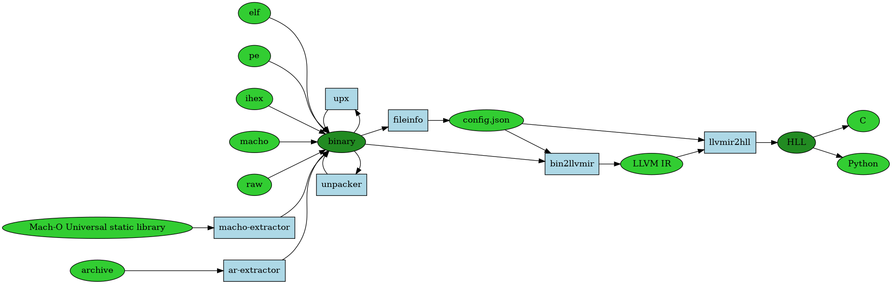

# 5.11.1 RetDec

- [RetDec 简介](#retdec-简介)
- [安装](#安装)
- [使用方法](#使用方法)
- [r2pipe decompiler](#r2pipe-decompiler)
- [参考资料](#参考资料)

前面介绍过 IDA Pro，其 F5 已经具有巨强大的反编译能力了，但这本书一直到现在，由于本人的某种执念，都是在硬怼汇编代码，没有用到 IDA，虽说这样能锻炼到我们的汇编能力，但也可以说是无故加大了逆向的难度。但现在事情出现了转机，安全公司 Avast 开源了它的反编译器 RetDec，能力虽不及 IDA，目前也只支持 32 位，但好歹有了第一步，未来会好起来的。

## RetDec 简介

[RetDec](https://retdec.com/) 是一个可重定向的机器码反编译器，它基于 LLVM，支持各种体系结构、操作系统和文件格式：

- 支持的文件格式：ELF，PE，Mach-O，COFF，AR（存档），Intel HEX 和原始机器码。
- 支持的体系结构（仅限 32 位）：Intel x86，ARM，MIPS，PIC32 和 PowerPC。

## 安装

在 Linux 上，你需要自己构建和安装。

安装依赖：

```text
$ sudo apt-get install build-essential cmake coreutils wget bc graphviz upx flex bison zlib1g-dev libtinfo-dev autoconf pkg-config m4 libtool
```

把项目连同子模块一起拉下来：

```text
$ git clone --recursive https://github.com/avast-tl/retdec
```

接下来要注意了，由于项目自己的问题，在运行 cmake 的时候一定指定一个干净的目录，不要在默认的 `/usr` 或者 `/usr/local` 里，可以像下面这样：

```text
$ cd retdec
$ mkdir build && cd build
$ cmake .. -DCMAKE_INSTALL_PREFIX=/usr/local/retdec
$ make && sudo make install
```

## 入门

安装完成后，我们用 helloword 大法试一下，注意将其编译成 32 位：

```C
#include <stdio.h>
int main() {
        printf("hello world!\n");
        return 0;
}
```

运行 decompile.sh 反编译它，我们截取出部分重要的过程和输出：

```text
$ /usr/local/retdec/bin/decompile.sh a.out
##### Checking if file is a Mach-O Universal static library...
RUN: /usr/local/retdec/bin/macho-extractor --list /home/firmy/test/a.out

##### Checking if file is an archive...
RUN: /usr/local/retdec/bin/ar-extractor --arch-magic /home/firmy/test/a.out

##### Gathering file information...
RUN: /usr/local/retdec/bin/fileinfo -c /home/firmy/test/a.out.c.json --similarity /home/firmy/test/a.out --no-hashes=all --crypto /usr/local/retdec/bin/../share/generic/yara_patterns/signsrch/signsrch.yara

##### Trying to unpack /home/firmy/test/a.out into /home/firmy/test/a.out-unpacked.tmp by using generic unpacker...
RUN: /usr/local/retdec/bin/unpacker -d /usr/local/retdec/bin/unpacker-plugins -o /home/firmy/test/a.out-unpacked.tmp /home/firmy/test/a.out

##### Trying to unpack /home/firmy/test/a.out into /home/firmy/test/a.out-unpacked.tmp by using UPX...
RUN: upx -d /home/firmy/test/a.out -o /home/firmy/test/a.out-unpacked.tmp

##### Decompiling /home/firmy/test/a.out into /home/firmy/test/a.out.c.backend.bc...
RUN: /usr/local/retdec/bin/bin2llvmir -provider-init -config-path /home/firmy/test/a.out.c.json -decoder -disable-inlining -disable-simplify-libcalls -inst-opt -verify -volatilize -instcombine -reassociate -volatilize -control-flow -cfg-fnc-detect -main-detection -register -stack -control-flow -cond-branch-opt -syscalls -idioms-libgcc -constants -param-return -local-vars -type-conversions -simple-types -generate-dsm -remove-asm-instrs -select-fncs -unreachable-funcs -type-conversions -stack-protect -verify -instcombine -tbaa -targetlibinfo -basicaa -domtree -simplifycfg -domtree -early-cse -lower-expect -targetlibinfo -tbaa -basicaa -globalopt -mem2reg -instcombine -simplifycfg -basiccg -domtree -early-cse -lazy-value-info -jump-threading -correlated-propagation -simplifycfg -instcombine -simplifycfg -reassociate -domtree -loops -loop-simplify -lcssa -loop-rotate -licm -lcssa -instcombine -scalar-evolution -loop-simplifycfg -loop-simplify -aa -loop-accesses -loop-load-elim -lcssa -indvars -loop-idiom -loop-deletion -memdep -gvn -memdep -sccp -instcombine -lazy-value-info -jump-threading -correlated-propagation -domtree -memdep -dse -dce -bdce -adce -die -simplifycfg -instcombine -strip-dead-prototypes -globaldce -constmerge -constprop -instnamer -domtree -instcombine -never-returning-funcs -adapter-methods -class-hierarchy -instcombine -tbaa -targetlibinfo -basicaa -domtree -simplifycfg -domtree -early-cse -lower-expect -targetlibinfo -tbaa -basicaa -globalopt -mem2reg -instcombine -simplifycfg -basiccg -domtree -early-cse -lazy-value-info -jump-threading -correlated-propagation -simplifycfg -instcombine -simplifycfg -reassociate -domtree -loops -loop-simplify -lcssa -loop-rotate -licm -lcssa -instcombine -scalar-evolution -loop-simplifycfg -loop-simplify -aa -loop-accesses -loop-load-elim -lcssa -indvars -loop-idiom -loop-deletion -memdep -gvn -memdep -sccp -instcombine -lazy-value-info -jump-threading -correlated-propagation -domtree -memdep -dse -dce -bdce -adce -die -simplifycfg -instcombine -strip-dead-prototypes -globaldce -constmerge -constprop -instnamer -domtree -instcombine -simple-types -stack-ptr-op-remove -type-conversions -idioms -instcombine -global-to-local -dead-global-assign -instcombine -stack-protect -phi2seq -o /home/firmy/test/a.out.c.backend.bc

##### Decompiling /home/firmy/test/a.out.c.backend.bc into /home/firmy/test/a.out.c...
RUN: /usr/local/retdec/bin/llvmir2hll -target-hll=c -var-renamer=readable -var-name-gen=fruit -var-name-gen-prefix= -call-info-obtainer=optim -arithm-expr-evaluator=c -validate-module -llvmir2bir-converter=orig -o /home/firmy/test/a.out.c /home/firmy/test/a.out.c.backend.bc -enable-debug -emit-debug-comments -config-path=/home/firmy/test/a.out.c.json

##### Done!
```

总共输出下面几个文件：

```text
$ ls
a.out  a.out.c  a.out.c.backend.bc  a.out.c.backend.ll  a.out.c.frontend.dsm  a.out.c.json
```

可以看到 RetDec 可以分为三个阶段：

- 预处理阶段：首先检查文件类型是否为可执行文件，然后调用 `fileinfo` 获取文件信息生成 `a.out.c.json`，然后调用 `unpacker` 查壳和脱壳等操作
- 核心阶段：接下来才是重头戏，调用 `bin2llvmir` 将二进制文件转换成 LLVM IR，并输出 `a.out.c.frontend.dsm`、`a.out.c.backend.ll` 和 `a.out.c.backend.bc`
- 后端阶段：这个阶段通过一系列代码优化和生成等操作，将 LLVM IR 反编译成 C 代码 `a.out.c`，还有 CFG 等。

整个过程的结构如下：



`decompile.sh` 有很多选项，使用 `decompile.sh -h` 查看。

比如反编译指定函数：

```text
$ /usr/local/retdec/bin/decompile.sh --select-functions main a.out
```

反编译指定的一段地址：

```text
$ /usr/local/retdec/bin/decompile.sh --select-ranges 0x51d-0x558 a.out
```

生成函数 CFG 图（.dot格式）：

```text
$ /usr/local/retdec/bin/decompile.sh --backend-emit-cfg a.out
```

## r2pipe decompiler

radare2 通过 r2pipe 脚本，利用 retdec.com 的 REST API 提供了反编译的功能，所以你首先要到网站上注册，拿到免费的 API key。

安装上该模块，当然你可能需要先安装上 npm，它是 JavaScript 的包管理器：

```text
$ git clone https://github.com/jpenalbae/r2-scripts.git
$ cd r2-scripts/decompiler/
$ npm install
```

将 API key 写入到 `~/.config/radare2/retdec.key` 中，然后就可以开心地反编译了。

还是 helloworld 的例子，用 r2 打开，反编译 main 函数。

```c
[0x000003e0]> #!pipe node /home/firmy/r2-scripts/decompiler/decompile.js @ main
Start: 0x51d
End: 0x558
Uploading binary to retdec.com
Please wait for decompilation to finish....

//
// This file was generated by the Retargetable Decompiler
// Website: https://retdec.com
// Copyright (c) 2017 Retargetable Decompiler <info@retdec.com>
//

#include <stdint.h>
#include <stdio.h>

// ------------------------ Functions -------------------------

// Address range: 0x51d - 0x558
int main() {
    int32_t v1;
    int32_t v2 = __x86_get_pc_thunk_ax((int32_t)&v1, 0);
    puts((char *)(v2 + 175));
    return 0;
}

// --------------- Dynamically Linked Functions ---------------

// int puts(const char * s);

// --------------------- Meta-Information ---------------------

// Detected compiler/packer: gcc (7.2.0)
// Detected functions: 1
// Decompiler release: v2.2.1 (2016-09-07)
// Decompilation date: 2017-12-15 07:48:04
```

每次输入反编译器路径是不是有点烦，在文件 `~/.config/radare2/radare2rc` 里配置一下 alias 就好了，用 `$decompile` 替代：

```sh
# Alias
$decompile=#!pipe node /home/user/r2-scripts/decompiler/decompile.js
```

```text
[0x000003e0]> $decompile -h

Usage: $decompile [-acChps] [-n naming] @ addr
  -a: disable selective decompilation (decompile the hole file)
  -c: clear comments
  -C: save decompilation results in r2 as a comment
  -p: produce python code instead of C
  -s: silent. Do not display messages
  -h: displays this help menu
  -n naming: select variable naming

Where valid variable namings are:
  readable: Tries to produce as meaningful variable names as possible
  address: Variables are named by their addresses in the binary file
  hungarian: Prefix variables with their type
  simple: Name variables simply by assigning fruit names
  unified: Globals, locals and parameters are named just gX, vX and aX

**********************************************************************
     This will upload the binary being analyzed to retdec.com !!!
                       You have been warned...
**********************************************************************
```

## 参考资料

- [retdec github](https://github.com/avast-tl/retdec)
- [RetDec: An Open-Source Machine-Code Decompiler](https://retdec.com/web/files/publications/retdec-slides-botconf-2017.pdf)
- [radare r2pipe decompiler](https://github.com/jpenalbae/r2-scripts/tree/master/decompiler)
