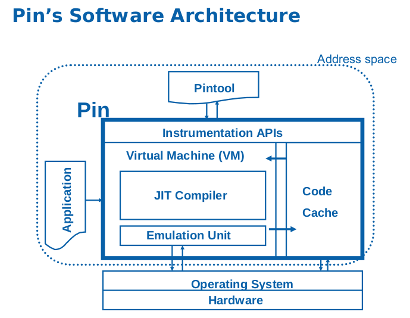

# 5.2.1 Pin 动态二进制插桩

- [插桩技术](#插桩技术)
- [Pin 简介](#pin-简介)
- [Pin 的基本用法](#pin-的基本用法)
- [Pintool 示例分析](#pintool-示例分析)
- [Pintool 编写](#pintool-编写)
- [Pin 在 CTF 中的应用](#pin-在-ctf-中的应用)
- [扩展：Triton](#扩展triton)

## 插桩技术

插桩技术是将额外的代码注入程序中以收集运行时的信息，可分为两种：

源代码插桩（Source Code Instrumentation(SCI)）：额外代码注入到程序源代码中。

示例：

```c
// 原始程序
void sci() {
    int num = 0;
    for (int i=0; i<100; ++i) {
        num += 1;
        if (i == 50) {
            break;
        }
    }
    printf("%d", num);
}
```

```c
// 插桩后的程序
char inst[5];
void sci() {
    int num = 0;
    inst[0] = 1;
    for (int i=0; i<100; ++i) {
        num += 1;
        inst[1] = 1;
        if (i == 50) {
            inst[2] = 1;
            break;
        }
        inst[3] = 1;
    }
    printf("%d", num);
    inst[4] = 1;
}
```

二进制插桩（Binary Instrumentation(BI)）：额外代码注入到二进制可执行文件中。

- 静态二进制插桩：在程序执行前插入额外的代码和数据，生成一个永久改变的可执行文件。
- 动态二进制插桩：在程序运行时实时地插入额外代码和数据，对可执行文件没有任何永久改变。

以上面的函数 `sci` 生成的汇编为例：

原始汇编代码

```text
sci:
  pushl %ebp
  movl  %esp, %ebp
  pushl %ebx
  subl  $20, %esp
  call  __x86.get_pc_thunk.ax
  addl  $_GLOBAL_OFFSET_TABLE_, %eax
  movl  $0, -16(%ebp)
  movl  $0, -12(%ebp)
  jmp   .L2
```

- 插入指令计数代码

  ```text
  sci:
    counter++;
    pushl %ebp
    counter++;
    movl  %esp, %ebp
    counter++;
    pushl %ebx
    counter++;
    subl  $20, %esp
    counter++;
    call  __x86.get_pc_thunk.ax
    counter++;
    addl  $_GLOBAL_OFFSET_TABLE_, %eax
    counter++;
    movl  $0, -16(%ebp)
    counter++;
    movl  $0, -12(%ebp)
    counter++;
    jmp   .L2
  ```

- 插入指令跟踪代码

```text
sci:
  Print(ip)
  pushl %ebp
  Print(ip)
  movl  %esp, %ebp
  Print(ip)
  pushl %ebx
  Print(ip)
  subl  $20, %esp
  Print(ip)
  call  __x86.get_pc_thunk.ax
  Print(ip)
  addl  $_GLOBAL_OFFSET_TABLE_, %eax
  Print(ip)
  movl  $0, -16(%ebp)
  Print(ip)
  movl  $0, -12(%ebp)
  Print(ip)
  jmp   .L
```

## Pin 简介

Pin 是 Intel 公司研发的一个动态二进制插桩框架，可以在二进制程序运行过程中插入各种函数，以监控程序每一步的执行。[官网](https://software.intel.com/en-us/articles/pin-a-dynamic-binary-instrumentation-tool)（目前有 2.x 和 3.x 两个版本，2.x 不能在 Linux 内核 4.x 及以上版本上运行，这里我们选择 3.x）

Pin 具有以下优点：

- 易用
  - 使用动态插桩，不需要源代码、不需要重新编译和链接。
- 可扩展
  - 提供了丰富的 API，可以使用 C/C++ 编写插桩工具（被叫做 Pintools）
- 多平台
  - 支持 x86、x86-64、Itanium、Xscale
  - Windows、Linux、OSX、Android
- 鲁棒性
  - 支持插桩现实世界中的应用：数据库、浏览器等
  - 支持插桩多线程应用
  - 支持信号量
- 高效
  - 在指令代码层面实现编译优化

## Pin 的基本结构和原理

Pin 是一个闭源的框架，由 Pin 和 Pintool 组成。Pin 内部提供 API，用户使用 API 编写可以由 Pin 调用的动态链接库形式的插件，称为 Pintool。



由图可以看出，Pin 由进程级的虚拟机、代码缓存和提供给用户的插桩检测 API 组成。Pin 虚拟机包括 JIT(Just-In-Time) 编译器、模拟执行单元和代码调度三部分，其中核心部分为 JIT 编译器。当 Pin 将待插桩程序加载并获得控制权之后，在调度器的协调下，JIT 编译器负责对二进制文件中的指令进行插桩，动态编译后的代码即包含用户定义的插桩代码。编译后的代码保存在代码缓存中，经调度后交付运行。

程序运行时，Pin 会拦截可执行代码的第一条指令，并为后续指令序列生成新的代码，新代码的生成即按照用户定义的插桩规则在原始指令的前后加入用户代码，通过这些代码可以抛出运行时的各种信息。然后将控制权交给新生成的指令序列，并在虚拟机中运行。当程序进入到新的分支时，Pin 重新获得控制权并为新分支的指令序列生成新的代码。

通常插桩需要的两个组件都在 Pintool 中：

- 插桩代码（Instrumentation code）
  - 在什么位置插入插桩代码
- 分析代码（Analysis code）
  - 在选定的位置要执行的代码

Pintool 采用向 Pin 注册插桩回调函数的方式，对每一个被插桩的代码段，Pin 调用相应的插桩回调函数，观察需要产生的代码，检查它的静态属性，并决定是否需要以及插入分析函数的位置。分析函数会得到插桩函数传入的寄存器状态、内存读写地址、指令对象、指令类型等参数。

- **Instrumentation routines**：仅当事件第一次发生时被调用
- **Analysis routines**：某对象每次被访问时都调用
- **Callbacks**：无论何时当特定事件发生时都调用

## Pin 的基本用法

在 Pin 解压后的目录下，编译一个 Pintool，首先在 `source/tools/` 目录中创建文件夹 `MyPintools`，将 `mypintool.cpp` 复制到 `source/tools/MyPintools` 目录下，然后 `make`：

```text
$ cp mypintools.cpp source/tools/MyPintools
$ cd source/tools/MyPintools
```

对于 32 位架构，使用 `TARGET=ia32`：

```text
[MyPintools]$ make obj-ia32/mypintool.so TARGET=ia32
```

对于 64 位架构，使用 `TARGET=intel64`：

```text
[MyPintools]$ make obj-intel64/mypintool.so TARGET=intel64
```

启动并插桩一个应用程序：

```text
[MyPintools]$ ../../../pin -t obj-intel64/mypintools.so -- application
```

其中 `pin` 是插桩引擎，由 Pin 的开发者提供；`pintool.so` 是插桩工具，由用户自己编写并编译。

绑定并插桩一个正在运行的程序：

```text
[MyPintools]$ ../../../pin -t obj-intel64/mypintools.so -pid 1234
```

## Pintool 示例分析

Pin 提供了一些 Pintool 的示例，下面我们分析一下用户手册中介绍的指令计数工具，可以在 `source/tools/ManualExamples/inscount0.cpp` 中找到。

```c
#include <iostream>
#include <fstream>
#include "pin.H"

ofstream OutFile;

// The running count of instructions is kept here
// make it static to help the compiler optimize docount
static UINT64 icount = 0;

// This function is called before every instruction is executed
VOID docount() { icount++; }

// Pin calls this function every time a new instruction is encountered
VOID Instruction(INS ins, VOID *v)
{
    // Insert a call to docount before every instruction, no arguments are passed
    INS_InsertCall(ins, IPOINT_BEFORE, (AFUNPTR)docount, IARG_END);
}

KNOB<string> KnobOutputFile(KNOB_MODE_WRITEONCE, "pintool",
    "o", "inscount.out", "specify output file name");

// This function is called when the application exits
VOID Fini(INT32 code, VOID *v)
{
    // Write to a file since cout and cerr maybe closed by the application
    OutFile.setf(ios::showbase);
    OutFile << "Count " << icount << endl;
    OutFile.close();
}

/* ===================================================================== */
/* Print Help Message                                                    */
/* ===================================================================== */

INT32 Usage()
{
    cerr << "This tool counts the number of dynamic instructions executed" << endl;
    cerr << endl << KNOB_BASE::StringKnobSummary() << endl;
    return -1;
}

/* ===================================================================== */
/* Main                                                                  */
/* ===================================================================== */
/*   argc, argv are the entire command line: pin -t <toolname> -- ...    */
/* ===================================================================== */

int main(int argc, char * argv[])
{
    // Initialize pin
    if (PIN_Init(argc, argv)) return Usage();

    OutFile.open(KnobOutputFile.Value().c_str());

    // Register Instruction to be called to instrument instructions
    INS_AddInstrumentFunction(Instruction, 0);

    // Register Fini to be called when the application exits
    PIN_AddFiniFunction(Fini, 0);

    // Start the program, never returns
    PIN_StartProgram();

    return 0;
}
```

执行流程如下：

- 在主函数 `main` 中：
  - 初始化 `PIN_Init()`，注册指令粒度的回调函数 `INS_AddInstrumentFunction(Instruction, 0)`，被注册插桩函数名为 `Instruction`
  - 注册完成函数（常用于最后输出结果）
  - 启动 Pin 执行
- 在每条指令之前（`IPOINT_BEFORE`）执行分析函数 `docount()`，功能是对全局变量递增计数。
- 执行完成函数 `Fini()`，输出计数结果到文件。

由于我当前使用的系统和内核版本过新，Pin 暂时还未支持，使用时需要加上 `-ifeellucky` 参数（在最新的 pin 3.5 中似乎不需要这个参数了），`-o` 参数将运行结果输出到文件。运行程序：

```text
[ManualExamples]$ uname -a
Linux manjaro 4.11.5-1-ARCH #1 SMP PREEMPT Wed Jun 14 16:19:27 CEST 2017 x86_64 GNU/Linux
[ManualExamples]$ ../../../pin -ifeellucky -t obj-intel64/inscount0.so -o inscount0.log -- /bin/ls
[ManualExamples]$ cat inscount0.log
Count 528090
```

其它一些自带插件及功能如下：

| 插件名 | 功能 |
| -- | --- |
| inscount | 统计执行的指令数量，输出到 inscount.out 文件 |
| itrace | 记录执行指令的 eip |
| malloctrace | 记录 malloc 和 free 的调用情况 |
| pinatrace | 记录读写内存的位置和值 |
| proccount | 统计 Procedure 的信息，包括名称、镜像、地址、指令数 |
| w_malloctrace | 记录 RtlAllocateHeap 的调用情况 |

## Pintool 编写

### main 函数的编写

Pintool 的入口为 `main` 函数，通常需要完成下面的功能：

- 初始化 Pin 系统环境：
  - `BOOL LEVEL_PINCLIENT::PIN_Init(INT32 argc, CHAR** argv)`
- 初始化符号表（如果需要调用程序符号信息，通常是指令粒度以上）：
  - `VOID LEVEL_PINCLIENT::PIN_InitSymbols()`
- 初始化同步变量：
  - Pin 提供了自己的锁和线程管理 API 给 Pintool 使用。当 Pintool 对多线程程序进行二进制检测，需要用到全局变量时，需要利用 Pin 提供的锁（Lock）机制，使得全局变量的访问互斥。编写时在全局变量中声明锁变量并在 `main` 函数中对锁进行初始化：`VOID LEVEL_BASE::InitLock(PIN_LOCK *lock)`。在插桩函数和分析函数中，锁的使用方式如下，应注意在全局变量使用完毕后释放锁，避免死锁的发生：

  ```text
  GetLock(&thread_lock, threadid);
  // 访问全局变量
  ReleaseLock(&thread_lock);
  ```

- 注册不同粒度的回调函数：
  - TRACE（轨迹）粒度
    - TRACE 表示一个单入口、多出口的指令序列的数据结构。Pin 将 TRACE 分为若干基本块 BBL（Basic Block），一个 BLL 是一个单入口、单出口的指令序列。TRACE 在指令发生跳转时进行插入，进一步进行基本块分析，常用于记录程序执行序列。注册 TRACE 粒度插桩函数原型为：
    ```text
    TRACE_AddInstrumentFunction(TRACE_INSTRUMENT_CALLBACK fun, VOID *val)
    ```
  - IMG（镜像）粒度
    - IMG 表示整个被加载进内存的二进制可执行模块（如可执行文件、动态链接库等）类型的数据结构。每次被插桩进程在执行过程中加载了镜像类型文件时，就会被当做 IMG 类型处理。注册插桩 IMG 粒度加载和卸载的函数原型：
    ```text
    IMG_AddInstrumentFunction(IMAGECALLBACK fun, VOID *v)
    IMG_AddUnloadFunction(IMAGECALLBACK fun, VOID *v)
    ```
  - RTN（例程）粒度
    - RTN 代表了由面向过程程序语言编译器产生的函数／例成／过程。Pin 使用符号表来查找例程，即需要插入的位置，需要调用内置的初始化表函数 `PIN_InitSymbols()`。必须使用 `PIN_InitSymbols` 使得符号表信息可用。插桩 RTN 粒度函数原型：
    ```text
    RTN_AddInstrumentFunction(RTN_INSTRUMENT_CALLBACK fun, VOID *val)
    ```
  - INS（指令）粒度
    - INS 代表一条指令对应的数据结构，INS 是最小的粒度。INS 的代码插桩是在指令执行前、后插入附加代码，会导致程序执行缓慢。插桩 INS 粒度函数原型：
    ```text
    INS_AddInstrumentFunction(INS_INSTRUMENT_CALLBACK fun, VOID *val)
    ```
- 注册结束回调函数
  - 插桩程序运行结束时，可以调用结束函数来释放不再使用的资源，输出统计结果等。注册结束回调函数：

  ```text
  VOID PIN_AddFiniFunction(FINI_CALLBACK fun, VOID *val)
  ```

- 启动 Pin 虚拟机进行插桩：
  - 最后调用 `VOID PIN_StartProgram()` 启动程序的运行。

### 插桩、分析函数的编写

在 `main` 函数中注册插桩回调函数后，Pin 虚拟机将在运行过程中对该种粒度的插桩函数对象选择性的进行插桩。所谓选择性，就是根据被插桩对象的性质和条件，选择性的提取或修改程序执行过程中的信息。

各种粒度的插桩函数：

- **INS**
  - `VOID LEVEL_PINCLIENT::INS_InsertCall(INS ins, IPOINT action, AFUNPTR funptr, ...)`
- **RTN**
  - `VOID LEVEL_PINCLIENT::RTN_InsertCall(RTN rtn, IPOINT action, AFUNPTR funptr, ...)`
- **TRACE**
  - `VOID LEVEL_PINCLIENT::TRACE_InsertCall(TRACE trace, IPOINT action, AFUNPTR funptr, ...)`
- **BBL**
  - `VOID LEVEL_PINCLIENT::BBL_InsertCall(BBL bbl, IPOINT action, AFUNPTR funptr, ...)`

其中 `funptr` 为用户自定义的分析函数，函数参数与 `...` 参数列表传入的参数个数相同，参数列表以 `IARG_END` 标记结束。

## Pin 在 CTF 中的应用

由于程序具有循环、分支等结构，每次运行时执行的指令数量不一定相同，于是我们可是使用 Pin 来统计执行指令的数量，从而对程序进行分析。特别是对一些使用特殊指令集和虚拟机，或者运用了反调试等技术的程序来说，相对于静态分析去死磕，动态插桩技术是一个比较好的选择。

我们先举一个例子，[源码](../src/others/5.2_pin/passwd.c)如下：

```c
#include<stdio.h>
#include<string.h>
void main() {
    char pwd[] = "abc123";
    char str[128];
    int flag = 1;
    scanf("%s", str);
    for (int i=0; i<=strlen(pwd); i++) {
        if (pwd[i]!=str[i] || str[i]=='\0'&&pwd[i]!='\0' || str[i]!='\0'&&pwd[i]=='\0') {
            flag = 0;
        }
    }
    if (flag==0) {
        printf("Bad!\n");
    } else {
        printf("Good!\n");
    }
}
```

这段代码要求用户输入密码，然后逐字符进行判断。

使用前面分析的指令计数的 inscount0 Pintool，我们先测试下密码的长度：

```text
[ManualExamples]$ echo x | ../../../pin -ifeellucky -t obj-intel64/inscount0.so -o inscount.out -- ~/a.out ; cat inscount.out
Bad!
Count 152667
[ManualExamples]$ echo xx | ../../../pin -ifeellucky -t obj-intel64/inscount0.so -o inscount.out -- ~/a.out ; cat inscount.out
Bad!
Count 152688
[ManualExamples]$ echo xxx | ../../../pin -ifeellucky -t obj-intel64/inscount0.so -o inscount.out -- ~/a.out ; cat inscount.out
Bad!
Count 152709
[ManualExamples]$ echo xxxx | ../../../pin -ifeellucky -t obj-intel64/inscount0.so -o inscount.out -- ~/a.out ; cat inscount.out
Bad!
Count 152730
[ManualExamples]$ echo xxxxx | ../../../pin -ifeellucky -t obj-intel64/inscount0.so -o inscount.out -- ~/a.out ; cat inscount.out
Bad!
Count 152751
[ManualExamples]$ echo xxxxxx | ../../../pin -ifeellucky -t obj-intel64/inscount0.so -o inscount.out -- ~/a.out ; cat inscount.out
Bad!
Count 152772
[ManualExamples]$ echo xxxxxxx | ../../../pin -ifeellucky -t obj-intel64/inscount0.so -o inscount.out -- ~/a.out ; cat inscount.out
Bad!
Count 152779
```

我们输入的密码位数从 1 到 7，可以看到输入位数为 6 位或更少时，计数值之差都是 21，而输入 7 位密码时，差值仅为 7，不等于 21。于是我们知道程序密码为 6 位。接下来我们更改密码的第一位：

```text
[ManualExamples]$ echo axxxxx | ../../../pin -ifeellucky -t obj-intel64/inscount0.so -o inscount.out -- ~/a.out ; cat inscount.out
Bad!
Count 152786
[ManualExamples]$ echo bxxxxx | ../../../pin -ifeellucky -t obj-intel64/inscount0.so -o inscount.out -- ~/a.out ; cat inscount.out
Bad!
Count 152772
[ManualExamples]$ echo cxxxxx | ../../../pin -ifeellucky -t obj-intel64/inscount0.so -o inscount.out -- ~/a.out ; cat inscount.out
Bad!
Count 152772
[ManualExamples]$ echo dxxxxx | ../../../pin -ifeellucky -t obj-intel64/inscount0.so -o inscount.out -- ~/a.out ; cat inscount.out
Bad!
Count 152772
```

很明显，程序密码第一位是 `a`，接着尝试第二位：

```text
[ManualExamples]$ echo aaxxxx | ../../../pin -ifeellucky -t obj-intel64/inscount0.so -o inscount.out -- ~/a.out ; cat inscount.out
Bad!
Count 152786
[ManualExamples]$ echo abxxxx | ../../../pin -ifeellucky -t obj-intel64/inscount0.so -o inscount.out -- ~/a.out ; cat inscount.out
Bad!
Count 152800
[ManualExamples]$ echo acxxxx | ../../../pin -ifeellucky -t obj-intel64/inscount0.so -o inscount.out -- ~/a.out ; cat inscount.out
Bad!
Count 152786
[ManualExamples]$ echo adxxxx | ../../../pin -ifeellucky -t obj-intel64/inscount0.so -o inscount.out -- ~/a.out ; cat inscount.out
Bad!
Count 152786
```

第二位是 `b`，同时我们还可以发现，每一位正确与错误的指令计数之差均为 14。同理，我们就可以暴力破解出密码，但这种暴力破解方式大大减少了次数，提高了效率。破解脚本可查看参考资料。

### 参考资料

- [A binary analysis, count me if you can](http://shell-storm.org/blog/A-binary-analysis-count-me-if-you-can/)
- [pintool2](https://github.com/sebastiendamaye/pintool2)
- [Pin 3.5 User Guide](https://software.intel.com/sites/landingpage/pintool/docs/97503/Pin/html/)

## 扩展：Triton

Triton 是一个二进制执行框架，其具有两个重要的优点，一是可以使用 Python 调用 Pin，二是支持符号执行。[官网](https://triton.quarkslab.com/)
