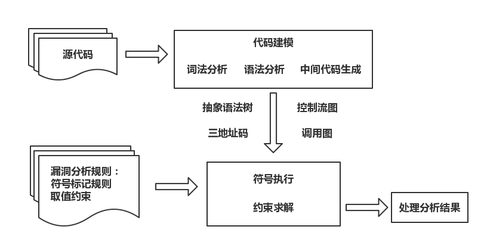

# 5.3 符号执行

- [基本原理](#基本原理)
- [方法实现](#方法实现)
- [实例分析](#实例分析)
- [参考资料](#参考资料)

## 基本原理

符号执行起初应用于基于源代码的安全检测中，它通过符号表达式来模拟程序的执行，将程序的输出表示成包含这些符号的逻辑或数学表达式，从而进行语义分析。

符号执行可分为过程内分析和过程间分析（或全局分析）。过程内分析是指只对单个函数的代码进行分析，过程间分析是指在当前函数入口点要考虑当前函数的调用信息和环境信息等。当符号执行用于代码漏洞静态检测时，更多的是进行程序全局的分析且更侧重代码的安全性相关的检测。将符号执行与约束求解器结合使用来产生测试用例是一个比较热门的研究方向。（关于约束求解我们会在另外的章节中详细讲解）

符号执行具有代价小、效率高的有点，但缺点也是很明显的。比如路径状态空间的爆炸问题，由于每一个条件分支语句都可能会使当前路径再分出一条新的路径，特别是遇到循环分支时，每增加一次循环都将增加一条新路径，因此这种增长是指数级的。在实践中，通常采用一些这种的办法来解决路径爆炸问题，比如规定每个过程内的分析路径的数目上限，或者设置时间上限和内存上限等来进行缓解。

**动态符号执行**将符号执行和具体执行结合起来，并交替使用静态分析和动态分析，在具体执行的同时堆执行到的指令进行符号化执行。

每一个符号执行的路径都是一个 true 和 false 组成的序列，其中第 i 个 true（或false）表示在该路径的执行中遇到的第 i 个条件语句。一个程序所有的执行路径可以用执行树（Execution Tree）表示。举一个例子：

```c
int twice(int v) {
    return 2*v;
}

void testme(int x, int y) {
    z = twice(y);
    if (z == x) {
        if (x > y+10) {
            ERROR;
        }
    }
}

int main() {
    x = sym_input();
    y = sym_input();
    testme(x, y);
    return 0;
}
```

这段代码的执行树如下图所示，图中的三条路径分别可以被输入 {x = 0, y = 1}、{x = 2, y = 1} 和 {x = 30, y = 15} 触发：


符号执行中维护了符号状态 σ 和符号路径约束 PC，其中 σ 表示变量到符号表达式的映射，PC 是符号表示的不含量词的一阶表达式。在符号执行的初始化阶段，σ 被初始化为空映射，而 PC 被初始化为 true，并随着符号执行的过程不断变化。在对程序的某一路径分支进行符号执行的终点，把 PC 输入约束求解器以获得求解。如果程序把生成的具体值作为输入执行，它将会和符号执行运行在同一路径，并且以同一种方式结束。

例如上面的程序中 σ 和 PC 变化过程如下：

```text
开始：  σ = NULL                    PC = true
第6行： σ = x->x0, y->y0, z->2y0    PC = true
遇到if(e)then{}else{}：σ = x->x0, y->y0    then分支：PC = PC∧σ(e) else分支：PC' = PC∧¬σ(e)
```

于是我们发现，在符号执行中，对于分析过程所遇到的程序中带有条件的控制转移语句，可以利用变量的符号表达式将控制转移语句中的条件转化为对符号取值的约束，通过分析约束是否满足来判断程序的某条路径是否可行。这样的过程也叫作路径的可行性分析，它是符号执行的关键部分，我们常常将符号取值约束的求解问题转化为一阶逻辑的可满足性问题，从而使用可满足性模理论（SMT）求解器对约束进行求解。

### 检测程序漏洞

程序中变量的取值可以被表示为符号值和常量组成的计算表达式，而一些程序漏洞可以表现为某些相关变量的取值不满足相应的约束，这时通过判断表示变量取值的表达式是否可以满足相应的约束，就可以判断程序是否存在相应的漏洞。

使用符号执行检测程序漏洞的原理如下图所示：



举个数组越界的例子：

```c
int a[10];
scanf("%d", &i);
if (i > 0) {
    if (i > 10)
        i = i % 10;
    a[i] = 1;
}
```

首先，将表示程序输入的变量 i 用符号 x 表示其取值，通过分别对 if 条件语句的两条分支进行分析，可以发现在赋值语句 a[i] = 1 处，当 x 的取值大于 0、小于 10 时，变量 i 的取值为 x，当 x 的取值大于 10 时，变量 i 的取值为 x % 10。通过分析约束 `(x>10∨x<10)∧(0<x∧x<10)` 和约束 `(x%10>10∨x%10<10)∧x>10` 的可满足性，可以发现漏洞的约束是不可满足的，于是认为漏洞不存在。

### 构造测试用例

在符号执行的分析过程中，可以不断地获得程序可能执行路径上对程序输入的约束，在分析停止时，利用获得的对程序输入的一系列限制条件，构造满足限制条件的程序输入作为测试用例。

在模拟程序执行并收集路径条件的过程中，如果同时收集可引起程序异常的符号取值的限制条件，并将异常条件和路径条件一起考虑，精心构造满足条件的测试用例作为程序的输入，那么在使用这样的输入的情况下，程序很可能在运行时出现异常。

## 方法实现

使用符号执行技术进行漏洞分析，首先对程序代码进行基本的解析，获得程序代码的中间表示。由于符号执行过程常常是路径敏感的分析过程，在代码解析之后，常常需要构建描述程序路径的控制流图和调用图等。漏洞分析分析的过程主要包括符号执行和约束求解两个部分，并交替执行。通过使用符号执行，将变量的取值表示为符号和常量的计算表达式，将路径条件和程序存在漏洞的条件表示为符号取值的约束。约束求解过程一方面判断路径条件是否可满足，根据判断结果对分析的路径进行取舍，另一方面检查程序存在漏洞的条件是否可以满足。符号执行的过程常常需要利用一定的漏洞分析规则，这些规则描述了在什么情况下需要引入符号，以及在什么情况下程序可能存在漏洞等信息。

### 正向的符号执行

正向的符号执行用于全面地对程序代码进行分析，可分为过程内分析和过程间分析。

**过程内分析**逐句地地过程内的程序语句进行分析：

- 声明语句分析
  - 通过声明语句，变量被分配到一定大小的存储空间，在检测缓冲区溢出漏洞时，需要记录这些存储空间的大小。
  - 分析声明语句的另一个目的是发现程序中的全局变量，记录全局变量的作用范围，这将有助于过程间分析。
- 赋值语句分析
  - 将赋值变量的取值表示为符号和常量的表达式。
  - 在检查程序漏洞时，常常对数组下标进行检查，判断对数组元素的访问是否存在越界。
  - 对于和指针变量有关的赋值语句，不仅需要考虑指针变量本身的取值，还需要考虑其指向的内容。
- 控制转移语句分析
  - 将路径条件表示为符号取值的约束并进行求解，可以判断路径是否可行，进而对待分析的路径进行取舍。
- 调用语句分析
  - 一些过程调用语句会进入符号，在分析过程中，将表示程序输入的变量的取值用符号表示，而程序可以通过过程调用接收程序的输入。对于指针变量，命令行参数同样使用符号表示其取值。
  - 通过过程调用语句，变量被分配的存储空间的大小常常是在分析时所需要记录的。
  - 对于一些关键的过程调用，需要对其使用情况进行检查，如 strcpy，需要检查参数以判断是否存在缓冲区溢出。
  - 对于一些库函数或者系统调用等非程序代码实现的过程，用摘要描述所关心的分析过程和结果，可以避免重复分析。

**过程间分析**常常需要考虑按照怎样的顺序分析程序语句，如深度优先遍历和广度优先遍历。另外在进行分析时，需要先确定一个分析的起始点，可以是程序入口点、程序中某个过程的起始点或者某个特定的程序点。

### 逆向的符号执行

逆向的符号执行用于对可能存在漏洞的部分代码进行有针对性的分析。通过分析这些程序语句，可以得到变量取值满足怎样的约束表示程序存在漏洞，将这样的约束记录下来，在之后的分析中，通过逆向分析判断程序存在漏洞的约束是否是可以满足的。通过不断地记录并分析路径条件，检查程序是否可能存在带有程序漏洞的路径。

例如下面的代码片段：

```c
if (j > -6) {
    a = i;
    i = j + 6;
    if (i < 15) {
        if (flag == 0) {
            a [i] = 1;
        }
    }
}
```

我们可以从语句 `a[i]=1` 开始，逆推上去，判断 `i<0∨i>len(a)` 是否可以满足，直到碰到语句 `if(i<15)` 时，存在漏洞的约束被更新为 `i<15∨flag==0∨i<0∨i>len(a)`，如果 `len(a)≥15`，则通过对约束进行求解可知当前约束是不满足的，这时停止对该路径的分析。否则如果 `len(a)<15`，则不能判断程序是否存在漏洞，分析将继续。

如果在碰到赋值语句且赋值变量和路径条件相关时，可以根据赋值语句所示的变量取值之间的关系更新当前路径条件。例如上面的 `i=j+6`，可以将其带入到路径条件中，得到 `j+6<15∨flag==0∨j+6<0∨j+6>len(a)`。而无关的赋值，如 `a=i`，则可以忽略它。然而变量之间的别名关系常常会对分析产生影响，所以可以在逆向分析之前，对程序进行别名分析或者指向分析。

逆向符号执行的过程间分析：

- 当过程内分析中遇到不能根据语义进行处理的过程，这些过程是程序实现的，并且影响所关心的存在漏洞的约束时
  - 通常选择直接对调用的过程进行过程内分析。
- 当过程内分析已经到达过程的入口点，且仍然无法判断存在漏洞的约束是否一定不可满足时
  - 可以根据调用图或其他调用关系找到调用该过程的过程，然后从调用点开始继续逆向分析。

## 实例分析

我们来看一段缓冲区溢出漏洞的例子，分析规则和漏洞代码如下：

```text
array[x];   len(array) = x
array[y];   0 < i < len(array)
```

```c
#define ISDN_MAX_DRIVERS 32
#define ISDN_CHANNELS 64

static struct isdn driver *drivers[ISDN_MAX_DRIVERS];
static struct isdn driver *get_drv_by_nr(int di) {
    unsigned long flags;
    struct isdn driver *drv;
    if (di < 0)
        return NULL;
    spin_lock_irqsave(&drivers lock, flags);
    drv = drivers[di];
    ......
}
static struct isdn slot *get_slot_by_minor(int minor) {
    int di, ch;
    struct isdn driver *drv;
    for (di = 0; di < ISDN_CHANNELS; di++) {
        drv = get_drv_by_nr(di);
        ......
    }
}
```

漏洞很明显，在语句 `drv = drivers[di]` 中，`di` 可能会超出数组上界。

代码片段的过程调用关系如下：

```text
--> get_slot_by_minor() --> get_drv_by_nr() --> spin_lock_irqsave()
```

我们首先用正向的分析方法，过程如下：

- 将函数 `get_drv_by_nr()` 的参数 `di` 作为符号处理，用符号 `a` 表示其值。
- 接下来声明了两个变量，但未对其赋值，所以不进行处理。
- 语句 `if(di<0)` 对变量 `di` 加以限制，这里记录 `a<0` 时，函数返回空。然后遍历语句的 false 分支。
- `spin_lock_irqsave()` 函数调用语句，使用其摘要进行分析。
- 然后是数组访问操作，是程序的检查点，根据分析规则，将 `a` 的取值范围限定在 `0≤a＜32`。结合路径条件得到约束，生成摘要 `0≤a＜32` 程序是安全的。
- 当函数 `get_drv_by_nr()` 分析完成后，将符号 `a` 替换为参数 `di`。生成摘要 `di<0` 时程序返回空，`0≤di<32` 时，程序安全。
- 然后分析函数 `get_slot_by_minor()`，首先记录循环变量 `di` 的范围是 `0≤di<64`。
- 接下来通过分析 `get_drv_by_nr()` 的摘要，`di≥32` 时存在漏洞，于是得到约束 `0≤di<64∧di≥32`，求解约束得 `di` 为 32 时满足约束条件，程序存在漏洞。

接下来采用逆向的分析方法，过程如下：

- 从 `drv = drivers[di]` 开始，根据规则得到约束 `0≤di<32`。而 `di≥32∨di<0` 程序存在漏洞。
- 上一条语句与 `di` 无关，跳过。
- 补充路径条件 `di≥0`，此时约束为 `(di≥32∨di<0)∧di≥0`，即 `di≥32` 时存在漏洞。
- 继续向上，直到函数入口点，此时分析调用它的函数 `get_slot_by_minor()`，得到约束 `0≤di<64`，求解约束 `0≤di<64∧di≥32`，发现可满足，认为程序存在漏洞。

## 参考资料

- [History of symbolic execution](https://github.com/enzet/symbolic-execution)
