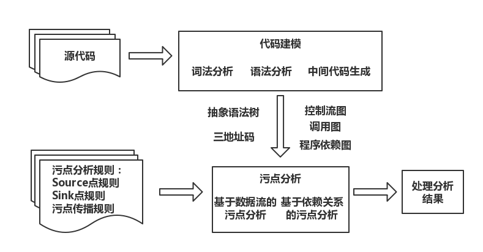

# 5.5 污点分析

- [污点分析](#污点分析)
  - [基本原理](#基本原理)
  - [方法实现](#方法实现)
  - [实例分析](#实例分析)
- [动态污点分析](#动态污点分析)
  - [基本原理](#基本原理)
  - [方法实现](#方法实现)
  - [实例分析](#实例分析)

## 污点分析

### 基本原理

污点分析是一种跟踪并分析污点信息在程序中流动的技术。在漏洞分析中，使用污点分析技术将所感兴趣的数据（通常来自程序的外部输入）标记为污点数据，然后通过跟踪和污点数据相关的信息的流向，可以知道它们是否会影响某些关键的程序操作，进而挖掘程序漏洞。即将程序是否存在某种漏洞的问题转化为污点信息是否会被 Sink 点上的操作所使用的问题。

污点分析常常包括以下几个部分：

- 识别污点信息在程序中的产生点（Source点）并对污点信息进行标记
- 利用特定的规则跟踪分析污点信息在程序中的传播过程
- 在一些关键的程序点（Sink点）检测关键的操作是否会受到污点信息的影响

举个例子：

```text
[...]
scanf("%d", &x);    // Source 点，输入数据被标记为污点信息，并且认为变量 x 是污染的
[...]
y = x + k;          // 如果二元操作的操作数是污染的，那么操作结果也是污染的，所以变量 y 也是污染的
[...]
x = 0;              // 如果一个被污染的变量被赋值为一个常数，那么认为它是未污染的，所以 x 转变成未污染的
[...]
while (i < y)       // Sink 点，如果规定循环的次数不能受程序输入的影响，那么需要检查 y 是否被污染
```

然而污点信息不仅可以通过数据依赖传播，还可以通过控制依赖传播。我们将通过数据依赖传播的信息流称为显式信息流，将通过控制依赖传播的信息流称为隐式信息流。

举个例子：

```c
if (x > 0)
    y = 1;
else
    y = 0;
```

变量 y 的取值依赖于变量 x 的取值，如果变量 x 是污染的，那么变量 y 也应该是污染的。

通常我们将使用污点分析可以检测的程序漏洞称为污点类型的漏洞，例如 SQL 注入漏洞：

```java
String user = getUser();
String pass = getPass();
String sqlQuery = "select * from login where user='" + user + "' and pass='" + pass + "'";
Statement stam = con.createStatement();
ResultSetrs = stam.executeQuery(sqlQuery);
if (rs.next())
    success = true;
```

在进行污点分析时，将变量 user 和 pass 标记为污染的，由于变量 sqlQuery 的值受到 user 和 pass 的影响，所以将 sqlQuery 也标记为污染的。程序将变量 sqlQuery 作为参数构造 SQL 操作语句，于是可以判定程序存在 SQL 注入漏洞。

使用污点分析检测程序漏洞的工作原理如下图所示：



- 基于数据流的污点分析。在不考虑隐式信息流的情况下，可以将污点分析看做针对污点数据的数据流分析。根据污点传播规则跟踪污点信息或者标记路径上的变量污染情况，进而检查污点信息是否影响敏感操作。
- 基于依赖关系的污点分析。考虑隐式信息流，在分析过程中，根据程序中的语句或者指令之间的依赖关系，检查 Sink 点处敏感操作是否依赖于 Source 点处接收污点信息的操作。

### 方法实现

静态污点分析系统首先对程序代码进行解析，获得程序代码的中间表示，然后在中间表示的基础上对程序代码进行控制流分析等辅助分析，以获得需要的控制流图、调用图等。在辅助分析的过程中，系统可以利用污点分析规则在中间表示上识别程序中的 Source 点和 Sink 点。最后检测系统根据污点分析规则，利用静态污点分析检查程序是否存在污点类型的漏洞。

#### 基于数据流的污点分析

在基于数据流的污点分析中，常常需要一些辅助分析技术，例如别名分析、取值分析等，来提高分析精度。辅助分析和污点分析交替进行，通常沿着程序路径的方向分析污点信息的流向，检查 Source 点处程序接收的污点信息是否会影响到 Sink 点处的敏感操作。

**过程内的分析**中，按照一定的顺序分析过程内的每一条语句或者指令，进而分析污点信息的流向。

- 记录污点信息。在静态分析层面，程序变量的污染情况为主要关注对象。为记录污染信息，通常为变量添加一个污染标签。最简单的就是一个布尔型变量，表示变量是否被污染。更复杂的标签还可以记录变量的污染信息来自哪些 Source 点，甚至精确到 Source 点接收数据的哪一部分。当然也可以不使用污染标签，这时我们通过对变量进行跟踪的方式达到分析污点信息流向的目的。例如使用栈或者队列来记录被污染的变量。
- 程序语句的分析。在确定如何记录污染信息后，将对程序语句进行静态分析。通常我们主要关注赋值语句、控制转移语句以及过程调用语句三类。
  - 赋值语句。
    - 对于简单的赋值语句，形如 `a = b` 这样的，记录语句左端的变量和右端的变量具有相同的污染状态。程序中的常量通常认为是未污染的，如果一个变量被赋值为常量，在不考虑隐式信息流的情况下，认为变量的状态在赋值后是未污染的。
    - 对于形如 `a = b + c` 这样带有二元操作的赋值语句，通常规定如果右端的操作数只要有一个是被污染的，则左端的变量是污染的（除非右端计算结果为常量）。
    - 对于和数组元素相关的赋值，如果可以通过静态分析确定数组下标的取值或者取值范围，那么就可以精确地判断数组中哪个或哪些元素是污染的。但通常静态分析不能确定一个变量是污染的，那么就简单地认为整个数组都是污染的。
    - 对于包含字段或者包含指针操作的赋值语句，常常需要用到指向分析的分析结果。
  - 控制转移语句。
    - 在分析条件控制转移语句时，首先考虑语句中的路径条件可能是包含对污点数据的限制，在实际分析中常常需要识别这种限制污点数据的条件，以判断这些限制条件是否足够包含程序不会受到攻击。如果得出路径条件的限制是足够的，那么可以将相应的变量标记为未污染的。
    - 对于循环语句，通常规定循环变量的取值范围不能受到输入的影响。例如在语句 `for (i = 1; i < k; i++){}` 中，可以规定循环的上界 k 不能是污染的。
  - 过程调用语句。
    - 可以使用过程间的分析或者直接应用过程摘要进行分析。污点分析所使用的过程摘要主要描述怎样改变与该过程相关的变量的污染状态，以及对哪些变量的污染状态进行检测。这些变量可以是过程使用的参数、参数的字段或者过程的返回值等。例如在语句 `flag = obj.method(str);` 中，str 是污染的，那么通过过程间的分析，将变量 obj 的字段 str 标记为污染的，而记录方法的返回值的变量 flag 标记为未污染的。
    - 在实际的过程间分析中，可以对已经分析过的过程构建过程摘要。例如前面的语句，其过程摘要描述为：方法 method 的参数污染状态决定其接收对象的实例域 str 的污染状态，并且它的返回值是未受污染的。那么下一次分析需要时，就可以直接应用摘要进行分析。
- 代码的遍历。一般情况下，常常使用流敏感的方式或者路径敏感的方式进行遍历，并分析过程中的代码。如果使用流敏感的方式，可以通过对不同路径上的分析结果进行汇集，以发现程序中的数据净化规则。如果使用路径敏感的分析方式，则需要关注路径条件，如果路径条件中涉及对污染变量取值的限制，可认为路径条件对污染数据进行了净化，还可以将分析路径条件对污染数据的限制进行记录，如果在一条程序路径上，这些限制足够保证数据不会被攻击者利用，就可以将相应的变量标记为未污染的。

**过程间的分析**与数据流过程间分析类似，使用自底向上的分析方法，分析调用图中的每一个过程，进而对程序进行整体的分析。

#### 基于依赖关系的污点分析

在基于依赖关系的污点分析中，首先利用程序的中间表示、控制流图和过程调用图构造程序完整的或者局部的程序的依赖关系。在分析程序依赖关系后，根据污点分析规则，检测 Sink 点处敏感操作是否依赖于 Source 点。

分析程序依赖关系的过程可以看做是构建程序依赖图的过程。程序依赖图是一个有向图。它的节点是程序语句，它的有向边表示程序语句之间的依赖关系。程序依赖图的有向边常常包括数据依赖边和控制依赖边。在构建有一定规模的程序的依赖图时，需要按需地构建程序依赖关系，并且优先考虑和污点信息相关的程序代码。

### 实例分析

在使用污点分析方法检测程序漏洞时，污点数据相关的程序漏洞是主要关注对象，如 SQL 注入漏洞、命令注入漏洞和跨站脚本漏洞等。

下面是一个存在 SQL 注入漏洞 ASP 程序的例子：

```asp
<%
    Set pwd = "bar"
    Set sql1 = "SELECT companyname FROM " & Request.Cookies("hello")
    Set sql2 = Request.QueryString("foo")
    MySqlStuff pwd, sql1, sql2
    Sub MySqlStuff(password, cmd1, cmd2)
    Set conn = Server.CreateObject("ADODB.Connection")
    conn.Provider = "Microsoft.Jet.OLEDB.4.0"
    conn.Open "c:/webdata/foo.mdb", "foo", password
    Set rs = conn.Execute(cmd2)
    Set rs = Server.CreateObject("ADODB.recordset")
    rs.Open cmd1, conn
    End Sub
%>
```

首先对这段代码表示为一种三地址码的形式，例如第 3 行可以表示为：

```text
a = "SELECT companyname FROM "
b = "hello"
param0 Request
param1 b
callCookies
return c
sql1 = a & c
```

解析完毕后，需要对程序代码进行控制流分析，这里只包含了一个调用关系（第 5 行）。

接下来，需要识别程序中的 Source 点和 Sink 点以及初始的被污染的数据。

具体的分析过程如下：

- 调用 Request.Cookies("hello") 的返回结果是污染的，所以变量 sql1 也是污染的。
- 调用 Request.QueryString("foo") 的返回结果 sql2 是污染的。
- 函数 MySqlStuff 被调用，它的参数 sql1，sql2 都是污染的。分了分析函数的处理过程，根据第 6 行函数的声明，标记其参数 cmd1，cmd2 是污染的。
- 第 10 行是程序的 Sink 点，函数 conn.Execute 执行 SQL 操作，其参数 cmd2 是污染的，进而发现污染数据从 Source 点传播到 Sink 点。因此，认为程序存在 SQL 注入漏洞

## 动态污点分析

### 动态污点分析的基本原理

动态污点分析是在程序运行的基础上，对数据流或控制流进行监控，从而实现对数据在内存中的显式传播、数据误用等进行跟踪和检测。动态污点分析与静态污点分析的唯一区别在于静态污点分析技术在检测时并不真正运行程序，而是通过模拟程序的执行过程来传播污点标记，而动态污点分析技术需要运行程序，同时实时传播并检测污点标记。

动态污点分析技术可分为三个部分：

- 污点数据标记：程序攻击面是程序接受输入数据的接口集，一般由程序入口点和外部函数调用组成。在污点分析中，来自外部的输入数据会被标记为污点数据。根据输入数据来源的不同，可分为三类：网络输入、文件输入和输入设备输入。
- 污点动态跟踪：在污点数据标记的基础上，对进程进行指令粒度的动态跟踪分析，分析每一条指令的效果，直至覆盖整个程序的运行过程，跟踪数据流的传播。
  - 动态污点跟踪通常基于以下三种机制
    - 动态代码插桩：可以跟踪单个进程的污点数据流动，通过在被分析程序中插入分析代码，跟踪污点信息流在进程中的流动方向。
    - 全系统模拟：利用全系统模拟技术，分析模拟系统中每条指令的污点信息扩散路径，可以跟踪污点数据在操作系统内的流动。
    - 虚拟机监视器：通过在虚拟机监视器中增加分析污点信息流的功能，跟踪污点数据在整个客户机中各个虚拟机之间的流动。
  - 污点动态跟踪通常需要影子内存（shadow memory）来映射实际内存的污染情况，从而记录内存区域和寄存器是否是被污染的。对每条语句进行分析的过程中，污点跟踪攻击根据影子内存判断是否存在污点信息的传播，从而对污点信息进行传播并将传播结果保存于影子内存中，进而追踪污点数据的流向。
  - 一般情况下，数据移动类和算数类指令都将造成显示的信息流传播。为了跟踪污点数据的显示传播，需要在每个数据移动指令和算数指令执行前做监控，当指令的结果被其中一个操作数污染后，把结果数据对应的影子内存设置为一个指针，指向源污染点操作数指向的数据结构。
- 污点误用检查：在正确标记污点数据并对污点数据的传播进行实时跟踪后，就需要对攻击做出正确的检测即检测污点数据是否有非法使用的情况。

动态污点分析的优缺点：

- 优点：误报率较低，检测结果的可信度较高。
- 缺点：
  - 漏报率较高：由于程序动态运行时的代码覆盖率决定的。
  - 平台相关性较高：特定的动态污点分析工具只能够解决在特定平台上运行的程序。
  - 资源消耗大：包括空间上和时间上。

### 动态污点分析的方法实现

#### 污点数据标记

污点数据通常主要是指软件系统所接受的外部输入数据，在计算机中，这些数据可能以内存临时数据的形式存储，也可能以文件的形式存储。当程序需要使用这些数据时，一般通过函数或系统调用来进行数据访问和处理，因此只需要对这些关键函数进行监控，即可得到程序读取或输出了什么污点信息。另外对于网络输入，也需要对网络操作函数进行监控。

识别出污点数据后，需要对污点进行标记。污点生命周期是指在该生命周期的时间范围内，污点被定义为有效。污点生命周期开始于污点创建时刻，生成污点标记，结束于污点删除时刻，清除污点标记。

- 污点创建
  - 将来自于非可靠来源的数据分配给某寄存器或内存操作数时
  - 将已经标记为污点的数据通过运算分配给某寄存器或内存操作数时
- 污点删除
  - 将非污点数据指派给存放污点的寄存器或内存操作数时
  - 将污点数据指派给存放污点的寄存器或内存地址时，此时会删除原污点，并创建新污点
  - 一些会清除污点痕迹的算数运算或逻辑运算操作时

#### 污点动态跟踪

当污点数据从一个位置传递到另一个位置时，则认为产生了污点传播。污点传播规则：

| 指令类型 | 传播规则 | 举例说明 |
| --- | --- | --- |
| 拷贝或移动指令 | T(a)<-T(b) | mov a, b |
| 算数运算指令 | T(a)<-T(b) | add a, b |
| 堆栈操作指令 | T(esp)<-T(a) | push a |
| 拷贝或移动类函数调用指令 | T(dst)<-T(src) | call memcpy |
| 清零指令 | T(a)<-false | xor a, a |

注：T(x) 的取值分为 true 和 false 两种，取值为 true 时表示 x 为污点，否则 x 不是污点。

对于污点信息流，通过污点跟踪和函数监控，已经能够进行污点信息流流动方向的分析。但由于缺少对象级的信息，仅靠指令级的信息流动并不能完全给出要分析的软件的确切行为。因此，需要在函数监控的基础上进行视图重建，如获取文件对象和套接字对象的详细信息，以方便进一步的分析工作。

根据漏洞分析的实际需求，污点分析应包括两方面的信息：

- 污点的传播关系，对于任一污点能够获知其传播情况。
- 对污点数据进行处理的所有指令信息，包括指令地址、操作码、操作数以及在污点处理过程中这些指令执行的先后顺序等。

污点动态跟踪的实现通常使用：

- 影子内存：真实内存中污点数据的镜像，用于存放程序执行的当前时刻所有的有效污点。
- 污点传播树：用于表示污点的传播关系。
- 污点处理指令链：用于按时间顺序存储与污点数据处理相关的所有指令。

当遇到会引起污点传播的指令时，首先对指令中的每个操作数都通过污点快速映射查找影子内存中是否存在与之对应的影子污点从而确定其是否为污点数据，然后根据污点传播规则得到该指令引起的污点传播结果，并将传播产生的新污点添加到影子内存和污点传播树中，同时将失效污点对应的影子污点删除。同时由于一条指令是否涉及污点数据的处理，需要在污点分析过程中动态确定，因此需要在污点处理指令链中记录污点数据的指令信息。

#### 污点误用检查

污点敏感点，即 Sink 点，是污点数据有可能被误用的指令或系统调用点，主要分为：

- 跳转地址：检查污点数据是否用于跳转对象，如返回地址、函数指针、函数指针偏移等。具体操作是在每个跳转类指令（如call、ret、jmp等）执行前进行监控分析，保证跳转对象不是污点数据所在的内存地址。
- 格式化字符串：检查污点数据是否用作printf系列函数的格式化字符串参数。
- 系统调用参数：检查特殊系统调用的特殊参数是否为污点数据。
- 标志位：跟踪标志位是否被感染，及被感染的标志位是否用于改变程序控制流。
- 地址：检查数据移动类指令的地址是否被感染。

在进行污点误用检查时，通常需要根据一些漏洞模式来进行检查，首先需要明确常见漏洞在二进制代码上的表现形式，然后将其提炼成漏洞模式，以更有效地指导自动化的安全分析。

### 动态污点分析的实例分析

下面我们来看一个使用动态污点分析的方法检测缓冲区溢出漏洞的例子。

```c
void fun(char *str)
{
    char temp[15];
    printf("in strncpy, source: %s\n", str);
    strncpy(temp, str, strlen(str));        // Sink 点
}
int main(int argc, char *argv[])
{
    char source[30];
    gets(source);                           // Source 点
    if (strlen(source) < 30)
        fun(source);
    else
        printf("too long string, %s\n", source);
    return 0;
}
```

漏洞很明显， 调用 strncpy 函数存在缓冲区溢出。

程序接受外部输入字符串的二进制代码如下：

```text
0x08048609 <+51>:    lea    eax,[ebp-0x2a]
0x0804860c <+54>:    push   eax
0x0804860d <+55>:    call   0x8048400 <gets@plt>
...
0x0804862c <+86>:    lea    eax,[ebp-0x2a]
0x0804862f <+89>:    push   eax
0x08048630 <+90>:    call   0x8048566 <fun>
```

程序调用 strncpy 函数的二进制代码如下：

```text
0x080485a1 <+59>:    push   DWORD PTR [ebp-0x2c]
0x080485a4 <+62>:    call   0x8048420 <strlen@plt>
0x080485a9 <+67>:    add    esp,0x10
0x080485ac <+70>:    sub    esp,0x4
0x080485af <+73>:    push   eax
0x080485b0 <+74>:    push   DWORD PTR [ebp-0x2c]
0x080485b3 <+77>:    lea    eax,[ebp-0x1b]
0x080485b6 <+80>:    push   eax
0x080485b7 <+81>:    call   0x8048440 <strncpy@plt>
```

首先，在扫描该程序的二进制代码时，能够扫描到 `call <gets@plt>`，该函数会读入外部输入，即程序的攻击面。确定了攻击面后，我们将分析污染源数据并进行标记，即将 `[ebp-0x2a]` 数组（即源程序中的source）标记为污点数据。程序继续执行，该污染标记会随着该值的传播而一直传递。在进入 `fun()` 函数时，该污染标记通过形参实参的映射传递到参数 `str` 上。然后运行到 Sink 点函数 `strncpy()`。该函数的第二个参数即 `str` 和 第三个参数 `strlen(str)` 都是污点数据。最后在执行 `strncpy()` 函数时，若设定了相应的漏洞规则（目标数组小于源数组），则漏洞规则将被触发，检测出缓冲区溢出漏洞。
