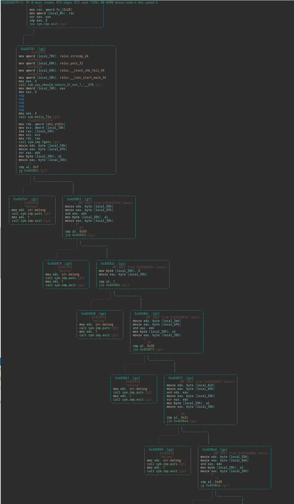

# 6.2.3 re CodegateCTF2017 angrybird

- [题目解析](#题目解析)
- [参考资料](#参考资料)

[下载文件](../src/writeup/6.2.3_re_codegatectf2017_angrybird)

## 题目解析

看题目就知道，这是一个会让我们抓狂的程序，事实也确实如此。

```text
$ file angrybird_org
angrybird: ELF 64-bit LSB executable, x86-64, version 1 (SYSV), dynamically linked, interpreter /lib64/ld-linux-x86-64.so.2, for GNU/Linux 2.6.32, BuildID[sha1]=089c3a14bcd7ffb08e94645cea46f1162b171445, stripped
```

```text
$ ./angrybird_org
$
```

一运行就退出，应该是需要程序流上有问题。

`main` 函数的开头有一些坑需要 patch，才能使程序正常运行，然后经过很多很多轮的运算和判断，可以看到 main 函数长达 18555 行：

```text
[0x00400600]> pd 60 @ main
/ (fcn) main 18555
|   main ();
|       :      ; DATA XREF from 0x0040061d (entry0)
|       :   0x00400761      55             push rbp
|       :   0x00400762      4889e5         mov rbp, rsp
|       :   0x00400765      4883c480       add rsp, 0xffffffffffffff80
|       :   0x00400769      64488b042528.  mov rax, qword fs:[0x28]    ; [0x28:8]=-1 ; '(' ; 40
|       :   0x00400772      488945f8       mov qword [local_8h], rax
|       :   0x00400776      31c0           xor eax, eax                 ; 将 eax 置 0
|       :   0x00400778      83f800         cmp eax, 0                   ; 比较 eax 和 0
|       `=< 0x0040077b      0f845ffeffff   je sym.imp.exit              ; eax == 0 时退出，所以需要将 je 换成 jne，或者把上一行的 0 换成 1
|           0x00400781      48c745901860.  mov qword [local_70h], reloc.strncmp_24 ; 0x606018
|           0x00400789      48c745982060.  mov qword [local_68h], reloc.puts_32 ; 0x606020
|           0x00400791      48c745a02860.  mov qword [local_60h], reloc.__stack_chk_fail_40 ; 0x606028
|           0x00400799      48c745a83860.  mov qword [local_58h], reloc.__libc_start_main_56 ; 0x606038
|           0x004007a1      b800000000     mov eax, 0
|           0x004007a6      e84bffffff     call sub.you_should_return_21_not_1_:__6f6   ; 该函数中需要返回 21
|           0x004007ab      89458c         mov dword [local_74h], eax                   ; [local_74] = 21
|           0x004007ae      b800000000     mov eax, 0
|           0x004007b3      e854ffffff     call sub.stack_check_70c                     ; 栈检查函数，直接 nop 掉，或者进入函数修改逻辑
|           0x004007b8      b800000000     mov eax, 0
|           0x004007bd      e868ffffff     call sub.hello_72a
|           0x004007c2      488b15a75820.  mov rdx, qword [obj.stdin]  ; [0x606070:8]=0 ; 从标准输入读入
|           0x004007c9      8b4d8c         mov ecx, dword [local_74h]
|           0x004007cc      488d45b0       lea rax, [local_50h]
|           0x004007d0      89ce           mov esi, ecx                 ; esi = 21
|           0x004007d2      4889c7         mov rdi, rax
|           0x004007d5      e8f6fdffff     call sym.imp.fgets          ; char *fgets(char *s, int size, FILE *stream)   ; patch 成功后就能调用 fgets
|           0x004007da      0fb655b0       movzx edx, byte [local_50h]  ; 读入的第一个字符
|           0x004007de      0fb645b1       movzx eax, byte [local_4fh]  ; 读入的第二个字符
|           0x004007e2      31d0           xor eax, edx
|           0x004007e4      8845d0         mov byte [local_30h], al
|           0x004007e7      0fb645d0       movzx eax, byte [local_30h]
|           0x004007eb      3c0f           cmp al, 0xf                 ; 15 ; 对处理后的输入字符做判断
|       ,=< 0x004007ed      7f14           jg 0x400803                      ; 若不满足条件，跳转失败，程序退出
|       |   0x004007ef      bf94504000     mov edi, str.melong         ; 0x405094 ; "melong"
|       |   0x004007f4      e897fdffff     call sym.imp.puts           ; int puts(const char *s)
|       |   0x004007f9      bf01000000     mov edi, 1
|       |   0x004007fe      e8ddfdffff     call sym.imp.exit           ; void exit(int status)
|       |      ; JMP XREF from 0x004007ed (main)
|       `-> 0x00400803      0fb655b0       movzx edx, byte [local_50h]  ; 第二轮运算
|           0x00400807      0fb645b1       movzx eax, byte [local_4fh]
|           0x0040080b      21d0           and eax, edx
|           0x0040080d      8845d0         mov byte [local_30h], al
|           0x00400810      0fb645d0       movzx eax, byte [local_30h]
|           0x00400814      3c50           cmp al, 0x50                ; 'P' ; 80
|       ,=< 0x00400816      7e14           jle 0x40082c
|       |   0x00400818      bf94504000     mov edi, str.melong         ; 0x405094 ; "melong"
|       |   0x0040081d      e86efdffff     call sym.imp.puts           ; int puts(const char *s)
|       |   0x00400822      bf01000000     mov edi, 1
|       |   0x00400827      e8b4fdffff     call sym.imp.exit           ; void exit(int status)
|       |      ; JMP XREF from 0x00400816 (main)
|       `-> 0x0040082c      c645d000       mov byte [local_30h], 0      ; 第三轮运算
|           0x00400830      0fb645d0       movzx eax, byte [local_30h]
|           0x00400834      3c01           cmp al, 1                   ; 1
|       ,=< 0x00400836      7e14           jle 0x40084c
|       |   0x00400838      bf94504000     mov edi, str.melong         ; 0x405094 ; "melong"
|       |   0x0040083d      e84efdffff     call sym.imp.puts           ; int puts(const char *s)
|       |   0x00400842      bf01000000     mov edi, 1
|       |   0x00400847      e894fdffff     call sym.imp.exit           ; void exit(int status)
|       |      ; JMP XREF from 0x00400836 (main)
|       `-> 0x0040084c      0fb655c2       movzx edx, byte [local_3eh]  ; 第 n 轮运算
|           0x00400850      0fb645b1       movzx eax, byte [local_4fh]
|           0x00400854      21d0           and eax, edx
|           0x00400856      8845d0         mov byte [local_30h], al
|           0x00400859      0fb645d0       movzx eax, byte [local_30h]
```

第一处 patch，将指令 `je` 改成 `jne`：

```text
[0x00400600]> s 0x0040077b
[0x0040077b]> pd 1
|       `=< 0x0040077b      0f845ffeffff   je sym.imp.exit
[0x0040077b]> wx 0f85
[0x0040077b]> pd 1
|       `=< 0x0040077b      0f855ffeffff   jne sym.imp.exit
```

第二处 patch，函数 `sub.you_should_return_21_not_1_:__6f6`：

```text
[0x0040077b]> pdf @ sub.you_should_return_21_not_1_:__6f6
/ (fcn) sub.you_should_return_21_not_1_:__6f6 22
|   sub.you_should_return_21_not_1_:__6f6 ();
|              ; CALL XREF from 0x004007a6 (main)
|           0x004006f6      55             push rbp
|           0x004006f7      4889e5         mov rbp, rsp
|           0x004006fa      bf64504000     mov edi, str.you_should_return_21_not_1_:_ ; 0x405064 ; "you should return 21 not 1 :("
|           0x004006ff      e88cfeffff     call sym.imp.puts           ; int puts(const char *s)
|           0x00400704      8b0556592000   mov eax, dword [0x00606060] ; [0x606060:4]=1     ; 修改 [0x606060:4] = 21 = 0x15
|           0x0040070a      5d             pop rbp
\           0x0040070b      c3             ret
[0x0040077b]> ?v 21
0x15
[0x0040077b]> s 0x00606060
[0x00606060]> px 16
- offset -   0 1  2 3  4 5  6 7  8 9  A B  C D  E F  0123456789ABCDEF
0x00606060  0100 0000 0000 0000 0000 0000 0000 0000  ................
[0x00606060]> wx 15
[0x00606060]> px 16
- offset -   0 1  2 3  4 5  6 7  8 9  A B  C D  E F  0123456789ABCDEF
0x00606060  1500 0000 0000 0000 0000 0000 0000 0000  ................
```

另外该函数结尾处指令是 `pop rbp`，而不是正确情况下的 `leave`，我们把它改过来：

```text
[0x00606060]> s 0x0040070a
[0x0040070a]> pd 1
|           0x0040070a      5d             pop rbp
[0x0040070a]> wx c9
[0x0040070a]> pd 1
|           0x0040070a      c9             leave
```

第三处 patch，将调用 `sub.stack_check_70c` 的指令直接 `nop` 掉：

```text
[0x00606060]> pdf @ sub.stack_check_70c
/ (fcn) sub.stack_check_70c 30
|   sub.stack_check_70c ();
|       :      ; CALL XREF from 0x004007b3 (main)
|       :   0x0040070c      55             push rbp
|       :   0x0040070d      4889e5         mov rbp, rsp
|       :   0x00400710      bf82504000     mov edi, str.stack_check    ; 0x405082 ; "stack check"
|       :   0x00400715      e876feffff     call sym.imp.puts           ; int puts(const char *s)
|       :   0x0040071a      678b0424       mov eax, dword [esp]
|       :   0x0040071e      83f800         cmp eax, 0
|       `=< 0x00400721      0f85b9feffff   jne sym.imp.exit
|           0x00400727      90             nop
|           0x00400728      5d             pop rbp
\           0x00400729      c3             ret
[0x00400600]> s 0x004007b3
[0x004007b3]> pd 1
|           0x004007b3      e854ffffff     call sub.stack_check_70c
[0x004007b3]> wx 9090909090
[0x004007b3]> pd 5
|           0x004007b3      90             nop
|           0x004007b4      90             nop
|           0x004007b5      90             nop
|           0x004007b6      90             nop
|           0x004007b7      90             nop
```

第四处 patch 是将 `sub.hello_72a` 函数中的 `je` 改成 `jne`：

```text
[0x0040077b]> pdf @ sub.hello_72a
/ (fcn) sub.hello_72a 55
|   sub.hello_72a ();
|           ; var int local_8h @ rbp-0x8
|              ; CALL XREF from 0x004007bd (main)
|           0x0040072a      55             push rbp
|           0x0040072b      4889e5         mov rbp, rsp
|           0x0040072e      4883ec10       sub rsp, 0x10
|           0x00400732      48c745f83860.  mov qword [local_8h], reloc.__libc_start_main_56 ; 0x606038
|           0x0040073a      488b45f8       mov rax, qword [local_8h]
|           0x0040073e      ba05000000     mov edx, 5
|           0x00400743      be8e504000     mov esi, str.hello          ; 0x40508e ; "hello"
|           0x00400748      4889c7         mov rdi, rax
|           0x0040074b      e830feffff     call sym.imp.strncmp        ; int strncmp(const char *s1, const char *s2, size_t n)  ; 如果相等则返回 0
|           0x00400750      85c0           test eax, eax
|       ,=< 0x00400752      740a           je 0x40075e                  ; 如果 eax 为 0，则跳转
|       |   0x00400754      bf01000000     mov edi, 1
|       |   0x00400759      e882feffff     call sym.imp.exit           ; void exit(int status)
|       |      ; JMP XREF from 0x00400752 (sub.hello_72a)
|       `-> 0x0040075e      90             nop
|           0x0040075f      c9             leave
\           0x00400760      c3             ret
```

总的来说就是修改了下面几个地方：

```text
$ radiff2 angrybird_org angrybird_mod
0x0000070a 5d => c9 0x0000070a
0x00000722 85 => 84 0x00000722
0x00000752 74 => 75 0x00000752
0x0000077c 84 => 85 0x0000077c
0x000007b3 e854ffffff => 9090909090 0x000007b3
0x00006060 01 => 15 0x00006060
```

这样程序的运行就正常了，它从标准输入读入字符，进行一系列的判断，由于程序执行流非常长，我们不可能一个一个地去 patch。radare2 里输入命令 `VV @ main` 可以看到下面的东西：



不如使用 angr 来解决它，指定好目标地址，让它运行到那儿，在大多数情况下，这种方法都是有效的。

```text
[0x00400761]> pd -20 @ main+18555
|           0x00404f8e      d00f           ror byte [rdi], 1
|           0x00404f90      b645           mov dh, 0x45                ; 'E' ; 69
|           0x00404f92      d03c78         sar byte [rax + rdi*2], 1
|       ,=< 0x00404f95      7e14           jle 0x404fab
|       |   0x00404f97      bf94504000     mov edi, str.melong         ; 0x405094 ; "melong"
|       |   0x00404f9c      e8efb5ffff     call sym.imp.puts           ; int puts(const char *s)
|       |   0x00404fa1      bf01000000     mov edi, 1
|       |   0x00404fa6      e835b6ffff     call sym.imp.exit           ; void exit(int status)
|       |      ; JMP XREF from 0x00404f95 (main)
|       `-> 0x00404fab      488d45b0       lea rax, [local_50h]
|           0x00404faf      4889c6         mov rsi, rax
|           0x00404fb2      bf9b504000     mov edi, str.you_typed_:__s_n ; 0x40509b ; "you typed : %s\n"
|           0x00404fb7      b800000000     mov eax, 0
|           0x00404fbc      e8efb5ffff     call sym.imp.printf         ; int printf(const char *format)
|           0x00404fc1      b800000000     mov eax, 0
|           0x00404fc6      488b4df8       mov rcx, qword [local_8h]
|           0x00404fca      6448330c2528.  xor rcx, qword fs:[0x28]
|       ,=< 0x00404fd3      7405           je 0x404fda
|       |   0x00404fd5      e8c6b5ffff     call sym.imp.__stack_chk_fail ; void __stack_chk_fail(void)
|       |      ; JMP XREF from 0x00404fd3 (main)
|       `-> 0x00404fda      c9             leave                   ; 选择一个目标地址
\           0x00404fdb      c3             ret
```

因为每次错误退出之前，都会调用 `puts` 函数，所以应该避免其出现，将地址设置为参数 avoid。

```text
[0x00400600]> is~puts
vaddr=0x00400590 paddr=0x00000590 ord=002 fwd=NONE sz=16 bind=GLOBAL type=FUNC name=imp.puts
```

对于使用 angr 来说，上面的 patch 完全没有必要，只要选择一个合适的初始化地址，如 `0x004007da`，也就是 `fget` 函数的下一条指令，就可以跑出结果：

```python
import angr

main  = 0x004007da
find  = 0x00404fda  # leave;ret
avoid = 0x00400590  # puts@plt

p = angr.Project('./angrybird_org')
init = p.factory.blank_state(addr=main)
pg = p.factory.simgr(init, threads=4)
ex = pg.explore(find=find, avoid=avoid)

final = ex.found[0].state
flag = final.posix.dumps(0)

print "Flag:", final.posix.dumps(1)
```

Bingo!!!（不能保证每次都有效，多试几次）

```text
$ python2 solve.py
WARNING | 2017-12-03 17:33:58,544 | angr.state_plugins.symbolic_memory | Concretizing symbolic length. Much sad; think about implementing.
Flag: you typed : Im_so_cute&pretty_:)�
```

然后用我们 patch 过的程序来验证 flag：

```text
$ ./angrybird_mod
you should return 21 not 1 :(
Im_so_cute&pretty_:)
you typed : Im_so_cute&pretty_:)
```

同样需要一定的运气才能通过，祝好运:)

## 参考资料

- <https://ctftime.org/task/3375>
