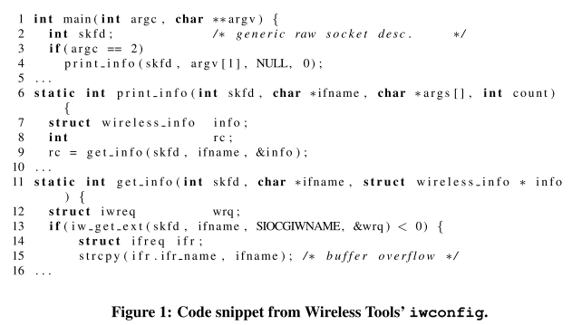
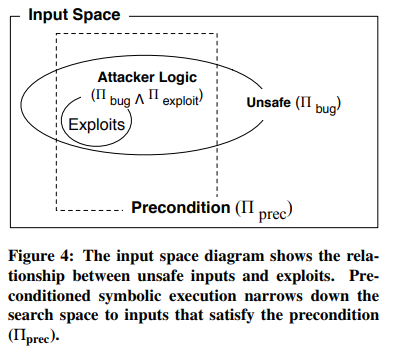
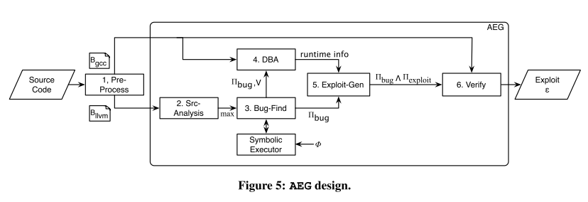
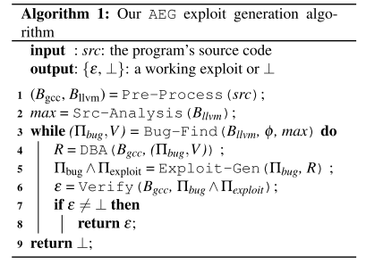
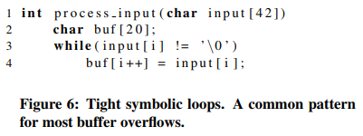
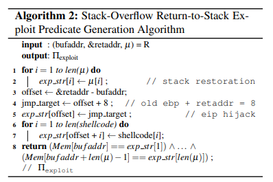

# 8.10 AEG: Automatic Exploit Generation

[paper](http://security.ece.cmu.edu/aeg/aeg-current.pdf)

## 简介

- 这篇论文向我们展示了如何将控制流劫持攻击的漏洞利用生成模型化为一个形式化验证问题。
- 提出了预处理符号执行，这是一种新的符号执行技术。
- 提出了一种通用的漏洞利用生成方法。
- 构建了 AEG，这是第一个能够自动发现漏洞并生成利用获得 shell 的端到端系统。

### 挑战及解决方案

- Source code analysis alone is inadequate and insufficient.
  - We combine source-code level analysis to improve scalability in finding bugs and binary and runtime information to exploit programs.
- Finding the exploitable paths among an infinite number of possible paths
  - We have developed preconditioned symbolic execution, a novel technique which targets paths that are more likely to be exploitable.
  - We have developed a priority queue path prioritization technique that uses heuristics to choose likely more exploitable paths first.
- An end-to-end system.
  - Our AEG implementation is a single command line that analyzes source code programs, generates symbolic execution formulas, solves them, performs binary analysis, generates binary-level runtime constraints, and formats the output as an actual exploit string that can be fed directly into the vulnerable program.

## AEG 概述

The example application is the setuid root `iwconfig` utility from the Wireless Tools package, a program consisting of about 3400 lines of C source code.

`iwconfig` has a classic strcpy buffer overflow vulnerability in the get info function (line 15). And our system goes through the following analysis steps:

1. AEG searches for bugs at the source code level by exploring execution paths. Specifically, AEG executes `iwconfig` using symbolic arguments (`argv`) as the input sources.
2. After following the path `main → print_info → get_info`, AEG reaches line 15, where it detects an out-of-bounds memory error on variable `ifr.ifr_name`. AEG solves the current path constraints and generates a concrete input that will trigger the detected bug.
3. AEG performs dynamic analysis on the `iwconfig` binary using the concrete input generated in step 2. It extracts runtime information about the memory layout, such as the address of the overflowed buffer (`ifr.ifr_name`) and the address of the return address of the vulnerable function (`get_info`).
4. AEG generates the constraints describing the exploit using the runtime information generated from the previous step: 1) the vulnerable buffer (`ifr.ifr_name`) must contain our shellcode, and 2) the overwritten return address must contain the address of the shellcode. Next, AEG appends the generated constraints to the path constraints and queries a constraint solver for a satisfying answer.
5. The satisfying answer gives us the exploit string. Finally, AEG runs the program with the generated exploit and verifies that it works. If the constraints were not solvable, AEG would resume searching the program for the next potential vulnerability.

## 形式化建模

At its core, the automatic exploit generation (AEG) challenge is a problem of finding program inputs that result in a desired exploited execution state.

In AEG, we are only concerned with the subset of unsafe states that are exploitable, represented by the circle labeled Πbug∧Πexploit. The intuition is that preconditioned symbolic execution limits the space searched to a smaller box.

Logically, we would be guaranteed to find all possible exploits when Πprec is less restrictive than the exploitability condition: Πbug(x)∧Πexploit(x) ⇒ Πprec(x).

## 实现方法

Our approach to the AEG challenge consists of six components: Pre-Process, Src-Analysis, Bug-Find, DBA, Exploit-Gen, and Verify.

- Pre-Process: src → (Bgcc, Bllvm).
  - The source program (src) is compiled down to 1) a binary Bgcc, for which AEG will try to generate a working exploit and 2) a LLVM bytecode file Bllvm, which will be used by our bug finding infrastructure.
- Src-Analysis: Bllvm → max.
  - AEG analyzes the source code to generate the maximum size of symbolic data `max` that should be provided to the program. AEG determines `max` by searching for the largest statically allocated buffers of the target program.
- Bug-Find: (Bllvm, φ, max) → (Πbug, V).
  - Bug-Find takes in LLVM bytecode Bllvm and a safety property φ, and outputs a tuple (Πbug, V) for each detected vulnerability. Πbug contains the path predicate. V contains source-level information about the detected vulnerability.
- DBA: (Bgcc, (Πbug, V)) → R.
  - DBA performs dynamic binary analysis on the target binary Bgcc with a concrete buggy input and extracts runtime information R.
- Exploit-Gen: (Πbug, R) → Πbug∧Πexploit.
  - Exploit-Gen receives a tuple with the path predicate of the bug (Πbug) and runtime information (R), and constructs a formula for a control flow hijack exploit. The output formula includes constraints ensuring that: 1) a possible program counter points to a user-determined location, and 2) the location contains shellcode (Πexploit). The resulting exploit formula is the conjunction of the two predicates.
- Verify: (Bgcc, Πbug∧Πexploit) → {ε, ⊥}.
  - Verify takes in the target binary executable Bgcc and an exploit formula Πbug∧Πexploit, and returns an exploit ε only if there is a satisfying answer. Otherwise, it returns ⊥.

The high-level algorithm for solving the AEG challenge:

## Bug-Find: 以漏洞利用生成为目的的程序分析

Bug-Find finds bugs with symbolic program execution, which explores the program state space one path at a time. However, there are an infinite number of paths to potentially explore. AEG addresses this problem with two novel algorithms:

- First, we present a novel technique called preconditioned symbolic execution that constrains the paths considered to those that would most likely include exploitable bugs.
- Second, we propose novel path prioritization heuristics for choosing which paths to explore first with preconditioned symbolic execution.

### Preconditioned Symbolic Execution

Preconditioned symbolic execution is a novel method to target symbolic execution towards a certain subset of the input state space. The state space subset is determined by the precondition predicate (Πprec); inputs that do not satisfy Πprec will not be explored.

In AEG, we have developed and implemented 4 different preconditions for efficient exploit generation:

- None. There is no precondition and the state space is explored as normal.
- Known Length. The precondition is that inputs are of known maximum length. We use static analysis to automatically determine this precondition.
- Known Prefix. The precondition is that the symbolic inputs have a known prefix.
- Concolic Execution. Concolic execution can be viewed as a specific form of preconditioned symbolic execution where the precondition is specified by a single program path as realized by an example input.

Consider the example program above. Suppose that the `input` buffer contains 42 symbolic bytes. Lines 3-4 represent a tight symbolic loop that will eventually spawn 42 different interpreters with traditional symbolic execution, each one having a different path predicate. Each path predicate will describe a different condition about the string length of the symbolic `input` buffer.

Preconditioned symbolic execution avoids examining the loop iterations that will not lead to a buffer overflow by imposing a length precondition. Thus, we only need a single interpreter to explore the entire loop.

### Path Prioritization: Search Heuristics

All pending paths are inserted into a priority queue based on their ranking, and the next path to explore is always drawn out of the priority queue. We present two new path prioritization heuristics we have developed: buggy-path-first and loop exhaustion.

- Buggy-Path-First. Exploitable bugs are often preceded by small but unexploitable mistakes. The observation that one bug on a path means subsequent statements are also likely to be buggy (and hopefully exploitable) led us to the buggy-path-first heuristic.
- Loop Exhaustion. The loop-exhaustion strategy gives higher priority to an interpreter exploring the maximum number of loop iterations, hoping that computations involving more iterations are more promising to produce bugs like buffer overflows.

### Environment Modelling: Vulnerability Detection in the Real World

AEG models most of the system environments that an attacker can possibly use as an input source. Therefore, AEG can detect most security relevant bugs in real programs. Our support for environment modeling includes file systems, network sockets, standard input, program arguments, and environment variables. Additionally, AEG handles most common system and library function calls.

## DBA, Exploit-Gen and Verify: 漏洞利用生成

### DBA: Dynamic Binary Analysis

DBA takes in three inputs: 1) the target executable (Bgcc) that we want to exploit; 2) the path constraints that lead up to the bug (Πbug); and 3) the names of vulnerable functions and buffers.

It then outputs a set of runtime information: 1) the address of the return address of the vulnerable function (&retaddr); 2) the address of the vulnerable buffer where the overwrite starts (bufaddr); and 3) the stack memory contents between them (µ).

### Exploit-Gen

Exploit-Gen takes in two inputs to produce an exploit: the unsafe program state containing the path constraints (Πbug) and low-level runtime information R.

It generates exploit formulas (Πbug∧Πexploit) for four types of exploits: 1) stack-overflow return-to-stack, 2) stack-overflow returnto-libc, 3) format-string return-to-stack, 4) format-string return-to-libc.

### Verify

VERIFY takes in two inputs: 1) the exploit constraints Πbug∧Πexploit, and 2) the target binary. It outputs either a concrete working exploit, i.e., an exploit that spawns a shell, or ⊥, if AEG fails to generate the exploit.
