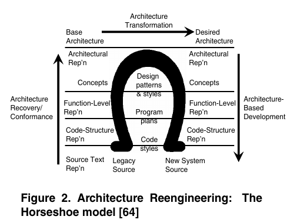

# 8.13 New Frontiers of Reverse Engineering

[paper](http://reversingproject.info/project_repository/reversing_references/pdf/new_frontiers_of_reverse_engineering.pdf)

## What is your take-away message from this paper

This paper briefly presents an overview of the field of reverse engineering, reviews main achievements and areas of application, and highlights key open research issues for the future.

## What are motivations for this work

### What is reverse engineering

The term *reverse engineering* was defined as:
> the process of analyzing a subject system to
>
> (i) identify the system's components and their inter-relationships and
>
> (ii) create representations of the system in another form or at a higher level of abstraction.

So, the core of reverse engineering consists two parts:

1. deriving information from the available software artifacts
2. translating the information into abstract representations more easily understandable by humans

### Why we need reverse engineering

Reverse engineering is a key supporting technology to deal with systems that have the source code as the only reliable representation.

### Previous reverse engineering

Reverse engineering has been traditionally viewed as a two step process: information extraction and abstraction.

The discussion of the main achievements of reverse engineering in last 10 years is organized three main threads:

- program analysis and its applications
- design recovery
- software visualization

### Program analysis and its applications

Several analysis and transformation toolkits provide facilities for parsing the source code and performing rule-based transformations.

- alternative source code analysis approaches
- extract fact even without the need for a thorough source code parsing, relevant information from the source code
- incorporating reverse engineering techniques into development environments or extensible editors
- deal with peculiarities introduced by object-oriented languages
- deal with the presence of clones in software systems

### Architecture and design recovery

- the diffusion of object-oriented languages and UML introduced the need of reverse engineering UML models from source code
- identifying design patterns into the source code aims at promoting reuse and assessing code quality
- techniques using static analysis, dynamic analysis, and their combination, were proposed
- the need for reverse engineering techniques tied to Web Applications

### Visualization

Software visualization is a crucial step for reverse engineering.

- straightforward visualization: UML diagrams, state machines, CFGs
- highlight relevant information at the right level of detail

## Future trends of reverse engineering

### program analysis

- high dynamicity
  - many programming languages widely used today allow for high dynamicity which make analysis more difficult
  - e.g. reflection in Java that can load classes at run-time
- cross-language applications
  - more cross-language applications today
  - e.g. Web Applications: HTML, SQL, scripts
- mining software repositories
  - a new, important research area

So, Reverse engineering research has highlighted the dualism between static and dynamic analysis and the need to complement the two techniques, trying to exploit the advantages of both and limit their disadvantages. And recent years the third dimension named historical analysis added.

- static analysis
  - when it is performed, within a single system snapshot, on software artifacts without requiring their execution
  - must deal with different language variants and non-compilable code
  - fast, precise, and cheap
  - many peculiarities of programming languages, such as pointers and polymorphism, or dynamic classes loading, make static analysis difficult and sometimes imprecise
- dynamic analysis
  - when it is performed by analyzing execution traces obtained from the execution of instrumented versions of a program, or by using an execution environment able to capture facts from program execution
  - extracts information from execution traces
  - since it depends on program inputs, it can be incomplete
  - challenge: ability to mine relevant information from execution traces (execution traces tend to quickly become large and unmanageable, thus a relevant challenge is to filter them and extract information relevant for the particular understanding task being performed)
- historical analysis
  - when the aim is to gain information about the evolution of the system under analysis by considering the changes performed by developers to software artifacts, as recorded by versioning systems

### design recovery

- design paradigms
  - a lot work needs to be done in particular for what regards the extraction of dynamic diagrams and also of OCL pre and post- conditions
  - new software architectures that have characteristics of being extremely dynamic, highly distributed, self-configurable and heterogeneous
  - e.g. Web 2.0 applications
- incomplete, imprecise and semi-automatic
  - the reverse engineering machinery should be able to learn from expert feedbacks to automatically produce results
  - e.g. machine learning, meta-heuristics and artificial intelligence

### visualization

Effective visualizations should be able to :

1. show the right level of detail a particular user needs, and let the user choose to view an artifact at a deeper level or detail, or to have a coarse-grain, in-the-large, view
2. show the information in a form the user is able to understand. Simpler visualizations should be favored over more complex ones, like 3D or animations, when this does not necessarily bring additional information that cannot be visualized in a simpler way

## Reverse engineering in emerging software development scenarios

The challenges for reverse engineering:

1. on the one hand, the analysis of systems having high dynamism, distribution and heterogeneity and, on the other hand, support their development by providing techniques to help developers enable mechanisms such as automatic discovery and reconfiguration
2. the need for a full integration of reverse engineering with the development process, which will benefit from on-the-fly application of reverse engineering techniques while a developer is writing the code, working on a design model, etc.

## Final

