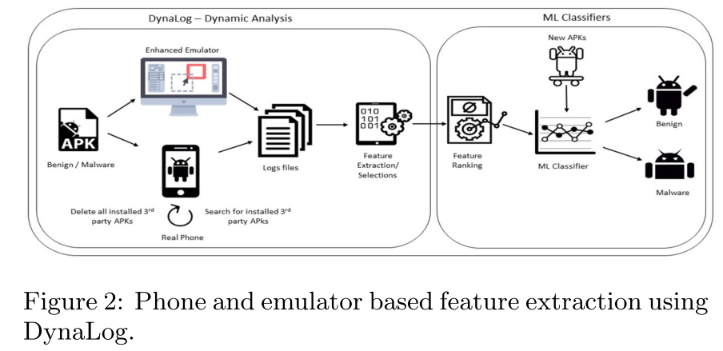

# 8.15 EMULATOR vs REAL PHONE: Android Malware Detection Using Machine Learning

[paper](https://pure.qub.ac.uk/portal/files/127232616/IWSPA_codaspy_2017.pdf)

## What is your take-away message from this paper

The authors present an investigation of machine learning based malware detection using dynamic analysis on real devices.

## What are motivations for this work

### malware

The rapid increase in malware numbers targeting Android devices has highlighted the need for efficient detection mechanisms to detect zero-day malware.

### anti-emulator techniques

Sophisticated Android malware employ detection avoidance techniques in order to hide their malicious activities from analysis tools. These include a wide range of anti-emulator techniques, where the malware programs attempt to hide their malicious activities by detecting the emulator.

## What is the proposed solution

> Hence, we have designed and imple- mented a python-based tool to enable dynamic analysis using real phones to automatically extract dynamic features and potentially mitigate anti-emulation detection. Further- more, in order to validate this approach, we undertake a comparative analysis of emulator vs device based detection by means of several machine learning algorithms. We examine the performance of these algorithms in both environments after investigating the effectiveness of obtaining the run-time features within both environments.

### phone based dynamic analysis and feature extraction

Since our aim is to perform experiments to compare emulator based detection with device based detection we need to extract features for the supervised learning fromboth environments. For the emulator based learning, we utilized the [DynaLog](https://arxiv.org/pdf/1607.08166.pdf) dynamic analysis framework.

- emulator based: DynaLog provides the ability to instrument each application with the necessary API calls to be monitored, logged and extracted from the emulator during the run-time analysis.
- device based: extended with a python-based tool
  - push a list of contacts to the device SD card and then import them to populate the phone’s contact list.
  - Discover and uninstall all third-party applications prior to installing the app under analysis.
  - Check whether the phone is in airplane mode or not.
  - Check the battery level of the phone.
  - Outgoing call dialling using adb shell.
  - Outgoing sms messages using adb shell.
  - Populate the phone SD card with other assets.

### Features extraction

After using DynaLog, the outputs are pre-procesed into a file of feature vectors representing the features extracted from each application. Then use InfoGain feature ranking algorithm in WEKA to get the top 100 ranked features.

### Machine learning classifiers

The features were divided into file different sets to compare the performance using machine learning algorithms.

## What is the work's evaluation of the proposed solution

### Dataset

> The dataset used for the experiments consists of a total of 2444 Android applications. Of these, 1222 were malware samples obtained from 49 families of the Android malware genome project. The rest were 1222 benign samples obtained from Intel Security (McAfee Labs).

### Machine learning algorithms

The following algorithms were used in the experiments:

- Support Vector Machine (SVM-linear)
- Naive Bayes (NB)
- Simple Logistic (SL)
- Multilayer Perceptron (MLP)
- Partial Decision Trees (PART)
- Random Forest (RF)
- J48 Decision Tree.

### Metrics

Five metrics were used for the performance emulation of the detection approaches.

- true positive rate (TPR)
- true negative ratio (TNR)
- false positive ratio (FPR)
- false negative ratio (FNR)
- weighted average F-measure.

### Experiment 1: Emulator vs Device analysis and feature extraction

### Experiment 2: Emulator vs Device Machine learning detection comparison

> Our experiments showed that several features were extractedmore effectively fromthe phone than the emulator using the same dataset. Furthermore, 23.8% more apps were fully analyzed on the phone compared to emulator.

This shows that for more efficient analysis the phone is definitely a better environment as far more apps crash when being analysed on the emulator.

> The results of our phone-based analysis obtained up to 0.926 F-measure and 93.1%TPR and 92%FPR with the RandomForest classifier and in general, phone-based results were better than emulator based results.

Thus we conclude that as an in- centive to reduce the impact of malware anti-emulation and environmental shortcomings of emulators which affect analysis efficiency, it is important to develop more effective ma- chine learning device based detection solutions.

## What is your analysis of the identified problem, idea and evaluation

Countermeasures against anti-emulator are becoming increasingly important in Android malware detection.

## What are the contributions

- Presented an investigation of machine learning based malware detection using dynamic analysis on real Android devices.
- Implemented a tool to automatically extract dynamic features from Android phones.
- Through several experiments we performed a comparative analysis of emulator based vs. device based detection by means of several machine learning algorithms.

## What are future directions for this research

> Hence future work will aim to investigate more effective, larger scale device based machine learning solutions using larger sample datasets. Future work could also investigate alternative set of dynamic features to those utilized in this study.

## What questions are you left with

- How to make emulator environment more closer to real environment?
- How to make more powerful dynamic analysis tools that can against anti-emulation techniques?
- Why the difference in Android versions had no impact?
