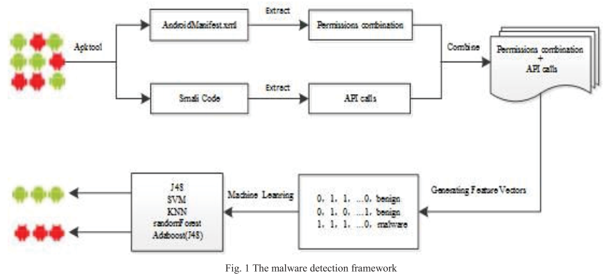

# 8.17 A Static Android Malware Detection Based on Actual Used Permissions Combination and API Calls

[paper](http://waset.org/publications/10005499)

## What is your take-away message from this paper

The paper put forward a machine learning detection method that based on the actually used Permissions Combination and API calls.

## What are motivations for this work

### Android development

Current Android system has not any restrictions to the number of permissions that an application can request, developers tend to apply more than actually needed permissions in order to ensure the successful running of the application, which results in the abuse of permissions.

### Current methods

Some traditional detection methods only consider the requested permissions and ignore whether it is actually used, which lead to incorrect identification of some malwares.

## What is the proposed solution

> We present a machine learning detection method which is based on the actually used permission combinations and API calls.

The framework contains mainly four parts:

1. Extracting AndroidManifest.xml and Smali codes by Apktool.
2. Firstly, extracting the permissions that declared in AndroidManifest.xml. Secondly, extracting API calls through scanning Smali codes in according with the mapping relation between permissions and API, and get the actually used permissions. Finally, obtaining the actually used permissions combination based on the single permission.
3. Generating feature vector, each application is represented as an instance.
4. Using five machine learning classification algorithms, including J48, Random Forest, SVM, KNN and AdaboostM1, to realize the classification and evaluation for applications.

## What is the work's evaluation of the proposed solution

### Data Set

The authors collected a total of 2375 Android applications. the 1170 malware samples are composed of 23 families from genetic engineering. 1205 benign samples are from Google officail market.

### Results

> We evaluate the classification performance of five different algorithms in terms of feature sets that have been extracted from applications, including API calls, permissions combination, the combination of actually used permissions combination and API calls, requested permissions. Inaddition, information gain and CFS feature selection algorithms are used to select the useful features to improve the efficiency of classifiers.

From the feature extraction, there is some differences between requested permissions and actually used permissions, it is imporant to improve the efficiency:

The experiments show that the feature of actually used permissions combination an API calls can achieve better performance:

## What is your analysis of the identified problem, idea and evaluation

The main idea of the paper is useing actually uesd permissions instead of declared permissons. But PScout can't get the whole mapping of permissons and API calls. This can make some errors.

## What are the contributions

1. Presented an Android malware detection method.
2. Various machine learning algorithms, feature selection methods and experimental samples are used to validate the efficiency.
3. The method can improve the performance of classifiers significantly and is more accurate than before methods.

## What are future directions for this research

- More useful characteristics could be extracted to achieve better results.
- Integration of multiple classifiers could be used to improve the identification of classifiers.

## What questions are you left with

Why not evaluate the performance of classifiers obtained when using the combination of declared permissions combination and API calls?
