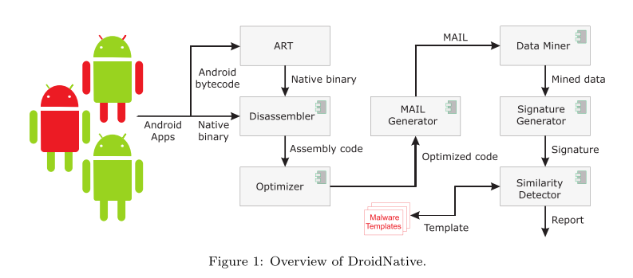

# 8.19 DroidNative: Semantic-Based Detection of Android Native Code Malware

[paper](http://pages.cs.wisc.edu/~vrastogi/static/papers/aqrcr17.pdf)

## What is your take-away message from this paper

The paper proposed DroidNative for detection of both bytecode and native code Android malware variants.

## What are motivations for this work

### native code

A recent study shows that 86% of the most popular Android applications contain native code.

### current methods

the plethora of more sophisticated detectors making use of static analysis techniques to detect such variants operate only at the bytecode level, meaning that malware embedded in native code goes undetected.

- No coverage of Android native binary code.
- Do not handle obfuscations at function level. Low level semantics are not covered.
- Heuristics used are very specific to malware programs, and hence are not scalable.
- Slow runtimes, can not be used in a practical system.

## What is the proposed solution

> This paper introduces DroidNative, a malware detection system for Android that operates at the native code level and is able to detect malware in either bytecode or native code. DroidNative performs static analysis of the native code and focuses on patterns in the control flow that are not significantly impacted by obfuscations. DroidNative is not limited to only analyzing native code, it is also able to analyze bytecode by making use of the Android runtime (ART) to compile bytecode into native code suitable for analysis. The use of control flow with patterns enables DroidNative to detect smaller size malware, which allows DroidNative to reduce the size of a signature for optimizing the detection time without reducing the DR.

### MAIL

DroidNative uses MAIL (Malware Analysis Intermediate Language) to provide an abstract representation of an assembly program, and that representation is used for malware analysis and detection.

### Disassembler

- A challenge is ensuring that all code is found and disassembled.
  - To overcome the dificiencies of linear sweep and recursive traversal we combine these two techniques while disassembling.
- Another challenge is that most binaries used in Android are stripped, meaning they do not include debugging or symbolic information.
  - We handle this problem by building control flow patterns and use them for malware detection.

### Optimizer

Removing other instructions that are not required for malware analysis. DroidNative builds multiple, smaller, interwoven CFGs for a program instead of a single, large CFG.

### MAIL Generation

The MAIL Generator translates an assembly program to a MAIL program.

### Malware Detection

- Data Miner: searches for the control and structural information in a MAIL program
- Signature Generator: builds a behavioral signature (ACFG or SWOD) of the MAIL program.
- Similarity Detector: matches the signature of the program against the signatures of the malware templates extracted during the training phase, and determines whether the application is malware based on thresholds that are computed empirically.

### ACFG

A CFG is built for each function in the an- notated MAIL program, yielding the ACFGs.

### SWOD

Each MAIL pattern is assigned a weight based on the SWOD that represents the differences between malware and benign samples’ MAIL patterns’ distributions.

## What is the work's evaluation of the proposed solution

### Dataset

> Our dataset for the experiments consists of total 2240 Android applications. Of these, 1240 are Android malware programs collected from two different resources and the other 1000 are benign programs containing Android 5.0 system programs, libraries and standard applications.

### N-Fold Cross Validation

The authors use n-flod cross validation to estimate the performance and define the following evaluation metrics: DR, FPR, ROC, AUC.

## What is your analysis of the identified problem, idea and evaluation

This is the first research effort to detect malware deal with the native code. It shows sperior results for the detection of Android native code and malware variants compared to the other research efforts and the commercial tools.

But there are some limitations:

- requires that the application's malicious code be available for static analysis.
- excels at detecting variants of malware that has been previously seen, and may not be able to detect true zero-day malware.
- may not be able to detect a malware employing excessive flow obfuscations.
- the pattern matching may fail if the malware variant obfuscates a statement in a basic block.

## What are the contributions

- DroidNative is the first system that builds and designs cross-platform signatures for Android and operates at the native code level, allowing it to detect malware embedded in either bytecode or native code.
- DroidNative is faster than existing systems, making it suitable for real-time analysis.

## What are future directions for this research

> To improve DroidNative’s resilient to such obfuscations, in the future we will use a threshold for pattern matching. We will also investigate other pattern matching techniques, such as a statement dependency graph or assigning one pattern to multiple statements of different type etc, to improve this resiliency.

## What questions are you left with

There are many other programming languages (JavaScript/Python/...) can be used for Android app development. How to detect malware written in those languages?
