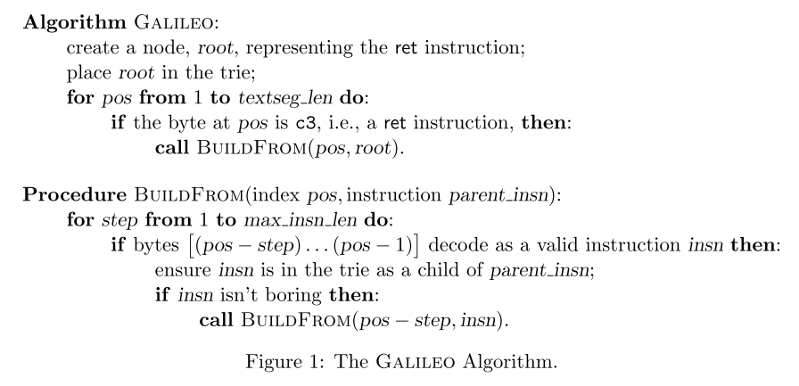

# 8.1 The Geometry of Innocent Flesh on the Bone: Return-into-libc without Function Calls (on the x86)

[paper](https://hovav.net/ucsd/dist/geometry.pdf)

## 简介

论文提出了一种 return-into-libc 的攻击方法，以对抗针对传统代码注入攻击的防御技术（W⊕X）。它不会调用到完整的函数，而是通过将一些被称作 gadgets 的指令片段组合在一起，形成指令序列，以达到任意代码执行的效果。这一技术为返回导向编程（Return-Oriented Programming）奠定了基础。

## 背景

对于一个攻击者，它要完成的任务有两个：

1. 首先它必须找到某种方法来改变程序的执行流
2. 然后让程序执行攻击者希望的操作

在传统的栈溢出攻击里，攻击者通过溢出改写返回地址来改变程序执行流，将指针指向攻击者注入的代码（shellcode），整个攻击过程就完成了。

后来很多针对性的防御技术被提出来，其中 W⊕X 将内存标记为可写（W）或可执行（X），但不可以同时兼有，这样的结果是要么攻击者的代码注入不了，要么即使攻击者在可写的内存中注入了代码，也不可以执行它。

那既然代码注入不可行，一种思路是利用内存中已有的程序代码，来达到攻击的目的。由于标准 C 库几乎在每个 Linux 程序执行时都会被加载，攻击者就开始考虑利用 libc 中的函数，这种技术就是最初版本的 return-into-libc。理论上来说，通过在栈上布置参数，即可调用任意程序在 text 段上和 libc 中的任意函数。

那么 W⊕X 对 return-into-libc 的影响是什么呢？主要有下面两点：

1. 在 return-into-libc 攻击中，攻击者可以一个接一个地调用 libc 中的函数，但这个执行流仍然是线性的，而不像代码注入那样可以执行任意代码。
2. 攻击者只能使用程序 text 段中已有的和 libc 中加载的函数，通过移除这些特定的函数即可对攻击者加以限制。

在这样的背景下，本论文就提出了一种新型的 return-into-libc 攻击方法。这种方法可以执行任意代码，而且不需要调用到任何函数。

## 寻找指令序列

为了完成指令序列的构建，首先需要在 libc 中找到一些以 return 指令结尾，并且在执行时必然以 return 结束，而不会跳到其它地方的小工具（gadgets），算法如下：

大概就是扫描二进制找到 ret 指令，将其作为 trie 的根节点，然后回溯解析前面的指令，如果是有效指令，将其添加为子节点，再判断是否为 boring，如果不是，就继续递归回溯。举个例子，在一个 trie 中一个表示 `pop %eax` 的节点是表示 `ret` 的根节点的子节点，则这个 gadgets 为 `pop %eax; ret`。如此就能把有用的 gadgets 都找出来。

那么哪些指令是 boring 的呢？

1. 该指令是 `leave`，并且后跟一个 `ret` 指令
2. 或者该指令是一个 `pop %ebp`，并且后跟一个 `ret` 指令
3. 或者该指令是返回或者非条件跳转

找到这些 gadgets 之后，就可以根据需要将它们串起来形成 ROP 链，执行任意代码了。
