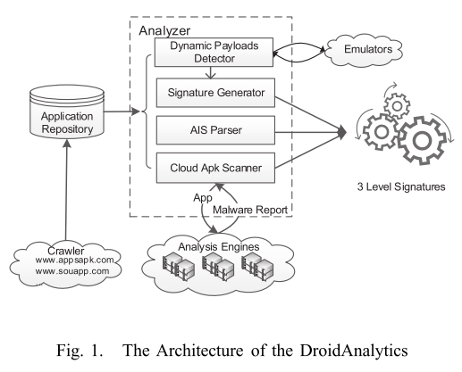

# 8.20 DroidAnalytics: A Signature Based Analytic System to Collect, Extract, Analyze and Associate Android Malware

[paper](https://www.cse.cuhk.edu.hk/~cslui/PUBLICATION/TRUST13DROIDANALYTICS.pdf)

## What is your take-away message from this paper

The authors present DroidAnalytics, an Android malware analytic system for malware collection, signature generation, information retrieval, and malware association based on similarity score. Furthermore, DroidAnalytics can efficiently detect zero-day repackaged malware.

## What are motivations for this work

An effective analytic system needs to address the following questions:

- How to automatically collect and manage a high volume of mobile malware?
- How to analyze a zero-day suspicious application, and compare or associate it with existingmalware families in the database?
- How to perform information retrieval so to reveal similar malicious logic with existing malware, and to quickly identify the new malicious code segment?

## What is the proposed solution

The system consists these modules:

- Extensible Crawler: systematically build up the mobile applications database for malware analysis and association.
- Dynamic Payload Detector: to deal with malware which dynamically downloads malicious codes via Internet or attachment files.
  - scans the package, identifies files using their magic numbers instead of file extension.
  - use the forward symbolic execution technique to trigger the download behavior.
- Android App Information (AIS) Parser: it is used to represent *.apk* information.
- Signature Generator: use a three-level signature generation scheme to identify each application, which is based on the mobile application, classes, methods. We generate a method's signature using the API call sequence, and given the signature of a method, create the signature of a class which composes of different methods, finally, the signature of an application is composed of all signatures of its classes.
  - Android API calls table: use the Java reflection to obtain all descriptions of the API calls.
  - Disassembling process: takes the Dalvik opcodes of the *.dex* file and transforms them to methods and classes.
  - Generate Lev3 signature: extracts the API call ID sequence as a string in each method, then hashes this string value to produce the method's signature.
  - Generate Lev2 signature: generate the Lev2 signature for each class based on the Lev3 signature of methods within that class.
  - Generate Lev1 signature: based on the Lev2 signatures.

## What is the work's evaluation of the proposed solution

> We conduct three experiments and show how analysts can study malware, carry out similarity measurement between applications, as well as perform class association among 150,368 mobile applications in the database.

- analyzing malware repackaging
- analyzing malware which uses code obfuscation
- analyzing malware with attachement files or dynamic payloads

> we have used DroidAnalyt- ics to detect 2,494 malware samples from 102 families, with 342 zero-day malware samples from six different families.

## What is your analysis of the identified problem, idea and evaluation

DroidAnalytics's signature generation is based on the following observation: For any functional application, it needs to invoke various Android API calls, and Android API calls sequence within a methods is difficult to modify.

Traditional Hash vs Three-level Signature:

- Traditional hash
  - Hackers can easily mutate a malware
  - Not flexible for analysis
- Three-level signature
  - App, classes and methods
  - Defend against obfuscation
  - Facilitate analysis
  - Zero-day malware

## What are the contributions

The authors present the design and implementation of DroidAnalytics:

- DroidAnalytics automates the processes of malware collection, analysis and management.
- DroidAnalytics uses a multi-level signature algorithm to extract the malware feature based on their semantic meaning at the opcode level.
- DroidAnalytics associates malware and generates signatures at the app/class/method level.
- Show how to use DroidAnalytics to detect zero-day repackaged malware.

## What are future directions for this research

## What questions are you left with
