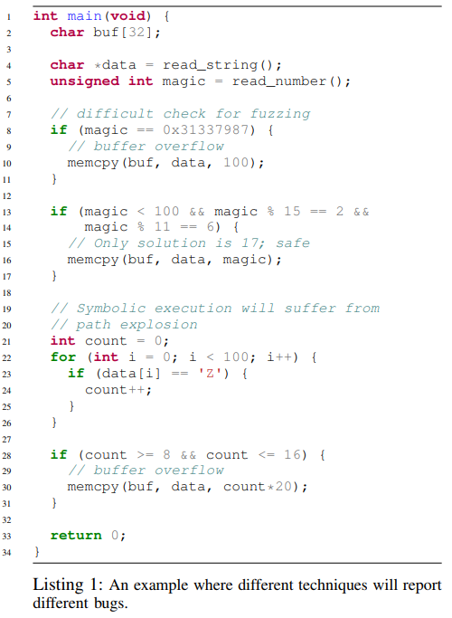
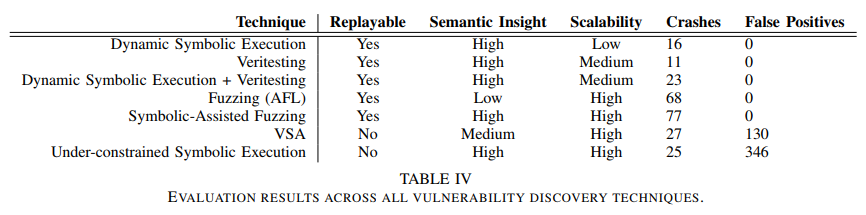

# 8.25 (State of) The Art of War: Offensive Techniques in Binary Analysis

[paper](https://www.cs.ucsb.edu/~vigna/publications/2016_SP_angrSoK.pdf)
[slides](https://docs.google.com/presentation/d/1t7KaCMc73z7WdV7EcL0z9TSHlT_kjdMdSrPHtpA6ezc/edit#slide=id.ga5363f155_3_76)
[video](https://www.youtube.com/watch?v=ONuLsVcaHB8)
[source](https://github.com/angr/angr)

## 简介

这篇文章提出了一个二进制分析框架，并实现了许多现有的分析技术。通过将这些技术系统化地实现，可以让其他研究人员直接利用并开发新的技术。此外，在统一框架中实现这些技术可以更直接地进行比较，并确定各自的优缺点。

## 自动化二进制分析

为了保持程序分析的可行性，往往需要在可重现性和语义理解两个方面需要进行权衡：

- 可重现性：由于分析系统做出的权衡，特定的分析所发现的漏洞可能无法重现。这可能是分析操作的覆盖范围导致的，一些分析从头执行整个应用程序，因此可以推断出触发漏洞的原因，而其他一些分析只是分析了程序的某个部分，这样做可以在特定模块中发现漏洞，但无法完整地推断出触发漏洞的原因，于是无法重现。
- 语义理解：一些分析缺乏对程序语义的理解。例如，动态分析能够追踪程序执行的代码，但不能理解为什么这些代码被执行或者程序输入的哪些部分导致了这样的执行。

为了得到可重现的输入或者语义理解的能力，就需要对分析技术进行权衡。例如，高可重现性往往和低覆盖率相关，因为要想生成可重现的输入必须知道如何到达任何想要分析的代码，那么它将不能分析尽可能多的代码。另一方面，如果不能通过重现来验证漏洞，那么会产生高误报率（即并不存在漏洞）。在缺乏可重现性的情况下，这些误报必须通过启发式的方法进行过滤，反过来又会引入高漏报率。同样的，为了实现语义理解，必须存储和处理大量的数据。例如，具有语义理解能力的动态分析必须保存下程序分支的条件，而具有语义理解能力的静态分析需要适时地调整数据域。但由于系统资源有限，在分析中必须做出取舍。

下面是一个例子，可以对不同分析技术的能力有个简单的认识：

对于静态分析，它可能会将全部 3 个 memcpy 调用都标记为漏洞（即使 16 行的调用其实是安全的），因为静态分析没有足够的信息来确定漏洞是否真的会发生。另外，静态分析可以得到漏洞的地点，但不能得到触发漏洞的输入。对于动态分析（例如 fuzzing），它通过制造输入来触发漏洞，所以通常有很大可能会漏掉需要精确输入的漏洞，例如第 10 行的漏洞。动态符号执行能够检测出第 10 行的错误并通过约束求解得到输入，也能判断出第 16 行没有漏洞，但是它很可能会漏掉第 30 行，因为有多个潜在的路径不会触发该漏洞。另外，在符号执行进行到循环时，可能存在路径爆炸的问题。

## 静态漏洞挖掘

Static analyses can be split into two paradigms: those that model program properties as graphs and those that model the data itself.

### 控制流图恢复

CFG recovery is implemented as a recursive algorithm that disassembles and analyzes a basic block, identifies its possible exits and adds them to the CFG, and then repeats the analysis recursively until no new exits are identified.

CFG recovery has one fundamental challenge: indirect jumps. Specifically, indirect jumps fall into several categories:

- Computed. The target of a computed jump is determined by the application by carrying out a calculation specified by the code. This calculation could further rely on values in other registers or in memory. A common example of this is a jump table.
- Context-sensitive. An indirect jump might depend on the context of an application. The common example is qsort() in the standard C library.
- Object-sensitive. A special case of context sensitivity is object sensitivity. In object-oriented languages, object polymorphism requires the use of virtual functions, often implemented as virtual tables of function pointers that are consulted, at runtime, to determine jump targets.

The goal of CFG recovery is to resolve the targets of as many of these indirect jumps as possible, in order to create a CFG. Depending on how well jump targets are resolved, the CFG recovery analysis has two properties:

- Soundness. A CFG recovery technique is sound if the set of all potential control flow transfers is represented in the graph generated.
- Completeness. A complete CFG recovery builds a CFG in which all edges represent actually possible control flow transfers.

### 值集分析

At a high level, VSA attempts to identify a tight over-approximation of the program state at any given point in the program. This can be used to understand the possible targets of indirect jumps or the possible targets of memory write operations.

## 动态漏洞挖掘

Dynamic techniques here are split into two main categories: concrete and symbolic execution.

### 动态具体执行

The most relevant application of dynamic concrete execution to vulnerability discovery is fuzzing.

- Coverage-based fuzzing. Such fuzzers attempt to produce inputs that maximize the amount of code executed in the target application based on the insight that the more code is executed, the higher the chance of executing vulnerable code.
  - Coverage-based fuzzing suffers from a lack of semantic insight into the target application.
- Taint-based fuzzing. Such fuzzers analyze how an application processes input to understand what parts of the input to modify in future runs.
  - While a taint-based fuzzer can understand what parts of the input should be mutated to drive execution down a given path in the program, it is still unaware of how to mutate this input.

### 动态符号执行

Dynamic symbolic execution executes a program in an emulated environment with an abstract domain of symbolic variables. They track the state of registers and memory throughout program execution and the constraints on those variables. Whenever a conditional branch is reached, execution forks and follows both paths, saving the branch condition as a constraint on the path in which the branch was taken and the inverse of the branch condition as a constraint on the path in which the branch was not taken.

- Classical dynamic symbolic execution. These engines analyze an application by performing path exploration until a vulnerable state is identified.
- Symbolic-assisted fuzzing. Such fuzzers modify inputs identified by the fuzzing component by processing them in a dynamic symbolic execution engine. Dynamic symbolic execution uses a more in-depth understanding of the analyzed program to properly mutate inputs, providing additional test cases that trigger previously-unexplored code and allow the fuzzing component to continue making progress.
- Under-constrained symbolic execution. These engines execute only parts of an application in order to increase the tractability of dynamic symbolic execution.

## angr 分析引擎

### 设计目标

- Cross-architecture support
- Cross-platform support
- Support for different analysis paradigms
- Usability

### 子模块：Intermediate Representation

We leveraged `libVEX`, the IR lifter of the Valgrind project. libVEX produces an IR, called VEX, that is specifically designed for program analysis. We used PyVEX to expose the VEX IR to Python.

### 子模块：Binary Loading

The task of loading an application binary into the analysis system is handled by a module called `CLE`. CLE abstracts over different binary formats to handle loading a given binary and any libraries that it depends on, resolving dynamic symbols, performing relocations, and properly initializing the program state.

#### 子模块：Program State Representation/Modification

The `SimuVEX` module is responsible for representing the program state. The state, named SimState in SimuVEX terms, is implemented as a collection of state plugins, which are controlled by state options specified by the user or analysis when the state is created.

- Registers. SimuVEX tracks the values of registers at any given point in the program as a state plugin of the corresponding program state.
- Symbolic memory. To enable symbolic execution, SimuVEX provides a symbolic memory model as a state plugin.
- Abstract memory. The abstract memory state plugin is used by static analyses to model memory. Unlike symbolic memory, which implements a continuous indexed memory model, the abstract memory provides a region-based memory model.
- POSIX. When analyzing binaries for POSIX-compliant environments, SimuVEX tracks the system state in this state plugins.
- Log. SimuVEX tracks a log of everything that is done to the state in this plugin.
- Inspection. SimuVEX provides a powerful debugging interface, allowing breakpoints to be set on complex conditions, including taint, exact expression makeup, and symbolic conditions. This interface can also be used to change the behavior of SimuVEX.
- Solver. The Solver is a plugin that exposes an interface to different data domains, through the data model provider.
- Architecture. The architecture plugin provides architecturespecific information that is useful to the analysis. The information in this plugin is sourced from the archinfo module, that is also distributed as part of angr.

### 子模块：Data Model

`Claripy` abstracts all values to an internal representation of an expression that tracks all operations in which it is used. These expressions are represented as “expression trees” with values being the leaf nodes and operations being non-leaf nodes.

At any point, an expression can be translated into data domains provided by Claripy’s backends. User-facing operations, such as interpreting the constructs provided by the backends into Python primitives are provided by frontends. A frontend augments a backend with additional functionality of varying complexity.

- FullFrontend. This frontend exposes symbolic solving to the user, tracking constraints, using the Z3 backend to solve them, and caching the results.
- CompositeFrontend. Splitting constraints into independent sets reduces the load on the solver. The CompositeFrontend provides a transparent interface to this functionality.
- LightFrontend. This frontend does not support constraint tracking, and simply uses the VSA backend to interpret expressions in the VSA domain.
- ReplacementFrontend. The ReplacementFrontend expands the LightFrontend to add support for constraints on VSA values.
- HybridFrontend. The HybridFrontend combines the FullFrontend and the ReplacementFrontend to provide fast approximation support for symbolic constraint solving.

### 子模块：Full-Program Analysis

`Project` is the analyst-facing part of angr, which provides complete analyses, such as dynamic symbolic execution and controlflow graph recovery.

- Path Groups. A PathGroup is an interface to dynamic symbolic execution.
- Analyses. angr provides an abstraction for any full program analysis with the Analysis class.

## 实现:数据流图恢复

- CFGAccurate. Given a specific program, angr performs an iterative CFG recovery, starting from the entry point of the program, with some necessary optimizations. angr leverages a combination of forced execution, backwards slicing, and symbolic execution to recover, where possible, all jump targets of each indirect jump. Moreover, it generates and stores a large quantity of data about the target application, which can be used later in other analyses such as data-dependence tracking.
- CFGFast. A secondary algorithm that uses a quick disassembly of the binary (without executing any basic block), followed by heuristics to identify functions, intra-function control flow, and direct inter-function control flow transitions.

### 假设

angr’s CFGAccurate makes several assumptions about binaries to optimize the run time of the algorithm.

- All code in the program can be distributed into different functions.
- All functions are either called by an explicit call instruction, or are preceded by a tail jump in the control flow.
- The stack cleanup behavior of each function is predictable, regardless of where it is called from. This lets CFGAccurate safely skip functions that it has already analyzed while analyzing a caller function and keep the stack balanced.

### 迭代生成 CFG

Throughout CFG recovery, CFGAccurate maintains a list of indirect jumps, Lj, whose jump targets have not been resolved. When the analysis identifies such a jump, it is added to Lj. After each iterative technique terminates, CFGAccurate triggers the next one in the list. This next technique may resolve jumps in Lj, may add new unresolved jumps to Lj, and may add basic blocks and edges to the CFG C. CFGAccurate terminates when a run of all techniques results in no change to Lj or C, as that means that no further indirect jumps can be resolved with any available analysis.

- Forced Execution. angr’s CFGAccurate leverages the concept of Dynamic Forced Execution for the first stage of CFG recovery. Forced Execution ensures that both directions of a conditional branch will be executed at every branch point. CFGAccurate maintains a work-list of basic blocks, Bw, and a list of analyzed blocks, Ba. When the analysis starts, it initializes its work-list with all the basic blocks that are in C but not in Ba. Whenever CFGAccurate analyzes a basic block from this work-list, the basic block and any direct jumps from the block are added to C. Indirect jumps, however, cannot be handled this way. So each indirect jump is stored in the list Lj for later analysis.
- Symbolic Execution. For each jump J ∈ Lj, CFGAccurate traverses the CFG backwards until it find the first merge point or up to a threshold number of blocks. From there, it performs forward symbolic execution to the indirect jump and uses a constraint solver to retrieve possible values for the target of the indirect jump. If the jump is resolved successfully, J is removed from Lj and edges and nodes are added to the CFG for each possible value of the jump target.
- Backward Slicing. CFGAccurate computes a backward slice starting from the unresolved jump. The slice is extended through the beginning of the previous call context. That is, if the indirect jump being analyzed is in a function Fa that is called from both Fb and Fc, the slice will extend backward from the jump in Fa and contain two start nodes: the basic block at the start of Fb and the one at the start of Fc. CFGAccurate then executes this slice using angr’s symbolic execution engine and uses the constraint engine to identify possible targets of the symbolic jumps, with the same threshold of 256 for the size of the solution set for the jump target. If the jump target is resolved successfully, the jump is removed from Lj and the edge representing the control flow transition, and the target basic blocks are added to the recovered CFG.

The goal of the fast CFG generation algorithm is to generate a graph, with high code coverage, that identifies at least the location and content of functions in the binary.

- Function identification. We use hard-coded function prologue signatures, which can be generated from techniques like ByteWeight, to identify functions inside the application.
- Recursive disassembly. Recursive disassembly is used to recover the direct jumps within the identified functions.
- Indirect jump resolution. Lightweight alias analysis, dataflow tracking, combined with pre-defined strategies are used to resolve intra-function control flow transfers.

## 实现：值集分析

Value-Set Analysis (VSA) is a static analysis technique that combines numeric analysis and pointer analysis for binary programs. It uses an abstract domain, called the Value-Set Abstract domain, for approximating possible values that registers or abstract locations may hold at each program point.

- Creating a discrete set of strided-intervals. The basic data type of VSA, the strided interval, is essentially an approximation of a set of numbers. It is great for approximating a set of normal concrete values. We developed a new data type called “strided interval set”, which represents a set of strided intervals that are not unioned together. A strided interval set will be unioned into a single strided interval only when it contains more than K elements, where K is a threshold that can be adjusted.
- Applying an algebraic solver to path predicates. Tracking branch conditions helps us constrain variables in a state after taking a conditional exit or during a merging procedure, which produces a more precise analysis result. We implemented a lightweight algebraic solver that works on the strided interval domain, based on modulo arithmetic which take care of some of the affine relations. When a new path predicate is seen, we attempt to simplify and solve it to obtain a number range for the variables involved in the path predicate. Then we perform an intersection between the newly generated number range and the original values for each corresponding variable.
- Adopting a signedness-agnostic domain. Wrapped Interval Analysis is such an interval domain for analyzing LLVM code, which takes care of signed and unsigned numbers at the same time. We based our signedness-agnostic strided-interval domain on this theory, applied to the VSA domain.

The main interface that angr provides into a full-program VSA analysis is the Value Flow Graph. The VFG is an enhanced CFG that includes the program state representing the VSA fix-point at each program location.

## 实现：动态符号执行

The dynamic symbolic execution module of our analysis platform is mainly based on the techniques described in Mayhem. Our implementation follows the same memory model and path prioritization techniques.

We use Claripy’s interface into Z3 to populate the symbolic memory model (specifically, SimSymbolicMemory) provided by SimuVEX. Individual execution paths through a program are managed by Path objects, provided by angr, which track the actions taken by paths, the path predicates, and various other path-specific information. Groups of these paths are managed by angr’s PathGroup functionality, which provides an interface for managing the splitting, merging, and filtering of paths during dynamic symbolic execution.

angr has built-in support for Veritesting, implementing it as a Veritesting analysis and exposing transparent support for it with an option passed to PathGroup objects.

## 实现：非约束的符号执行

We implemented under-constrained symbolic execution (UCSE), as proposed in UC-KLEE, and dubbed it UC-angr. UCSE is a dynamic symbolic execution technique where execution is performed on each function separately.

We made two changes to the technique described in UCSE:

- Global memory under-constraining.We mark all global data as underconstrained, allowing us to lower our false positive rate.
- Path limiters. We abort the analysis of a function when we find that it is responsible for a path explosion. We detect this by hard-coding a limit and, when a single function branches over this many paths, we replace the function with an immediate return, and rewind the analysis from the call site of that function.
- False positive filtering. When we detect an exploitable state, we attempt to ensure that the state is not incorrectly made exploitable by a lack of constraints on under-constrained data.

## 实现：符号辅助的 fuzzing

Our implementation of symbolic-assisted fuzzing, called Driller, uses the AFL fuzzer as its foundation and angr as its symbolic tracer.

## 实现：崩溃重现

We implemented the approach proposed by Replayer to recover missing relationships between input values and output values.

We can define the problem of replaying a crashing input as the search for an input specification is to bring a program from an initial state s to a crash state q. Our implementation symbolically executes the path from sa to qa, using the input ia. It records all constraints that are generated while executing P. Given the constraints, the execution path, the program P, and the new initial state sb, we can symbolically execute P with an unconstrained symbolic input, following the previously recorded execution path until the new crash state qb is reached. At this point, the input constraints on the input and output can be analyzed, and relationships between them can be recovered. This relationship data is used to generate the input specification is, allowing the crashing input to be replayed.

## 实现：利用生成

we generate exploits by performing concolic execution on crashing program inputs using angr. We drive concolic execution forward, forcing it to follow the same path as a dynamic trace gathered by concretely executing the crashing input applied to the program. Concolic execution is stopped at the point where the program crashed, and we inspect the symbolic state to determine the cause of the crash and measure exploitability. By counting the number of symbolic bits in certain registers, we can triage a crash into a number of categories such as frame pointer overwrite, instruction pointer overwrite, or arbitrary write, among others.

## 实现：利用强化

To harden exploits against modern mitigation techniques, we implemented a ROP chain compiler based on the ideas in Q.

- Gadget discovery. We scan all executable code in the application, at every byte offset, to identify ROP gadgets and classify them according to their effects. To carry out the classification, our analysis leverages the action history provided by angr’s Path objects and symbolic relations provided by Claripy.
- Gadget arrangement. The ROP chain compiler then determines arrangements of gadgets that can be used to perform high-level actions.
- Payload generation. After the ROP compiler identifies the requisite set of gadget arrangements, it combines these gadgets into a chain to carry out high-level actions. This is done by writing gadget arrangements into a program state in angr, constraining their outputs to the provided arguments, and querying the SMT solver for a solution for their inputs.

## 比较评估

