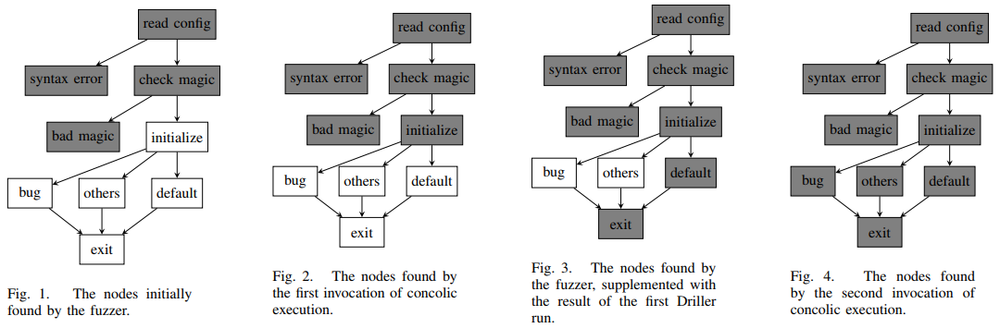

# 8.26 Driller: Augmenting Fuzzing Through Selective Symbolic Execution

[paper](http://cs.ucsb.edu/~chris/research/doc/ndss16_driller.pdf)

## 简介

这篇文章提出了 Driller，这是一种混合漏洞挖掘工具，它以互补的方式将模糊测试和选择性混合执行结合起来，以发现隐藏更深的漏洞。模糊测试用于探索程序空间的不同区间，并使用混合执行来生成满足不同区间的输入。

## Driller 概述

A core intuition behind the design of Driller is that applications process two different classes of user input: `general` input, representing a wide range of values that can be valid, and `specific` input, representing input that must take on one of a select few possible values. Conceptually, an application’s checks on the latter type of input split the application into compartments. Execution flow moves between compartments through checks against specific input, while, within a compartment, the application processes general input.

Driller is composed of multiple components：

- Input test cases. Driller can operate without input test cases. However, the presence of such test cases can speed up the initial fuzzing step by pre-guiding the fuzzer toward certain compartments.
- Fuzzing. When Driller is invoked, it begins by launching its fuzzing engine. The fuzzing engine explores the first compartment of the application until it reaches the first complex check on specific input.
- Concolic execution. Driller invokes its selective concolic execution component when the fuzzing engine gets stuck. This component analyzes the application, pre-constraining the user input with the unique inputs discovered by the prior fuzzing step to prevent a path explosion. After tracing the inputs discovered by the fuzzer, the concolic execution component utilizes its constraint-solving engine to identify inputs that would force execution down previously unexplored paths.
- Repeat. Once the concolic execution component identifies new inputs, they are passed back to the fuzzing component, which continues mutation on these inputs to fuzz the new compartments.

In this example, the application parses a configuration file, containing a magic number, received over an input stream. If the received data contains syntax errors or an incorrect magic number, the program exits. Otherwise, control flow switches based on input between a number of new compartments, some of which contain memory corruption flaws.

- Figure 1. Fuzzing the first compartment of the application. Then the fuzzing engine gets stuck on the comparison with the magic number.
- Figure 2. Driller executes the concolic execution engine to identify inputs that will drive execution past the check, into other program compartments.
- Figure 3. Driller enters its fuzzing stage again, fuzzing the second compartment. The fuzzer cannot find any arms of the key switch besides the default.
- Figure 4. When this second fuzzing invocation gets stuck, Driller leverages its concolic execution engine to discover the "crashstring" and "set_option" inputs.

## 模糊测试

To implement Driller, we leveraged a popular off-the-shelf fuzzer, American Fuzzy Lop (AFL). Our improvements mostly deal with integrating the fuzzer with our concolic execution engine. Since instrumentation that AFL relies on can be either introduced at compile-time or via a modified QEMU, we opted for a QEMU-backend to remove reliance on source code availability.

### Fuzzer Features

- Genetic fuzzing. AFL carries out input generation through a genetic algorithm, mutating inputs according to genetics-inspired rules and ranking them by a fitness function.
- State transition tracking. AFL tracks the union of control flow transitions that it has seen from its inputs, as tuples of the source and destination basic blocks.
- Loop “bucketization”. When AFL detects that a path contains iterations of a loop, a secondary calculation is triggered to determine whether that path should be eligible for breeding. AFL determines the number of loop iterations that were executed and compares it against previous inputs that caused a path to go through the same loop. These paths are all placed into “buckets” by the logarithm of their loop iteration count.
- Derandomization. We pre-set AFL’s QEMU backend to a specific random seed to ensure consistent execution. Later, when a crashing input is discovered, we use our concolic execution engine to recover any “challenge-response” behavior or vulnerabilities that rely on leaking randomness.

### Fuzzer Limitations

Because fuzzers randomly mutate input, and genetic fuzzers, in turn, mutate input that has, in the past, generated unique paths through a binary, they are able to quickly discover different paths that process “general” input. However, the generation of “specific” input to pass complex checks in the application is very challenging for fuzzers.

### Transition to Concolic Execution

Driller aims to complement the fundamental weakness of fuzzing, determining specific user input required to pass complex checks, by leveraging the strength of concolic execution. When the fuzzing component has gone through a predetermined amount (proportional to the input length) of mutations without identifying new state transitions, we consider it “stuck”. Driller then retrieves the inputs that the fuzzer has deemed “interesting” in the current compartment and invokes the concolic execution engine on them.

The fuzzer identifies inputs as interesting if one of two conditions holds:

- The path that the input causes the application to take was the first to trigger some state transition.
- The path that the input causes the application to take was the first to be placed into a unique “loop bucket”.

## 选择性混合执行

When Driller determines that the fuzzer is unable to find additional state transitions, the concolic execution engine is invoked. The concolic execution engine is used to leverage a symbolic solver to mutate existing inputs that reach but fail to satisfy complex checks into new inputs that reach and satisfy such checks.

When Driller invokes the concolic execution engine, it passes all of the “interesting” inputs that were identified by the fuzzing engine. Each input is traced, symbolically, to identify state transitions that the fuzzing engine was unable to satisfy. When such a transition is identified, the concolic execution engine produces input that would drive execution through this state transition.

After the concolic execution engine finishes processing the provided inputs, its results are fed back into the fuzzing engine’s queue and control is passed back to the fuzzing engine.

### Concolic Execution

We leveraged angr for Driller’s concolic execution engine. The engine is based on the model popularized and refined by Mayhem and S2E.

Driller’s symbolic memory model can store both concrete and symbolic values. It uses an index-based memory model in which read addresses may be symbolic, but write address are always concretized. This approach, popularized by Mayhem, is an important optimization to keep the analysis feasible.

### Limitations

The traditional approach to concolic execution involves beginning concolic execution from the beginning of a program and exploring the path state with the symbolic execution engine to find as many bugs as possible. However, this approach suffers from two major limitations.

- First, concolic execution is slow. Specifically, the latter operation involves the solution of an NP-complete problem, making the generation of potential inputs time-consuming.
- Worse, symbolic execution suffers from the state explosion problem. The number of paths grows exponentially as the concolic execution engine explores the program.

### Concolic Execution in Driller

In most cases, most of the work is offloaded from the concolic execution engine to the fuzzer, which will find many paths quickly, letting the concolic engine just work on solving the harder constraints.

- Pre-constrained Tracing
  - A key factor in the effectiveness of this approach is that it allows Driller to avoid the path explosion inherent in concolic exploration, because only the path representing the application’s processing of that input is analyzed. When Driller comes upon a conditional control flow transfer, it checks if inverting that condition would result in the discovery of a new state transition. If it will, Driller produces an example input that will drive execution through the new state transition instead of the original control flow. After producing the input, Driller continues following the matching path to find additional new state transitions.
- Input Preconstraining
  - Driller uses preconstraining to ensure that the results of the concolic execution engine are identical to those in the native execution while maintaining the ability to discover new state transitions. In preconstrained execution, each byte of input is constrained to match each actual byte that was output by the fuzzer. When new possible basic block transitions are discovered, the preconstraining is briefly removed, allowing Driller to solve for an input that would deviate into that state transition.
- Limited Symbolic Exploration
  - This symbolic exploration stub explores the surrounding area of the state transition until a configurable number of basic blocks has been traversed by the explorer. Once this number of blocks has been discovered, Driller concretizes inputs for all paths discovered by the explorer.
- Re-randomization
  - Once a vulnerability is discovered, we use symbolic execution to trace crashing inputs and recover input bytes that need to satisfy dynamic checks posed by the target binary. By inspecting the symbolic state at crash time and finding the relationships between the application’s output and the crashing input, Driller can determine the application’s challenge-response protocol.
