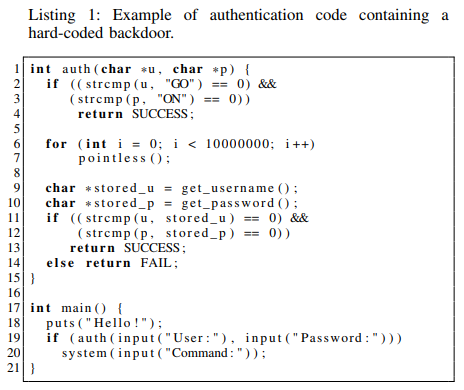
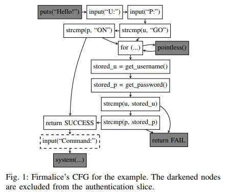

# 8.27 Firmalice - Automatic Detection of Authentication Bypass Vulnerabilities in Binary Firmware

[paper](https://seclab.cs.ucsb.edu/media/uploads/papers/firmalice.pdf)
[slides](https://docs.google.com/presentation/d/1kwObiKZsPSpxM0uZByzeRTaLC7RS1E2C7UR6HxD7Y1Y/edit#slide=id.g1d1712ddc1_0_0)
[video](https://www.youtube.com/watch?v=Fi_S2F7ud_g)

## 简介

这篇文章提出了 Firmalice，一种二进制分析框架，以支持对嵌入式设备上所运行的固件进行分析。Firmalice 构建在符号执行引擎之上，并且提供了程序切片之类的技术来提高其可扩展性。此外，Firmalice 构建了一种新型的认证旁路漏洞模型，基于攻击者的能力来确定执行特权操作所需要的输入。

Detecting authentication bypasses in firmware is challenging for several reasons:

- The source code of the firmware is not available.
- Firmware often takes the form of a single binary image that runs directly on the hardware of the device, without an underlying operating system.
- Embedded devices frequently require their firmware to be cryptographically signed by the manufacturer, making modification of the firmware on the device for analysis purposes infeasible.

## 认证旁路漏洞

Many embedded devices contain `privileged operations` that should only be accessible by `authorized users`. To protect these privileged operations, these devices generally include some form of user verification. This verification almost always takes the form of an authentication of the user’s credentials before the privileged functionality is executed.

The verification can be avoided by means of an authentication bypass attack. Authentication bypass vulnerabilities, commonly termed “backdoors,” allow an attacker to perform privileged operations in firmware without having knowledge of the valid credentials of an authorized user.

To reason about these vulnerabilities, we created a model based on the concept of `input determinism`. Our authentication bypass model specifies that all paths leading from an entry point into the firmware to a privileged operation must validate some input that the attacker cannot derive from the firmware image itself or from prior communication with the device. In other words, we report an authentication bypass vulnerability when an attacker can craft inputs that lead the firmware execution to a privileged operation.

## 方法概述

The identification of authentication bypasses in firmware proceeds in several steps. At a high level, Firmalice loads a firmware image, parses a security policy, and uses static analysis to drive a symbolic execution engine. The results from this symbolic execution are then checked against the security policy to identify violations.

- Firmware Loading. Before the analysis can be carried out, firmware must be loaded into our analysis engine.
- Security Policies. Firmalice takes the `privileged operation`, described by a security policy, and identifies a set of `privileged program points`, which are points in the program that, if executed, represent the privileged operation being performed.
- Static Program Analysis. This module generates a program dependency graph of the firmware and uses this graph to create an `authentication slice` from an entry point to the privileged program point.
- Symbolic Execution. The symbolic execution engine attempts to find paths that successfully reach a `privileged program point`.
- Authentication Bypass Check. This module uses the concept of `input determinism` to determine whether the state in question represents the use of an authentication bypass vulnerability.

The example is a user-space firmware sample with a hardcoded backdoor, wihch is the check in lines 2 and 3. The security policy provided to Firmalice is: “The Firmware should not present a prompt for a command (specifically, output the string "Command:") to an unauthenticated user.”

Firmalice first loads the firmware program and carries out its Static Program Analysis. This results in a control flow graph and a data dependency graph. The latter is then used to identify the location in the program where the string "Command:" is shown to the user. This serves as the privileged program point for Firmalice’s analysis.

Firmalice utilizes its Static Program Analysis module to create an authentication slice to the privileged program point. The extracted authentication slice is then passed to Firmalice’s Symbolic Execution engine. This engine explores the slice symbolically, and attempts to find user inputs that would reach the privileged program point. In this case, it finds two such states: one that authenticates the user via the backdoor, and one that authenticates the user properly.

As these privileged states are discovered, they are passed to the Authentication Bypass Check module. In this case, the component would detect that the first state (with a username of “GO” and a password of “ON”) contains a completely deterministic input, and, thus, represents an authentication bypass.

## 固件加载

Firmware takes one of two forms:

- user-space firmware. Some embedded devices actually run a general-purpose OS, with much of their functionality implemented in user-space programs. All of the OS primitives, program entry points, and library import symbols are well-defined.
- Binary-blob firmware. Firmware often takes the form of a single binary image that runs directly on the bare metal of the device, without an underlying operating system. OS and library abstractions do not exist in such cases, and it is generally unknown how to properly initialize the runtime environment of the firmware sample, or at what offset to load the binary and at what address to begin execution.

### Disassembly and Intermediate Representation

Firmalice supports a wide range of processor architectures by carrying out its analyses over an intermediate representation (IR) of binary code.

### Base Address Determination

Firmalice identifies the expected location of a binary-blob firmware in memory by analyzing the relationship between jump table positions and the memory access pattern of the indirect jump instructions.

### Entry Point Discovery

Firmalice attempts to automatically identify potential execution entry points:

- First, Firmalice attempts to identify functions in the binary blob.
- Next, Firmalice creates a coarse directed call graph from the list of functions, and identifies all the weakly-connected components of this graph. Any root node of a weaklyconnected component is identified as a potential entry point.

## 安全策略

Firmalice requires a human analyst to provide a security policy. For our purposes, a security policy must specify what operations should be considered privileged. When provided a security policy, Firmalice analyzes the firmware in question to convert the policy into a set of `privileged program points`. This set of program points is then utilized by Firmalice in its analysis to identify if the execution can reach the specified program point without proper authentication.

The policies that Firmalice supports:

- Static output. A security policy can be specified as a rule about some static data the program must not output to a user that has not been properly authenticated.
  - Firmalice searches the firmware for the static data and utilizes its data dependency graph to identify locations in the program where this data can be passed into an output routine.
- Behavioral rules. Another policy that Firmalice supports is the regulation of what actions a device may take without authentication.
  - Firmalice analyzes its control flow graph and data dependency graph for positions where an action is taken that matches the parameters specified in the security policy.
- Memory access. Firmalice accepts security policies that reason about access to absolute memory addresses.
  - Firmalice identifies locations in the data dependency graph where such memory locations are accessed.
- Direct privileged program point identification. The privileged program points can be specified directly as function addressed in the security policy.

## 静态程序分析

The identification of privileged program points specified by a security policy, and the creation of backward slices leading to them, requires the use of a program dependency graph (PDG) to reason about the control and data flow required to arrive at a specific point in the program. The program dependency graph comprises a data dependency graph (DDG) and a control dependency graph (CDG).

### Control Flow Graph

The first step in creating a PDG is the creation of a CFG. Firmalice creates a context-sensitive CFG by statically analyzing the firmware, starting from each of the entry points and looking for jump edges in the graph.

To increase the precision of its CFG, Firmalice utilizes `forced execution` to systematically explore both directions of every conditional branch. When it encounters a computed or indirect jump, Firmalice can leverage its symbolic execute engine to reason about the possible targets of that jump.

### Control Dependency Graph

We use a context sensitivity of 2 when generating the CDG, which allows Firmalice to reason about not only the basic block that needs to execute so that a given statement is reached, but also the call context from which that basic block must be executed. The CDG is generated via a straightforward transformation of the CFG.

### Data Dependency Graph

Firmalice adopts an existing, worklist-based, iterative approach to data flow analysis. The approach is an inter-procedural data flow analysis algorithm that uses `def-use` chains, in addition to `use-def` chains, to optimize the worklist algorithm.

### Backward Slicing

Using the PDG, Firmalice can compute backward slices. That is, starting from a given program point, we can produce every statement on which that point depends.

## 符号执行引擎

The implementation of this module of Firmalice follows ideas presented in Mayhem, adding support for symbolic summaries of functions, to automatically detect common library functions and abstract their effects on the symbolic state.

### Symbolic State and Constraints

Firmalice’s symbolic analysis works at the level of symbolic `states`. Whenever a path reaches the privileged program point, its associated state is labeled as a `privileged state` and passed to the Authentication Bypass Check module for further analysis, based on constraint solving.

### Symbolic Summaries

Firmalice adopts the concept of “symbolic summaries”, which involves descriptions of the transformation that certain commonly-seen functions have on a program state. A symbolic summary acts in the same way as a binary instruction: it consumes an input state and produces a set of output states.

When Firmalice symbolically calls a function for the first time, the analysis is paused and the function-testing phase begins. Firmalice first attempts to run the function with the test case states. If all of the test cases of a symbolic summary pass, Firmalice replaces the entry point to the function in question with that symbolic summary, and continues its analysis. Any subsequent jumps to that address will instead trigger execution of the symbolic summary. If no symbolic summary is identified as the right summary for a function, the function is analyzed normally.

### Lazy Initialization

Firmalice adopts a lazy approach to firmware initialization. When the execution engine encounters a memory read from uninitialized memory, it identifies other procedures that contain direct memory writes to that location, and labels them as `initialization procedures`. If an initialization procedure is identified, the state is duplicated: one state continues execution without modification, while the other one runs the initialization procedure before resuming execution.

## 认证旁路检查

Given an `privileged state` from the Symbolic Execution engine, the Authentication Bypass Check module identifies the input and output from/to the user and reasons about the `exposure` of data represented by the output. It then attempts to uniquely concretize the user input. If the user input can be uniquely concretized, then it represents that the input required to reach the `privileged program point` can be uniquely determined by the attacker, and the associated path is labeled as an `authentication bypass`. At this point, Firmalice terminates its analysis. In cases where the user input depends on data exposed by the device’s output, a function that can generate valid inputs for a provided output is produced.

### Choosing I/O

What should be considered as user input to the firmware is not always obvious. Firmalice uses several heuristics to identify input and output. Alternatively, Firmalice can accept a specification of the Application Binary Interface of the firmware and use that to choose between input and output.

### Data Exposure

The core intuition of our approach is that data seen by the user, via an output routine, is `exposed` to the attacker. Specifically, this exposure does not just reveal information about the output data: information is also revealed about any data that depends on or is related to the output. The attackers can deduce information about authentication credentials by observing program outputs.

### Constraint Solving

For each privileged state, Firmalice attempts to concretize the user input to determine the possible values that a user can input to successfully reach the privileged program point. A properly-authenticated path contains inputs that concretize to a large set of values. Conversely, the existence of a path for which the input concretizes into a limited set of values signifies that an attacker can determine, using a combination of information within the firmware image and information that is revealed to them via device output, an input that allows them to authenticate.
