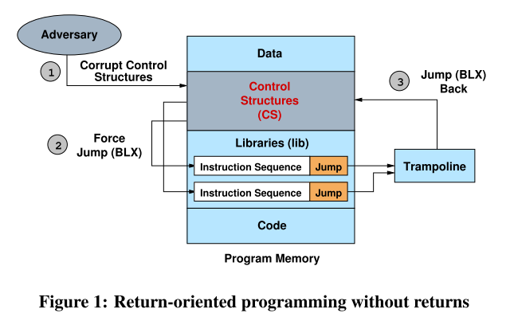
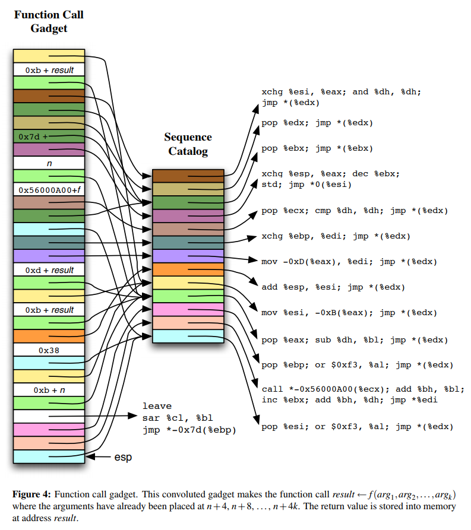

# 8.2 Return-Oriented Programming without Returns

[paper](https://www2.cs.uic.edu/~s/papers/noret_ccs2010/noret_ccs2010.pdf)

## 简介

论文提出了一种不依赖于使用 return 指令的 ROP 技术。这种攻击方法是在 libc 中找到一些特定的指令序列，来替代 return 指令，完成和 return 同样的工作。这些指令具备图灵完备性，已经在 (x86)Linux 和 (ARM)Android 中被证实。

由于该攻击方法并不使用 return 指令，所以那些基于 return 原理实现的 ROP 防御技术就失效了。

## 背景

正常程序的指令流执行和 ROP 的指令流执行有很大不同，至少存在下面两点：

- ROP 执行流会包含了很多 return 指令，而且这些 return 指令只间隔了几条其他指令
- ROP 利用 return 指令来 unwind 堆栈，却没有与 `ret` 指令相对应的 `call` 指令

针对上面两点不同，研究人员提出了很多 ROP 检测和防御技术：

- 针对第一点不同，可以检测程序执行中是否有频繁 return 的指令流，作为报警的依据
- 针对第二点不同，可以通过 call 和 return 指令来查找正常程序中通常都存在的后进先出栈里维护的不变量，判断其是否异常。或者维护一个影子堆栈（shadow stack）作为正常堆栈的备份，每次 return 时对比影子堆栈和正常堆栈是否一致。
- 还有更极端的，在编译器层面重写二进制文件，消除里面的 return 指令

所以其实这些早期的防御技术都默认了一个前提，即 ROP 中必定存在 return 指令。所以反过来想，如果攻击者能够找到既不使用 return 指令，又能改变执行流执行任意代码的 ROP 链，那么就成功绕过了这些防御。

## ROP Without Returns

于是不依赖于 return 指令的 ROP 技术诞生了。

我们知道 return 指令的作用主要有两个：一个是通过间接跳转改变执行流，另一个是更新寄存器状态。在 x86 和 ARM 中都存在一些指令序列，也能够完成这些工作，它们首先更新全局状态（如栈指针），然后根据更新后的状态加载下一条指令序列的地址，最后跳转过去执行（把它们叫做 update-load-branch 指令序列）。使用这些指令序列完全可以避免 return 指令的使用。

就像下面这样，`x` 代表任意的通用寄存器：

```text
pop x
jmp *x
```

`r6` 通用寄存器里是更新后的状态：

```text
adds r6, #4
ldr r5, [r6, #124]
blx r5
```

由于 update-load-branch 指令序列相比 return 指令更加稀少，所以需要把它作为 trampoline 重复利用。在构造 ROP 链时，选择以 trampoline 为目标的间接跳转指令结束的指令序列。当一个 gadget 执行结束后，跳转到 trampoline，trampoline 更新程序全局状态，并将程序控制交给下一个 gadget，由此形成 ROP 链。

跳转攻击流程的原理如下图所示：



在 x86 上，我们使用一个寄存器 y 保存 trampoline 的地址，那么以间接跳转到 y 结束的指令序列的行为就像是以一个 update-load-branch 指令结束一样。并形成像 ROP 链一样的东西。这种操作在 ARM 上也是类似的。

## x86 上的具体实现

x86 上的 return 指令有如下效果：

1. 检索堆栈顶部的 4 个字节，用它设置指令指针 eip
2. 将堆栈指针 esp 值增加 4

传统的 ROP 就是依靠这个操作将布置到栈上的指令片段地址串起来，依次执行。

现在我们考虑下面的指令序列：

```text
pop %eax; jmp *%eax
```

它的行为和 return 很像，唯一的副作用是覆盖了 eax 寄存器的内容。现在假设程序的执行不依赖于 eax 寄存器，那么这一段指令序列就完全可以取代 return，这一假设正是本论文的关键。

首先，我们当然可以把 eax 换成其它任意一个通用寄存器。其次，比起单间接跳转，我们通常使用双重间接跳转：

```text
pop %eax; jmp *(%eax)
```

此时 eax 寄存器存放的是一个被叫做 sequence catalog 表中的地址，该表用于存放各种指令序列的地址，也就是类似于 GOT 表的东西。第一次跳转，是从上一段指令序列跳到 catalog 表，第二次跳转，则从 catalog 表跳转到下一段指令序列。这样做使得 ROP 链的构造更加便捷，甚至可以根据某指令序列相对表的偏移来实现跳转。

下图是一个函数调用的示例：



通过 gadget 来实现函数调用一方面可以调用正常的返回导向指令序列，另一方面可以调用合法的函数（需要移动栈指针以及处理返回值）。在函数调用之前，栈指针应该被移动到一个新的位置，以防改写栈上的其他 gadget。如果函数执行时栈指针位于位置 n，那么 k 个参数应该被保存在 n+4, n+8, ... , n+4k。然后函数调用 gadget 从而调用函数 A -> fun(arg1, arg2, ..., argn)。

1.装载寄存器 esi, ebp 和 eax。

- 将 catalog 中 call-jump 序列的地址装入 esi 寄存器：

```text
pop %esi; or $0xf3, %al; jmp *(%edx);

# call-jump 序列： call *-0x56000A00(%ecx); add %bh, %bl; inc %ebc; add %bj, %dh; jmp *%edi;
```

- 将 catalog 中 leave-jump 序列的地址装入 ebp 寄存器：

```text
pop %ebp; or $0xf3, %al; jmp *(%edx);

# leave-jump 序列：leave; sar %cl, %bl; jmp *-0x7d(%ebp);
```

- 将值 0xb+n 装入 eax 寄存器：

```text
pop %eax; sub %dh, %bl; jmp *(%edx);
```

2.call-jump 序列的地址位于地址 n，将值 0x38 装入寄存器 esi，并加上栈指针的值。此时 esi 保存了一个地址，在函数调用返回时会将栈指针设置为该地址。

```text
mov %esi, -0xB(%eax); jmp *(%edx);

pop %esi; or $0xf3, %al; jmp *(%edx);

add %esp, %esi; jmp *(%edx);
```

3.将函数返回时栈指针的值赋值给 ebp。

- 先将函数返回的栈指针保存到 esi 指向的内存中：

```text
pop %eax; sub %dh, %bl; jmp *(%edx);

mov %esi, -0xB(%eax); jmp *(%edx);
```

- 将上一步存放的栈指针取出来放入 edi 寄存器：

```text
pop %eax; sub %dh, %bl; jmp *(%edx);

mov -0xD(%eax), %edi; jmp *(%edx);
```

- 通过 xchg 交换 edi 和 ebp：

```text
xchg %ebp, %edi; jmp *(%edx);
```

此时，edi 中保存 leave-jump 序列的地址，ebp 保存函数返回后的栈指针地址。

4.将 `pop %ebx; jmp *(%ebx);` 序列的地址装入 esi，保存函数地址的指针（加上偏移量）装入 ecx，将值 n 装入 eax。交换 esp 和 eax 的值，使得栈指针被设置为 n。

```text
pop %esi; or $0xf3, %al; jmp *(%edx);

pop %ecx; cmp %dh, %dh; jmp *(%edx);

pop %eax; sub %dh, %bl; jmp *(%edx);

xchg %esp, %eax; dec %ebx; std; jmp *0(%esi);
```

5.由于 n 保存了 call-jump 序列的地址，此时 call-jump 序列被调用，即函数被间接调用。函数返回后，eax 保存了返回值。由于 edi 保存了 leave-jump 序列的地址，因此 leave-jump 序列被调用，将 ebp 赋值给 esp，并从栈顶 pop 出新的 ebp：

```text
pop %ebx; jmp *(%ebx);

call *-0x56000A00(%ecx); add %bh, %bl; inc %ebc; add %bj, %dh; jmp *%edi;

leave; sar %cl, %bl; jmp *-0x7d(%ebp);
```

此时 ebp 指向 `pop %ebx; jmp *(%ebx);`，然后 jmp 过去。

6.将 eax 里的返回值保存到内存：

```text
pop %ebx; jmp *(%ebx);

pop %edx; jmp *(%edx);

xchg %esi, %eax; and %dh, %dh; jmp *(%edx);

pop %eax; sub %dh, %bl; jmp *(%edx);

mov &esi, -0xB(%eax); jmp *(%edx);
```

在另一篇论文里，几乎同时提出了这种基于 jmp 指令的攻击方法，即跳转导向编程（Jump-Oriented Programming），参考章节 8.47。
