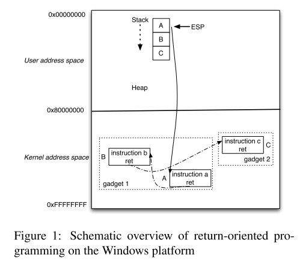
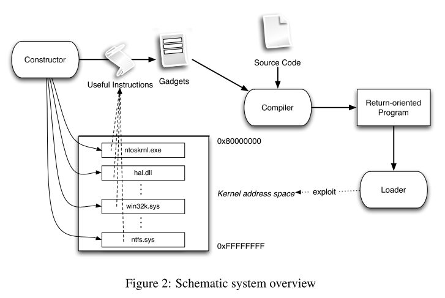

# 8.3 Return-Oriented Rootkits: Bypassing Kernel Code Integrity Protection Mechanisms

[paper](https://www.usenix.org/legacy/event/sec09/tech/full_papers/hund.pdf)

## 简介

本论文设计并实现了一个能够自动化构建 ROP 指令序列的攻击系统。由于系统使用的指令序列来自内核已有的代码，而不需要进行代码注入，所以能够绕过内核代码完整性保护机制。

## 内核完整性保护机制

### 内核模块签名

这一机制要求所有内核模块都需要经过数字签名的验证，并拒绝加载验证失败的代码，所以它的有效性在模块加载时体现，可以一定程度上防御代码注入攻击。但这种方法并不能保证已有的内核代码中没有可以利用的漏洞或指令序列。

### W⊕X

这一机制通过对内存进行可读或可写的标记，能够在运行时防御代码注入攻击。这种机制对于内核的有效性在于，它假设了攻击者会对内核空间的代码进行修改和执行，然而在实践中，攻击者往往先获得用户空间的权限，然后修改虚拟地址中用户空间部分的页面权限。由于页表的不可执行位标记不够精细，所以不可能仅在用户模式下就将页面标记为可执行。于是攻击者可以在用户空间准备好自己的指令，然后让漏洞代码跳转到那里执行。

## 自动化 ROP

基于 ROP 技术，就可以绕过上面的内核完整性保护机制。

内核 ROP 如下图所示：

自动化攻击系统的结构如下图所示：

其中的三个核心组成部分：

- Constructor：扫描给定的二进制文件，标记出有用的指令序列，并自动构建出 gadgets
- Compiler：提供了一种专门用于 ROP 的语言，它将 Constructor 的输出和用该语言编写的源文件一起编译，生成程序的最终内存映像
- Loader：由于 Compiler 的输出是位置无关的，Loader 用于将相对地址解析为绝对地址
