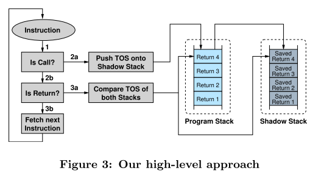
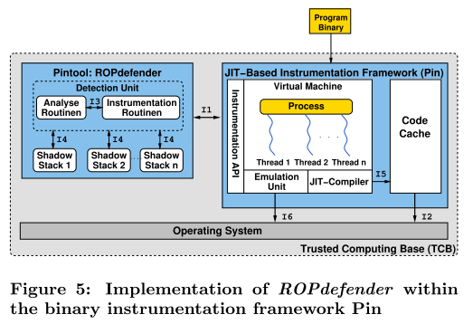

# 8.4 ROPdefender: A Detection Tool to Defend Against Return-Oriented Programming Attacks

[paper](https://www.ei.ruhr-uni-bochum.de/media/trust/veroeffentlichungen/2010/12/14/HGI-TR-2010-001.pdf)

## 简介

论文设计并实现了工具 ROPdefender，可以动态地检测传统的 ROP 攻击（基于return指令）。ROPdefender 可以由用户来执行，而不依赖于源码、调试信息等在现实中很难获得的信息。

ROPdefender 基于二进制插桩框架 Pin 实现，作为一个 Pintool 使用，在运行时强制进行返回地址检查。

## 背景

现有的 ROP 检测方法会维护一个 shadow stack，作为返回地址的备份。当函数返回时，检查返回地址是否被修改。

这种方法有个明显的缺陷，它只能检测预期的返回（intended return），而对于非预期的返回（unintended return）无效。

intended instruction 是程序中明确存在的指令。而 unintended instruction 是正常指令通过偏移得到的指令。举个例子：

intended instruction：

```text
b8 13 00 00 00  mov $0x13, %eax
e9 c3 f8 ff ff  jmp 3aae9
```

偏移两个十六进制后的 unintended instruction：

```text
00 00   add %al, (%eax)
00 e9   add %ch, %cl
c3      ret
```

这样的返回不会被备份到 shadow stack 中，因此也不会被检测到。

另外，如果攻击者修改的不是返回地址，而是函数的 GOT 表，则同样不会被检测到。

## 解决方案

ROPdefender 同样也使用 shadow stack 来储存每次函数调用的返回地址。在每次函数返回时进行返回地址检查。

与现有方法不同的是：

- ROPdefender 会检查传递给处理器的每个返回指令（基于JIT插桩工具），这样即使攻击者使用 unintended instruction 也会被检测到
- ROPdefender 还能处理各种特殊的情况

整体思想如下图所示：



在处理器执行指令时，对指令类别进行判断，如果是 call，将返回地址放进 shadow stack；如果是 return，则检查与 shadow stack 顶部的返回地址是否相同。这一方法不仅可用于检测 ROP 攻击，还可以检测所有利用缓冲区溢出改写返回地址的攻击。

## 实现细节

基于 Pin 动态二进制插桩（DBI）框架的实现如下图所示：



一般工作流程是这样的，程序在 DBI 框架下加载并启动。DBI 框架确保：

1. 程序的每条指令都在 DBI 的控制下执行
2. 所有指令都根据 ROPdefender 特定的检测代码执行，然后进行返回地址检查

ROPdefender 包含了多个 shadow stack 和一个 detection unit。detection unit 用于 shadow stack 返回地址的压入和弹出，并进行强制返回地址检查。使用多个 shadow stack 的原因是程序可能会有多个线程，这样就可以为每个线程都维护一个 shadow stack。
