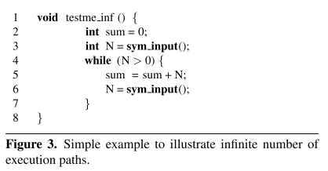
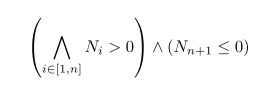

# 8.9 Symbolic Execution for Software Testing: Three Decades Later

[paper](https://people.eecs.berkeley.edu/~ksen/papers/cacm13.pdf)

## 简介

近几年符号执行因其在生成高覆盖率的测试用例和发现复杂软件漏洞的有效性再次受人关注。这篇文章对现代符号执行技术进行了概述，讨论了这些技术在路径探索，约束求解和内存建模方面面临的主要挑战，并讨论了几个主要从作者自己的工作中获得的解决方案。

这算是一篇很经典很重要的论文了。

## 传统符号执行

符号执行的关键是使用符号值替代具体的值作为输入，并将程序变量的值表示为符号输入值的符号表达式。其结果是程序计算的输出值被表示为符号输入值的函数。一个符号执行的路径就是一个 true 和 false 组成的序列，其中第 i 个 true（或false）表示在该路径的执行中遇到的第 i 个条件语句，并且走的是 then（或else） 这个分支。一个程序所有的执行路径可以用执行树（Execution Tree）来表示。举一个例子：

函数 testme() 有 3 条执行路径，组成右边的执行树。只需要针对路径给出输入，即可遍历这 3 条路径，例如：{x = 0, y = 1}、{x = 2, y = 1} 和 {x = 30, y = 15}。符号执行的目标就是去生成这样的输入集合，在给定的时间内遍历所有的路径。

符号执行维护了符号状态 σ 和符号路径约束 PC，其中 σ 表示变量到符号表达式的映射，PC 是符号表示的不含量词的一阶表达式。在符号执行的初始化阶段，σ 被初始化为空映射，而 PC 被初始化为 true，并随着符号执行的过程不断变化。在对程序的某一路径分支进行符号执行的终点，把 PC 输入约束求解器以获得求解。如果程序把生成的具体值作为输入执行，它将会和符号执行运行在同一路径，并且以同一种方式结束。

例如上面的例子。符号执行开始时，符号状态 σ 为空，符号路径约束 PC 为 true。每当遇到输入语句 var = sym_input() 时，符号执行就会在符号状态 σ 中加入一个映射 var->s，这里的 s 是一个新的未约束的符号值，于是程序的前两行得到结果 σ = {x->x0, y->y0}。当遇到一个赋值语句 v = e 时，符号执行就会在符号状态 σ 中加入一个 v 到 σ(e) 的映射，于是程序执行完第 6 行后得到 σ = {x->x0, y->y0, z->2y0}。

当每次遇到条件语句 if(e) S1 else S2 时，PC 会被更新为 PC∧σ(e)，表示 then 分支，同时生成一个新的路径约束 PC'，初始化为 PC∧¬σ(e)，表示 else 分支。如果 PC 是可满足的，那么程序会走 then 分支（σ 和 PC），否则如果 PC' 是可满足的，那么程序会走 else 分支（σ 和 PC'）。值得注意的是，符号执行不同于实际执行，其实两条路都是可以走的，分别维护它们的状态就好了。如果 PC 和 PC' 都不能满足，那么符号执行就在对应的路径终止。例如，第 7 行建立了符号执行实例，路径约束分别是 x0 = 2y0 和 x0 ≠ 2y0，在第 8 行又建立了两个实例，分别是 (x0 = 2y0)∧(x0 > y0 + 10) 和 (x0 = 2y0)∧(x0 ≤ y0 + 10)。

如果符号执行遇到了 exit 语句或者 error，当前实例会终止，并利用约束求解器对当前路径约束求出一个可满足的值，这个值就构成了测试输入：如果程序输入了这些实际的值，就会在同样的路径结束。例如上图中三个绿色块里的值。

如果符号执行的代码包含循环或递归，且它们的终止条件是符号化的，那么可能就会导致产生无数条路径。举个例子：

这段程序的执行路径有两种：一种是无数的 true 加上一个 false，另一种是无数的 false。第一种的符号路径约束如下：

其中每个 Ni 都是一个新的符号值，执行结束的符号状态为 {N->Nn+1, sum->Σi∈[1,n]Ni}。在实践中我们需要通过一些方法限制这样的搜索。

传统符号执行的一个关键的缺点是，当符号路径约束包含了不能由约束求解器求解的公式时，就不能生成输入值。例如把上面的 twice 函数替换成下面的：

那么符号执行会得到路径约束 x0 ≠ (y0y0)mod50 和 x0 = (y0y0)mod50。更严格一点，如果我们不知道 twice 的源码，符号执行将得到路径约束 x0 ≠ twice(y0) 和 x0 = twice(y0)。在这两种情况下，符号执行都不能生成输入值。

## 现代符号执行

现代符号执行的标志和最大的优势是将实际执行和符号执行结合了起来。

### Concolic Testing

Directed Automated Random Testing(DART) 在程序执行中使用了具体值，动态地执行符号执行。Concolic 执行维护一个实际状态和一个符号状态：实际状态将所有变量映射到实际值，符号状态只映射那些有非实际值的变量。Concolic 执行首先使用一些给定的或者随机的输入作为开始，收集执行过程中的条件语句对输入的符号约束，然后使用约束求解器推测输入的变化，从而引导下一次的程序执行到另一条路径。这个过程会不断地重复，直至探索完所有的执行路径，或者满足了用户定义的覆盖范围，又或者超出了预计的时间开销。

还是上面那个例子。Concolic 执行会生成一些随机输入，例如 {x = 22, y = 7}，然后对程序同时进行实际执行和符号执行。这个实际执行会到达第 7 行的 else 分支，同时符号执行会为该实际执行路径生成路径约束 x ≠ 2y0。然后 Concolic 执行会将路径约束的连接词取反，求解 x0 = 2y0 得到测试输入 {x = 2, y = 1}，这个新的输入将会让程序沿着另一条执行路径运行。然后 Concolic 执行在这个新的测试输入上，重复实际执行和符号执行的过程，此时将到达第 7 行的 then 分支和第 8 行的 else 分支，生成路径约束 (x0 = 2y0)∧(x0 ≤ y0 + 10)，从而生成新的测试输入让程序执行没有被执行过的路径。通过对将结合项 (x0 ≤ y0 + 10) 取反得到的约束 (x0 = 2y0)∧(x0 > y0 + 10) 进行求解，得到测试输入 {x = 30, y = 15}，然后程序到达了 ERROR 语句。这样程序的所有 3 条路径就都探索完了，其使用的策略是深度优先搜索。

### Execution-Generated Testing(EGT)

EGT 是由 EXE 和 KLEE 实现和扩展的现代符号执行方法，它将程序的实际状态和符号状态进行了区分。EGT 在每次执行前会动态地检查所涉及的值是不是都是实际的值，如果是，则程序按照原样执行，否则，如果至少有一个值是符号值，程序会通过更新当前路径的条件符号化地执行。例如上面的例子，把 17 行的 y = sym_input() 改成 y = 10，那么第 6 行就会用实参 20 去调用 twice 函数，就像原程序那样执行。然后第 7 行将变成 if(20 == x)，符号执行会通过添加约束 x = 20，走 then 分支，同时添加约束 x ≠ 20，走 else 分支。而在 then 分支上，第 8 行变成了 if(x > 20)，不会到达 ERROR。

于是，传统符号执行中，因为外部函数或者无法进行约束求解造成的问题通过使用实际值得到了解决。但同时因为在执行中使用了实际值，固定了某些执行路径，由此将造成路径完成性的缺失。

## 关键的挑战和解决方案

### 路径爆炸

在时间和资源有限的情况下，符号执行应该对最相关的路径进行探索，主要有两种方法：启发式地优先探索最值得探索的路径，并使用合理的程序分析技术来降低路径探索的复杂性。

启发式搜索是用于确定路径搜索优先级的关键机制。大多数的启发式方法都专注于获得较高的语句和分支的覆盖率。一种有限的方法是使用静态控制流图来知道探索，尽量选择与未覆盖指令最接近的路径。另一种启发式方法是随机探索，即在两边都可行的符号化分支处随机选择一边。最近提出的一种方法是将符号执行与进化搜索相结合，其 fitness function 用于指导输入空间的搜索。

利用程序分析和软件验证的思想，以合理的方式减少路径探索的复杂性。一种简单的方法是使用 selelct 表达式进行静态融合，然后将其直接传递给约束求解器。这种方法在很多情况下都很管用，但实际上是将路径选择的复杂性传递给了约束求解器。还有一种方法是通过缓存和重用底层函数的计算结果，减小分析的复杂性。

### 约束求解

虽然近几年约束求解器的能力有明显提升，但依然是符号执行的关键瓶颈之一。因此，实现约束求解器的优化十分重要，这里讲两种方法：不相关约束消除和增量求解。

通常一个程序分支只依赖于一小部分的程序变量，因此一种有效的优化是从当前路径条件中移除与识别当前分支不相关的约束。例如，当前路径的条件是：(x + y > 10)∧(z > 0)∧(y < 12)∧(z - x = 0)，我们想通过求解 (x + y > 10)∧(z > 0)∧¬(y < 12)，其中 ¬(y < 12) 是取反的条件分支，那么我们就可以去掉对 z 的约束，因为其对 ¬(y < 12) 分支不会造成影响。减小后的约束会产生新的 x 和 y，我们用当前执行产生的 z 就可以产生新的输入了。

符号执行生成的约束集有一个重要的特征，就是它们被表示为程序源代码中的静态分支的固定集合。所以，多个路径可能会产生相似的约束集，所以可以使用相似的解决方案。通过重用以前相似请求得到的结果，可以提升约束求解的速度，这种方法被运用到了 CUTE 和 KLEE 中。在 KLEE 中，所有的请求结果都保存在缓存里，该缓存将约束集映射到实际的变量赋值。例如，在缓存中有这样一个映射：(x + y < 10)∧(x > 5) => {x = 6, y = 3}。利用这些映射，KLEE 可以迅速地解决一些相似的请求，例如请求 (x + y < 10)∧(x > 5)∧(y ≥ 0)，KLEE 可以迅速检查得到 {x = 6, y = 3} 是可行的。

### 内存建模

程序语句翻译为符号约束的精确性对符号执行的覆盖率有很大的影响。
