---
presentation:
  width: 1600
  height: 900
  slideNumber: 'c/t'
  showSlideNumber: "all"
  center: true
  enableSpeakerNotes: true
---

<!-- slide -->
## CRYPTOGRAPHY 密码学
### CRYPT-3 分组密码

<!-- slide -->
## 目录
3.1 分组密码概述
3.2 分组加密法的模式
3.3 乘积加密法
3.4 DES加密技术
3.5 差分密码分析与线性密码分析
3.6 3DES加密技术
3.7 AES算法

<!-- slide -->
## 3.1 分组密码概述
在今天我们所使用的加密法中，分组加密是最常见的类型。分组加密法每次作用于固定大小的分组（与流密码相反，流密码每次只加密一位）。此外，一个分组的比特数就称为分组长度。

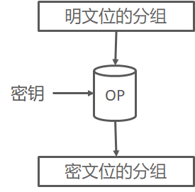

<!-- slide -->
## 3.1 分组密码概述
在许多密码系统中，单钥分组密码是系统安全的一个重要组成部分，用分组密码易于构造伪随机数生成器、流密码、消息认证码（MAC）和杂凑函数等，还可进而成为消息认证技术、数据完整性机制、实体认证协议以及单钥数字签字体制的核心组成部分。实际应用中对于分组密码可能提出多方面的要求，除了安全性外，还有运行速度、存储量（程序的长度、数据分组长度、高速缓存大小）、实现平台（硬件、软件、芯片）、运行模式等限制条件。这些都需要与安全性要求之间进行适当的折中选择。

<!-- slide -->
## 3.1.1 分组密码的设计原则
### 设计的算法应满足下述要求
① 分组长度n要足够大，使分组代换字母表中的元素个数2n足够大，防止明文穷举攻击法奏效。
DES、IDEA、FEAL和LOKI等分组密码都采用n=64，在生日攻击下用232组密文成功概率为1/2，同时要求232×64b=215MB存贮，故采用穷举攻击是不现实的。

<!-- slide -->
## 3.1.1 分组密码的设计原则
② 密钥量要足够大（即置换子集中的元素足够多），尽可能消除弱密钥并使所有密钥同等地好，以防止密钥穷举攻击奏效。
但密钥又不能过长，以便于密钥的管理。
DES采用56比特密钥，太短了，IDEA采用128比特密钥，据估计，在今后30～40年内采用80 比特密钥是足够安全的。

<!-- slide -->
## 3.1.1 分组密码的设计原则
③ 由密钥确定置换的算法要足够复杂，充分实现明文与密钥的扩散和混淆，没有简单的关系可循，能抗击各种已知的攻击，如差分攻击和线性攻击；有高的非线性阶数，实现复杂的密码变换；使对手破译时除了用穷举法外，无其它捷径可循。

<!-- slide -->
## 3.1.1 分组密码的设计原则
④ 加密和解密运算简单，易于软件和硬件高速实现。如将分组n化分为子段，每段长为8、16或者32。在以软件实现时，应选用简单的运算，使作用于子段上的密码运算易于以标准处理器的基本运算，如加、乘、移位等实现，避免用以软件难于实现的逐比特置换。为了便于硬件实现，加密和解密过程之间的差别应仅在于由秘密密钥所生成的密钥表不同而已。这样，加密和解密就可用同一器件实现。设计的算法采用规则的模块结构，如多轮迭代等，以便于软件和VLSI快速实现。此外，差错传播和数据扩展要尽可能地小。

<!-- slide -->
## 3.1.1 分组密码的设计原则
⑤ 数据扩展尽可能地小。一般无数据扩展，在采用同态置换和随机化加密技术时可引入数据扩展。
⑥ 差错传播尽可能地小。

<!-- slide -->
## 3.1.2 混淆与扩散
扩散和混淆是由Shannon提出的设计密码系统的两个基本方法，目的是抗击攻击者对密码系统的统计分析。
如果攻击者知道明文的某些统计特性，如消息中不同字母出现的频率、可能出现的特定单词或短语，而且这些统计特性以某种方式在密文中反映出来，那么攻击者就有可能得出加密密钥或其一部分，或者得出包含加密密钥的一个可能的密钥集合。

<!-- slide -->
## 3.1.2 混淆与扩散
- 混淆（Confusion）：是一种使密钥与密文之间的关系尽可能模糊的加密操作。设计者希望让密文的统计特性与密钥的取值之间的关系尽可能复杂化，以使密钥和明文以及密文之间的依赖性对密码分析者来说是无法利用的。实现混淆常用的一个元素就是替换；这个元素都在DES和AES中都有使用。
- 扩散（Diffusion）：是一种为了隐藏明文的统计属性而将一个明文符号的影响扩散到多个密文符号的加密操作，以便在大量的密文中消除明文的统计结构。最简单的扩散元素就是置换，它常用于DES中；而AES则使用更高级的Mixcolunm操作。
扩散和混淆成功地实现了分组密码的本质属性，因而成为设计现代分组密码的基础。

<!-- slide -->
## 3.2 分组加密法的模式
## 什么是模式
分组密码只能加密固定长度的分组，但是我们需要加密的明文长度可能会超过分组密码的分组长度，这时就需要对分组密码算法进行迭代，以便将一段很长的明文全部加密。这个迭代的方法就称为分组密码的模式（mode）。
在介绍模式前我们引入两个术语：
明文分组（$M_n$）：指分组密码算法中作为加密对象的明文，明文分组的长度与分组密码算法的分组长度是等长的。
密文分组（$C_n$）：指使用分组密码算法将明文分组加密之后所生成的密文。

<!-- slide -->
## 3.2.1 电子编码薄模式（ECB）
这是分组加密最简单的一种模式，即明文的每一个块加密成密文的每一个块。明文被分为若干块$(M_1,M_2,M_3,M_4, … ,M_n)$，通过加密方法$E_k$，得到密文$(C_1,C_2,C_3,C_4,…,C_n)$，当最后一个明文分组小于分组长度时，需要用一些特定的数据进行填充。

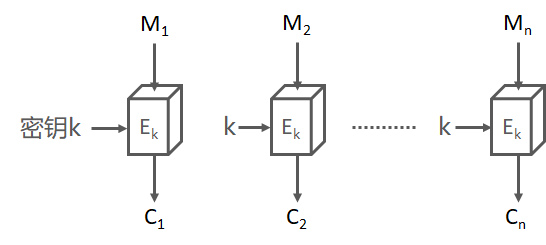

<!-- slide -->
## 3.2.1 电子编码薄模式（ECB）
解密过程也是一次对一个分组解密，而且每次解密都使用同一密钥。
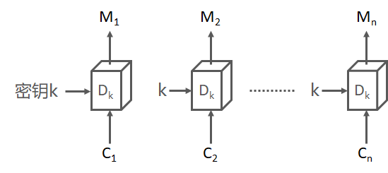

<!-- slide -->
## 3.2.1 电子编码薄模式（ECB）
- ECB模式的特点
ECB模式是所有模式中最简单的一种。ECB模式中，明文分组与密文分组是一一对应关系，因此，如果明文中存在多个相同的明文分组，则这些明文分组最终都将被转换为相同的 密文分组。这样一来，只要观察一下密文，就可以知道明文中存在怎么样的重复组合，并可以以此为线索来破译密码，因此ECB模式是存在一定风险的。

<!-- slide -->
## 3.2.1 电子编码薄模式（ECB）
- 对ECB模式的攻击
ECB模式中，每个明文分组都是各自独立地进行加密和解密，但这其实是一个很大的弱点。假如存在一个攻击者，当他作为中间人截获两方的通信时，他能够改变密文的分组顺序，当接收者对密文进行解密时，由于密文分组的顺序被改变了，因此相应的明文分组的顺序也被改变了，那么接收者实际上是解密出了一段被篡改后的密文。在这种场景中，攻击者不需要破译密码，也不需要知道分组密码的算法，他只需要知道哪个分组记录了什么样的数据。
思考一个模拟的场景：

<!-- slide -->
## 3.2.1 电子编码薄模式（ECB）
假设分组的长度为128比特（16字节），某银行的转账请求数据由以下三个分组构成。
分组1：付款人的银行账号
分组2：收款人的银行账号
分组3：转账金额
此时我们模拟一个转账请求数据：从A-5374帐号向B-6671帐号转账1亿元，用16进制数据表示：
明文分组1=41 2D 35 33 37 34 20 20 20 20 20 20 20 20 20 20 （付款人：A-5374）
明文分组2=42 2D 36 36 37 31 20 20 20 20 20 20 20 20 20 20 （收款人：B-6671）
明文分组3=31 30 30 30 30 30 30 30 30 20 20 20 20 20 20 20 （转账金额：100000000）

<!-- slide -->
## 3.2.1 电子编码薄模式（ECB）
接下来，攻击者将密文分组1和2的内容进行对调。（此时攻击者并不知道分组的具体内容，但知道这是付款人信息）
明文分组2=42 2D 36 36 37 31 20 20 20 20 20 20 20 20 20 20 （收款人：B-6671）
明文分组1=41 2D 35 33 37 34 20 20 20 20 20 20 20 20 20 20 （付款人：A-5374）
明文分组3=31 30 30 30 30 30 30 30 30 20 20 20 20 20 20 20 （转账金额：100000000）
当银行对信息进行解密时，信息的内容实际上已经发生了改变，付款人的身份和收款人的身份已经被调换了。
这就是ECB模式的最大弱点，可以在不破译密文的情况下操纵密文。

<!-- slide -->
## 3.2.2 密码分组链接模式（CBC）
这个模式的实现更复杂、更安全，因此它是使用最普遍的块加密模式。在这种模式下，来自上一块的密文与当前明文块做XOR逻辑运算，得到的结果才是加密的位块。

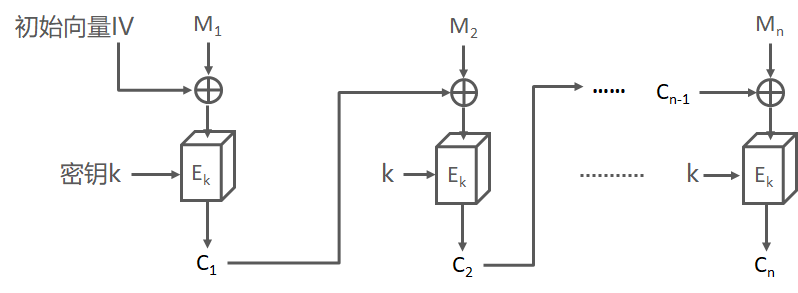

<!-- slide -->
## 3.2.2 密码分组链接模式（CBC）
如果为每个消息传输选取不同的IV，那么两个相同的消息即使使用相同的密钥，也将有不同的密文。这大大提高了安全性。问题在于：接收端如何知道所使用的IV呢？
一种方法是在不安全的通道上发送该IV，并且该IV只使用一次，永不重复。
另外一种方法就是基于唯一数的概念。唯一数是一个唯一的数字，永远不重复使用的密钥，它不一定非得保密，它可以是消息的数目等。用块加密法将唯一数加密后生成IV。如果唯一数附加到密文前面，接收端就可以还原IV。

<!-- slide -->
## 3.2.2 密码分组链接模式（CBC）
- CBC模式的特点
在CBC模式中，我们无法单独对一个中间的明文分组进行加密，加入要生成第三组密文，那么至少需要凑齐分组1,2,3才行。
观察CBC模式的解密过程，我们发现：如果加密后的分组C2出现内容错误（存储介质故障或者网络传输中的误码等）使得一个分组中的0变成了1。那么解密的时候最多只会让2个分组内容受到数据损坏的影响。
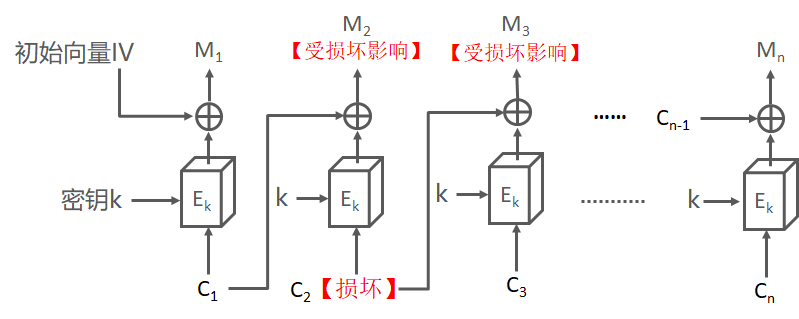

<!-- slide -->
## 3.2.2 密码分组链接模式（CBC）
但是，如果不是数据出错，而是密文分组中有比特缺失，那么即使丢失一个比特，也会导致密文分组的长度发生变化，后续的分组发生错位，最终导致后面的所有密文分组都会解密出无效的数据。
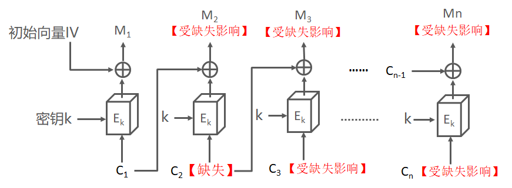

<!-- slide -->
## 3.2.2 密码分组链接模式（CBC）
- 对CBC模式的攻击
1. 比特反转
如果攻击者截获了传递信息，在这段信息中包含了初始向量IV，根据CBC模式的解密方式我们可以看出，如果攻击者对IV中的任意比特进行反转（1变为0，0变为1），那么明文中相应的比特位就会发生反转。
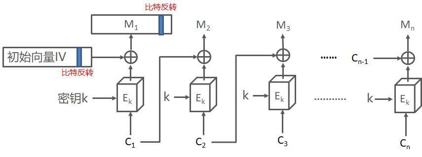

<!-- slide -->
## 3.2.2 密码分组链接模式（CBC）
- 对CBC模式的攻击
2. 填充提示攻击
填充提示是一种利用分组密码中太难冲部分来进行攻击的方法。在分组密码中，当明文长度不为分组长度的整数倍时，需要在最后一个分组中填充一些数据使其凑满一个分组长度。在填充提示攻击中，攻击者会反复发送一段密文，每次发送时都对填充内容进行少许修改。由于接收者（服务器）在无法正确解密时会返回一个错误消息，攻击者通过这个错误消息就可以获取一部分与明文相关的信息，当然这个方法不仅仅适用于CBC模式，而是适用于所有需要进行分组填充的模式。要防御这种攻击，就必须验证密文是否是由合法的发送者在知道明文内容的前提下生成的。

<!-- slide -->
## 3.2.3 密文反馈模式（CFB）
在CFB模式中，前一个密文分组会被送回到密码算法的输入端，这里的反馈指的是返回输入端的意思。
在ECB模式和CBC模式中，明文分组都是通过密码算法进行加密的，然而，在CFB模式中，明文分组并没有通过密码算法来直接进行加密。
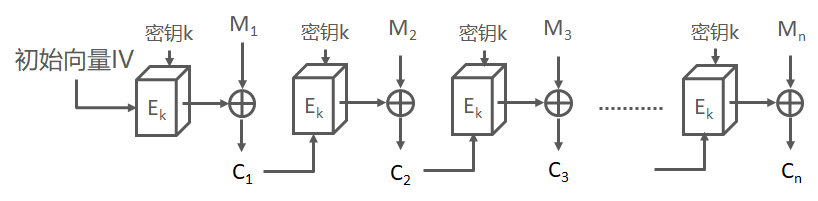

<!-- slide -->
## 3.2.3 密文反馈模式（CFB）
CFB模式的解密过程如图所示，解密算法和加密的算法是相同的，因为我们可以将CFB模式看作是一种通过分组密码来实现流加密的方式，CFB模式中的密码算法相当于用来生成伪随机数和密文进行XOR运算。通过之前对流密码的学习，我们知道流密码的加密解密的算法是相同。
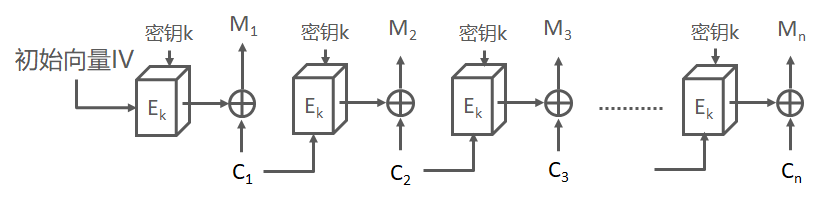

<!-- slide -->
## 3.2.3 密文反馈模式（CFB）
### 对CFB模式的攻击
1. 重放攻击
举一个例子：Alice向Bob发送了一条消息，这条消息由4个密文分别组成。攻击者将消息的后3个密文分组保存下来，第二天，Alice又向Bob发送了内容不同的4个密文分组（这里我们假设Alice使用的密钥是没有变的）。攻击者将昨天保存下来的3个分组分别替换了这段密文的后3个分组。当Bob解密的时候，4个分组中只有第一个可以解密成功，而第2组就会产生错误，然而第3和第4则被替换成了攻击者保存下来的之前使用过的分组，Bob仍然可以正常解密。此时第2个分组成为了一个错误的分组，但Bob无法确认是网络传输过程中的通信错误，还是被人篡改的。

<!-- slide -->
## 3.2.3 密文反馈模式（CFB）
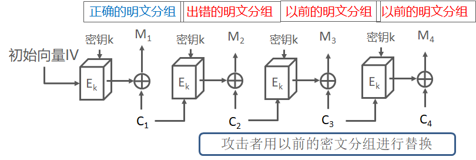

<!-- slide -->
## 3.2.4 输出反馈模式（OFB）
这个模式使用分组加密法来生成一个密钥流。密钥和块加密法的初始输入启动这个加密过程，通过将块加密法的输出加密。解密的过程同样是对初始向量做加密运算，将得到的密钥流与密文做XOR运算。
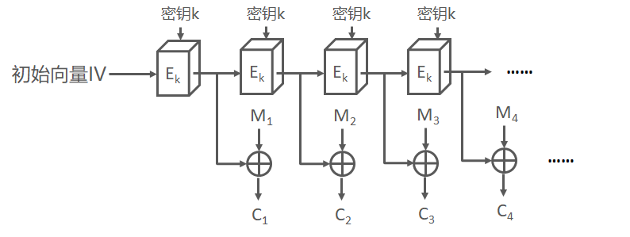

<!-- slide -->
## 3.2.4 输出反馈模式（OFB）
- CFB模式与OFB模式的对比
OFB模式和CFB模式的区别仅仅在于密码算法的输入。
CFB模式中，密码算法的输入是前一个密文分组，也就是将密文分组反馈到密码算法中，因此就有了“密文反馈模式”这个名字。
OFB模式中，密码算法的输入则是密码算法的前一个输出，也就是将输出反馈给密码算法，因此就有了“输出反馈模式”这个名字。

<!-- slide -->
## 3.2.5 计数器模式（CTR）
CTR模式中，每个分组对应一个逐次累加的计数器，并通过对计数器进行加密来生成密钥流。也就是说，最终的密文分组是通过将计数器加密得到的比特流，与明文分组进行XOR运算得到的。
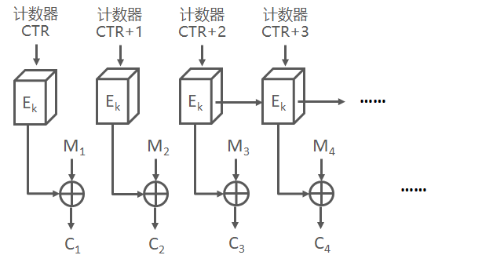

<!-- slide -->
## 3.2.5 计数器模式（CTR）
- 计数器的生成方法
每次加密是都会生成一个不同的值（nonce）来作为计数器的初始值。例如：当分组长度为128比特（16字节）时，计数器的初始值可能是像这样的形式。
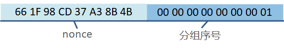

<!-- slide -->
## 3.2.5 计数器模式（CTR）
其中，前8个字节为nonce，这个值在每次加密时必须都是不同的。后8个字节为分组序号，这个部分是会在加密的过程中逐次累加的。

66 1F 98 CD 37 A3 8B 4B 00 00 00 00 00 00 00 01	明文分组1的计数器
66 1F 98 CD 37 A3 8B 4B 00 00 00 00 00 00 00 02	明文分组2的计数器
66 1F 98 CD 37 A3 8B 4B 00 00 00 00 00 00 00 03	明文分组3的计数器
66 1F 98 CD 37 A3 8B 4B 00 00 00 00 00 00 00 04	明文分组4的计数器

<!-- slide -->
## 3.3 乘积加密法
### 乘积加密法的概念
1973年， Feistel提出了一种乘积加密法，它成为今天所用的对称加密法的体系结构基础。
乘积加密法指的是：顺序地执行两个或多个基本密码系统，使得最后结果的密码强度高于每个基本密码系统产生的结果.
Feistel还提出了实现代换和置换的方法。其思想实际上是Shannon提出的利用乘积密码实现混淆和扩散思想的具体应用。

<!-- slide -->
## 3.3.1 乘积加密法的结构
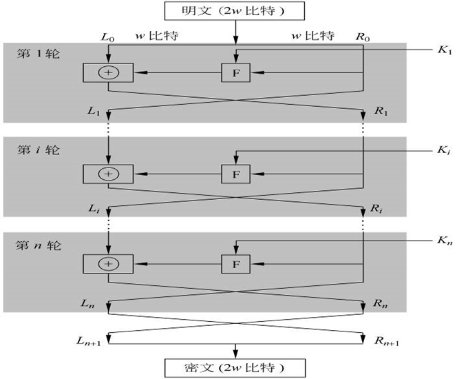

<!-- slide -->
## 3.3.1 乘积加密法的结构
输入是分组长为2𝑤的明文和一个密钥K。将每组明文分成左右两半𝐿_0和𝑅_0  ，在进行完n轮迭代后，左右两半再合并到一起以产生密文分组。其第i轮迭代的输入为前一轮输出的函数：

$ L_i = R_{i-1} $
$R_i=L_{i-1} \bigoplus F(R_{i-1},K_i)$

其中，$K_i$是第i轮用的子密钥，由加密密钥K得到。通常，各轮子密钥彼此不同而且与K也不同。

<!-- slide -->
## 3.3.2 乘积加密法的解密过程
乘积加密法解密过程本质上和加密过程是一样的，算法使用密文作为输入，但使用子密钥Ki的次序与加密过程相反，即第1轮使用Kn，第2轮使用Kn-1，……，最后一轮使用K1。这一特性保证了解密和加密可采用同一算法。

<!-- slide -->
## 3.3.2 乘积加密法的解密过程
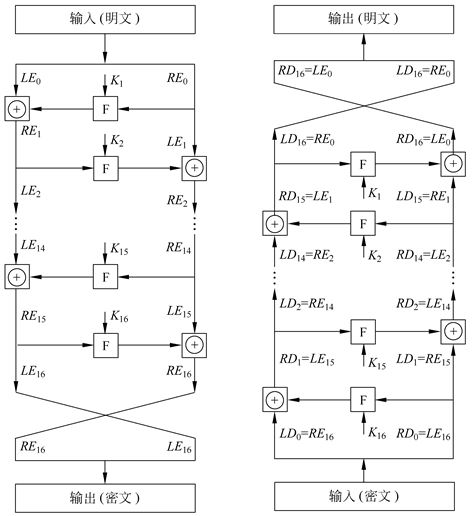

<!-- slide -->
## 3.3.2 乘积加密法的解密过程
在加密过程中：
$LE_{16}=RE_{15}$
$RE_{16}=LE\bigoplus F(RE_{15},K_{16})$
在解密过程中：
$LD_1=RD_0=LE_{16}=RE_{15}$
$RD_1=LD_0 \bigoplus F(RD_0,K_{16})=RE_{16} \bigoplus F(RE_{15},K_{16})$
    $=[LE_{15} \bigoplus F(RE_{15},K_{16})] \bigoplus F(RE_{15},K_{16})$
    $=LE_{15}$

<!-- slide -->
## 3.3.2 乘积加密法的解密过程
所以解密过程第1轮的输出为LE15‖RE15，等于加密过程第16轮输入左右两半交换后的结果。容易证明这种对应关系在16轮中每轮都成立。一般地，加密过程的第i轮有
$LE_i=RE_{i-1}$
$RE_i=LE_{i-1}\bigoplus F(RE_{i-1},K_{i})$
因此
$RE_{i-1}=LE_i$
$LE_{i-1}=RE_i \bigoplus F(RE_{i-1},K_i)=RE_i \bigoplus F(LE_i,K_i)$

<!-- slide -->
## 3.3.3 乘积加密法的特点
乘积加密法的实现与以下参数和特性有关：
① 分组大小: 分组越大则安全性越高，但加密速度就越慢。分组密码设计中最为普遍使用的分组大小是64比特。
② 密钥大小：密钥越长则安全性越高，但加密速度就越慢。现在普遍认为64比特或更短的密钥长度是不安全的，通常使用128比特的密钥长度。
③ 轮数：单轮结构远不足以保证安全性，但多轮结构可提供足够的安全性。典型地，轮数取为16。
④ 子密钥产生算法：该算法的复杂性越大，则密码分析的困难性就越大。
⑤ 轮函数：轮函数的复杂性越大，密码分析的困难性也越大。

<!-- slide -->
## 3.3.3 乘积加密法的特点
在设计乘积加密法（Feistel网络）时，还有以下两个方面需要考虑：
① 快速的软件实现：在很多情况中，算法是被镶嵌在应用程序中，因而无法用硬件实现。此时算法的执行速度是考虑的关键。
② 算法容易分析：如果算法能被无疑义地解释清楚，就可容易地分析算法抵抗攻击的能力，有助于设计高强度的算法。

<!-- slide -->
## 3.4 DES加密技术
- DES的诞生与谢幕
数据加密标准（ data encryption standard, DES ）是1977年美国联邦信息处理标准（FIPS）中所采用的一种对称密码。
它是由美国IBM公司研制的，是早期的称作Lucifer密码的一种发展和修改。DES在1975年3月17日首次被公布在联邦记录中，经过大量的公开讨论后，DES于1977年1月15日被正式批准并作为美国联邦信息处理标准，即FIPS-46，同年7月15日开始生效。规定每隔5年由美国国家保密局（national security agency, NSA）作出评估，并重新批准它是否继续作为联邦加密标准。
<!-- slide -->
## 3.4 DES加密技术
最后的一次评估是在1994年1月，美国已决定1998年12月以后将不再使用DES。1997年DESCHALL小组经过近4个月的努力，通过Internet搜索了3×1016个密钥，找出了DES的密钥，恢复出了明文。1998年5月美国EFF(electronics frontier foundation)宣布，他们以一台价值20万美元的计算机改装成的专用解密机，用56小时破译了56 比特密钥的DES。美国国家标准和技术协会已征集并进行了几轮评估、筛选，产生了称之为AES(advanced encryption standard) 的新加密标准。尽管如此，DES对于推动密码理论的发展和应用毕竟起了重大作用，对于掌握分组密码的基本理论、设计思想和实际应用仍然有着重要的参考价值。

<!-- slide -->
## 3.4.1 DES算法概述
尽管DES密钥有64位，但用户只能定义其中的56位，其余的8位由算法提供。分别放在8、16、24、32、40、48、56和64位上。也就是每8位的密钥中包含了用户提供的7位和DES确定的1位，这样做是为了让每个8位的块都有奇数个奇偶校验位（即1的个数为奇数）。
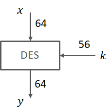
<!-- slide -->
## 3.4.1 DES算法概述
DES的基本结构是由乘积加密算法组成的。它对明文中每一个分组的加密过程都包含16轮，且每轮的操作完全相同。每一轮都会使用不同的子密钥，每个子密钥ki都是从主密钥k中推导出来的。

<!-- slide -->
## 3.4.1 DES算法概述
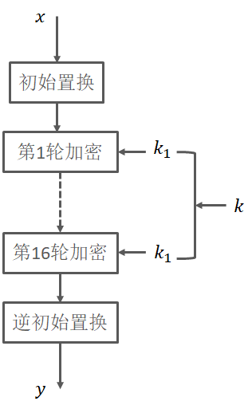
<!-- slide -->
## 3.4.2 DES算法的结构
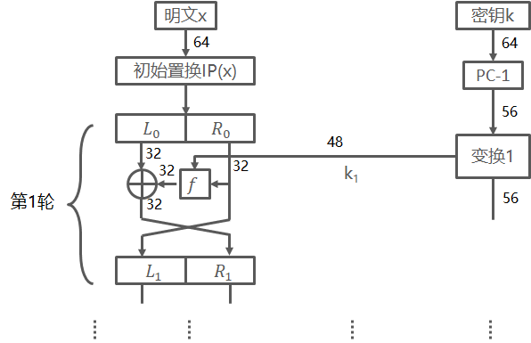

<!-- slide -->
## 3.4.2 DES算法的结构
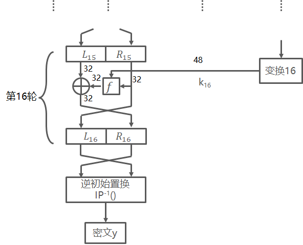
根据Feistel算法可知，在每一轮中，实际是将右半部分Ri送入函数f中，函数的输出将与32位的左半部分Li进行XOR运算，最后左右交换。

<!-- slide -->
## 3.4.3 初始置换和逆初始置换
如图所示，初始置换IP与逆初始置换IP-1都是按位置换。我们可以简单地想象成一个简单替换密码。例如：输入的第58位在置换后映射到第1位。
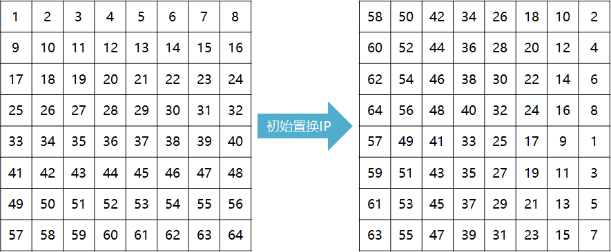

<!-- slide -->
## 3.4.3 初始置换和逆初始置换
如果再取逆初始置换Y=IP-1(X)=IP-1(IP(M))，可以看出，每个比特位的初始顺序将被恢复。

<!-- slide -->
## 3.4.4 f函数
f函数在DES的安全性中扮演着重要的角色。在第i轮中，f函数的输入为前一轮输出的右半部分Ri-1和当前轮子密钥ki。f函数的输出将用来参与XOR运算，加密左半部分输入位Li-1。
F函数的结构如图所示：
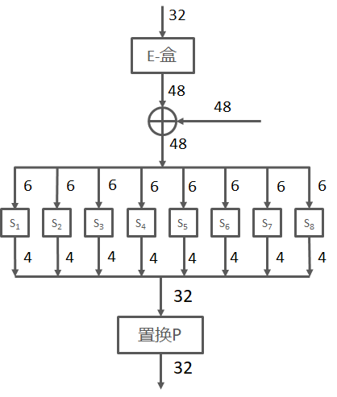

<!-- slide -->
## 3.4.4 f函数
- 将输入分成8个4位的分组，然后将每个分组扩展为6位，从而将32位的输入扩展为48位。这个过程在E-盒中进行。
- 接着将扩展后的48位与本轮的子密钥ki进行XOR运算，将48位拆为8个6位长的分组分别放入8个不同的替换盒中，这个替换盒叫S-盒。
- 从S盒中得到32位的输出，然后再用置换P进行按位置换。

<!-- slide -->
## 3.4.4 f函数
### E-盒
E-盒是一种特殊的置换。它需要将32位的比特扩展为48位。
- 将32比特分为8个4位的分组
- 将4位的分组拓展为6位，变成8个6位分组
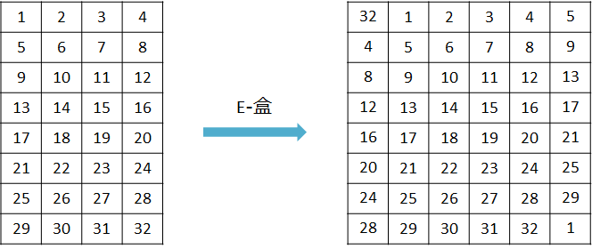

<!-- slide -->
## 3.4.4 f函数
### S-盒
S盒是DES的核心，它将6位的输入映射为4位的输出，为DES提供了非线性特征，这意味着即使给定一个输入-输出值的集合，也很难预估所有S盒的输出。 尽管NBS/NIST早在1977年就发布DES的完整规范，但却从来没有完整披露过S-盒表的选择动机。这个事实引发了人们的很多猜测，尤其是关于是否存在只有NSA才能破解的秘密后门的可能性或一些其他故意构造的缺陷。
对每个盒Si，其6比特输入中，第1个和第6个比特形成一个2位二进制数，用来选择Si的4个代换中的一个。6比特输入中，中间4位用来选择列。行和列选定后，得到其交叉位置的十进制数，将这个数表示为4位二进制数即得这一S盒的输出。

<!-- slide -->
## 3.4.4 f函数
### S-盒
例如，S1 的输入为011001，行选为01（即第1行），列选为1100（即第12列），行列交叉位置的数为9，其4位二进制表示为1001，所以S1的输出为1001。
S盒的每一行定义了一个可逆代换。
<!-- slide -->
## 3.4.4 f函数
### S-盒
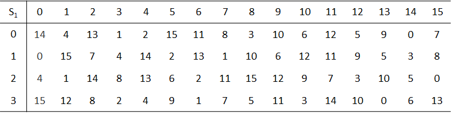

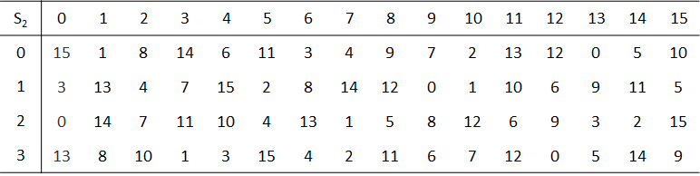
<!-- slide -->
## 3.4.4 f函数
### S-盒
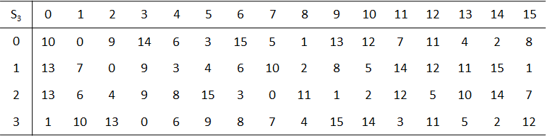

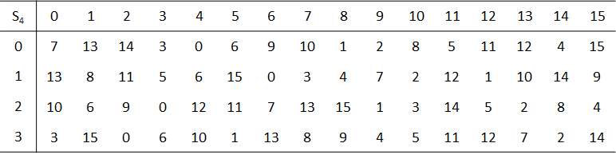

<!-- slide -->
## 3.4.4 f函数
### S-盒
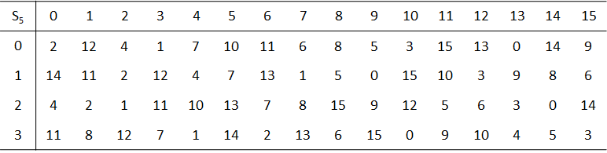

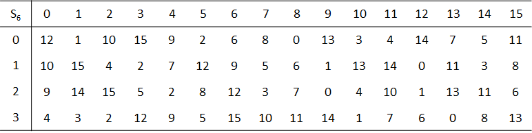
<!-- slide -->
## 3.4.4 f函数
### S-盒
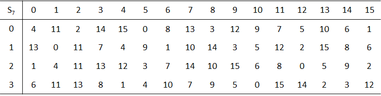

<!-- slide -->
## 3.4.4 f函数
### S-盒的设计准则
- 每个S-盒都有6个输入位和4个输出位
- 任意一个输出位都不应该太接近于输入位的线性组合
- 如果输入的最高位和最低位都是固定的，只有中间的4个位是可变的，则每个可能的4位输出值都必须只出现一次。
- 对于S-盒的两个输入，如果仅有1位不同，则输出必须至少有两位不同。
- 对于S-盒的两个输入，如果只有中间两位不同，则输出必须至少有两位不同。
- 对于S-盒的两个输入，如果开头的两位不同，但最后两位相同，则输出必须不同。
- 对任意有6位非零差分的输入对，32对输入中至多有8对有相同的输出差分。
- 8个S-盒对应的32位输出的冲突（零输出差异）只有在三个相邻的S-盒的情况下才有可能。

<!-- slide -->
## 3.4.4 f函数
### 置换P
32位的输出会根据下表中给出的置换P进行按位置换。与初始置换IP以及逆初始置换IP-1不同，置换P将扩散引入到DES中，因此每个S-盒的四位输出都会进行置换，使得每位在下一轮中会影响多个不同的S-盒。
由扩充带来的扩散、S-盒与置换P可以保证，在第五轮结束时每个位都是明文位与密钥位的函数。这种行为称为雪崩效应。

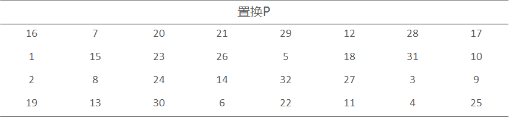

<!-- slide -->
## 3.4.5 密钥生成
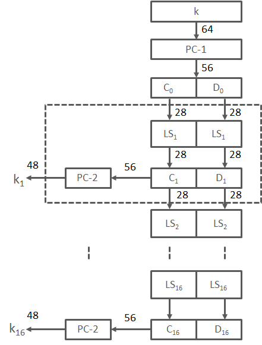

<!-- slide -->
## 3.4.5 密钥生成
- 用置换表PC-1进行置换操作，同时去除奇偶校验位。
- 将密钥分为C0和D0两个部分，并进行左位移（循环移位）操作，生成C1和C2。
- C1和C2根据置换表PC-2再次进行置换操作生成子密钥k1。
- C1和C2进行左位移操作，生成C3和C4。
<!-- slide -->
## 3.4.5 密钥生成
### 初始密钥置换PC-1
在置换表中忽略第8、16、24、32、40、48、56、64位，在置换的同时去掉奇偶校验。置换表如下：
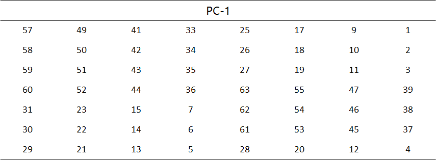

<!-- slide -->
## 3.4.5 密钥生成
### 移位操作
得到的56位密钥被分为C0和D0两部分，周期性地向左移动一位或者两位（即循环移位），移动的具体位数则取决于轮数i，其规则为：
- 当i=1,2,9,16轮时，左右两部分向左移动一位
- 当i≠1,2,9,16轮时，左右两个部分向左移动两位。

注意：循环移位要么发生在左半部分，要么发生在右半部分。
循环移动位置的总数为$4*1+12*2=28$ 。这将带来一个有趣的属性，即$C_0=C_{16}$和$D_0=D_{16}$ 。

<!-- slide -->
## 3.4.5 密钥生成
### PC-2
为了得到48位的子密钥ki，左右两部分需要再次根据PC-2进行按位置换。由于Ci和Di共有56位，因此PC-2需要忽略其中的8位，只置换48位。置换关系如下：
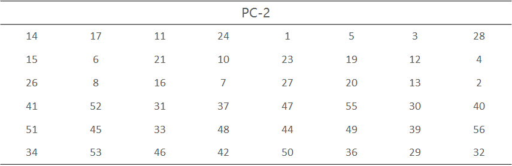

<!-- slide -->
## 3.4.6 DES的解密过程
DES的优势之一就是其解密过程与加密过程在本质上是完全相同的。这主要是因为DES是基本Feistel网络。与加密相同相比，解密过程中只有密钥编排逆转了，即解密的第一轮需要子密钥16；第二轮需要子密钥15；依次类推。

<!-- slide -->
## 3.4.7 DES软件实现与硬件实现
### 软件
最简单直观的软件实现遵循DES描述的数据流，按部就班进行实现，但是这种方法性能通常较差，这主要的是因为很多原子级的DES操作都涉及到位置换，尤其是E置换和P置换，这会使软件实现变得很慢。为此，人们提出了加快DES软件实现的算法，通常的思路就是使用一些表，这些表里的数据来自一些DES操作预计算的值，比如一些S-盒预计算值和置换预计算值。

<!-- slide -->
## 3.4.7 DES软件实现与硬件实现
### 硬件
DES的一个设计标准就是硬件实现效率。类似E置换、P置换、IP置换等操作，非常易于使用硬件实现，因为它们只需要布线而不需要逻辑、S-盒在硬件实现上也相当简单，通常它们是使用布尔逻辑实现的，即逻辑门电路，平均下来，一个S-盒大概需要100个门。

<!-- slide -->
## 课堂实验
### 在CAP4软件中实现DES加密
CAP4中提供了两个版本的DES，即标准的DES实现和一个小型版本（S-DES）。两者操作的方法相同，都是先输入明文或密文，然后选取Ciphers菜单中DES或S-DES。CAP4中的DES实现还提供了一个评估选项，你可以对DES进行两种类型的雪崩条件测试。

<!-- slide -->
## 3.5 差分密码分析与线性密码分析
差分密码分析是迄今已知的攻击迭代密码最有效的方法之一，其基本思想是：  通过分析明文对的差值对密文对的差值的影响来恢复某些密钥比特。
线性密码分析是对迭代密码的一种已知明文攻击，它利用的是密码算法中的“不平衡（有效）的线性逼近”。

<!-- slide -->
## 3.5.1 差分密码分析
差分密码分析法的基本思想是，比较密文与相应的明文之间的差异。基于这些差异，就可以对密钥的位进行合理的猜测。差分密码分析在1990被提出，理论上它可以破任何分组密码，然而事实证明，DES的S-盒可以很好地抵抗这种攻击。实际上，在差分密码分析被公布后，一位参与设计DES密码的研究员透露：他们在设计的时候就已经意识到这种攻击的存在，据说，之所以没有向公众公布S-盒设计标准的原因也在于，设计组不想公开差分密码分析这种强大的攻击手段。如果这是真的——当然所有的事实也支持这个说法——这意味着IBM和NSA小组已经领先学术界15年，当然，在20时机70年代和80年代只有相当少的人还在积极研究密码学。

<!-- slide -->
## 3.5.1 差分密码分析
对分组长度为n的r轮迭代密码，两个n比特串$Y_i$和$Y_i^{*-1}$的差分定义为
$$\Delta Y_i=Y_i \bigotimes Y_i^{*-1}$$
其中$\bigotimes$表示n比特串集上的一个特定群运算，$Y_i^{*-1}$表示$Y_i^{*}$在此群中的逆元。
由加密对可得差分序列
$$\Delta Y_{0}, \Delta Y_{1},..., \Delta Y_{r}$$
其中$Y_0$和$Y_0^{*}$是明文对，$Y_i$和$Y_i^{*}$(1≤i≤r)是第i轮的输出，它们同时也是第i+1轮的输入。第i轮的子密钥记为$K_i$，F是轮函数，且$Y_i=F(Y_{i-1}, $K_i$)$。

<!-- slide -->
## 3.5.1 差分密码分析
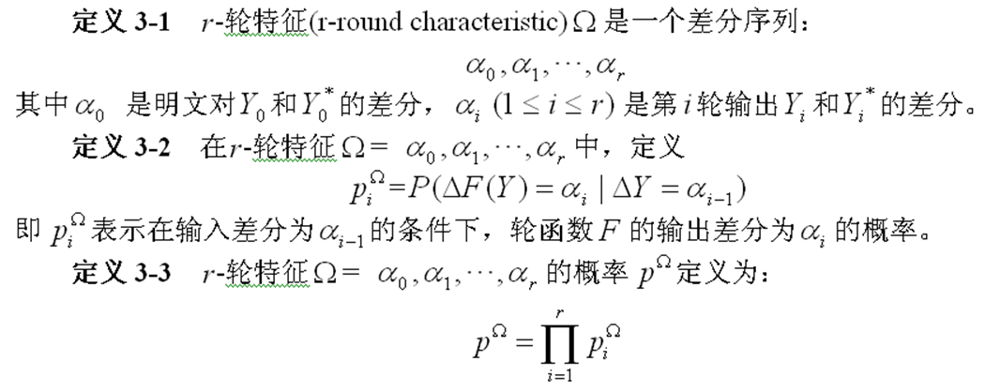
<!-- slide -->
## 3.5.1 差分密码分析
对r-轮迭代密码的差分密码分析过程可综述为如下的步骤：
① 找出一个(r-1)-轮特征$\Omega (r-1)=a_0,a_1,...,a_{r-1}$，使得它的概率达到最大或几乎最大。
② 均匀随机地选择明文$Y_0$并计算$Y_0^{*}$，使得$Y_0^{*}$和$Y_0^{*}$的差分为$a_0$，找出$Y_0$和$Y_0^{*}$在实际密钥加密下所得的密文$Y_r$和$Y_r^{*}$。若最后一轮的子密钥$K_r$（或$K_r$的部分比特）有$2^m$个可能值$K_r^j$(1≤j≤2m)，设置相应的$2^m$个计数器$\Lambda_j$(1≤j≤2m)；用每个$K_r^j$解密密文$K_r$和$Y_r^{*}$，得到$Y_{r-1}$和$Y_{r-1}^{*}$，如果$Y_{r-1}$和$Y_{r-1}^{*}$的差分是$a_{r-1}$，则给相应的计数器$\Lambda_j$加1。
③ 重复步骤②，直到一个或几个计数器的值明显高于其他计数器的值，输出它们所对应的子密钥（或部分比特）。

<!-- slide -->
## 3.5.2 线性密码分析
设明文分组长度和密文分组长度都为n比特，密钥分组长度为m比特。记
明文分组：P[1]，P[2]，…,P[n]，
密文分组：C[1]，C[2]，…，C[n]，
密钥分组：K[1]，K[2]，…，K[m]。

定义：

$$A[i,j,...,k]=A[i]\bigoplus A[j]\bigoplus ... \bigoplus A[k]$$

<!-- slide -->
## 3.5.2 线性密码分析
线性密码分析的目标就是找出以下形式的有效线性方程：

$$P[i_1,i_2,...,i_a]\bigoplus C\bigoplus [j_1,j_2,...,j_b]=K[k_1,k_2,...,k_c]$$

其中1≤a≤n,1≤b≤n,1≤c≤m。
如果方程成立的概率p≠1/2，则称该方程是有效的线性逼近。如果|$p- \dfrac{1}{2}$|是最大的，则称该方程是最有效的线性逼近。

<!-- slide -->
## 3.5.2 线性密码分析
设N表示明文数，T是使方程左边为0的明文数。如果T>N/2，则令

如果T<N/2，则令
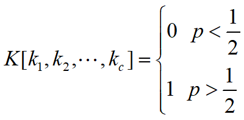

从而可得关于密钥比特的一个线性方程。对不同的明文密文对重复以上过程，可得关于密钥的一组线性方程，从而确定出密钥比特。

<!-- slide -->
## 3.5.2 线性密码分析
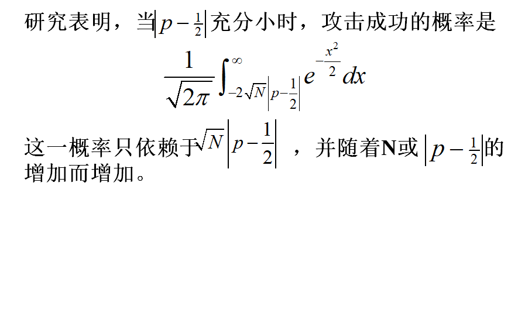
<!-- slide -->
## 3.5.3 其他密码分析方法
如何对差分密码分析和线性密码分析进行改进，降低它们的复杂度仍是现在理论研究的热点，目前已推出了很多改进方法，例如,高阶差分密码分析、截段差分密码分析（truncated differential cryptanalysis）、不可能差分密码分析、多重线性密码分析、非线性密码分析、划分密码分析和差分-线性密码分析，再如针对密钥编排算法的相关密钥攻击、基于Lagrange插值公式的插值攻击及基于密码器件的能量分析（power analysis），另外还有错误攻击、时间攻击、Square攻击和Davies攻击等。

<!-- slide class="middle"-->

# Thanks for Watching
