# CRYPT-9 数字货币

## 目录
9.1 数字货币
9.2 比特币的交易原理
9.3 区块链技术在比特币中的运用

### 9.1 数字货币

#### 9.1.1 数字货币与虚拟货币

- 与实物货币相似属性
    - 但允许即时交易和无边界转让
    - 虚拟货币和加密货币都是数字货币的类型，但相反是不正确的。与传统货币一样，这些货币可用于购买实物商品和服务，但也可能限于某些社区，例如用于在线游戏或社交网络内部使用。

 - 虚拟货币
    - 一种不受监管的数字货币，通常由其开发人员发布并控制，并在特定虚拟社区的成员中使用和接受
    - 一种在某些环境中像货币一样运作的交易媒介，但不具有真实货币的所有属性

#### 9.1.2 虚拟货币与加密货币

- 虚拟货币
     - 欧洲中央银行（European Central Bank）：一种不受监管的数字货币，通常由其开发商发行并通常由其控制，并在特定虚拟社区的成员中使用和接受
     - 美国财政部：一种在某些环境中像货币一样运作的交易媒介，但并不具有真实货币的所有属性
 - 加密货币
     - 一种依赖密码技术的数字代币
         - 将令牌传输的数字签名链接在一起
         - 点对点网络和
         - 权力下放
         - 用于创建和管理货币的工作证明

## 9.1.3 加密货币定义

 - 一种数字资产，旨在作为使用加密技术的交换媒介来保证交易的安全并控制货币额外单位的创建。
 - 假设在相互不信任的环境中工作
 - 比特币在2009年成为第一个分散加密货币
 - 比特币及其衍生品采用分散控制而不是集中式电子货币/集中银行系统。
 - 分散控制与分布式账本角色中比特币区块链交易数据库的使用有关。

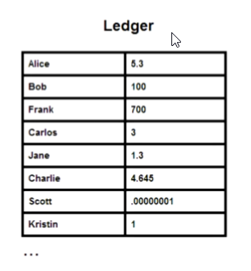

**典型情况**

- 爱丽丝想买鲍勃的车
- 他们同意与价格100 BTC的鲍勃
-  Alice注册交易（Alice的余额为-100 BTC，Bob的余额为+100 BTC）
- 如何：
    - 确保Alice有足够的资金
    - 确保鲍勃不能否认收到付款
    - 防止Alice花费同样的钱进行多次交易（双重支出）
    - 防止第三方花费Alice的资金
 - 解决方案基于诸如区块链、数字签名交易和工作证明方案等概念

### 9.2 比特币的交易原理

#### 9.2.1 区块链数据库

- 一个开放的分布式数据库，保持有序块不断增长的列表。网络中的所有节点都维护数据库的副本
 - 每个块都包含一个时间戳，一个指向前一个块的链接和一个事务列表
 - 区块链本身对数据修改具有抵抗力 - 一旦记录，块中的数据不能追溯性地改变

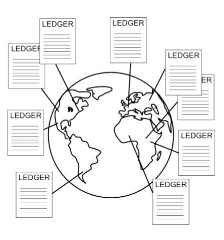

#### 9.2.2 凭据校验工作
- 一般来说：
    - 难以解决的挑战，但容易检查解决方案
 - 产生困难的计算挑战（例如，NP难题）
 - 网络中的所有节点试图通过选择要检查的随机解决方案来并行解决问题
 - 获胜者创建新块并在网络中传播
    - 网络中的每个节点都独立验证块
 - 赢家获得bitcons的数量
 - 尽管可能，两个节点同时创建新块的概率很低：
    - 避免创建替代新块
    - 如果创建了两个备选块，则每个参与者都会接受其中一个块
 - 挑战的难度始终自动调整，以便网络在10分钟内找到新的区块

#### 9.2.3 交易

- 包含比特币数量变化的信息的记录
 - 输入：
     - 取消付款人提前收到的值
 - 输出：
     - 支付事件的非交易（交换）
     - 支付给收款人的金额，他/她可以用作他/她进一步交易的输入
 - 记录由付款人签字

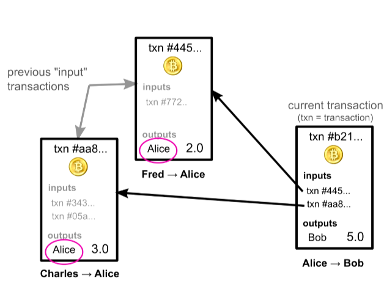

#### 9.2.4 如何在比特币系统中发送货币
- 在基本层面上，爱丽丝向鲍勃汇款时，她只是简单地播放一条包含账户和金额的消息 - 从爱丽丝发送5.0 BTC到鲍勃
 - 每个接收它的节点都会更新其分类账的副本，然后传递交易消息
     - 但是，节点如何确保请求是真实的，只有合法的所有者才能发送消息？
        - 电子签名！
 - 用户的“账号”是他/她的公钥

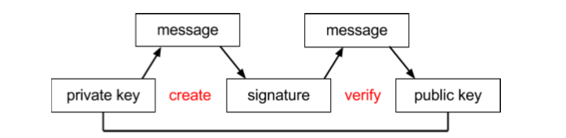

#### 9.2.5 如何验证您的余额？

 - 事实上，根本没有账户余额记录
     - 只存在多少用户收到的信息以及他/她早些时候花了多少钱
 - 而不是余额，资金的所有权通过与以前交易的链接进行验证

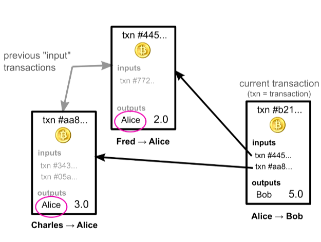

#### 9.2.6 交易详情

- 要发送5.0 BTC给Bob，Alice必须参考其他交易，并在其中收到5个或更多比特币
- 这些被引用的事务被称为“输入”。
- 验证此交易的其他节点将检查这些输入以确保Alice实际上是收件人，并且输入可累加5个或更多比特币

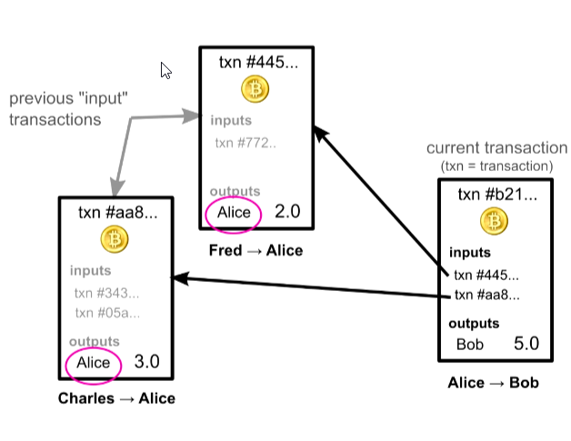

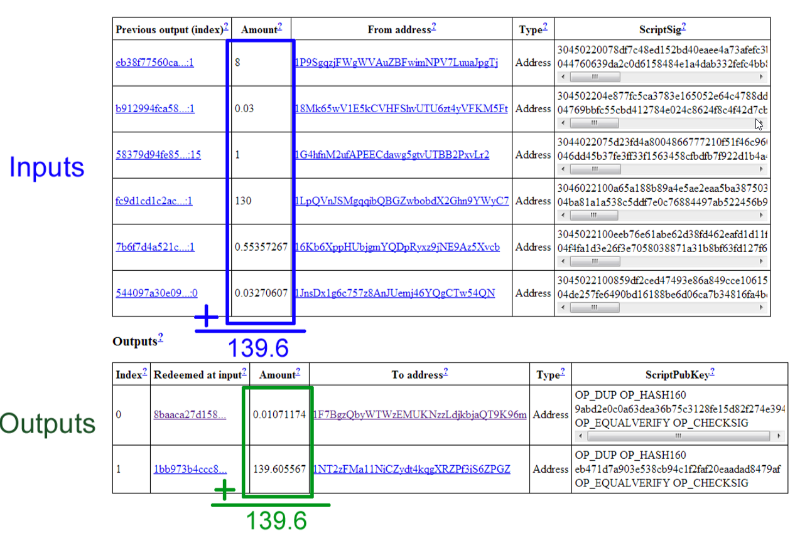

#### 9.2.7 所有权传递链

- 此交易参考总共139.6比特币的6个输入
- 在输出部分，注意有两行
    - 其中的第一个实际上是作为交易的更改返回给发件人
- 简化规则规定每个输入必须在事务中完全用完
    - 如果您要发送的金额与您的某个输入不完全匹配，则需要将剩余金额发回给自己

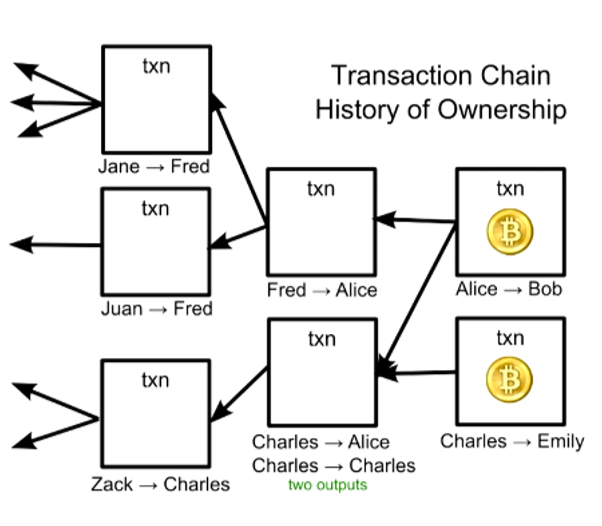

**所有权传递链验证**

- 通过这些参考输入链接，比特币的所有权以一种链式传递，每种交易的有效性取决于以前的交易
- 你如何相信那些以前的交易？
    - 你不能，也应该检查他们的输入
    - 事实上，当您第一次安装比特币钱包软件时，它会下载所有有史以来的交易，并检查每一笔交易的有效性，直至回到有史以来的第一笔交易

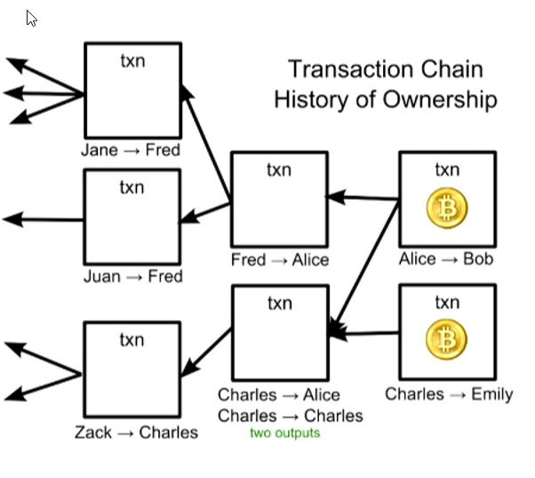

**所有权传递链，双重验证**
- 一旦交易使用过一次，它将被视为已用完，并且不能再次使用
- 在验证交易时，除了其他检查外，节点还确保输入尚未用完
- 对于每个输入，节点检查每一个其他事务，以确保输入之前没有被使用过
- 尽管这看起来很耗时，因为现在有超过2000万笔交易，但它的速度非常快，并且有未使用的交易索引

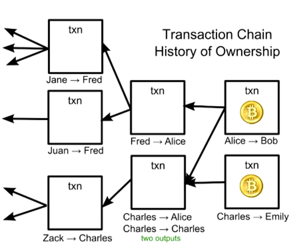

找出自己的平衡需要重复所有有史以来的事务，并将所有未使用的输入加起来

#### 9.2.8 没有怜悯的错误

- 因为您没有银行或信用卡公司可以上诉
     - 任何“用户错误”错误都可能导致比特币的永久损失，而不仅仅是您自己的帐户，而是比特币经济总体
     - 如果您丢失了私钥，与相应公钥相关的任何资金将永远消失
 - 由于硬盘崩溃和备份不足，人们可能会丢失私钥，这意味着比特币最终将成为通货紧缩的货币

#### 9.2.9 匿名和身份

- 如果您通过隐藏IP地址的TOR网络访问比特币，则可以使用比特币，而不会泄露比您的公钥更多的东西
 - 为了避免有人将您的交易连接在一起（请记住，它们都公开存储在每台计算机上！），您可以为每个传入交易生成一个新的公钥
 - 生成公钥是匿名的，通常与您的真实身份无关，可以离线完成
     - 公私密钥对是随机生成的
     - 因为有很多不同的可能地址，所以没有理由甚至检查是否有其他人已经拥有该密钥
     - 事实上，如果你猜猜别人的钥匙，你就可以获得他们的钱！

### 9.3 区块链技术在比特币中的运用

#### 9.3.1 比特币的双倍支出

- 通过验证数字签名，我们知道只有真正的所有者才能创建交易消息
 - 为了确保发件人真的有钱可花，我们还检查每个参考输入，确保它没有花销
 - 但系统中仍然存在一个大的安全漏洞，可能会导致“未使用的检查”不可靠，这与交易顺序有关。

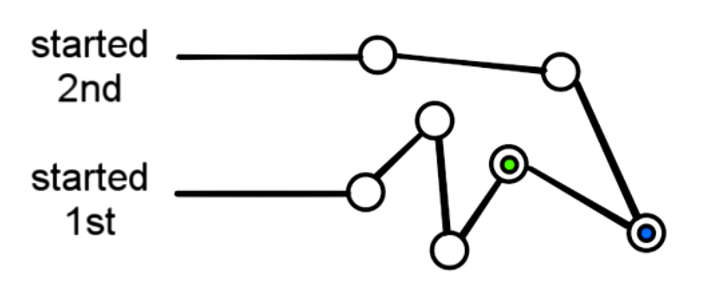

#### 9.3.2 检查交易的顺序
- 考虑到事务是通过网络逐个节点传递的，所以不能保证你接收它们的顺序代表它们被创建的顺序
 - 你不应该相信时间戳，因为人们可以很容易地说出创建交易的时间
     - 与贝宝等中央系统对比，中央计算机很容易跟踪交易顺序

#### 9.3.3 交易订单

- 您无法确定一笔交易是否先于另一笔交易，并且这可能导致欺诈行为
 - 例如，恶意用户Alice可以发送给Bob的交易，等待Bob发送产品，然后将引用相同“输入”的另一个交易发回给自己。
 - 由于传播时间的差异，网络上的一些节点会在Bob之前收到第二个“双重支出”交易。
 - 当鲍勃的交易到达时，他们会认为它无效，因为它试图重复使用输入。
 - 总的来说，整个网络中Bob或Alice是否有这笔钱会有分歧，因为没有办法证明哪个交易是先发生的

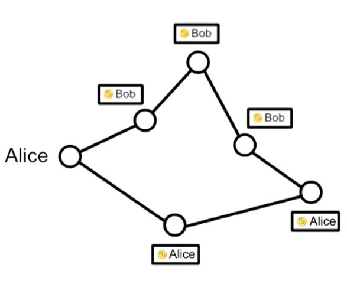

#### 9.3.4 用区块链技术解决问题

**区块链：交易顺序**

 - 整个网络需要有一种方式来就交易顺序达成一致
 - 比特币的解决方案是通过一种数学竞赛来确定和保护订单的聪明方式
 - 比特币系统通过将交易放置在称为块的组中并将这些块链接在一起称为块链的交易中来对交易进行订购
     - 请注意，这与交易链不同
     - 区块链用于订购交易，而交易链则记录所有权如何变化

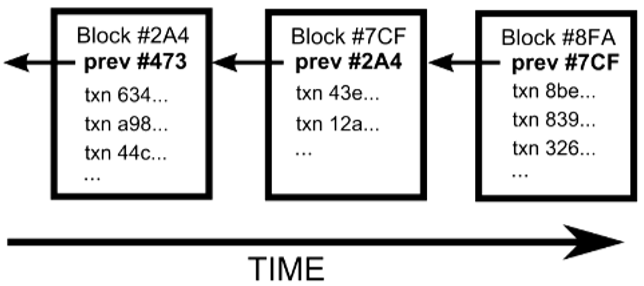

**区块链**
每个块都有一个对前一个块的引用，这就是将一个块一个接一个地放在一个块中的情况。
- 可以将引用向后遍历到有史以来的第一组事务。
- 在同一个块中的事务被认为具有发生在同一时间，并且尚未在一个区块中的交易被称为“未确认”，或无序

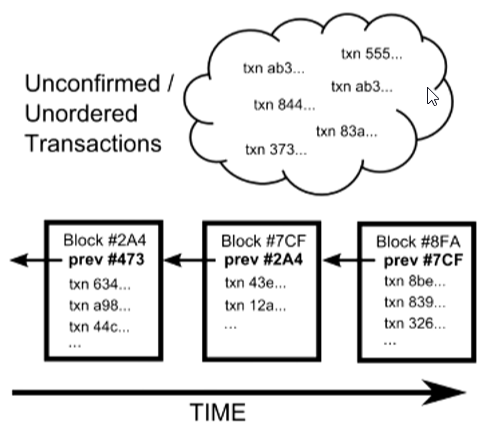

- 任何节点都可以将一组未确认的交易收集到一个块中，并将其广播到网络的其余部分，作为链中下一个块的内容的建议
 - 由于多人可以同时创建区块，因此可能有多种选择可供选择，因此网络如何决定下一个应该选择哪个区块？
 - 我们不能依赖块到达的顺序，因为正如上面的交易所解释的那样，它们可能会在网络中的不同点上以不同的顺序到达

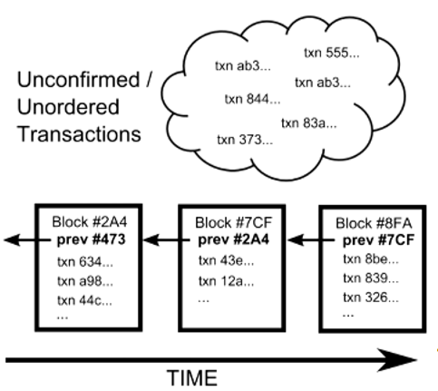

**创建新的块**

- 每个有效的块必须包含一个非常特殊的数学问题的答案
 - 通过散列函数（32字节，SHA256）运行块的整个文本以及额外的随机猜测，直到输出低于某个阈值
 - 整个比特币网络中的每台计算机都有猜测数字，平均需要10分钟才能找到解决方案
 - 第一个解决数学问题的人广播他们的区块，并将他们的交易组接受为链中的下一个。数学问题中的随机性在人们找到解决方案时有效地展开，使得两个人不可能同时解决它

**多个分支**

- 然而，偶尔会同时解决多个区块，导致多个可能的分支
 - 在这种情况下，您只需构建您收到的第一个。其他人可能以不同的顺序接收了这些块，并且将在他们收到的第一个块上构建

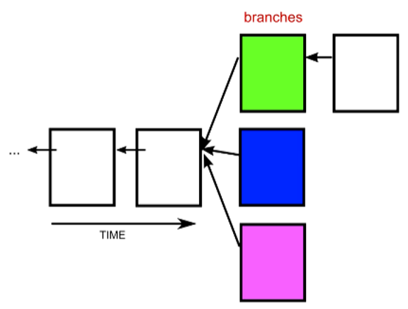

 - 当有人解决另一个块时，领带被破坏
 - 您总是立即切换到可用的最长分支
 - 在同一时间解决问题的情况很少
 - 区块链在整个网络中迅速稳定

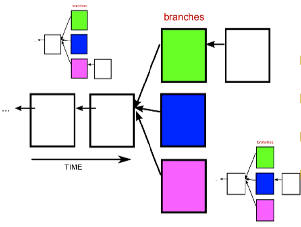

**区块链中的双重支出**

- 链条末端存在一些不明确的事实对交易安全性有重要影响
- 例如，如果您的交易发现自己位于其中一个较短的分支中，则它将在区块链中失去其位置
- 这意味着它只会回到未确认的交易池中，并被包含在后面的块中
- 这打开了双重打击的攻击之门

例如：
 - 一个骗子，爱丽丝，把钱汇给鲍勃
 - 鲍勃然后等待交易“确认”到区块链中，然后发货
 - 现在，因为节点总是切换到更长的分支，所以如果Alice可以生成一个更长的分支，将Bob的交易替换为其他人，那么他的钱将被有效地清除
 - 鲍勃的交易最初将被扔回未经确认的游泳池
 - 但是由于Alice用另一个使用相同输入的事务取代了它，节点现在会认为Bob的事务是无效的，因为它引用了已经用完的输入

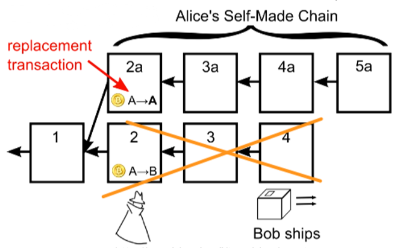

**双重支出的预防**

- 你可能认为Alice可以在恰当的时间预先计算一系列块以在网络上弹出，但每个块中的数学拼图实际上可以防止这种情况发生
 - 一旦她想要构建的块被解决，她就只能开始解决块，并且其散列值是已知的
 - 因此，她与网络的其他部门进行竞赛，直到鲍勃运送产品，这是她想要展示更长时间的分支时
 - 她必须私下工作，因为如果鲍勃听说她的双重消费块，他显然不会运送产品
 - 最后一个问题是，如果Alice拥有一台速度非常快的电脑，或者可能是一间装满电脑的房间，Alice是否能够超越所有人
     - 即使有数千台电脑，她也不可能赢得解决障碍的比赛，因为她不是在竞争任何一台电脑，而是整个网络
     - 她需要控制整个网络总计算能力的一半，才有50％的机会在别人面前解决问题

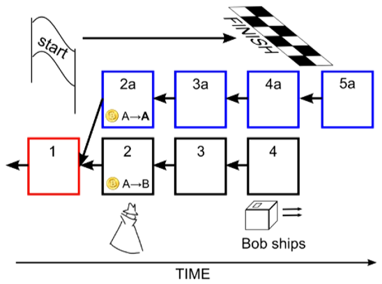

- 区块链中的交易受数学难题保护
 - 一个攻击者攻击整个网络的其余部分
 - 各个块之间相互建立的结果是，进一步返回链中的交易更加安全
 - 该系统在链条末端容易受到双重支出攻击，这就是为什么建议在考虑收到最终资金之前等待几个块的原因

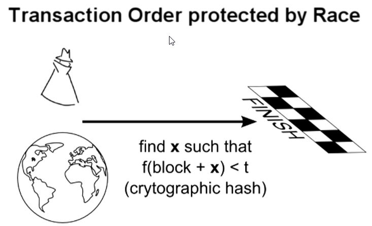

**不需要信任**

- 令人惊讶的是，迄今为止没有任何描述需要任何信任
- 当您从比特币网络中的陌生人处收到信息时，您可以检查自己的区块解决方案是否正确
- 因为数学问题太难了，你知道攻击者无法自己产生它们
- 这些解决方案证明了整个网络的计算能力得以实现

#### 9.3.5 新的比特币从哪里来？
 - 为了汇款，您必须参考以前的交易，您之前是否是收款人，但硬币首先如何进入这个所有权链？
 - 作为慢慢随机生成和分配硬币的一种方式，给予任何人解决方块的“奖励”
 - 这就是为什么解决块被称为挖掘，尽管它的真正目的是验证交易，并保护块链每4年，块奖励减半，所以最终不会有更多的硬币被释放
     - 总共将创造约2100万个
 - 除了块奖励之外，矿工还可以获得交易中可选择的任何交易费用。
     - 现在，矿工将包括没有费用的交易，因为他们的主要动机是块奖励，
     - 但在未来，交易可能会按照附加费的顺序处理，没有费用的交易可能会被忽略。
     - 以比特币发送资金可能不会免费，但希望仍然比目前的信用卡收费便宜

#### 9.3.6 挖掘池

- 平均而言，典型的计算机需要几年时间才能解决问题
 - 一个人在网络其他部分（通常需要10分钟）之前解决问题的几率非常低
 - 为了获得稳定的收入来源，许多人加入了被称为采矿池的团体，这些团体共同努力解决块问题，并根据贡献的工作分配奖励
 - 这些行为有点像同事中的彩票池，除了其中一些矿池非常大，并且占网络中所有计算机的20％以上
 - 这些池中有一些如此之大的事实对安全性有一些重要的影响
 - 攻击者不太可能以比网络其余部分快得多的速度连续地解决数个方块，但这是可能的，并且随着攻击者的处理能力与网络其他部分成比例地增加
 - 事实上，其中一个挖矿公司BTC Guild已经自行完成了6个区块，并且自愿限制其成员避免对整个比特币网络的不信任

**矿池最终会趋向全部挖空**

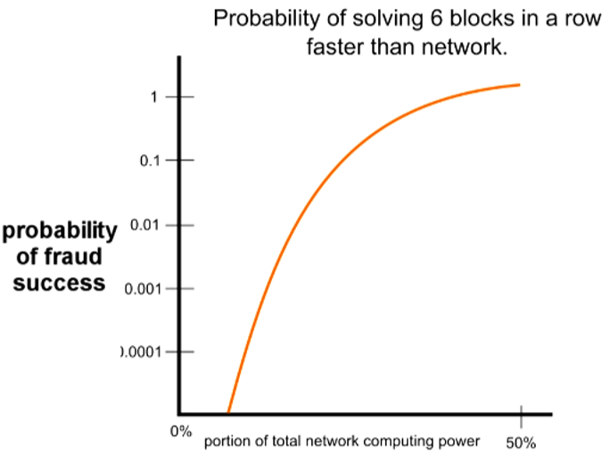

#### 9.3.7 建议的等待时间

 - 目前的建议是等待交易至少进入一个区块，或者获得一个确认，然后再考虑最终的交易
 - 对于较大的交易，等待至少6个或更多的块

#### 9.3.8 确认时间
- 按设计，每个块需要大约10分钟才能解决，因此等待6个街区需要大约一个小时
- 与信用卡交易需要几秒钟的时间相比，等待这一长时间以确认可能看起来很繁琐
    - 但是，请记住，信用卡客户可以在几个月后申请盗用的卡从商家撤销费用（称为退款）
    - 这样一来，从商家的角度来看，比特币实际上要快得多
- 选择10分钟的特定选择以避免不稳定性和延迟的确认时间
- 随着更多的计算机加入网络，专用硬件专为采矿而设计，模块解决时间将变得非常短
    - 为了补偿计算时间上的变化，每两周比特币软件将数学问题的难度重新标定为10分钟

### 结论

 - 比特币是由同行网络维护的受数学保护的数字货币
 - 数字签名授权单个交易，通过交易链传递所有权，以及在区块链中保护的交易的顺序
 - 通过要求每个块能够解决困难的数学问题，潜在的攻击者在计算竞赛中与网络的其余部分进行对抗，他们不太可能获胜

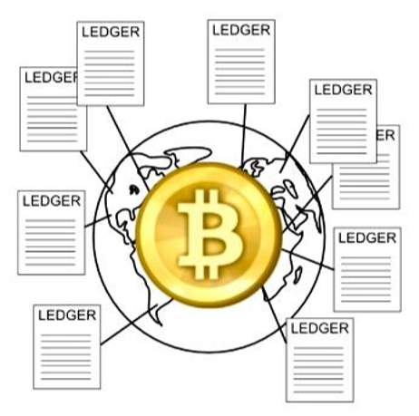

